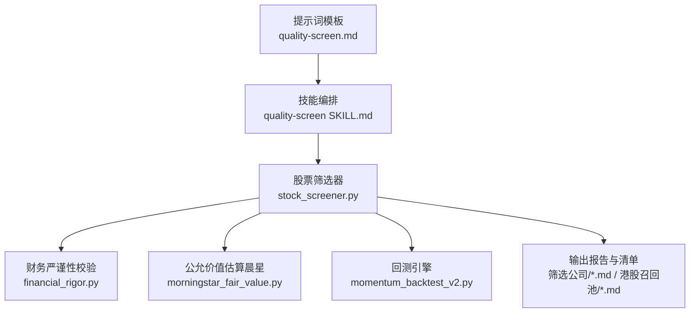
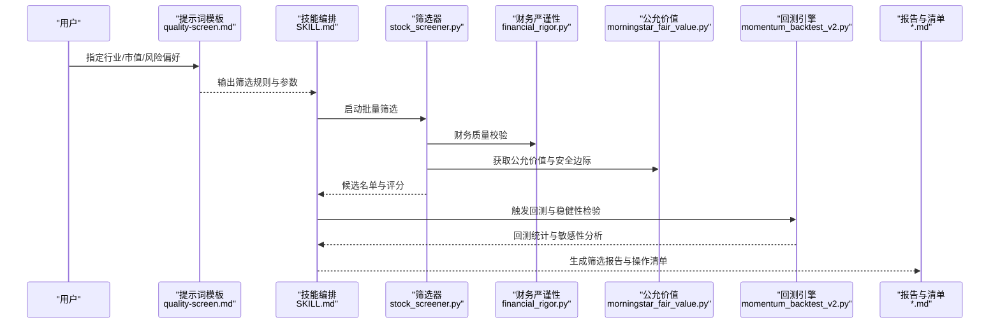
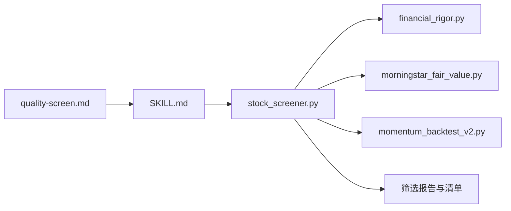

# 质量筛选标准模板

<cite>
**本文引用的文件**   
- [quality-screen.md](file://codex-prompts/quality-screen.md)
- [SKILL.md](file://codex-skills/quality-screen/SKILL.md)
- [stock_screener.py](file://tools/stock_screener.py)
- [financial_rigor.py](file://tools/financial_rigor.py)
- [morningstar_fair_value.py](file://tools/morningstar_fair_value.py)
- [momentum_backtest_v2.py](file://tools/momentum_backtest_v2.py)
- [晨星护城河低估值筛选-20260607.md](file://筛选公司/晨星护城河低估值筛选-20260607.md)
- [去劣指标压力测试-20260517.md](file://港股召回池/去劣指标压力测试-20260517.md)
</cite>

## 目录
1. [简介](#简介)
2. [项目结构](#项目结构)
3. [核心组件](#核心组件)
4. [架构总览](#架构总览)
5. [详细组件分析](#详细组件分析)
6. [依赖关系分析](#依赖关系分析)
7. [性能与可扩展性](#性能与可扩展性)
8. [故障排查指南](#故障排查指南)
9. [结论](#结论)
10. [附录](#附录)

## 简介
本文件围绕“质量筛选标准提示词模板”，系统化阐述高质量公司的量化筛选标准与定性评估体系，覆盖护城河强度、财务稳健性、增长可持续性、治理结构等关键维度，并给出行业与市值差异化的阈值建议、自动化筛选工具配置与批量处理流程、个性化策略构建方法、结果质量验证与回测流程，以及常见筛选陷阱的识别与规避建议。目标是帮助读者将模板落地为可重复、可验证、可迭代的选股工作流。

## 项目结构
与质量筛选相关的核心内容分布在以下位置：
- 提示词与技能定义：codex-prompts/quality-screen.md、codex-skills/quality-screen/SKILL.md
- 自动化筛选与数据处理：tools/stock_screener.py、tools/financial_rigor.py、tools/morningstar_fair_value.py
- 回测与验证：tools/momentum_backtest_v2.py
- 历史筛选与案例：筛选公司/晨星护城河低估值筛选-20260607.md、港股召回池/去劣指标压力测试-20260517.md

图示来源
- [quality-screen.md](file://codex-prompts/quality-screen.md)
- [SKILL.md](file://codex-skills/quality-screen/SKILL.md)
- [stock_screener.py](file://tools/stock_screener.py)
- [financial_rigor.py](file://tools/financial_rigor.py)
- [morningstar_fair_value.py](file://tools/morningstar_fair_value.py)
- [momentum_backtest_v2.py](file://tools/momentum_backtest_v2.py)
- [晨星护城河低估值筛选-20260607.md](file://筛选公司/晨星护城河低估值筛选-20260607.md)
- [去劣指标压力测试-20260517.md](file://港股召回池/去劣指标压力测试-20260517.md)

章节来源
- [quality-screen.md](file://codex-prompts/quality-screen.md)
- [SKILL.md](file://codex-skills/quality-screen/SKILL.md)
- [stock_screener.py](file://tools/stock_screener.py)
- [financial_rigor.py](file://tools/financial_rigor.py)
- [morningstar_fair_value.py](file://tools/morningstar_fair_value.py)
- [momentum_backtest_v2.py](file://tools/momentum_backtest_v2.py)
- [晨星护城河低估值筛选-20260607.md](file://筛选公司/晨星护城河低估值筛选-20260607.md)
- [去劣指标压力测试-20260517.md](file://港股召回池/去劣指标压力测试-20260517.md)

## 核心组件
- 提示词模板：定义高质量公司的筛选原则、指标口径、阈值区间、权重与评分逻辑，以及不同行业与市值的差异化规则。
- 技能编排：将提示词转化为可执行的步骤化流程，串联数据获取、指标计算、过滤排序、报告生成与回测验证。
- 筛选器：实现批量扫描、指标计算、多因子打分、阈值过滤与结果导出。
- 财务严谨性校验：对利润质量、现金流、杠杆、资产质量等进行一致性检查与异常标记。
- 公允价值估算：结合外部公允价值参考（如晨星），辅助判断安全边际与估值合理性。
- 回测引擎：对筛选策略进行历史回测，评估胜率、收益分布、回撤与稳定性。

章节来源
- [quality-screen.md](file://codex-prompts/quality-screen.md)
- [SKILL.md](file://codex-skills/quality-screen/SKILL.md)
- [stock_screener.py](file://tools/stock_screener.py)
- [financial_rigor.py](file://tools/financial_rigor.py)
- [morningstar_fair_value.py](file://tools/morningstar_fair_value.py)
- [momentum_backtest_v2.py](file://tools/momentum_backtest_v2.py)

## 架构总览
下图展示从提示词到自动化执行、再到结果验证的整体链路。

图示来源
- [quality-screen.md](file://codex-prompts/quality-screen.md)
- [SKILL.md](file://codex-skills/quality-screen/SKILL.md)
- [stock_screener.py](file://tools/stock_screener.py)
- [financial_rigor.py](file://tools/financial_rigor.py)
- [morningstar_fair_value.py](file://tools/morningstar_fair_value.py)
- [momentum_backtest_v2.py](file://tools/momentum_backtest_v2.py)
- [晨星护城河低估值筛选-20260607.md](file://筛选公司/晨星护城河低估值筛选-20260607.md)

## 详细组件分析

### 提示词模板：质量筛选标准
- 目标：以一致、可复用的方式定义“高质量公司”的多维标准，确保跨市场、跨行业、跨周期的可比性。
- 核心维度
  - 护城河强度：品牌、网络效应、转换成本、规模与范围经济、监管许可、技术壁垒等。
  - 财务稳健性：盈利质量、自由现金流、资产负债结构、资本开支效率、分红与回购。
  - 增长可持续性：收入与利润复合增速、市场份额趋势、产品管线与定价权、客户集中度与粘性。
  - 治理结构：管理层激励与持股、信息披露透明度、关联交易与利益冲突、ESG与合规记录。
- 指标与阈值
  - 提供基础阈值区间与行业/市值调整系数；支持硬约束（一票否决）与软约束（加权评分）。
  - 示例口径（概念性说明）：ROIC、FCF利润率、净负债/EBITDA、营收CAGR、毛利率稳定性、管理层持股比例等。
- 评分与排序
  - 多因子加权评分，按总分与子项得分双轨排序；设置最低门槛与淘汰红线。
- 差异化规则
  - 行业差异：科技、消费、金融、周期、公用事业等采用不同权重与阈值。
  - 市值差异：大盘、中盘、小盘在流动性、波动性与数据可得性上进行调整。

章节来源
- [quality-screen.md](file://codex-prompts/quality-screen.md)

### 技能编排：从提示词到流水线
- 输入：行业、市值区间、风险偏好、时间窗口、数据源开关。
- 步骤
  - 解析提示词参数，生成筛选任务。
  - 调用筛选器执行批量扫描与打分。
  - 触发财务严谨性校验与公允价值对比。
  - 输出候选池与初筛报告。
  - 自动触发回测与稳健性检验。
  - 汇总生成最终报告与操作清单。
- 质量控制：每步输出校验、异常告警、重试与降级策略。

章节来源
- [SKILL.md](file://codex-skills/quality-screen/SKILL.md)

### 筛选器：批量处理与多因子打分
- 功能要点
  - 数据接入：行情、基本面、估值与外部公允价值。
  - 指标计算：滚动窗口、同比/环比、标准化与去极值。
  - 过滤与排序：硬约束过滤、软约束加权、分位数与百分位排名。
  - 输出：候选名单、评分明细、剔除原因与风险提示。
- 扩展点
  - 插件式指标库、行业/市值规则包、自定义权重与阈值。
  - 批处理与并行化、增量更新与缓存。

章节来源
- [stock_screener.py](file://tools/stock_screener.py)

### 财务严谨性校验：利润与现金流的交叉验证
- 校验维度
  - 利润质量：净利润与经营性现金流匹配度、非经常性损益占比、递延与减值。
  - 杠杆与偿付：净负债/EBITDA、利息保障倍数、短债长投比例。
  - 资产质量：商誉与无形资产占比、存货与应收周转、固定资产利用率。
  - 分红与回报：股息率、回购与注销、资本回报率。
- 输出
  - 健康度评分、异常标记、改进建议与复核清单。

章节来源
- [financial_rigor.py](file://tools/financial_rigor.py)

### 公允价值与安全边际：外部锚定与估值校准
- 作用
  - 引入第三方公允价值参考，辅助判断当前价格的安全边际与潜在上行空间。
- 流程
  - 拉取公允价值或合理估值区间。
  - 计算折溢价与安全边际。
  - 与内部评分融合，形成综合吸引力指数。

章节来源
- [morningstar_fair_value.py](file://tools/morningstar_fair_value.py)
- [晨星护城河低估值筛选-20260607.md](file://筛选公司/晨星护城河低估值筛选-20260607.md)

### 回测引擎：策略稳健性与历史表现验证
- 能力
  - 基于历史数据回放筛选信号，统计胜率、年化收益、最大回撤、夏普比率等。
  - 进行敏感性分析与参数鲁棒性检验。
  - 输出回测报告与可视化摘要。
- 使用
  - 输入：筛选规则、参数集、回测区间、交易假设。
  - 输出：绩效指标、持仓轮动、归因分析。

章节来源
- [momentum_backtest_v2.py](file://tools/momentum_backtest_v2.py)

### 历史案例与压力测试
- 晨星护城河低估值筛选：展示如何结合护城河评级与低估条件，生成候选池与跟踪清单。
- 去劣指标压力测试：通过极端情景与阈值扰动，检验筛选规则的稳健性与抗噪能力。

章节来源
- [晨星护城河低估值筛选-20260607.md](file://筛选公司/晨星护城河低估值筛选-20260607.md)
- [去劣指标压力测试-20260517.md](file://港股召回池/去劣指标压力测试-20260517.md)

## 依赖关系分析
- 模块耦合
  - 提示词与技能编排为上层控制面，驱动筛选器与校验模块。
  - 筛选器依赖财务严谨性与公允价值模块，共同产出候选池。
  - 回测引擎独立运行，但复用筛选器的输出作为信号源。
- 外部依赖
  - 数据源（行情、基本面、公允价值）、存储与日志系统。
- 循环依赖
  - 各模块单向依赖，避免循环引用，便于单元测试与替换。

图示来源
- [quality-screen.md](file://codex-prompts/quality-screen.md)
- [SKILL.md](file://codex-skills/quality-screen/SKILL.md)
- [stock_screener.py](file://tools/stock_screener.py)
- [financial_rigor.py](file://tools/financial_rigor.py)
- [morningstar_fair_value.py](file://tools/morningstar_fair_value.py)
- [momentum_backtest_v2.py](file://tools/momentum_backtest_v2.py)

## 性能与可扩展性
- 批处理与并行：对全市场标的进行并行计算，利用缓存与增量更新降低IO与CPU开销。
- 指标标准化：统一口径与去极值策略，减少异常值对排名的影响。
- 模块化扩展：新增行业/市值规则包与指标插件，无需改动核心流程。
- 资源管理：内存与线程池限制、失败重试与断点续跑。

[本节为通用指导，不直接分析具体文件]

## 故障排查指南
- 数据缺失或异常
  - 现象：指标为空、NaN或异常大值。
  - 处理：启用缺失值填充与去极值；记录缺失原因与样本量变化。
- 阈值过严导致空池
  - 现象：候选池为空或极少。
  - 处理：放宽软约束、提高权重弹性、增加行业/市值差异化系数。
- 回测结果不稳定
  - 现象：参数微调导致绩效大幅波动。
  - 处理：进行敏感性分析、扩大回测区间、引入正则化与稳健性惩罚。
- 公允价值不可用
  - 现象：外部公允价值缺失或延迟。
  - 处理：切换备用估值模型或放宽安全边际要求，并在报告中显著标注。

章节来源
- [financial_rigor.py](file://tools/financial_rigor.py)
- [morningstar_fair_value.py](file://tools/morningstar_fair_value.py)
- [momentum_backtest_v2.py](file://tools/momentum_backtest_v2.py)

## 结论
通过将“质量筛选标准提示词模板”与技能编排、筛选器、财务严谨性校验、公允价值与安全边际、回测引擎有机结合，可以构建一套端到端、可重复、可验证的高质量公司筛选体系。建议在实战中持续迭代阈值与权重，结合行业与市值差异化规则，并通过压力测试与回测验证提升策略稳健性。

[本节为总结性内容，不直接分析具体文件]

## 附录

### 常用指标与阈值建议（概念性）
- 护城河强度
  - 品牌与定价权：毛利率与费用率稳定性、提价频率与幅度。
  - 网络效应与转换成本：用户留存、活跃与迁移成本代理指标。
  - 规模与范围经济：单位成本下降曲线、产能利用率。
- 财务稳健性
  - ROIC > 行业均值+一定百分点；FCF利润率稳定为正；净负债/EBITDA低于行业分位。
  - 利息保障倍数高于阈值；短债长投比例可控。
- 增长可持续性
  - 营收与利润CAGR保持正增长且波动收敛；市场份额趋势向上。
  - 研发/营销投入产出比改善；客户集中度下降。
- 治理结构
  - 管理层持股与长期激励；信息披露及时透明；无重大合规事件。

[本节为通用指导，不直接分析具体文件]

### 自动化筛选工具配置与批量处理流程
- 配置项
  - 市场与板块、行业分类、市值区间、风险偏好、回测区间。
  - 指标权重、阈值、是否启用公允价值与安全边际。
- 批量处理
  - 分批扫描、并行计算、结果落盘与版本化管理。
  - 异常重试与断点续跑。
- 输出物
  - 候选名单、评分明细、剔除原因、回测报告与操作清单。

章节来源
- [SKILL.md](file://codex-skills/quality-screen/SKILL.md)
- [stock_screener.py](file://tools/stock_screener.py)
- [momentum_backtest_v2.py](file://tools/momentum_backtest_v2.py)

### 个性化策略构建方法
- 明确投资目标与约束：收益目标、回撤容忍、流动性要求。
- 选择行业与市值范围：聚焦优势领域，避免过度分散。
- 设定差异化阈值：根据行业特性与生命周期调整权重与门槛。
- 建立反馈闭环：定期复盘与参数调优，纳入新信息与经验。

[本节为通用指导，不直接分析具体文件]

### 筛选结果的质量验证与回测流程
- 质量验证
  - 财务严谨性复核、公允价值对比、同业对标与专家审阅。
- 回测流程
  - 历史信号回放、交易假设设定、绩效统计与归因分析。
  - 敏感性分析与压力测试，输出稳健性结论。

章节来源
- [financial_rigor.py](file://tools/financial_rigor.py)
- [morningstar_fair_value.py](file://tools/morningstar_fair_value.py)
- [momentum_backtest_v2.py](file://tools/momentum_backtest_v2.py)

### 常见筛选陷阱与规避建议
- 幸存者偏差：仅看成功样本，忽略失败样本。
  - 规避：纳入退市与失败案例，进行对照分析。
- 指标共线性：多指标高度相关导致重复计分。
  - 规避：相关性检测与主成分降维，保留信息冗余最小化。
- 过度拟合：参数在样本内表现优异，样本外失效。
  - 规避：交叉验证、参数网格搜索与正则化。
- 数据滞后与前瞻偏差：使用未来信息或延迟数据未对齐。
  - 规避：严格的时间戳对齐与滚动窗口设计。
- 忽视流动性与冲击成本：小盘股难以成交。
  - 规避：加入流动性约束与交易成本假设。

[本节为通用指导，不直接分析具体文件]