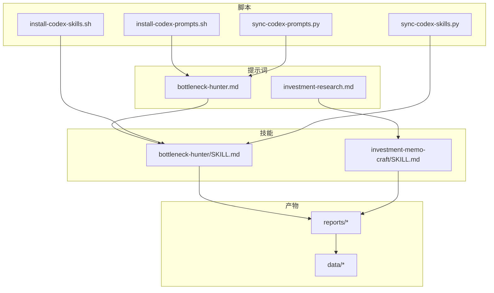
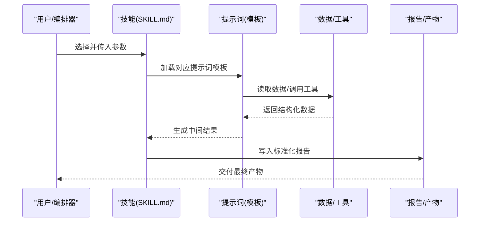
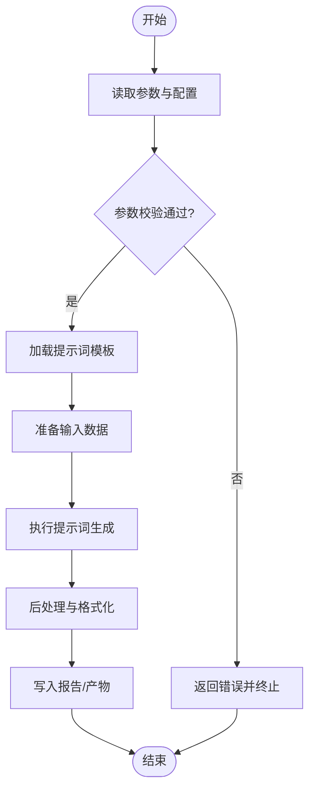
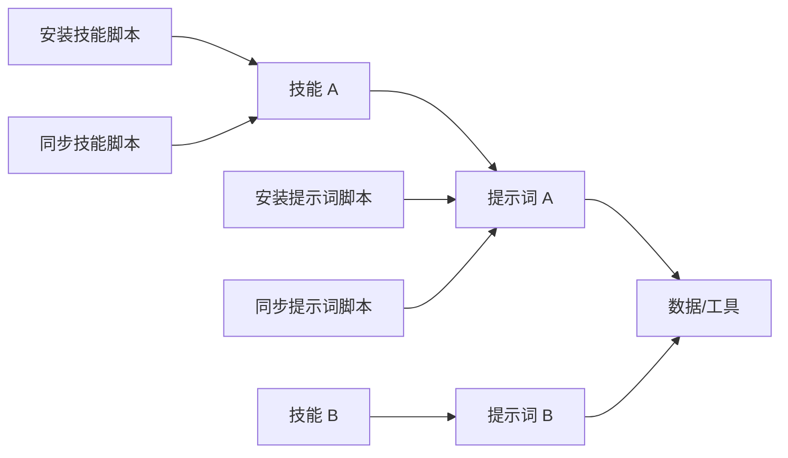

# 自定义提示词开发指南

<cite>
**本文引用的文件**   
- [README_EN.md](file://README_EN.md)
- [AGENTS.md](file://AGENTS.md)
- [CLAUDE.md](file://CLAUDE.md)
- [codex-prompts/bottleneck-hunter.md](file://codex-prompts/bottleneck-hunter.md)
- [codex-skills/bottleneck-hunter/SKILL.md](file://codex-skills/bottleneck-hunter/SKILL.md)
- [codex-skills/investment-memo-craft/SKILL.md](file://codex-skills/investment-memo-craft/SKILL.md)
- [scripts/install-codex-prompts.sh](file://scripts/install-codex-prompts.sh)
- [scripts/install-codex-skills.sh](file://scripts/install-codex-skills.sh)
- [scripts/sync-codex-prompts.py](file://scripts/sync-codex-prompts.py)
- [scripts/sync-codex-skills.py](file://scripts/sync-codex-skills.py)
</cite>

## 目录
1. [简介](#简介)
2. [项目结构](#项目结构)
3. [核心组件](#核心组件)
4. [架构总览](#架构总览)
5. [详细组件分析](#详细组件分析)
6. [依赖分析](#依赖分析)
7. [性能考虑](#性能考虑)
8. [故障排查指南](#故障排查指南)
9. [结论](#结论)
10. [附录](#附录)

## 简介
本指南面向需要为投资研究场景定制与扩展“提示词”的开发者，提供从需求分析、结构设计、原型开发、测试验证到版本管理与部署的全流程方法。重点说明：
- 如何基于现有仓库组织方式创建新提示词与技能（SKILL）
- 如何将提示词与技能系统对接（SKILL.md 配置、参数传递、结果处理）
- 如何进行版本管理、更新策略与工程化实践
- 如何构建可复用的提示词组件与模块化架构
- 如何编写自动化脚本与工具链，提升团队协作效率

## 项目结构
仓库采用“提示词 + 技能 + 脚本 + 报告/数据”的分层组织方式：
- codex-prompts：存放纯文本提示词模板（Markdown），用于驱动模型生成
- codex-skills：每个技能一个目录，包含 SKILL.md 描述与可选 agents 配置
- scripts：安装与同步脚本，支持将提示词与技能分发到本地或工作区
- reports/data/tools：产出物、数据与辅助工具，供提示词与技能调用

图示来源
- [codex-prompts/bottleneck-hunter.md](file://codex-prompts/bottleneck-hunter.md)
- [codex-skills/bottleneck-hunter/SKILL.md](file://codex-skills/bottleneck-hunter/SKILL.md)
- [codex-skills/investment-memo-craft/SKILL.md](file://codex-skills/investment-memo-craft/SKILL.md)
- [scripts/install-codex-prompts.sh](file://scripts/install-codex-prompts.sh)
- [scripts/install-codex-skills.sh](file://scripts/install-codex-skills.sh)
- [scripts/sync-codex-prompts.py](file://scripts/sync-codex-prompts.py)
- [scripts/sync-codex-skills.py](file://scripts/sync-codex-skills.py)

章节来源
- [README_EN.md](file://README_EN.md)
- [AGENTS.md](file://AGENTS.md)
- [CLAUDE.md](file://CLAUDE.md)

## 核心组件
- 提示词模板（codex-prompts/*.md）：定义任务目标、输入输出格式、约束与风格，便于在不同上下文中复用
- 技能定义（codex-skills/*/SKILL.md）：描述技能名称、用途、参数、执行步骤、依赖与输出规范，作为提示词的“运行契约”
- 安装与同步脚本（scripts/*）：将提示词与技能复制到目标环境，或从远程源同步更新，保证一致性
- 产物与数据（reports/*, data/*）：提示词与技能运行的输入与输出载体，支撑可追溯与可审计

章节来源
- [codex-prompts/bottleneck-hunter.md](file://codex-prompts/bottleneck-hunter.md)
- [codex-skills/bottleneck-hunter/SKILL.md](file://codex-skills/bottleneck-hunter/SKILL.md)
- [scripts/install-codex-prompts.sh](file://scripts/install-codex-prompts.sh)
- [scripts/install-codex-skills.sh](file://scripts/install-codex-skills.sh)
- [scripts/sync-codex-prompts.py](file://scripts/sync-codex-prompts.py)
- [scripts/sync-codex-skills.py](file://scripts/sync-codex-skills.py)

## 架构总览
下图展示了“用户/编排器 → 技能 → 提示词 → 外部数据/工具 → 报告”的整体交互关系。

图示来源
- [codex-skills/bottleneck-hunter/SKILL.md](file://codex-skills/bottleneck-hunter/SKILL.md)
- [codex-prompts/bottleneck-hunter.md](file://codex-prompts/bottleneck-hunter.md)

## 详细组件分析

### 提示词模板设计与实现
- 设计要点
  - 明确角色与目标：限定模型身份、任务范围与期望质量
  - 输入输出契约：规定输入字段、必填项、输出结构与示例
  - 约束与风格：限制长度、语气、引用来源、避免幻觉
  - 可组合性：将通用段落抽象为模块，便于跨技能复用
- 开发流程
  - 需求分析：识别业务问题、受众与关键指标
  - 结构设计：确定输入/输出、步骤与校验规则
  - 原型开发：在最小数据集上快速迭代
  - 测试验证：覆盖边界条件与异常输入，记录回归用例
  - 文档化：在 SKILL.md 中声明参数与用法
- 示例路径
  - 瓶颈挖掘提示词：[bottleneck-hunter.md](file://codex-prompts/bottleneck-hunter.md)

章节来源
- [codex-prompts/bottleneck-hunter.md](file://codex-prompts/bottleneck-hunter.md)

### 技能系统与 SKILL.md 集成
- SKILL.md 职责
  - 定义技能元信息：名称、版本、作者、许可证
  - 描述能力与适用场景
  - 声明参数：类型、默认值、取值范围、是否必填
  - 指定执行步骤：数据准备、调用提示词、后处理、输出落盘
  - 列出依赖：外部工具、环境变量、权限
- 参数传递与结果处理
  - 参数通过命令行或配置文件注入
  - 中间结果以 JSON/CSV 等结构化格式保存
  - 最终报告按统一模板生成，便于审阅与归档
- 示例路径
  - 瓶颈挖掘技能：[bottleneck-hunter/SKILL.md](file://codex-skills/bottleneck-hunter/SKILL.md)
  - 投资备忘录技能：[investment-memo-craft/SKILL.md](file://codex-skills/investment-memo-craft/SKILL.md)

图示来源
- [codex-skills/bottleneck-hunter/SKILL.md](file://codex-skills/bottleneck-hunter/SKILL.md)
- [codex-skills/investment-memo-craft/SKILL.md](file://codex-skills/investment-memo-craft/SKILL.md)

章节来源
- [codex-skills/bottleneck-hunter/SKILL.md](file://codex-skills/bottleneck-hunter/SKILL.md)
- [codex-skills/investment-memo-craft/SKILL.md](file://codex-skills/investment-memo-craft/SKILL.md)

### 安装与同步脚本
- 安装脚本
  - install-codex-prompts.sh：将提示词模板安装到目标位置
  - install-codex-skills.sh：将技能定义安装到目标位置
- 同步脚本
  - sync-codex-prompts.py：从远程源拉取最新提示词并合并
  - sync-codex-skills.py：从远程源拉取最新技能并合并
- 使用建议
  - 在 CI 中定期执行同步，确保团队一致
  - 变更需附带版本标记与变更日志
  - 失败时回滚到上一稳定版本

章节来源
- [scripts/install-codex-prompts.sh](file://scripts/install-codex-prompts.sh)
- [scripts/install-codex-skills.sh](file://scripts/install-codex-skills.sh)
- [scripts/sync-codex-prompts.py](file://scripts/sync-codex-prompts.py)
- [scripts/sync-codex-skills.py](file://scripts/sync-codex-skills.py)

### 开发示例：从简单查询到复杂分析
- 简单查询
  - 目标：根据股票代码获取基础信息与摘要
  - 步骤：定义输入（代码、时间窗口）、调用数据接口、生成简要报告
  - 产出：JSON 摘要 + Markdown 简报
- 复杂分析
  - 目标：多公司对比与风险因子评估
  - 步骤：批量召回候选、计算指标、生成对比矩阵、输出决策建议
  - 产出：结构化指标表 + 深度分析报告
- 参考路径
  - 提示词模板：[bottleneck-hunter.md](file://codex-prompts/bottleneck-hunter.md)
  - 技能定义：[bottleneck-hunter/SKILL.md](file://codex-skills/bottleneck-hunter/SKILL.md)

章节来源
- [codex-prompts/bottleneck-hunter.md](file://codex-prompts/bottleneck-hunter.md)
- [codex-skills/bottleneck-hunter/SKILL.md](file://codex-skills/bottleneck-hunter/SKILL.md)

### 模块化与可复用组件
- 组件划分
  - 数据接入层：统一数据源、清洗与校验
  - 提示词库：按主题分类，标注版本与依赖
  - 技能编排：组合多个提示词与工具，形成端到端流程
  - 报告模板：统一样式与字段，便于审阅与归档
- 复用策略
  - 通过参数化与占位符实现模板复用
  - 使用共享函数与常量减少重复逻辑
  - 建立单元测试与基准数据集，保障稳定性

## 依赖分析
- 内部依赖
  - 技能依赖提示词模板；提示词依赖数据与工具
  - 脚本负责安装与同步，不直接参与运行时逻辑
- 外部依赖
  - 大模型 API、数据源、存储与日志系统
- 潜在风险
  - 循环依赖：应避免技能与提示词互相强耦合
  - 版本不一致：通过同步脚本与版本号控制解决

图示来源
- [scripts/install-codex-prompts.sh](file://scripts/install-codex-prompts.sh)
- [scripts/install-codex-skills.sh](file://scripts/install-codex-skills.sh)
- [scripts/sync-codex-prompts.py](file://scripts/sync-codex-prompts.py)
- [scripts/sync-codex-skills.py](file://scripts/sync-codex-skills.py)

章节来源
- [scripts/install-codex-prompts.sh](file://scripts/install-codex-prompts.sh)
- [scripts/install-codex-skills.sh](file://scripts/install-codex-skills.sh)
- [scripts/sync-codex-prompts.py](file://scripts/sync-codex-prompts.py)
- [scripts/sync-codex-skills.py](file://scripts/sync-codex-skills.py)

## 性能考虑
- 提示词优化
  - 精简上下文，避免冗余指令
  - 使用结构化输入与输出，降低解析成本
- 数据与工具
  - 缓存热点数据，减少重复 IO
  - 并行处理独立任务，提高吞吐
- 资源与成本
  - 设置最大 token 与重试上限
  - 对长任务进行分片与断点续跑

## 故障排查指南
- 常见问题
  - 参数缺失或类型错误：检查 SKILL.md 参数定义与校验逻辑
  - 提示词未找到或版本不匹配：确认安装与同步脚本执行成功
  - 数据源不可用：检查网络、鉴权与配额
- 定位方法
  - 查看日志与中间产物，定位失败阶段
  - 使用最小数据集复现问题，逐步缩小范围
- 恢复策略
  - 回滚到上一稳定版本
  - 启用降级模式，仅生成基础报告

## 结论
通过标准化的提示词与技能体系、完善的安装与同步机制、以及清晰的模块化架构，团队可以高效地开发与维护高质量的投资研究提示词。建议在持续集成中引入自动化测试与质量门禁，确保提示词与技能的稳定性与可演进性。

## 附录
- 最佳实践清单
  - 为每个提示词编写最小可运行示例
  - 在 SKILL.md 中完整声明参数、依赖与输出
  - 使用语义化版本号管理变更
  - 建立共享知识库与评审流程
- 相关参考
  - 项目总体说明与约定：[README_EN.md](file://README_EN.md)、[AGENTS.md](file://AGENTS.md)、[CLAUDE.md](file://CLAUDE.md)