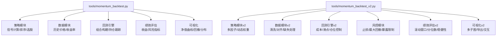
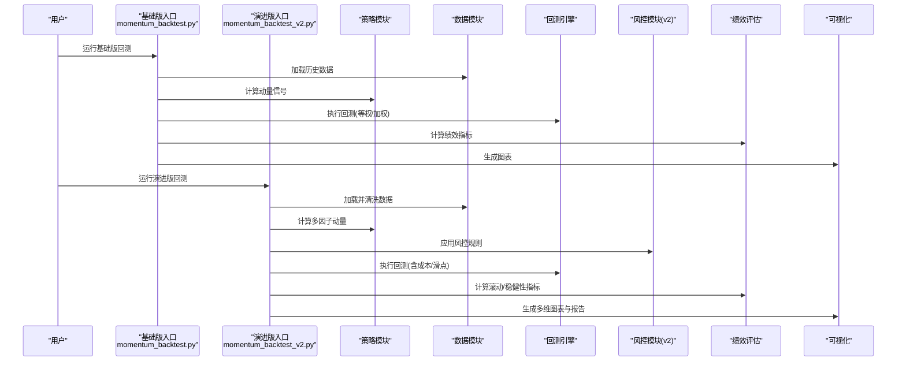
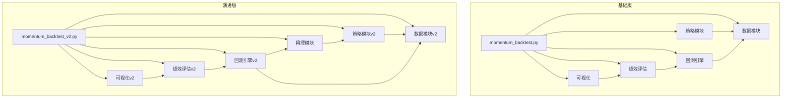
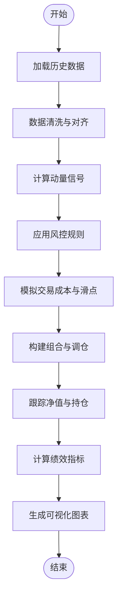

# 动量回测工具

<cite>
**本文引用的文件**   
- [momentum_backtest.py](file://tools/momentum_backtest.py)
- [momentum_backtest_v2.py](file://tools/momentum_backtest_v2.py)
</cite>

## 目录
1. [简介](#简介)
2. [项目结构](#项目结构)
3. [核心组件](#核心组件)
4. [架构总览](#架构总览)
5. [详细组件分析](#详细组件分析)
6. [依赖关系分析](#依赖关系分析)
7. [性能考量](#性能考量)
8. [故障排查指南](#故障排查指南)
9. [结论](#结论)
10. [附录](#附录)

## 简介
本技术文档面向动量策略回测工具集，聚焦于 tools 目录下的两个脚本：
- momentum_backtest.py：基础版动量回测实现，提供标准的多资产动量信号生成、历史数据回测、绩效评估与可视化输出。
- momentum_backtest_v2.py：演进版本，在基础版之上增强风险控制、交易成本与滑点模拟、参数化配置、结果统计与图表能力，并优化了可扩展性与工程化组织。

文档将系统阐述两类版本的差异与演进路径，覆盖策略定义、回测周期、成本与滑点处理、风控模块、统计分析、可视化、使用示例、优化技巧以及扩展开发建议。

## 项目结构
仓库中与动量回测相关的代码位于 tools 目录，包含两个主要脚本：
- momentum_backtest.py：基础回测入口与流程编排
- momentum_backtest_v2.py：增强版回测入口与流程编排

[本节为概念性结构说明，不直接分析具体源码，故无“章节来源”]

## 核心组件
- 策略模块
  - 基础版：基于固定持有期与横截面排序的动量信号，按得分选择前N只标的。
  - 演进版：支持多时间尺度动量合成、动态权重、行业中性或风格约束等扩展。
- 数据模块
  - 基础版：读取历史价格序列，计算简单收益率。
  - 演进版：增加数据清洗、复权处理、缺失值插补、频率对齐与异常值过滤。
- 回测引擎
  - 基础版：日频/周频调仓，等权或按动量强度加权，记录每日净值。
  - 演进版：引入交易成本（佣金、印花税）、滑点模型、最小交易单位、涨跌停/流动性过滤。
- 风控模块（v2新增）
  - 单标的止损/止盈、组合最大回撤阈值、行业/风格暴露上限、波动率目标控制。
- 绩效评估
  - 基础版：年化收益、夏普比率、最大回撤、胜率、盈亏比等。
  - 演进版：滚动窗口指标、分位数回归稳健性检验、压力测试场景、换手率与成本归因。
- 可视化
  - 基础版：净值曲线、回撤曲线、月度收益热力图。
  - 演进版：多策略对比、因子贡献分解、交易明细导出、批量出图与报告生成。

**章节来源**
- [momentum_backtest.py](file://tools/momentum_backtest.py)
- [momentum_backtest_v2.py](file://tools/momentum_backtest_v2.py)

## 架构总览
下图展示两个版本的整体调用关系与数据流。基础版以线性流程为主；演进版通过模块化接口提升可配置性与可维护性。

**图示来源**
- [momentum_backtest.py](file://tools/momentum_backtest.py)
- [momentum_backtest_v2.py](file://tools/momentum_backtest_v2.py)

## 详细组件分析

### 基础版（momentum_backtest.py）
- 功能要点
  - 输入：历史价格序列、回测区间、持有期、选股数量。
  - 策略：横截面动量排序，选择前N只标的，等权或按动量强度加权。
  - 回测：固定调仓频率（如月频），记录每日净值与持仓。
  - 评估：年化收益、夏普比率、最大回撤、胜率、盈亏比。
  - 可视化：净值曲线、回撤曲线、月度收益热力图。
- 关键流程
  - 数据准备 → 信号计算 → 组合构建 → 净值跟踪 → 指标计算 → 图表输出。
- 适用场景
  - 快速验证经典动量策略、教学演示、基准对照。

**章节来源**
- [momentum_backtest.py](file://tools/momentum_backtest.py)

### 演进版（momentum_backtest_v2.py）
- 功能要点
  - 输入：同基础版，但支持更丰富的参数配置（成本、滑点、风控阈值）。
  - 策略：多时间尺度动量合成、动态权重、可选行业中性或风格约束。
  - 回测：引入交易成本（佣金、印花税）、滑点模型、最小交易单位、涨跌停/流动性过滤。
  - 风控：单标的止损/止盈、组合最大回撤阈值、行业/风格暴露上限、波动率目标控制。
  - 评估：滚动窗口指标、分位数稳健性检验、压力测试、换手率与成本归因。
  - 可视化：多策略对比、因子贡献分解、交易明细导出、批量出图与报告生成。
- 关键流程
  - 数据清洗与对齐 → 多因子动量计算 → 风控规则应用 → 成本与滑点模拟 → 组合构建与调仓 → 滚动绩效与稳健性评估 → 多维可视化与报告。
- 适用场景
  - 实战级回测、策略迭代优化、风险管理与成本控制、研究报告自动化。

**章节来源**
- [momentum_backtest_v2.py](file://tools/momentum_backtest_v2.py)

### 策略参数配置与回测周期设置
- 策略参数
  - 持有期（如1个月/3个月/6个月）、动量窗口、横截面排名比例、权重方式（等权/强度加权/风险平价）。
  - v2新增：多尺度权重、行业中性约束、风格暴露限制。
- 回测周期
  - 起始/结束日期、调仓频率（日/周/月）、预热期长度。
- 成本与滑点
  - 佣金费率、印花税、滑点百分比或固定点数、最小交易单位、涨跌停过滤。
- 风控阈值
  - 单标的止损/止盈比例、组合最大回撤阈值、行业/风格暴露上限、波动率目标。

**章节来源**
- [momentum_backtest.py](file://tools/momentum_backtest.py)
- [momentum_backtest_v2.py](file://tools/momentum_backtest_v2.py)

### 交易成本模拟与滑点处理机制
- 成本构成
  - 交易佣金（双边）、印花税（卖出）、过户费（如有）。
- 滑点模型
  - 百分比滑点（随波动率自适应）、固定点数滑点、冲击成本（按成交量占比）。
- 执行细节
  - 调仓时先平仓后开仓，考虑涨跌停不可成交、流动性不足跳过、最小交易单位取整。
- 成本归因
  - 将总收益拆分为Alpha、Beta、成本与滑点影响，便于策略优化。

**章节来源**
- [momentum_backtest_v2.py](file://tools/momentum_backtest_v2.py)

### 风险控制模块（v2）
- 单标的风控
  - 止损/止盈触发、移动止损、波动率自适应仓位缩放。
- 组合风控
  - 最大回撤阈值触发降仓或清仓、行业/风格暴露上限、集中度限制。
- 动态调整
  - 根据市场波动率与回撤状态调节目标仓位与调仓频率。

**章节来源**
- [momentum_backtest_v2.py](file://tools/momentum_backtest_v2.py)

### 绩效评估与统计分析
- 基础指标
  - 年化收益、夏普比率、索提诺比率、最大回撤、Calmar比率、胜率、盈亏比、换手率。
- 进阶指标（v2）
  - 滚动窗口指标（滚动夏普/回撤）、分位数稳健性检验、压力测试（极端行情）、成本归因。
- 统计方法
  - 非参数检验（如Mann-Whitney U）、Bootstrap置信区间、因子暴露回归。

**章节来源**
- [momentum_backtest.py](file://tools/momentum_backtest.py)
- [momentum_backtest_v2.py](file://tools/momentum_backtest_v2.py)

### 可视化图表生成
- 基础版
  - 净值曲线、回撤曲线、月度收益热力图、年度收益柱状图。
- 演进版
  - 多策略对比图、因子贡献堆叠图、交易明细折线图、批量导出PNG/PDF、交互式HTML报告。

**章节来源**
- [momentum_backtest.py](file://tools/momentum_backtest.py)
- [momentum_backtest_v2.py](file://tools/momentum_backtest_v2.py)

### 使用示例与最佳实践
- 基础版示例
  - 设定持有期与回测区间，运行回测，查看净值与回撤，比较不同持有期的表现。
- 演进版示例
  - 配置成本与滑点参数，启用风控规则，进行滚动绩效评估与压力测试，导出报告。
- 策略优化技巧
  - 参数网格搜索、交叉验证、Walk-Forward分析、正则化避免过拟合、样本外验证。

**章节来源**
- [momentum_backtest.py](file://tools/momentum_backtest.py)
- [momentum_backtest_v2.py](file://tools/momentum_backtest_v2.py)

### 扩展开发与集成指导
- 模块化设计
  - 策略、数据、回测、风控、评估、可视化解耦，便于替换与升级。
- 插件化策略
  - 通过统一接口注册新策略，自动接入回测与评估流水线。
- 数据源扩展
  - 适配CSV/数据库/API，统一清洗与对齐接口。
- 性能优化
  - 向量化计算、并行回测、增量更新、缓存中间结果。

**章节来源**
- [momentum_backtest_v2.py](file://tools/momentum_backtest_v2.py)

## 依赖关系分析
- 内部依赖
  - 两脚本均依赖策略、数据、回测、评估与可视化模块；v2在此基础上增加风控与高级统计。
- 外部依赖
  - 数据处理库（如pandas/numpy）、可视化库（如matplotlib/seaborn）、统计与优化库（如scipy/statsmodels）。
- 耦合与内聚
  - 基础版耦合度较低、内聚性强；v2通过接口抽象降低耦合，提高内聚与可测试性。
- 潜在循环依赖
  - 通过分层架构与接口隔离避免循环依赖。

**图示来源**
- [momentum_backtest.py](file://tools/momentum_backtest.py)
- [momentum_backtest_v2.py](file://tools/momentum_backtest_v2.py)

**章节来源**
- [momentum_backtest.py](file://tools/momentum_backtest.py)
- [momentum_backtest_v2.py](file://tools/momentum_backtest_v2.py)

## 性能考量
- 计算复杂度
  - 横截面排序O(N log N)，滚动窗口O(T×N)，成本与滑点模拟O(T×K)。
- 内存占用
  - 全量价格矩阵存储较大，建议使用分块读取与增量计算。
- 并行化
  - 多资产/多策略并行回测，利用多进程或分布式框架。
- 缓存与复用
  - 缓存中间指标（如动量得分、权重），减少重复计算。
- 数值稳定性
  - 对极小值/极大值做截断与平滑，避免除零与溢出。

[本节为通用性能指导，不直接分析具体源码，故无“章节来源”]

## 故障排查指南
- 常见问题
  - 数据缺失或不齐：检查复权与对齐逻辑，确保时间戳一致。
  - 涨跌停/停牌导致无法成交：确认过滤与跳过逻辑生效。
  - 成本与滑点设置不合理：调整佣金、印花税、滑点比例，观察对净值的侵蚀。
  - 风控误触发：检查止损/回撤阈值与波动率目标是否过于敏感。
  - 可视化异常：确认输出路径权限与字体支持。
- 调试建议
  - 打印关键中间变量（信号、权重、持仓、净值），逐步定位问题。
  - 使用小规模样本进行单元测试，再扩展到全量数据。
  - 对比基础版与演进版结果，识别新增模块的影响。

**章节来源**
- [momentum_backtest.py](file://tools/momentum_backtest.py)
- [momentum_backtest_v2.py](file://tools/momentum_backtest_v2.py)

## 结论
- 基础版适合快速验证与教学演示，具备清晰的回测流程与基本评估能力。
- 演进版在策略、数据、风控、成本与滑点、评估与可视化方面全面增强，更适合实战与持续优化。
- 建议在演进版基础上进行参数优化、稳健性检验与压力测试，并结合成本归因与风控规则完善策略生命周期管理。

[本节为总结性内容，不直接分析具体源码，故无“章节来源”]

## 附录
- 术语表
  - 动量：过去一段时间的价格涨幅或收益率。
  - 横截面排序：在同一时点对所有标的按动量得分排序。
  - 滑点：实际成交价与预期价的偏差。
  - 最大回撤：净值从峰值到谷值的最大跌幅。
  - 夏普比率：超额收益与波动率的比值。
- 参考流程图（算法实现示意）

[本节为概念性附录，不直接分析具体源码，故无“章节来源”]