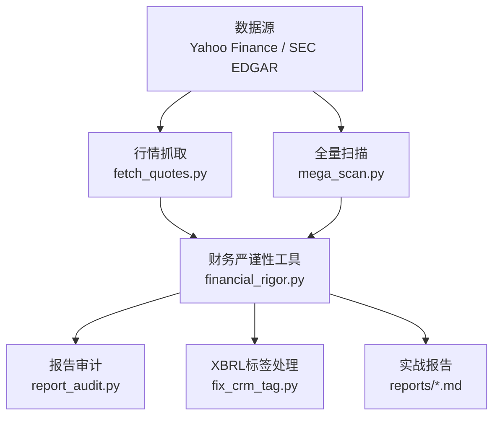
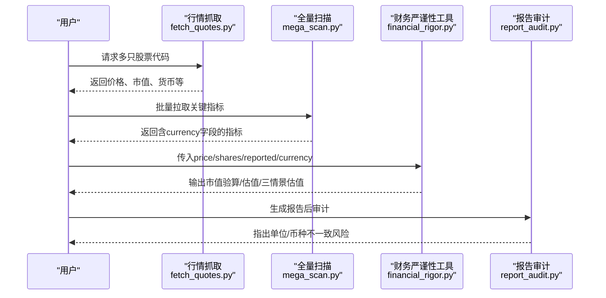
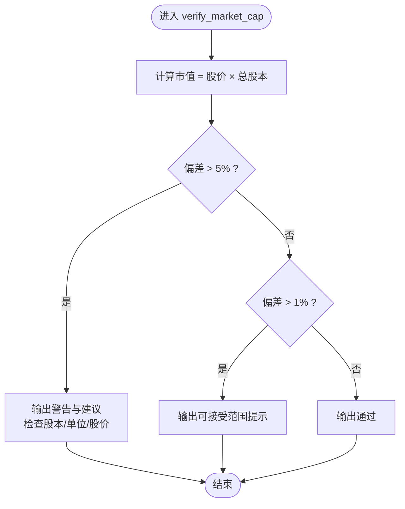
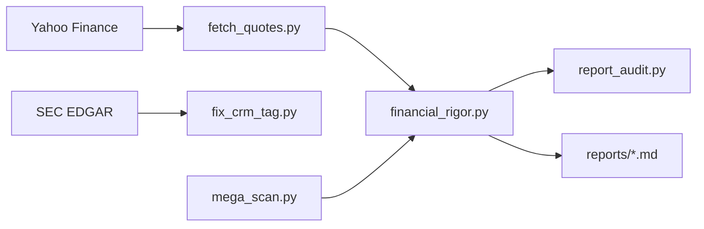

# 多币种分析支持

<cite>
**本文引用的文件**
- [README.md](file://README.md)
- [CONTEXT.md](file://CONTEXT.md)
- [tools/financial_rigor.py](file://tools/financial_rigor.py)
- [tests/test_financial_rigor.py](file://tests/test_financial_rigor.py)
- [tools/fetch_quotes.py](file://tools/fetch_quotes.py)
- [tools/mega_scan.py](file://tools/mega_scan.py)
- [tools/report_audit.py](file://tools/report_audit.py)
- [tools/fix_crm_tag.py](file://tools/fix_crm_tag.py)
- [reports/portfolio-action-20260810-v2.md](file://reports/portfolio-action-20260810-v2.md)
- [reports/7公司10年投资价值横评-确定性调整后回报-20260814.md](file://reports/7公司10年投资价值横评-确定性调整后回报-20260814.md)
</cite>

## 目录
1. [引言](#引言)
2. [项目结构](#项目结构)
3. [核心组件](#核心组件)
4. [架构总览](#架构总览)
5. [详细组件分析](#详细组件分析)
6. [依赖关系分析](#依赖关系分析)
7. [性能与精度考量](#性能与精度考量)
8. [故障排查指南](#故障排查指南)
9. [结论](#结论)
10. [附录](#附录)

## 引言
本文件聚焦“多币种分析支持”能力，说明该仓库如何在数据获取、计算验证、报告审计与输出呈现中贯穿币种信息，确保跨市场（美元、港币、人民币等）数据的可比性与可审计性。核心目标：
- 在数据层显式携带并传递币种字段；
- 在计算层使用精确十进制避免浮点误差；
- 在验证层对市值、估值、三情景估值等进行币种感知校验；
- 在报告层统一单位与币种标注，避免混用导致的误判。

## 项目结构
围绕多币种能力的代码主要分布在工具层与测试层：
- 工具层：财务严谨性工具、行情抓取、全量扫描、报告审计、XBRL标签处理等；
- 测试层：针对金融工具的回归测试，覆盖编码与计算路径；
- 文档与报告：README、SaaS上下文说明、实战报告中的币种与折现率讨论。

图表来源
- [tools/fetch_quotes.py:9-35](file://tools/fetch_quotes.py#L9-L35)
- [tools/mega_scan.py:60-153](file://tools/mega_scan.py#L60-L153)
- [tools/financial_rigor.py:74-104](file://tools/financial_rigor.py#L74-L104)
- [tools/report_audit.py:39-65](file://tools/report_audit.py#L39-L65)
- [tools/fix_crm_tag.py:15-46](file://tools/fix_crm_tag.py#L15-L46)

章节来源
- [README.md:109-123](file://README.md#L109-L123)
- [CONTEXT.md:1-30](file://CONTEXT.md#L1-L30)

## 核心组件
- 财务严谨性工具（financial_rigor.py）：提供市值验算、估值指标验算、多源交叉验证、Benford检测、精确计算器、三情景估值，并在多处显式支持币种参数与输出。
- 行情抓取（fetch_quotes.py）：从Yahoo获取实时报价与统计，返回结果包含货币字段。
- 全量扫描（mega_scan.py）：批量拉取股票关键指标，保留currency字段用于后续处理。
- 报告审计（report_audit.py）：正则匹配数值与单位，识别亿元/亿美元/港元等，辅助报告一致性检查。
- XBRL标签处理（fix_crm_tag.py）：按USD单位抽取财报事实，体现单一币种视角的数据提取。
- 测试（test_financial_rigor.py）：覆盖GBK控制台下的输出稳定性与计算正确性。

章节来源
- [tools/financial_rigor.py:1-16](file://tools/financial_rigor.py#L1-L16)
- [tools/fetch_quotes.py:9-35](file://tools/fetch_quotes.py#L9-L35)
- [tools/mega_scan.py:60-153](file://tools/mega_scan.py#L60-L153)
- [tools/report_audit.py:39-65](file://tools/report_audit.py#L39-L65)
- [tools/fix_crm_tag.py:15-46](file://tools/fix_crm_tag.py#L15-L46)
- [tests/test_financial_rigor.py:1-25](file://tests/test_financial_rigor.py#L1-L25)

## 架构总览
多币种分析贯穿“数据—计算—验证—报告”的流水线：
- 数据层：行情与财报数据附带币种或按币种过滤；
- 计算层：所有关键计算采用Decimal精确运算，避免浮点误差；
- 验证层：市值、估值、三情景估值均支持币种参数，偏差阈值与提示明确；
- 报告层：单位与币种标注一致，审计工具辅助发现不一致。

图表来源
- [tools/fetch_quotes.py:9-35](file://tools/fetch_quotes.py#L9-L35)
- [tools/mega_scan.py:60-153](file://tools/mega_scan.py#L60-L153)
- [tools/financial_rigor.py:74-104](file://tools/financial_rigor.py#L74-L104)
- [tools/report_audit.py:39-65](file://tools/report_audit.py#L39-L65)

## 详细组件分析

### 财务严谨性工具（多币种核心）
- 市值验算：支持传入币种，计算股价×总股本并与报告市值对比，输出偏差百分比与告警建议（如单位不一致）。
- 估值指标验算：基于输入计算PE/PB/PS/FCF Yield/股息率等，全部使用Decimal精确计算。
- 多源交叉验证：比较多个来源的同一字段，给出共识值与偏差提示。
- Benford检测：对大量财务数值的分布进行快速异常检测。
- 精确计算器：安全表达式求值，避免LLM心算误差。
- 三情景估值：支持乐观/中性/悲观三种增长与目标PE组合，输出目标价与涨跌幅，支持币种参数。

图表来源
- [tools/financial_rigor.py:74-104](file://tools/financial_rigor.py#L74-L104)

章节来源
- [tools/financial_rigor.py:74-104](file://tools/financial_rigor.py#L74-L104)
- [tools/financial_rigor.py:111-173](file://tools/financial_rigor.py#L111-L173)
- [tools/financial_rigor.py:180-217](file://tools/financial_rigor.py#L180-L217)
- [tools/financial_rigor.py:227-294](file://tools/financial_rigor.py#L227-L294)
- [tools/financial_rigor.py:301-326](file://tools/financial_rigor.py#L301-L326)
- [tools/financial_rigor.py:333-373](file://tools/financial_rigor.py#L333-L373)

### 行情抓取与币种透传
- fetch_quotes.py：从Yahoo获取实时报价与统计，返回结果中包含currency字段，便于下游按币种区分处理。
- mega_scan.py：批量拉取时同样保留currency字段，并在内部推导指标时保持币种一致性。

章节来源
- [tools/fetch_quotes.py:9-35](file://tools/fetch_quotes.py#L9-L35)
- [tools/mega_scan.py:60-153](file://tools/mega_scan.py#L60-L153)

### 报告审计与单位识别
- report_audit.py：通过正则匹配数值与单位（如亿元、亿美元、港元、百分比、倍数等），帮助发现报告中单位混用问题，降低跨币种误读风险。

章节来源
- [tools/report_audit.py:39-65](file://tools/report_audit.py#L39-L65)

### XBRL标签与单一币种视角
- fix_crm_tag.py：从SEC EDGAR抽取以USD计量的财报事实，体现单一币种视角的数据提取方式，适用于美股标的的严格USD口径分析。

章节来源
- [tools/fix_crm_tag.py:15-46](file://tools/fix_crm_tag.py#L15-L46)

### 测试保障与平台兼容性
- test_financial_rigor.py：模拟GBK控制台环境，验证财务工具在不同编码下不崩溃，并确保计算逻辑不受影响；覆盖市值验算通过/失败路径及三情景估值。

章节来源
- [tests/test_financial_rigor.py:1-25](file://tests/test_financial_rigor.py#L1-L25)
- [tests/test_financial_rigor.py:40-90](file://tests/test_financial_rigor.py#L40-L90)
- [tests/test_financial_rigor.py:107-115](file://tests/test_financial_rigor.py#L107-L115)

## 依赖关系分析
- 数据源依赖：Yahoo Finance（行情）、SEC EDGAR（财报）；
- 工具间耦合：
  - fetch_quotes.py 与 mega_scan.py 产出含currency字段的结构化数据；
  - financial_rigor.py 消费这些数据进行市值/估值/三情景估值校验；
  - report_audit.py 对最终报告进行单位/币种一致性检查；
  - fix_crm_tag.py 提供USD口径的财报事实抽取。
- 外部库：仅Python标准库（decimal、json、math、argparse），保证零外部依赖与高可移植性。

图表来源
- [tools/fetch_quotes.py:9-35](file://tools/fetch_quotes.py#L9-L35)
- [tools/mega_scan.py:60-153](file://tools/mega_scan.py#L60-L153)
- [tools/financial_rigor.py:74-104](file://tools/financial_rigor.py#L74-L104)
- [tools/report_audit.py:39-65](file://tools/report_audit.py#L39-L65)
- [tools/fix_crm_tag.py:15-46](file://tools/fix_crm_tag.py#L15-L46)

章节来源
- [tools/financial_rigor.py:1-16](file://tools/financial_rigor.py#L1-L16)

## 性能与精度考量
- 精度优先：所有关键计算使用Decimal精确十进制，避免浮点误差；
- 零外部依赖：仅标准库，减少环境差异带来的不确定性；
- 批处理能力：mega_scan.py支持批量拉取并写入JSON，便于后续批量校验；
- 平台兼容：强制UTF-8输出，避免Windows GBK控制台崩溃；
- 可扩展性：命令行子命令清晰，易于扩展新的币种或指标校验。

[本节为通用指导，无需具体文件引用]

## 故障排查指南
- 市值验算偏差过大：
  - 检查股本是否最新（回购/增发）；
  - 确认单位一致（港币 vs 人民币 vs 美元）；
  - 确认股价是否为最新。
- 报告单位不一致：
  - 使用report_audit.py检查亿元/亿美元/港元混用；
  - 在报告中显式标注币种与单位。
- 控制台乱码或崩溃：
  - 已在工具内强制UTF-8输出，若仍出现异常，检查环境变量与终端设置。
- 美股财报数据缺失：
  - 确认EDGAR标签存在且日期范围匹配；
  - 使用fix_crm_tag.py定位可用标签。

章节来源
- [tools/financial_rigor.py:74-104](file://tools/financial_rigor.py#L74-L104)
- [tools/report_audit.py:39-65](file://tools/report_audit.py#L39-L65)
- [tests/test_financial_rigor.py:40-90](file://tests/test_financial_rigor.py#L40-L90)
- [tools/fix_crm_tag.py:15-46](file://tools/fix_crm_tag.py#L15-L46)

## 结论
该仓库在多币种分析方面形成了完整闭环：从数据层的币种透传，到计算层的精确十进制，再到验证层的市值/估值/三情景估值校验，以及报告层的单位与币种一致性审计。配合测试保障与平台兼容性处理，确保了跨市场投资研究的严谨性与可复现性。建议在后续扩展中继续坚持“币种显式化、单位标准化、计算精确化”的原则。

[本节为总结性内容，无需具体文件引用]

## 附录

### 使用示例（命令行）
- 市值验算（带币种）：
  - python3 tools/financial_rigor.py verify-market-cap --price 510 --shares 9.11e9 --reported 4.65e12 --currency HKD
- 估值指标验算：
  - python3 tools/financial_rigor.py verify-valuation --price 510 --eps 23.5 --bvps 120
- 多源交叉验证：
  - python3 tools/financial_rigor.py cross-validate --field revenue --values '{"年报": 7518, "Yahoo": 7500}' --unit 亿
- Benford检测：
  - python3 tools/financial_rigor.py benford --values '[1234, 2345, 3456, ...]'
- 精确计算：
  - python3 tools/financial_rigor.py calc --expr '510 * 9.11e9'
- 三情景估值（带币种）：
  - python3 tools/financial_rigor.py three-scenario --price 8.00 --eps 0.5000 --shares 5.0000 --growth 0.15 0.03 -0.10 --pe 22 15 10 --years 3 --currency CNY

章节来源
- [tools/financial_rigor.py:380-460](file://tools/financial_rigor.py#L380-L460)

### 实战报告中的币种与折现率要点
- 币种选择决定折现率与永续增速的匹配：人民币口径r=8%、g≤2%；美元/港元口径r=9%–11.5%、g≤4%；
- 排序在不同币种口径下通常稳健，绝对回报会随币种变化；
- 数据来源清单显示yfinance与financial_rigor.py的组合用于实时与精确计算。

章节来源
- [reports/7公司10年投资价值横评-确定性调整后回报-20260814.md:645-651](file://reports/7公司10年投资价值横评-确定性调整后回报-20260814.md#L645-L651)
- [reports/portfolio-action-20260810-v2.md:476-507](file://reports/portfolio-action-20260810-v2.md#L476-L507)