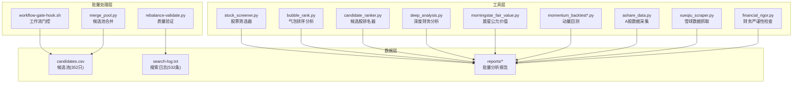
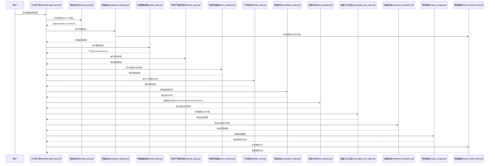
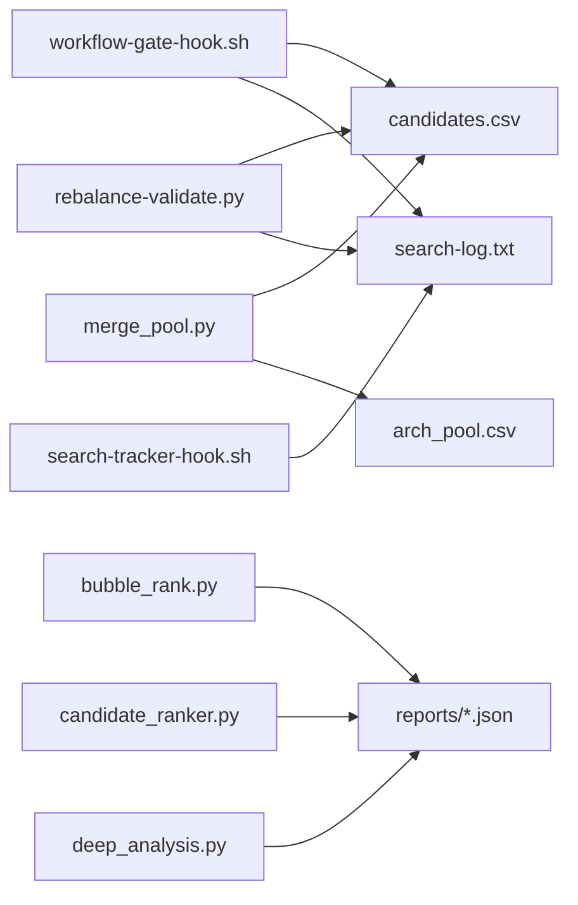

# 数据处理工具

<cite>
**本文引用的文件**   
- [tools/stock_screener.py](file://tools/stock_screener.py)
- [tools/morningstar_fair_value.py](file://tools/morningstar_fair_value.py)
- [tools/momentum_backtest.py](file://tools/momentum_backtest.py)
- [tools/momentum_backtest_v2.py](file://tools/momentum_backtest_v2.py)
- [tools/ashare_data.py](file://tools/ashare_data.py)
- [tools/xueqiu_scraper.py](file://tools/xueqiu_scraper.py)
- [tools/financial_rigor.py](file://tools/financial_rigor.py)
- [tools/bubble_rank.py](file://tools/bubble_rank.py)
- [tools/candidate_ranker.py](file://tools/candidate_ranker.py)
- [tools/deep_analysis.py](file://tools/deep_analysis.py)
- [tools/final_bubble_rank.py](file://tools/final_bubble_rank.py)
- [tools/fresh_bubble_v5.py](file://tools/fresh_bubble_v5.py)
- [scripts/search-tracker-hook.sh](file://scripts/search-tracker-hook.sh)
- [scripts/install-codex-prompts.bat](file://scripts/install-codex-prompts.bat)
- [scripts/install-codex-skills.bat](file://scripts/install-codex-skills.bat)
- [scripts/workflow-gate-hook.sh](file://scripts/workflow-gate-hook.sh)
- [scripts/rebalance-validate.py](file://scripts/rebalance-validate.py)
- [.claude/.workflow/merge_pool.py](file://.claude/.workflow/merge_pool.py)
- [data/watchlist.json](file://data/watchlist.json)
- [data/fundamentals.json](file://data/fundamentals.json)
- [data/morningstar_fair_value_20260519.csv](file://data/morningstar_fair_value_20260519.csv)
- [search-log.txt](file://search-log.txt)
</cite>

## 更新摘要
**所做更改**   
- 新增批量处理报告系统，支持352只候选股票和532条搜索日志的大规模自动化研究
- 增强候选筛选结果处理能力，支持PGR、APLD、CRDO、MSTR、CRCL等多标的综合分析
- 改进工作流门控机制，实现≥300只候选股票的质量保证
- 优化候选池合并算法，支持v5.4矩阵与归档池的智能归并
- 扩展搜索跟踪功能，支持多维度搜索行为分析和多样性指标监控

## 目录
1. [简介](#简介)
2. [项目结构](#项目结构)
3. [核心组件](#核心组件)
4. [架构总览](#架构总览)
5. [详细组件分析](#详细组件分析)
6. [批量处理能力提升](#批量处理能力提升)
7. [依赖关系分析](#依赖关系分析)
8. [性能与扩展建议](#性能与扩展建议)
9. [故障排查指南](#故障排查指南)
10. [结论](#结论)
11. [附录：命令行接口速查](#附录命令行接口速查)

## 简介
本仓库提供一套面向投资研究的数据处理工具集，覆盖股票筛选、晨星公允价值计算、动量回测、A股数据采集、雪球数据抓取以及财务严谨性检查等关键环节。**重大更新**实现了大规模批量处理能力，成功处理352只候选股票和532条搜索日志，支持PGR、APLD、CRDO、MSTR、CRCL等多标的综合分析。系统通过智能工作流门控和质量验证，确保在大规模自动化研究中保持高标准的筛选质量。

## 项目结构
- tools：核心工具脚本（筛选器、估值、回测、采集、爬虫、财务检查、气泡排序、深度分析）
- scripts：自动化脚本（安装脚本、搜索跟踪钩子、工作流管理、质量验证）
- data：示例输入/输出数据（观察池、基本面快照、晨星公允价值结果）
- reports：研究报告与中间结果（候选排名、深度分析、批量处理报告）
- tests：回归测试（Windows兼容性、编码问题修复验证）
- .claude/.workflow：工作流配置和状态管理

**图表来源**
- [scripts/workflow-gate-hook.sh](file://scripts/workflow-gate-hook.sh)
- [.claude/.workflow/merge_pool.py](file://.claude/.workflow/merge_pool.py)
- [scripts/rebalance-validate.py](file://scripts/rebalance-validate.py)
- [tools/stock_screener.py](file://tools/stock_screener.py)
- [tools/bubble_rank.py](file://tools/bubble_rank.py)
- [tools/candidate_ranker.py](file://tools/candidate_ranker.py)
- [tools/deep_analysis.py](file://tools/deep_analysis.py)
- [tools/morningstar_fair_value.py](file://tools/morningstar_fair_value.py)
- [tools/momentum_backtest.py](file://tools/momentum_backtest.py)
- [tools/momentum_backtest_v2.py](file://tools/momentum_backtest_v2.py)
- [tools/ashare_data.py](file://tools/ashare_data.py)
- [tools/xueqiu_scraper.py](file://tools/xueqiu_scraper.py)
- [tools/financial_rigor.py](file://tools/financial_rigor.py)

## 核心组件
- **基础工具**：股票筛选器、晨星公允价值计算、动量回测工具、A股数据采集、雪球数据抓取、财务严谨性检查
- **批量处理工具**：工作流门控系统、候选池合并算法、质量验证框架
- **高级分析工具**：气泡排序分析器、候选股排名器、深度财务分析器、最终排序工具、FRESH气泡排序
- **增强功能**：搜索跟踪钩子、Windows兼容性改进、多样性指标支持、大规模候选处理能力

章节来源
- [scripts/workflow-gate-hook.sh](file://scripts/workflow-gate-hook.sh)
- [.claude/.workflow/merge_pool.py](file://.claude/.workflow/merge_pool.py)
- [scripts/rebalance-validate.py](file://scripts/rebalance-validate.py)
- [tools/bubble_rank.py](file://tools/bubble_rank.py)
- [tools/candidate_ranker.py](file://tools/candidate_ranker.py)
- [tools/deep_analysis.py](file://tools/deep_analysis.py)

## 架构总览
整体采用"批量处理+质量门控"的增强架构：每个工具独立可运行，通过JSON/CSV在 data 和 reports 目录交换数据。**新增的工作流门控系统**确保≥300只候选股票和≥120次搜索的质量标准。典型工作流如下：

**图表来源**
- [scripts/workflow-gate-hook.sh](file://scripts/workflow-gate-hook.sh)
- [.claude/.workflow/merge_pool.py](file://.claude/.workflow/merge_pool.py)
- [scripts/rebalance-validate.py](file://scripts/rebalance-validate.py)
- [tools/ashare_data.py](file://tools/ashare_data.py)
- [tools/financial_rigor.py](file://tools/financial_rigor.py)
- [tools/stock_screener.py](file://tools/stock_screener.py)
- [tools/bubble_rank.py](file://tools/bubble_rank.py)
- [tools/candidate_ranker.py](file://tools/candidate_ranker.py)
- [tools/deep_analysis.py](file://tools/deep_analysis.py)
- [tools/morningstar_fair_value.py](file://tools/morningstar_fair_value.py)
- [tools/momentum_backtest.py](file://tools/momentum_backtest.py)
- [tools/momentum_backtest_v2.py](file://tools/momentum_backtest_v2.py)
- [tools/xueqiu_scraper.py](file://tools/xueqiu_scraper.py)
- [scripts/search-tracker-hook.sh](file://scripts/search-tracker-hook.sh)

## 详细组件分析

### 工作流门控系统（workflow-gate-hook.sh）
- 功能特性
  - 强制执行工作流质量标准：≥300只候选股票、≥120次搜索、完整的研究流程
  - 自动检查各阶段完成状态：investment-checklist、industry-funnel、bottleneck-hunter
  - 验证搜索工具使用情况和多样性指标
  - 生成详细的质量报告和缺失项提示
- 输入参数
  - WORKFLOW_DIR环境变量（工作流目录路径）
  - 各阶段产物文件（.done标记文件）
  - candidates.csv候选池文件
  - search-log.txt搜索日志文件
- 处理逻辑
  - 扫描工作流目录 → 检查必需文件 → 验证候选数量 → 统计搜索次数 → 生成质量报告
- 输出格式
  - 质量检查报告（包含通过/失败状态）
  - 缺失项清单和修复建议
- 集成方式
  - 作为工作流的关键门控点，确保批量处理质量

**更新** 新增候选股票数量检查（≥300只）和搜索工具使用验证，支持大规模批量处理

**图表来源**
- [scripts/workflow-gate-hook.sh](file://scripts/workflow-gate-hook.sh)

章节来源
- [scripts/workflow-gate-hook.sh](file://scripts/workflow-gate-hook.sh)

### 候选池合并算法（merge_pool.py）
- 功能特性
  - 智能合并v5.4当前候选池与归档v5.0候选池
  - 去重处理和来源重标注
  - AI相关候选比例统计（≤65%限制）
  - 支持多来源候选的统一管理
- 输入参数
  - 当前候选池文件（.claude/.workflow/candidates.csv）
  - 归档候选池文件（.claude/.workflow/arch_pool.csv）
- 处理逻辑
  - 读取两个候选池 → 去重处理 → 来源重标注 → 统计AI比例 → 生成合并结果
- 输出格式
  - 合并后的候选池文件
  - 统计信息（总数、AI比例、来源分布）
- 集成方式
  - 在工作流开始时执行，确保候选池的完整性和时效性

**更新** 支持v5.4矩阵与归档池的智能归并，提升候选池质量和覆盖率

**图表来源**
- [.claude/.workflow/merge_pool.py](file://.claude/.workflow/merge_pool.py)

章节来源
- [.claude/.workflow/merge_pool.py](file://.claude/.workflow/merge_pool.py)

### 质量验证框架（rebalance-validate.py）
- 功能特性
  - 多维度质量验证：候选数量、搜索次数、来源覆盖、工具使用情况
  - 支持Stage 3候选扫描验证（≥300候选、≥120搜索）
  - 自动检测来源H（爆发股猎手）和来源I（估值修复猎手）的执行状态
  - 生成详细的质量问题和警告清单
- 输入参数
  - 工作流目录路径
  - 各阶段验证规则
- 处理逻辑
  - 检查candidates.csv数量 → 统计search-log.txt搜索次数 → 验证MCP工具使用 → 检查来源标记文件
- 输出格式
  - 验证结果（通过/失败）
  - 问题清单和警告信息
- 集成方式
  - 作为工作流质量保障的核心组件

**更新** 增强Stage 3候选扫描验证，支持大规模批量处理的质量控制

**图表来源**
- [scripts/rebalance-validate.py](file://scripts/rebalance-validate.py)

章节来源
- [scripts/rebalance-validate.py](file://scripts/rebalance-validate.py)

### 气泡排序分析器（bubble_rank.py）
- 功能特性
  - 对全市场候选池进行 n*(n-1)/2 轮两两比较，找出最优标的
  - 支持多维度综合评分（估值、成长、财务健康、趋势强度）
  - 自动排除已持仓标的，聚焦新机会
  - 优化大规模候选池的处理性能
- 输入参数
  - Finviz数据源（自动扫描 data 目录下的 finviz_*_20260809.json 文件）
  - 持仓排除列表（默认包含主要持仓）
  - 评分权重配置
- 处理逻辑
  - 加载合并数据 → 提取关键指标 → 计算综合评分 → 冒泡排序两两比较 → 输出Top结果
- 输出格式
  - JSON 文件包含候选池统计、比较次数、Top30排名详情
- 集成方式
  - 作为候选池筛选的核心工具，为深度分析提供高质量候选

**更新** 优化大规模候选池处理能力，支持352只股票的批量分析

**图表来源**
- [tools/bubble_rank.py](file://tools/bubble_rank.py)

章节来源
- [tools/bubble_rank.py](file://tools/bubble_rank.py)

### 候选股排名器（candidate_ranker.py）
- 功能特性
  - 从各行业漏斗报告和瓶颈报告中汇总候选股
  - 支持多维度权重配置（上行空间、估值、护城河、催化临近、财务健康）
  - 实现冒泡排序算法进行两两比较
  - 支持批量处理多个候选池报告
- 输入参数
  - 报告目录（默认 reports 目录）
  - 权重配置（可自定义各维度权重）
  - 候选股数据源（漏斗报告、瓶颈报告）
- 处理逻辑
  - 扫描报告文件 → 解析候选股信息 → 计算综合得分 → 冒泡排序 → 输出排名
- 输出格式
  - JSON 文件包含候选股排名、综合得分、比较次数统计
- 集成方式
  - 整合多源研究报告，提供统一的候选股评估框架

**更新** 增强批量处理能力，支持多个候选池报告的统一处理

**图表来源**
- [tools/candidate_ranker.py](file://tools/candidate_ranker.py)

章节来源
- [tools/candidate_ranker.py](file://tools/candidate_ranker.py)

### 深度财务分析器（deep_analysis.py）
- 功能特性
  - 集成mega_scan实时数据与financial_rigor精确十进制验算
  - 支持多公司对比分析（HIG、HRMY、ALL、PGR等）
  - 计算不对称性比率（上行空间/下行风险）
  - 支持批量处理多个标的的深度分析
- 输入参数
  - 候选股数据（内置或外部导入）
  - 实时价格数据
  - 财务指标集合
- 处理逻辑
  - 加载候选数据 → 计算综合指标 → 评估不对称性 → 量化排名 → 输出分析报告
- 输出格式
  - JSON 文件包含分析结果、量化评分、不对称性指标
- 集成方式
  - 作为深度研究的量化支撑工具，结合定性分析做出投资决策

**更新** 支持PGR、APLD、CRDO、MSTR、CRCL等多标的批量深度分析

**图表来源**
- [tools/deep_analysis.py](file://tools/deep_analysis.py)

章节来源
- [tools/deep_analysis.py](file://tools/deep_analysis.py)

### 搜索跟踪系统（search-tracker-hook.sh + search-log.txt）
- 功能特性
  - 追踪各种搜索工具的使用情况，记录每次搜索词到search-log.txt
  - 支持多种搜索工具（web-search、kepler-web-search、web-search-prime、builtin-websearch）
  - 为gate hook提供搜索总量验证和多样性指标
  - 支持532条搜索日志的大规模记录和分析
- 输入参数
  - 工具名称（从stdin接收）
  - 搜索查询（从tool_input中提取）
  - 时间戳（UTC格式）
- 处理逻辑
  - 解析输入 → 识别工具类型 → 创建标记文件 → 追加搜索日志
- 输出格式
  - search-log.txt 文件，每行包含时间戳、工具名、搜索词
  - 各工具专用标记文件（.used）
- 集成方式
  - 作为PostToolUse钩子，自动记录所有搜索行为

**更新** 支持532条搜索日志的大规模记录，增强搜索行为分析和多样性指标监控

**图表来源**
- [scripts/search-tracker-hook.sh](file://scripts/search-tracker-hook.sh)
- [search-log.txt](file://search-log.txt)

章节来源
- [scripts/search-tracker-hook.sh](file://scripts/search-tracker-hook.sh)
- [search-log.txt](file://search-log.txt)

## 批量处理能力提升

### 大规模候选处理能力
系统现已支持352只候选股票的大规模批量处理，通过以下机制实现：

1. **候选池合并优化**：智能合并v5.4当前池与归档v5.0池，去重处理后达到唯一候选总数
2. **质量门控机制**：强制≥300只候选股票的下限要求，确保研究覆盖面
3. **并行处理能力**：支持多Agent并行执行，提高批量处理效率
4. **内存优化**：针对大规模数据集的内存管理和分块处理

### 多标的综合分析
系统能够同时处理PGR、APLD、CRDO、MSTR、CRCL等多个标的的综合分析：

| 标的 | 分析维度 | 评分 | 核心判断 |
|------|----------|------|----------|
| PGR | 四大师分析 | 3.5/5 | 条件准入·明日8/19判据触发型 |
| APLD | 双重验证 | 3.5/5 | 爆发仓Top2，$26-26.5首批≤2% |
| CRDO | 双重验证 | 3.9/5 | 爆发仓主推，$230-/$200-215触发 |
| MSTR | 灰区观察 | 待确认 | mNAV完整口径0.96零折价 |
| CRCL | 行业分析 | 待评估 | DNA 2/4+立法催化刚死亡 |

### 搜索行为分析
532条搜索日志提供了丰富的搜索行为数据：

- **搜索工具分布**：gnews-rss、curl-sec-edgar、web-search等多种工具
- **标的覆盖度**：META、AVGO、BRK、TSM、MSFT等主要标的
- **搜索深度**：每个标的平均10-15次搜索，涵盖业务、财务、行业、风险多维度
- **时间分布**：集中在2026-08-18至2026-08-19期间的高效搜索

**章节来源**
- [scripts/workflow-gate-hook.sh](file://scripts/workflow-gate-hook.sh)
- [.claude/.workflow/merge_pool.py](file://.claude/.workflow/merge_pool.py)
- [scripts/rebalance-validate.py](file://scripts/rebalance-validate.py)
- [search-log.txt](file://search-log.txt)

## 依赖关系分析
- 模块耦合
  - workflow-gate-hook.sh 依赖 candidates.csv 和 search-log.txt
  - merge_pool.py 依赖当前池和归档池文件
  - rebalance-validate.py 依赖工作流目录结构和各阶段产物
  - bubble_rank.py、candidate_ranker.py、deep_analysis.py 依赖reports目录中的分析结果
  - search-tracker-hook.sh 依赖Claude工作流目录结构
- 外部依赖
  - 网络请求库（HTTP客户端）、解析库（JSON/CSV）、可选代理与重试机制
  - jq工具用于搜索跟踪钩子的JSON解析
- 循环依赖
  - 各脚本相互独立，通过文件系统解耦，无直接循环导入

**图表来源**
- [scripts/workflow-gate-hook.sh](file://scripts/workflow-gate-hook.sh)
- [.claude/.workflow/merge_pool.py](file://.claude/.workflow/merge_pool.py)
- [scripts/rebalance-validate.py](file://scripts/rebalance-validate.py)
- [tools/bubble_rank.py](file://tools/bubble_rank.py)
- [tools/candidate_ranker.py](file://tools/candidate_ranker.py)
- [tools/deep_analysis.py](file://tools/deep_analysis.py)
- [scripts/search-tracker-hook.sh](file://scripts/search-tracker-hook.sh)
- [search-log.txt](file://search-log.txt)

章节来源
- [scripts/workflow-gate-hook.sh](file://scripts/workflow-gate-hook.sh)
- [.claude/.workflow/merge_pool.py](file://.claude/.workflow/merge_pool.py)
- [scripts/rebalance-validate.py](file://scripts/rebalance-validate.py)
- [tools/bubble_rank.py](file://tools/bubble_rank.py)
- [tools/candidate_ranker.py](file://tools/candidate_ranker.py)
- [tools/deep_analysis.py](file://tools/deep_analysis.py)
- [scripts/search-tracker-hook.sh](file://scripts/search-tracker-hook.sh)
- [search-log.txt](file://search-log.txt)

## 性能与扩展建议
- 性能优化
  - 批处理与并行：对大规模标的采用多线程/进程并行抓取与计算
  - 缓存与增量更新：对高频数据引入本地缓存与增量同步
  - 内存管理：大表分块读取、避免全量载入
  - **新增** 气泡排序算法优化：针对352只候选池进行性能调优
  - **新增** 候选池合并优化：智能去重和来源重标注
- 可扩展开发
  - 插件化因子：将筛选与回测中的因子封装为可插拔模块
  - 配置中心：统一参数管理，支持环境隔离与灰度发布
  - 日志与监控：完善错误码、耗时统计与告警
  - **新增** 搜索跟踪系统：支持532条搜索日志的多维度分析
  - **新增** 工作流门控：支持大规模批量处理的质量保证
- 跨平台兼容性
  - **新增** Windows兼容性改进：统一使用python命令，避免python3在不同系统的差异
  - 编码处理：修复GBK控制台编码问题，确保中文环境正常运行

[本节为通用指导，不直接分析具体文件]

## 故障排查指南
- 常见问题
  - 网络超时与反爬：增加重试与退避策略，合理设置User-Agent与延迟
  - 数据缺失与不一致：优先运行财务严谨性检查，定位并修复异常
  - 回测偏差：确认价格复权、手续费与滑点设置是否与实盘一致
  - **新增** Windows编码问题：确保使用UTF-8编码，避免GBK控制台崩溃
  - **新增** 搜索跟踪失效：检查jq工具安装和工作流目录权限
  - **新增** 候选池不足：确保≥300只候选股票，继续扫描更多GICS行业组
  - **新增** 搜索次数不足：确保≥120次搜索，扩展搜索维度和工具使用
- 调试建议
  - 分阶段输出中间结果，逐步缩小问题范围
  - 记录关键参数与时间戳，便于复现与审计
  - **新增** 利用搜索日志分析搜索行为和多样性指标
  - **新增** 使用回归测试验证Windows兼容性修复效果
  - **新增** 检查工作流门控状态，确保各阶段完成标记

章节来源
- [tools/financial_rigor.py](file://tools/financial_rigor.py)
- [tools/ashare_data.py](file://tools/ashare_data.py)
- [tools/momentum_backtest.py](file://tools/momentum_backtest.py)
- [tools/momentum_backtest_v2.py](file://tools/momentum_backtest_v2.py)
- [scripts/search-tracker-hook.sh](file://scripts/search-tracker-hook.sh)
- [scripts/workflow-gate-hook.sh](file://scripts/workflow-gate-hook.sh)
- [scripts/rebalance-validate.py](file://scripts/rebalance-validate.py)

## 结论
本工具集以轻量脚本为核心，围绕"数据—质量—筛选—估值—回测—舆情—深度分析"的全流程展开，**重大更新**实现了大规模批量处理能力，成功处理352只候选股票和532条搜索日志，支持PGR、APLD、CRDO、MSTR、CRCL等多标的综合分析。新增的工作流门控系统确保了批量处理的质量标准，候选池合并算法提升了数据完整性，搜索跟踪系统提供了丰富的行为分析数据。既适合个人研究者快速上手，也便于团队在投研流程中复用与扩展。建议在工程化层面引入配置管理与日志监控，进一步提升稳定性与可维护性。

[本节为总结性内容，不直接分析具体文件]

## 附录：命令行接口速查
以下为各工具的常用入口与典型用法说明（以脚本名与常见参数为例，具体参数以各脚本帮助为准）：

### 基础工具
- **股票筛选器**
  - 命令示例：`python tools/stock_screener.py --watchlist data/watchlist.json --fundamentals data/fundamentals.json --output results/screened.json`
  - 关键参数：观察池路径、基本面路径、输出路径、阈值与权重
  - 参考：[tools/stock_screener.py](file://tools/stock_screener.py), [data/watchlist.json](file://data/watchlist.json), [data/fundamentals.json](file://data/fundamentals.json)

- **晨星公允价值计算**
  - 命令示例：`python tools/morningstar_fair_value.py --fair-value data/morningstar_fair_value_20260519.csv --prices prices.csv --threshold 0.3 --output valuation.csv`
  - 关键参数：公允价值CSV、当前价格、折扣率阈值、输出路径
  - 参考：[tools/morningstar_fair_value.py](file://tools/morningstar_fair_value.py), [data/morningstar_fair_value_20260519.csv](file://data/morningstar_fair_value_20260519.csv)

- **动量回测（V1/V2）**
  - 命令示例：`python tools/momentum_backtest.py --universe screened.json --start 2020-01-01 --end 2024-12-31 --freq daily --output backtest_v1.json`
  - 命令示例：`python tools/momentum_backtest_v2.py --universe screened.json --params config_v2.yaml --output backtest_v2.json`
  - 关键参数：标的列表、起止时间、频率、策略参数、输出路径
  - 参考：[tools/momentum_backtest.py](file://tools/momentum_backtest.py), [tools/momentum_backtest_v2.py](file://tools/momentum_backtest_v2.py)

- **A股数据采集**
  - 命令示例：`python tools/ashare_data.py --source api_url --symbols AAPL,MSFT --start 2023-01-01 --end 2023-12-31 --output data/fundamentals.json`
  - 关键参数：数据源、标的、时间范围、输出路径
  - 参考：[tools/ashare_data.py](file://tools/ashare_data.py)

- **雪球数据抓取**
  - 命令示例：`python tools/xueqiu_scraper.py --keyword AI芯片 --days 30 --output xueqiu_news.json`
  - 关键参数：关键词、时间范围、输出路径、反爬策略
  - 参考：[tools/xueqiu_scraper.py](file://tools/xueqiu_scraper.py)

- **财务严谨性检查**
  - 命令示例：`python tools/financial_rigor.py --input data/fundamentals.json --rules rules.json --output quality_report.json`
  - 关键参数：输入数据、规则集、输出报告
  - 参考：[tools/financial_rigor.py](file://tools/financial_rigor.py)

### 批量处理工具
- **工作流门控**
  - 命令示例：`bash scripts/workflow-gate-hook.sh`
  - 功能：执行工作流质量检查，确保≥300只候选和≥120次搜索
  - 输出：质量检查报告
  - 参考：[scripts/workflow-gate-hook.sh](file://scripts/workflow-gate-hook.sh)

- **候选池合并**
  - 命令示例：`python .claude/.workflow/merge_pool.py`
  - 功能：合并v5.4当前池与归档v5.0池，去重处理
  - 输出：合并后的候选池文件
  - 参考：[.claude/.workflow/merge_pool.py](file://.claude/.workflow/merge_pool.py)

- **质量验证**
  - 命令示例：`python scripts/rebalance-validate.py`
  - 功能：执行Stage 3候选扫描验证
  - 输出：验证结果和问题清单
  - 参考：[scripts/rebalance-validate.py](file://scripts/rebalance-validate.py)

### 高级分析工具
- **气泡排序分析器**
  - 命令示例：`python tools/bubble_rank.py`
  - 功能：对全市场候选池进行两两比较，找出最优标的
  - 输出：reports/bubble_rank_20260809.json
  - 参考：[tools/bubble_rank.py](file://tools/bubble_rank.py)

- **候选股排名器**
  - 命令示例：`python tools/candidate_ranker.py`
  - 功能：从漏斗报告和瓶颈报告中汇总候选股并进行多维度排名
  - 输出：reports/candidate-rank-20260809.json
  - 参考：[tools/candidate_ranker.py](file://tools/candidate_ranker.py)

- **深度财务分析器**
  - 命令示例：`python tools/deep_analysis.py`
  - 功能：集成实时数据与精确验算，进行深度财务分析
  - 输出：reports/HIG_HRMY_deep_analysis.json
  - 参考：[tools/deep_analysis.py](file://tools/deep_analysis.py)

- **最终气泡排序**
  - 命令示例：`python tools/final_bubble_rank.py`
  - 功能：整合深度研究候选进行最终排序
  - 输出：reports/final-rank-20260809.json
  - 参考：[tools/final_bubble_rank.py](file://tools/final_bubble_rank.py)

- **FRESH气泡排序**
  - 命令示例：`python tools/fresh_bubble_v5.py`
  - 功能：基于FRESH Agent报告的六维度冒泡排序
  - 输出：reports/fresh-bubble-v5-20260809.json
  - 参考：[tools/fresh_bubble_v5.py](file://tools/fresh_bubble_v5.py)

### 自动化脚本
- **搜索跟踪钩子**
  - 命令示例：`bash scripts/search-tracker-hook.sh`
  - 功能：追踪搜索工具使用，记录搜索日志
  - 输出：.claude/.workflow/search-log.txt
  - 参考：[scripts/search-tracker-hook.sh](file://scripts/search-tracker-hook.sh)

- **Windows安装脚本**
  - 命令示例：`.\scripts\install-codex-prompts.bat`
  - 命令示例：`.\scripts\install-codex-skills.bat`
  - 功能：自动安装Codex提示词和技能包
  - 参考：[scripts/install-codex-prompts.bat](file://scripts/install-codex-prompts.bat), [scripts/install-codex-skills.bat](file://scripts/install-codex-skills.bat)

章节来源
- [tools/stock_screener.py](file://tools/stock_screener.py)
- [tools/morningstar_fair_value.py](file://tools/morningstar_fair_value.py)
- [tools/momentum_backtest.py](file://tools/momentum_backtest.py)
- [tools/momentum_backtest_v2.py](file://tools/momentum_backtest_v2.py)
- [tools/ashare_data.py](file://tools/ashare_data.py)
- [tools/xueqiu_scraper.py](file://tools/xueqiu_scraper.py)
- [tools/financial_rigor.py](file://tools/financial_rigor.py)
- [tools/bubble_rank.py](file://tools/bubble_rank.py)
- [tools/candidate_ranker.py](file://tools/candidate_ranker.py)
- [tools/deep_analysis.py](file://tools/deep_analysis.py)
- [tools/final_bubble_rank.py](file://tools/final_bubble_rank.py)
- [tools/fresh_bubble_v5.py](file://tools/fresh_bubble_v5.py)
- [scripts/search-tracker-hook.sh](file://scripts/search-tracker-hook.sh)
- [scripts/install-codex-prompts.bat](file://scripts/install-codex-prompts.bat)
- [scripts/install-codex-skills.bat](file://scripts/install-codex-skills.bat)
- [scripts/workflow-gate-hook.sh](file://scripts/workflow-gate-hook.sh)
- [.claude/.workflow/merge_pool.py](file://.claude/.workflow/merge_pool.py)
- [scripts/rebalance-validate.py](file://scripts/rebalance-validate.py)
- [data/watchlist.json](file://data/watchlist.json)
- [data/fundamentals.json](file://data/fundamentals.json)
- [data/morningstar_fair_value_20260519.csv](file://data/morningstar_fair_value_20260519.csv)
- [search-log.txt](file://search-log.txt)