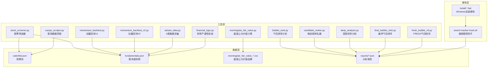
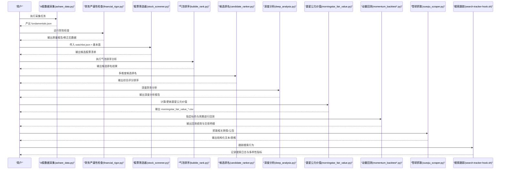
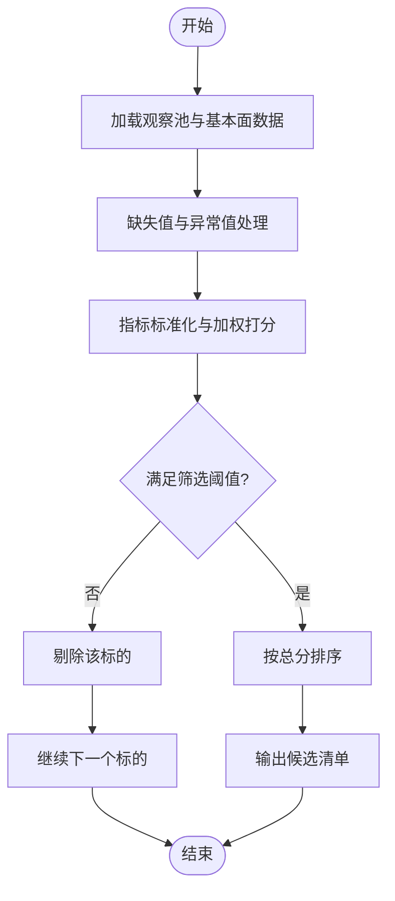
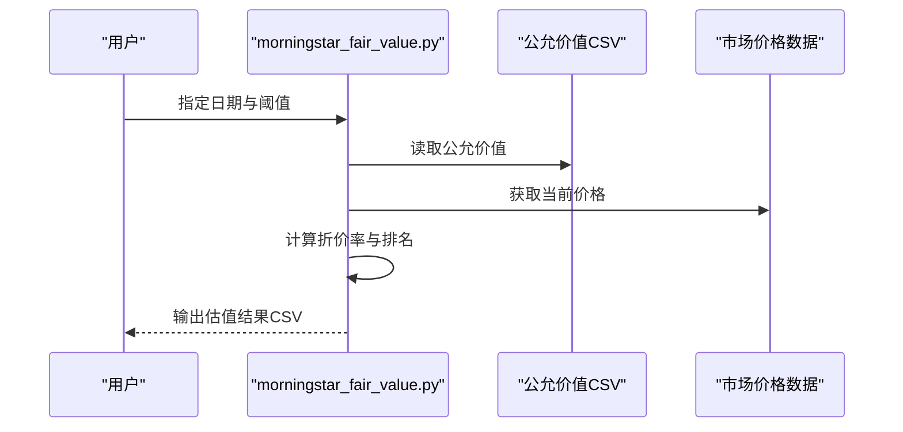
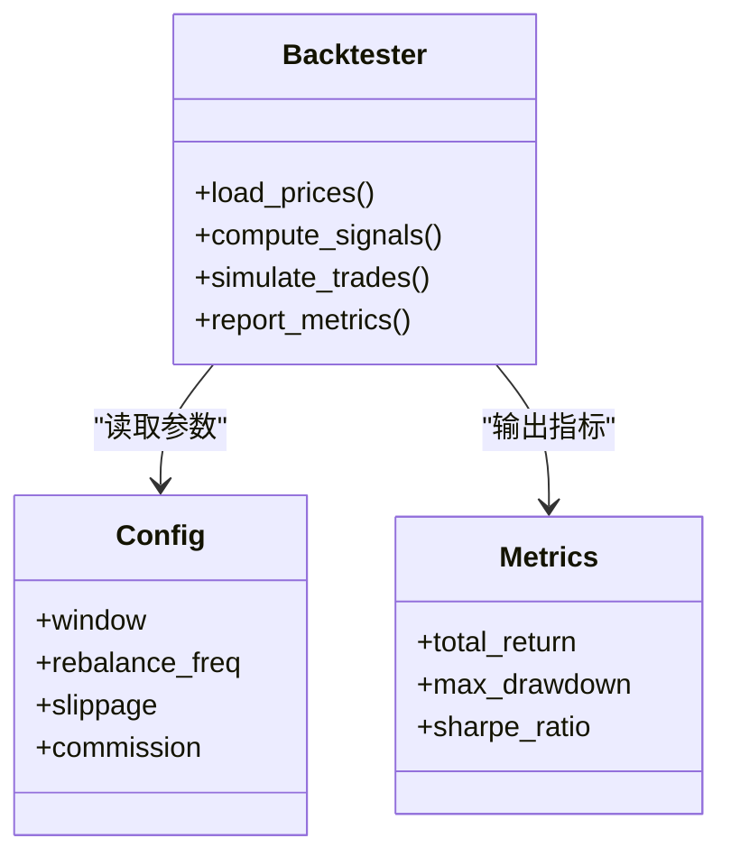
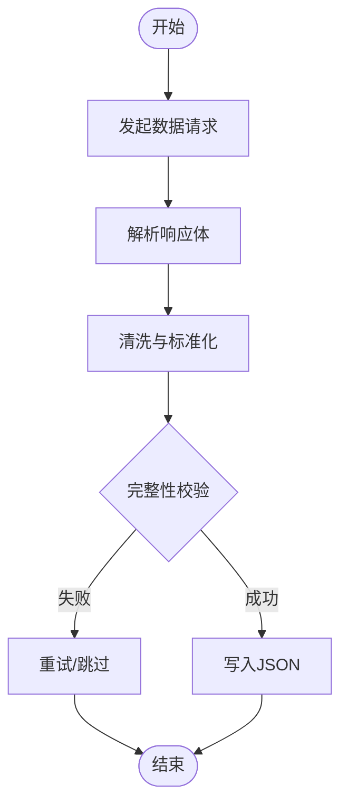
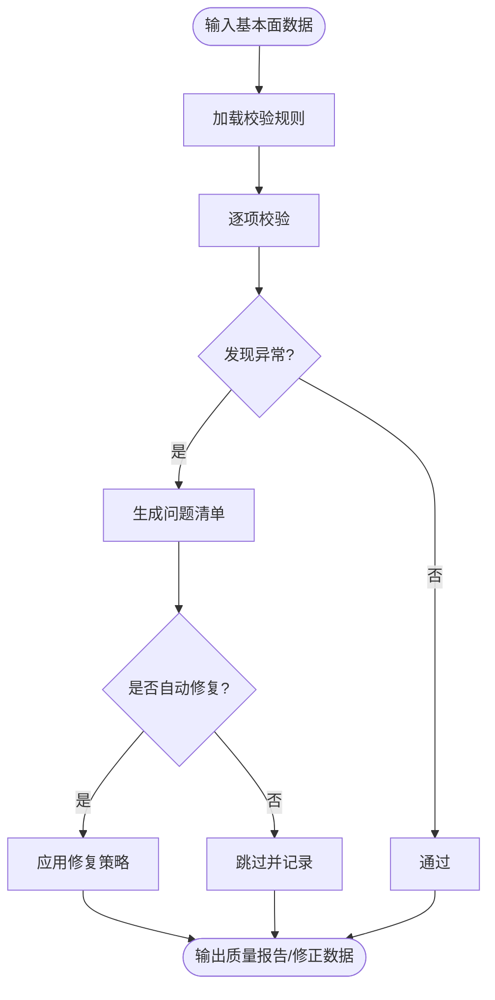
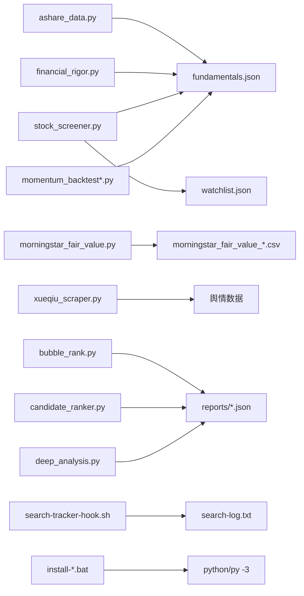

# 数据处理工具

<cite>
**本文引用的文件**   
- [tools/stock_screener.py](file://tools/stock_screener.py)
- [tools/morningstar_fair_value.py](file://tools/morningstar_fair_value.py)
- [tools/momentum_backtest.py](file://tools/momentum_backtest.py)
- [tools/momentum_backtest_v2.py](file://tools/momentum_backtest_v2.py)
- [tools/ashare_data.py](file://tools/ashare_data.py)
- [tools/xueqiu_scraper.py](file://tools/xueqiu_scraper.py)
- [tools/financial_rigor.py](file://tools/financial_rigor.py)
- [tools/bubble_rank.py](file://tools/bubble_rank.py)
- [tools/candidate_ranker.py](file://tools/candidate_ranker.py)
- [tools/deep_analysis.py](file://tools/deep_analysis.py)
- [tools/final_bubble_rank.py](file://tools/final_bubble_rank.py)
- [tools/fresh_bubble_v5.py](file://tools/fresh_bubble_v5.py)
- [scripts/search-tracker-hook.sh](file://scripts/search-tracker-hook.sh)
- [scripts/install-codex-prompts.bat](file://scripts/install-codex-prompts.bat)
- [scripts/install-codex-skills.bat](file://scripts/install-codex-skills.bat)
- [data/watchlist.json](file://data/watchlist.json)
- [data/fundamentals.json](file://data/fundamentals.json)
- [data/morningstar_fair_value_20260519.csv](file://data/morningstar_fair_value_20260519.csv)
</cite>

## 更新摘要
**所做更改**   
- 新增气泡排序分析工具（bubble_rank.py）用于全市场候选池的两两比较
- 新增候选股排名器（candidate_ranker.py）支持多维度综合评分
- 新增深度财务分析工具（deep_analysis.py）集成实时数据与精确验算
- 增强搜索跟踪功能，支持多样性指标和跨平台兼容性
- 改进Windows兼容性，统一使用python命令替代python3
- 新增多个气泡排序变体工具用于不同场景的候选筛选

## 目录
1. [简介](#简介)
2. [项目结构](#项目结构)
3. [核心组件](#核心组件)
4. [架构总览](#架构总览)
5. [详细组件分析](#详细组件分析)
6. [依赖关系分析](#依赖关系分析)
7. [性能与扩展建议](#性能与扩展建议)
8. [故障排查指南](#故障排查指南)
9. [结论](#结论)
10. [附录：命令行接口速查](#附录命令行接口速查)

## 简介
本仓库提供一套面向投资研究的数据处理工具集，覆盖股票筛选、晨星公允价值计算、动量回测、A股数据采集、雪球数据抓取以及财务严谨性检查等关键环节。**最新更新**增加了气泡排序分析、候选股排名、深度财务分析等高级功能，并增强了搜索跟踪能力和跨平台兼容性。工具以Python脚本形式组织在 tools 目录下，配合 data 目录中的示例数据，形成从"数据获取—清洗—加工—分析—输出"的完整流水线，便于在实际投研工作中快速落地。

## 项目结构
- tools：核心工具脚本（筛选器、估值、回测、采集、爬虫、财务检查、气泡排序、深度分析）
- scripts：自动化脚本（安装脚本、搜索跟踪钩子、工作流管理）
- data：示例输入/输出数据（观察池、基本面快照、晨星公允价值结果）
- reports：研究报告与中间结果（候选排名、深度分析、气泡排序结果）
- tests：回归测试（Windows兼容性、编码问题修复验证）

**图表来源**
- [tools/stock_screener.py](file://tools/stock_screener.py)
- [tools/morningstar_fair_value.py](file://tools/morningstar_fair_value.py)
- [tools/momentum_backtest.py](file://tools/momentum_backtest.py)
- [tools/momentum_backtest_v2.py](file://tools/momentum_backtest_v2.py)
- [tools/ashare_data.py](file://tools/ashare_data.py)
- [tools/xueqiu_scraper.py](file://tools/xueqiu_scraper.py)
- [tools/financial_rigor.py](file://tools/financial_rigor.py)
- [tools/bubble_rank.py](file://tools/bubble_rank.py)
- [tools/candidate_ranker.py](file://tools/candidate_ranker.py)
- [tools/deep_analysis.py](file://tools/deep_analysis.py)
- [tools/final_bubble_rank.py](file://tools/final_bubble_rank.py)
- [tools/fresh_bubble_v5.py](file://tools/fresh_bubble_v5.py)
- [scripts/search-tracker-hook.sh](file://scripts/search-tracker-hook.sh)
- [scripts/install-codex-prompts.bat](file://scripts/install-codex-prompts.bat)
- [scripts/install-codex-skills.bat](file://scripts/install-codex-skills.bat)
- [data/watchlist.json](file://data/watchlist.json)
- [data/fundamentals.json](file://data/fundamentals.json)
- [data/morningstar_fair_value_20260519.csv](file://data/morningstar_fair_value_20260519.csv)

## 核心组件
- **基础工具**：股票筛选器、晨星公允价值计算、动量回测工具、A股数据采集、雪球数据抓取、财务严谨性检查
- **新增高级工具**：气泡排序分析器、候选股排名器、深度财务分析器、最终排序工具、FRESH气泡排序
- **增强功能**：搜索跟踪钩子、Windows兼容性改进、多样性指标支持
- **自动化脚本**：安装脚本、工作流管理、搜索监控

章节来源
- [tools/stock_screener.py](file://tools/stock_screener.py)
- [tools/morningstar_fair_value.py](file://tools/morningstar_fair_value.py)
- [tools/momentum_backtest.py](file://tools/momentum_backtest.py)
- [tools/momentum_backtest_v2.py](file://tools/momentum_backtest_v2.py)
- [tools/ashare_data.py](file://tools/ashare_data.py)
- [tools/xueqiu_scraper.py](file://tools/xueqiu_scraper.py)
- [tools/financial_rigor.py](file://tools/financial_rigor.py)
- [tools/bubble_rank.py](file://tools/bubble_rank.py)
- [tools/candidate_ranker.py](file://tools/candidate_ranker.py)
- [tools/deep_analysis.py](file://tools/deep_analysis.py)
- [tools/final_bubble_rank.py](file://tools/final_bubble_rank.py)
- [tools/fresh_bubble_v5.py](file://tools/fresh_bubble_v5.py)
- [scripts/search-tracker-hook.sh](file://scripts/search-tracker-hook.sh)
- [scripts/install-codex-prompts.bat](file://scripts/install-codex-prompts.bat)
- [scripts/install-codex-skills.bat](file://scripts/install-codex-skills.bat)

## 架构总览
整体采用"脚本即服务"的轻量架构：每个工具独立可运行，通过JSON/CSV在 data 和 reports 目录交换数据。**新增的搜索跟踪系统**支持跨平台兼容性和多样性指标监控。典型工作流如下：

**图表来源**
- [tools/ashare_data.py](file://tools/ashare_data.py)
- [tools/financial_rigor.py](file://tools/financial_rigor.py)
- [tools/stock_screener.py](file://tools/stock_screener.py)
- [tools/bubble_rank.py](file://tools/bubble_rank.py)
- [tools/candidate_ranker.py](file://tools/candidate_ranker.py)
- [tools/deep_analysis.py](file://tools/deep_analysis.py)
- [tools/morningstar_fair_value.py](file://tools/morningstar_fair_value.py)
- [tools/momentum_backtest.py](file://tools/momentum_backtest.py)
- [tools/momentum_backtest_v2.py](file://tools/momentum_backtest_v2.py)
- [tools/xueqiu_scraper.py](file://tools/xueqiu_scraper.py)
- [scripts/search-tracker-hook.sh](file://scripts/search-tracker-hook.sh)

## 详细组件分析

### 股票筛选器（stock_screener.py）
- 功能特性
  - 读取观察池与基本面快照，按预设规则进行过滤与打分排序。
  - 支持多维度指标组合（如盈利质量、估值水平、流动性等）。
  - 输出候选清单，便于后续深度研究与回测验证。
- 输入参数
  - 观察池路径（默认指向 data/watchlist.json）
  - 基本面数据路径（默认指向 data/fundamentals.json）
  - 筛选阈值与权重（可通过命令行或配置文件调整）
- 处理逻辑
  - 加载数据 → 缺失值处理 → 指标标准化 → 条件过滤 → 综合打分 → 排序输出
- 输出格式
  - JSON/CSV 候选清单，包含股票代码、关键指标、得分与排名
- 集成方式
  - 作为上游"数据→初筛"环节，为回测与研报生成提供标的池

**图表来源**
- [tools/stock_screener.py](file://tools/stock_screener.py)
- [data/watchlist.json](file://data/watchlist.json)
- [data/fundamentals.json](file://data/fundamentals.json)

章节来源
- [tools/stock_screener.py](file://tools/stock_screener.py)
- [data/watchlist.json](file://data/watchlist.json)
- [data/fundamentals.json](file://data/fundamentals.json)

### 气泡排序分析器（bubble_rank.py）
- 功能特性
  - 对全市场候选池进行 n*(n-1)/2 轮两两比较，找出最优标的
  - 支持多维度综合评分（估值、成长、财务健康、趋势强度）
  - 自动排除已持仓标的，聚焦新机会
- 输入参数
  - Finviz数据源（自动扫描 data 目录下的 finviz_*_20260809.json 文件）
  - 持仓排除列表（默认包含主要持仓）
  - 评分权重配置
- 处理逻辑
  - 加载合并数据 → 提取关键指标 → 计算综合评分 → 冒泡排序两两比较 → 输出Top结果
- 输出格式
  - JSON 文件包含候选池统计、比较次数、Top30排名详情
- 集成方式
  - 作为候选池筛选的核心工具，为深度分析提供高质量候选

**更新** 新增气泡排序分析功能，支持大规模候选池的高效筛选

**图表来源**
- [tools/bubble_rank.py](file://tools/bubble_rank.py)

章节来源
- [tools/bubble_rank.py](file://tools/bubble_rank.py)

### 候选股排名器（candidate_ranker.py）
- 功能特性
  - 从各行业漏斗报告和瓶颈报告中汇总候选股
  - 支持多维度权重配置（上行空间、估值、护城河、催化临近、财务健康）
  - 实现冒泡排序算法进行两两比较
- 输入参数
  - 报告目录（默认 reports 目录）
  - 权重配置（可自定义各维度权重）
  - 候选股数据源（漏斗报告、瓶颈报告）
- 处理逻辑
  - 扫描报告文件 → 解析候选股信息 → 计算综合得分 → 冒泡排序 → 输出排名
- 输出格式
  - JSON 文件包含候选股排名、综合得分、比较次数统计
- 集成方式
  - 整合多源研究报告，提供统一的候选股评估框架

**更新** 新增候选股排名功能，支持多维度权重配置和冒泡排序算法

**图表来源**
- [tools/candidate_ranker.py](file://tools/candidate_ranker.py)

章节来源
- [tools/candidate_ranker.py](file://tools/candidate_ranker.py)

### 深度财务分析器（deep_analysis.py）
- 功能特性
  - 集成mega_scan实时数据与financial_rigor精确十进制验算
  - 支持多公司对比分析（HIG、HRMY、ALL、PGR等）
  - 计算不对称性比率（上行空间/下行风险）
- 输入参数
  - 候选股数据（内置或外部导入）
  - 实时价格数据
  - 财务指标集合
- 处理逻辑
  - 加载候选数据 → 计算综合指标 → 评估不对称性 → 量化排名 → 输出分析报告
- 输出格式
  - JSON 文件包含分析结果、量化评分、不对称性指标
- 集成方式
  - 作为深度研究的量化支撑工具，结合定性分析做出投资决策

**更新** 新增深度财务分析功能，集成实时数据与精确验算

**图表来源**
- [tools/deep_analysis.py](file://tools/deep_analysis.py)

章节来源
- [tools/deep_analysis.py](file://tools/deep_analysis.py)

### 晨星公允价值计算（morningstar_fair_value.py）
- 功能特性
  - 读取或生成晨星公允价值CSV，结合当前市场价格计算低估幅度与安全边际。
  - 支持批量更新与历史对比，辅助构建"宽护城河+低估值"策略。
- 输入参数
  - 公允价值CSV路径（默认 data/morningstar_fair_value_YYYYMMDD.csv）
  - 当前价格数据源（本地文件或外部API）
  - 折扣率阈值与排序维度
- 处理逻辑
  - 读取公允价值 → 合并当前价 → 计算折价率 → 过滤与排序 → 输出结果
- 输出格式
  - CSV 包含标的、公允价值、当前价、折价率、排名等字段
- 集成方式
  - 与筛选器联动，将"估值因子"纳入综合评分；也可单独用于价值型扫描

**图表来源**
- [tools/morningstar_fair_value.py](file://tools/morningstar_fair_value.py)
- [data/morningstar_fair_value_20260519.csv](file://data/morningstar_fair_value_20260519.csv)

章节来源
- [tools/morningstar_fair_value.py](file://tools/morningstar_fair_value.py)
- [data/morningstar_fair_value_20260519.csv](file://data/morningstar_fair_value_20260519.csv)

### 动量回测工具（momentum_backtest.py / momentum_backtest_v2.py）
- 功能特性
  - 对动量策略进行历史回测，支持多版本实现（V1/V2），便于策略迭代与对比。
  - 可配置持仓周期、调仓频率、止损止盈、滑点与手续费等。
- 输入参数
  - 标的列表（来自筛选器或观察池）
  - 时间窗口与频率（日频/周频）
  - 策略参数（动量窗口、换手限制、仓位管理等）
- 处理逻辑
  - 加载价格序列 → 计算动量信号 → 模拟交易 → 统计绩效（收益、回撤、夏普等）
- 输出格式
  - 交易明细、净值曲线、风险指标汇总（CSV/JSON）
- 集成方式
  - 承接筛选器输出，作为"策略验证"的关键环节；可与财务检查结合做"质量+动量"双因子

**图表来源**
- [tools/momentum_backtest.py](file://tools/momentum_backtest.py)
- [tools/momentum_backtest_v2.py](file://tools/momentum_backtest_v2.py)

章节来源
- [tools/momentum_backtest.py](file://tools/momentum_backtest.py)
- [tools/momentum_backtest_v2.py](file://tools/momentum_backtest_v2.py)

### A股数据采集（ashare_data.py）
- 功能特性
  - 拉取A股基础行情与财务数据，进行标准化与去重，统一写入JSON供下游消费。
- 输入参数
  - 数据源URL/认证信息（环境变量或配置文件）
  - 时间范围与标的范围
  - 输出路径（默认 data/fundamentals.json）
- 处理逻辑
  - 请求数据 → 解析与清洗 → 字段映射 → 去重与校验 → 持久化
- 输出格式
  - JSON 对象数组，包含代码、日期、价格、财务指标等
- 集成方式
  - 为筛选器、财务检查与回测提供统一数据底座

**图表来源**
- [tools/ashare_data.py](file://tools/ashare_data.py)

章节来源
- [tools/ashare_data.py](file://tools/ashare_data.py)

### 雪球数据抓取（xueqiu_scraper.py）
- 功能特性
  - 抓取雪球公开帖子、评论与公告摘要，用于舆情监测与事件驱动研究。
- 输入参数
  - 目标账户/话题标签
  - 时间范围与关键词
  - 反爬策略（延迟、代理、Cookie）
- 处理逻辑
  - 构造请求 → 翻页抓取 → 文本抽取 → 结构化存储
- 输出格式
  - JSON/CSV 文本记录，含时间、作者、正文、链接等
- 集成方式
  - 可作为"非结构化数据"补充，与量化因子结合进行情绪面分析

章节来源
- [tools/xueqiu_scraper.py](file://tools/xueqiu_scraper.py)

### 财务严谨性检查（financial_rigor.py）
- 功能特性
  - 对基本面数据进行一致性校验与异常检测，识别潜在错报与缺失。
  - **新增** Windows GBK控制台兼容性修复，避免Unicode编码错误导致的崩溃。
- 输入参数
  - 基本面JSON路径
  - 校验规则集（勾稽关系、极值阈值、同比环比波动）
- 处理逻辑
  - 规则加载 → 逐项校验 → 生成问题清单 → 可选自动修复
- 输出格式
  - 质量报告（JSON/CSV），包含问题类型、严重等级与建议
- 集成方式
  - 置于数据采集之后、筛选之前，确保输入质量

**更新** 修复Windows GBK控制台编码问题，确保在中文Windows环境下正常运行

**图表来源**
- [tools/financial_rigor.py](file://tools/financial_rigor.py)

章节来源
- [tools/financial_rigor.py](file://tools/financial_rigor.py)

### 搜索跟踪钩子（search-tracker-hook.sh）
- 功能特性
  - 追踪各种搜索工具的使用情况，记录每次搜索词到search-log.txt
  - 支持多种搜索工具（web-search、kepler-web-search、web-search-prime、builtin-websearch）
  - 为gate hook提供搜索总量验证和多样性指标
- 输入参数
  - 工具名称（从stdin接收）
  - 搜索查询（从tool_input中提取）
  - 时间戳（UTC格式）
- 处理逻辑
  - 解析输入 → 识别工具类型 → 创建标记文件 → 追加搜索日志
- 输出格式
  - search-log.txt 文件，每行包含时间戳、工具名、搜索词
  - 各工具专用标记文件（.used）
- 集成方式
  - 作为PostToolUse钩子，自动记录所有搜索行为

**更新** 增强搜索跟踪功能，支持多样性指标和跨平台兼容性

**图表来源**
- [scripts/search-tracker-hook.sh](file://scripts/search-tracker-hook.sh)

章节来源
- [scripts/search-tracker-hook.sh](file://scripts/search-tracker-hook.sh)

### Windows安装脚本（install-codex-prompts.bat / install-codex-skills.bat）
- 功能特性
  - **更新** 改进Windows兼容性，使用python命令替代python3
  - 自动检测Python环境，优先使用py -3，回退到python
  - 支持Codex提示词和技能包的自动安装
- 输入参数
  - 无（自动检测环境）
- 处理逻辑
  - 检测Python环境 → 选择合适命令 → 执行同步脚本 → 复制文件
- 输出格式
  - 安装完成消息，显示目标路径
- 集成方式
  - 作为Windows平台的安装入口，简化部署流程

**更新** 改进Windows兼容性，统一使用python命令，提升跨平台一致性

**图表来源**
- [scripts/install-codex-prompts.bat](file://scripts/install-codex-prompts.bat)
- [scripts/install-codex-skills.bat](file://scripts/install-codex-skills.bat)

章节来源
- [scripts/install-codex-prompts.bat](file://scripts/install-codex-prompts.bat)
- [scripts/install-codex-skills.bat](file://scripts/install-codex-skills.bat)

## 依赖关系分析
- 模块耦合
  - stock_screener.py 依赖 watchlist.json 与 fundamentals.json
  - morningstar_fair_value.py 依赖 morningstar_fair_value_*.csv 与市场价格数据
  - momentum_backtest*.py 依赖价格序列与标的列表
  - ashare_data.py 产出 fundamentals.json，被其他模块消费
  - financial_rigor.py 位于数据链路中上游，保障数据质量
  - xueqiu_scraper.py 产出非结构化数据，可独立使用或与因子模型结合
  - **新增** bubble_rank.py、candidate_ranker.py、deep_analysis.py 依赖reports目录中的分析结果
  - **新增** search-tracker-hook.sh 依赖Claude工作流目录结构
- 外部依赖
  - 网络请求库（HTTP客户端）、解析库（JSON/CSV）、可选代理与重试机制
  - **新增** jq工具用于搜索跟踪钩子的JSON解析
- 循环依赖
  - 各脚本相互独立，通过文件系统解耦，无直接循环导入

**图表来源**
- [tools/ashare_data.py](file://tools/ashare_data.py)
- [tools/financial_rigor.py](file://tools/financial_rigor.py)
- [tools/stock_screener.py](file://tools/stock_screener.py)
- [tools/momentum_backtest.py](file://tools/momentum_backtest.py)
- [tools/momentum_backtest_v2.py](file://tools/momentum_backtest_v2.py)
- [tools/morningstar_fair_value.py](file://tools/morningstar_fair_value.py)
- [tools/xueqiu_scraper.py](file://tools/xueqiu_scraper.py)
- [tools/bubble_rank.py](file://tools/bubble_rank.py)
- [tools/candidate_ranker.py](file://tools/candidate_ranker.py)
- [tools/deep_analysis.py](file://tools/deep_analysis.py)
- [scripts/search-tracker-hook.sh](file://scripts/search-tracker-hook.sh)
- [scripts/install-codex-prompts.bat](file://scripts/install-codex-prompts.bat)
- [scripts/install-codex-skills.bat](file://scripts/install-codex-skills.bat)
- [data/fundamentals.json](file://data/fundamentals.json)
- [data/watchlist.json](file://data/watchlist.json)
- [data/morningstar_fair_value_20260519.csv](file://data/morningstar_fair_value_20260519.csv)

章节来源
- [tools/ashare_data.py](file://tools/ashare_data.py)
- [tools/financial_rigor.py](file://tools/financial_rigor.py)
- [tools/stock_screener.py](file://tools/stock_screener.py)
- [tools/momentum_backtest.py](file://tools/momentum_backtest.py)
- [tools/momentum_backtest_v2.py](file://tools/momentum_backtest_v2.py)
- [tools/morningstar_fair_value.py](file://tools/morningstar_fair_value.py)
- [tools/xueqiu_scraper.py](file://tools/xueqiu_scraper.py)
- [tools/bubble_rank.py](file://tools/bubble_rank.py)
- [tools/candidate_ranker.py](file://tools/candidate_ranker.py)
- [tools/deep_analysis.py](file://tools/deep_analysis.py)
- [scripts/search-tracker-hook.sh](file://scripts/search-tracker-hook.sh)
- [scripts/install-codex-prompts.bat](file://scripts/install-codex-prompts.bat)
- [scripts/install-codex-skills.bat](file://scripts/install-codex-skills.bat)
- [data/fundamentals.json](file://data/fundamentals.json)
- [data/watchlist.json](file://data/watchlist.json)
- [data/morningstar_fair_value_20260519.csv](file://data/morningstar_fair_value_20260519.csv)

## 性能与扩展建议
- 性能优化
  - 批处理与并行：对大规模标的采用多线程/进程并行抓取与计算
  - 缓存与增量更新：对高频数据引入本地缓存与增量同步
  - 内存管理：大表分块读取、避免全量载入
  - **新增** 气泡排序算法优化：针对大规模候选池进行性能调优
- 可扩展开发
  - 插件化因子：将筛选与回测中的因子封装为可插拔模块
  - 配置中心：统一参数管理，支持环境隔离与灰度发布
  - 日志与监控：完善错误码、耗时统计与告警
  - **新增** 搜索跟踪系统：支持多维度搜索行为分析和多样性指标监控
- 跨平台兼容性
  - **新增** Windows兼容性改进：统一使用python命令，避免python3在不同系统的差异
  - 编码处理：修复GBK控制台编码问题，确保中文环境正常运行

[本节为通用指导，不直接分析具体文件]

## 故障排查指南
- 常见问题
  - 网络超时与反爬：增加重试与退避策略，合理设置User-Agent与延迟
  - 数据缺失与不一致：优先运行财务严谨性检查，定位并修复异常
  - 回测偏差：确认价格复权、手续费与滑点设置是否与实盘一致
  - **新增** Windows编码问题：确保使用UTF-8编码，避免GBK控制台崩溃
  - **新增** 搜索跟踪失效：检查jq工具安装和工作流目录权限
- 调试建议
  - 分阶段输出中间结果，逐步缩小问题范围
  - 记录关键参数与时间戳，便于复现与审计
  - **新增** 利用搜索日志分析搜索行为和多样性指标
  - **新增** 使用回归测试验证Windows兼容性修复效果

章节来源
- [tools/financial_rigor.py](file://tools/financial_rigor.py)
- [tools/ashare_data.py](file://tools/ashare_data.py)
- [tools/momentum_backtest.py](file://tools/momentum_backtest.py)
- [tools/momentum_backtest_v2.py](file://tools/momentum_backtest_v2.py)
- [scripts/search-tracker-hook.sh](file://scripts/search-tracker-hook.sh)

## 结论
本工具集以轻量脚本为核心，围绕"数据—质量—筛选—估值—回测—舆情—深度分析"的全流程展开，**最新更新**增加了气泡排序分析、候选股排名、深度财务分析等高级功能，并增强了搜索跟踪能力和跨平台兼容性。既适合个人研究者快速上手，也便于团队在投研流程中复用与扩展。建议在工程化层面引入配置管理与日志监控，进一步提升稳定性与可维护性。

[本节为总结性内容，不直接分析具体文件]

## 附录：命令行接口速查
以下为各工具的常用入口与典型用法说明（以脚本名与常见参数为例，具体参数以各脚本帮助为准）：

### 基础工具
- **股票筛选器**
  - 命令示例：`python tools/stock_screener.py --watchlist data/watchlist.json --fundamentals data/fundamentals.json --output results/screened.json`
  - 关键参数：观察池路径、基本面路径、输出路径、阈值与权重
  - 参考：[tools/stock_screener.py](file://tools/stock_screener.py), [data/watchlist.json](file://data/watchlist.json), [data/fundamentals.json](file://data/fundamentals.json)

- **晨星公允价值计算**
  - 命令示例：`python tools/morningstar_fair_value.py --fair-value data/morningstar_fair_value_20260519.csv --prices prices.csv --threshold 0.3 --output valuation.csv`
  - 关键参数：公允价值CSV、当前价格、折扣率阈值、输出路径
  - 参考：[tools/morningstar_fair_value.py](file://tools/morningstar_fair_value.py), [data/morningstar_fair_value_20260519.csv](file://data/morningstar_fair_value_20260519.csv)

- **动量回测（V1/V2）**
  - 命令示例：`python tools/momentum_backtest.py --universe screened.json --start 2020-01-01 --end 2024-12-31 --freq daily --output backtest_v1.json`
  - 命令示例：`python tools/momentum_backtest_v2.py --universe screened.json --params config_v2.yaml --output backtest_v2.json`
  - 关键参数：标的列表、起止时间、频率、策略参数、输出路径
  - 参考：[tools/momentum_backtest.py](file://tools/momentum_backtest.py), [tools/momentum_backtest_v2.py](file://tools/momentum_backtest_v2.py)

- **A股数据采集**
  - 命令示例：`python tools/ashare_data.py --source api_url --symbols AAPL,MSFT --start 2023-01-01 --end 2023-12-31 --output data/fundamentals.json`
  - 关键参数：数据源、标的、时间范围、输出路径
  - 参考：[tools/ashare_data.py](file://tools/ashare_data.py)

- **雪球数据抓取**
  - 命令示例：`python tools/xueqiu_scraper.py --keyword AI芯片 --days 30 --output xueqiu_news.json`
  - 关键参数：关键词、时间范围、输出路径、反爬策略
  - 参考：[tools/xueqiu_scraper.py](file://tools/xueqiu_scraper.py)

- **财务严谨性检查**
  - 命令示例：`python tools/financial_rigor.py --input data/fundamentals.json --rules rules.json --output quality_report.json`
  - 关键参数：输入数据、规则集、输出报告
  - 参考：[tools/financial_rigor.py](file://tools/financial_rigor.py)

### 新增高级工具
- **气泡排序分析器**
  - 命令示例：`python tools/bubble_rank.py`
  - 功能：对全市场候选池进行两两比较，找出最优标的
  - 输出：reports/bubble_rank_20260809.json
  - 参考：[tools/bubble_rank.py](file://tools/bubble_rank.py)

- **候选股排名器**
  - 命令示例：`python tools/candidate_ranker.py`
  - 功能：从漏斗报告和瓶颈报告中汇总候选股并进行多维度排名
  - 输出：reports/candidate-rank-20260809.json
  - 参考：[tools/candidate_ranker.py](file://tools/candidate_ranker.py)

- **深度财务分析器**
  - 命令示例：`python tools/deep_analysis.py`
  - 功能：集成实时数据与精确验算，进行深度财务分析
  - 输出：reports/HIG_HRMY_deep_analysis.json
  - 参考：[tools/deep_analysis.py](file://tools/deep_analysis.py)

- **最终气泡排序**
  - 命令示例：`python tools/final_bubble_rank.py`
  - 功能：整合深度研究候选进行最终排序
  - 输出：reports/final-rank-20260809.json
  - 参考：[tools/final_bubble_rank.py](file://tools/final_bubble_rank.py)

- **FRESH气泡排序**
  - 命令示例：`python tools/fresh_bubble_v5.py`
  - 功能：基于FRESH Agent报告的六维度冒泡排序
  - 输出：reports/fresh-bubble-v5-20260809.json
  - 参考：[tools/fresh_bubble_v5.py](file://tools/fresh_bubble_v5.py)

### 自动化脚本
- **搜索跟踪钩子**
  - 命令示例：`bash scripts/search-tracker-hook.sh`
  - 功能：追踪搜索工具使用，记录搜索日志
  - 输出：.claude/.workflow/search-log.txt
  - 参考：[scripts/search-tracker-hook.sh](file://scripts/search-tracker-hook.sh)

- **Windows安装脚本**
  - 命令示例：`.\scripts\install-codex-prompts.bat`
  - 命令示例：`.\scripts\install-codex-skills.bat`
  - 功能：自动安装Codex提示词和技能包
  - 参考：[scripts/install-codex-prompts.bat](file://scripts/install-codex-prompts.bat), [scripts/install-codex-skills.bat](file://scripts/install-codex-skills.bat)

章节来源
- [tools/stock_screener.py](file://tools/stock_screener.py)
- [tools/morningstar_fair_value.py](file://tools/morningstar_fair_value.py)
- [tools/momentum_backtest.py](file://tools/momentum_backtest.py)
- [tools/momentum_backtest_v2.py](file://tools/momentum_backtest_v2.py)
- [tools/ashare_data.py](file://tools/ashare_data.py)
- [tools/xueqiu_scraper.py](file://tools/xueqiu_scraper.py)
- [tools/financial_rigor.py](file://tools/financial_rigor.py)
- [tools/bubble_rank.py](file://tools/bubble_rank.py)
- [tools/candidate_ranker.py](file://tools/candidate_ranker.py)
- [tools/deep_analysis.py](file://tools/deep_analysis.py)
- [tools/final_bubble_rank.py](file://tools/final_bubble_rank.py)
- [tools/fresh_bubble_v5.py](file://tools/fresh_bubble_v5.py)
- [scripts/search-tracker-hook.sh](file://scripts/search-tracker-hook.sh)
- [scripts/install-codex-prompts.bat](file://scripts/install-codex-prompts.bat)
- [scripts/install-codex-skills.bat](file://scripts/install-codex-skills.bat)
- [data/watchlist.json](file://data/watchlist.json)
- [data/fundamentals.json](file://data/fundamentals.json)
- [data/morningstar_fair_value_20260519.csv](file://data/morningstar_fair_value_20260519.csv)