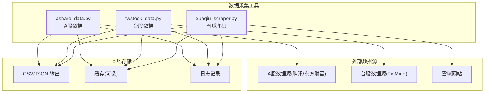
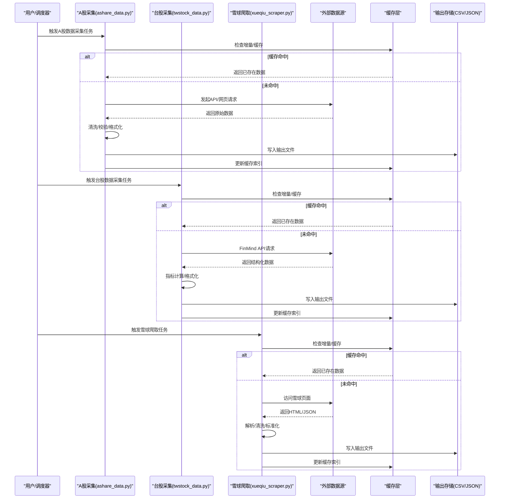
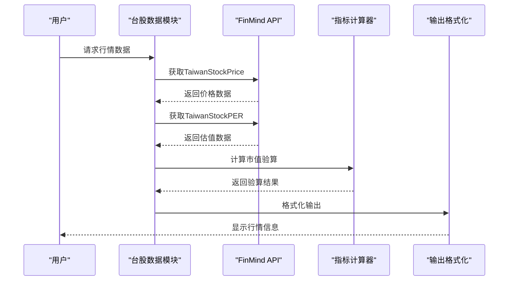
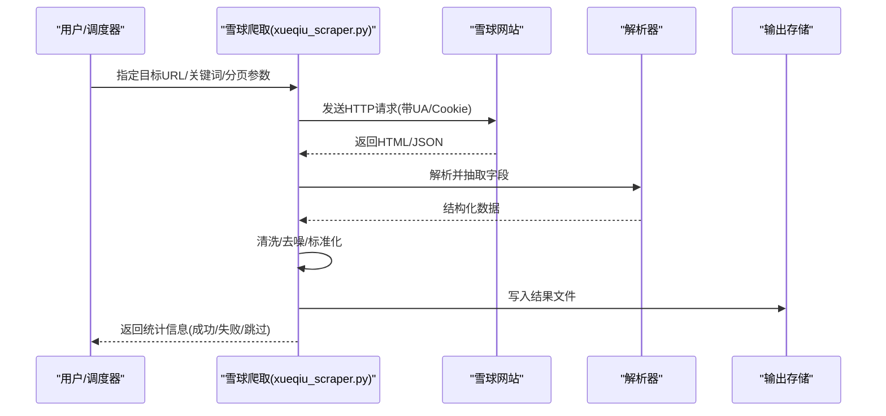
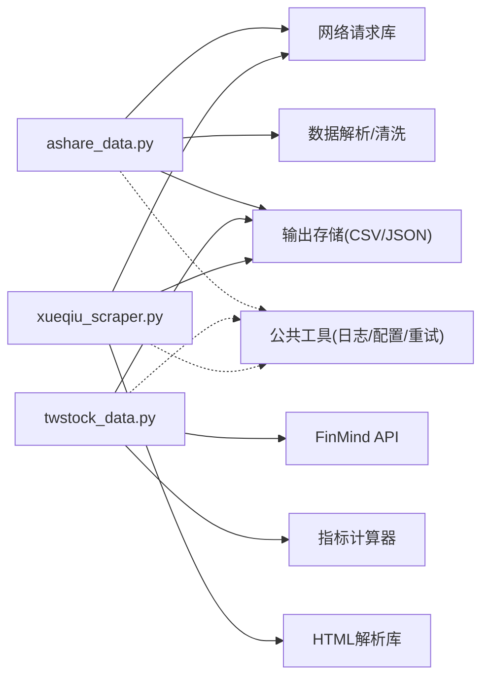

# 数据采集工具

<cite>
**本文引用的文件**   
- [tools/ashare_data.py](file://tools/ashare_data.py)
- [tools/xueqiu_scraper.py](file://tools/xueqiu_scraper.py)
- [tools/twstock_data.py](file://tools/twstock_data.py)
</cite>

## 更新摘要
**变更内容**   
- 新增台湾股票市场数据采集功能（twstock_data.py）
- 扩展A股市场数据获取能力，支持更多市场标识
- 增强估值指标计算和财务数据分析功能
- 优化网络请求和错误处理机制
- 完善增量更新策略和数据缓存机制

## 目录
1. [简介](#简介)
2. [项目结构](#项目结构)
3. [核心组件](#核心组件)
4. [架构总览](#架构总览)
5. [详细组件分析](#详细组件分析)
6. [依赖关系分析](#依赖关系分析)
7. [性能与并发优化](#性能与并发优化)
8. [故障排查指南](#故障排查指南)
9. [结论](#结论)
10. [附录：使用示例与最佳实践](#附录使用示例与最佳实践)

## 简介
本技术文档面向数据采集工具集，聚焦以下三个脚本的数据抓取能力：
- A股市场数据获取（ashare_data.py）
- 台湾股票市场数据获取（twstock_data.py）
- 雪球平台信息爬取（xueqiu_scraper.py）

文档覆盖API接口调用、反爬虫策略、数据缓存机制、错误重试逻辑、数据清洗与格式化、增量更新策略、存储格式选择、网络请求优化、并发处理与异常监控等主题，并提供完整的使用示例与最佳实践。

**更新** 本次更新重点介绍了新增的台湾股票市场支持功能，包括零依赖Python脚本实现、实时行情获取、估值指标计算、月营收分析等特色功能。

## 项目结构
本项目将数据采集相关脚本集中于 tools 目录下，便于统一维护与复用。本次重点分析的三个脚本如下：
- ashare_data.py：负责A股相关数据的采集、清洗与输出
- twstock_data.py：负责台湾股票市场数据的采集与分析
- xueqiu_scraper.py：负责雪球平台公开信息的抓取与结构化



**图表来源**
- [tools/ashare_data.py:1-369](file://tools/ashare_data.py#L1-L369)
- [tools/twstock_data.py:1-409](file://tools/twstock_data.py#L1-L409)
- [tools/xueqiu_scraper.py:1-434](file://tools/xueqiu_scraper.py#L1-L434)

**章节来源**
- [tools/ashare_data.py:1-369](file://tools/ashare_data.py#L1-L369)
- [tools/twstock_data.py:1-409](file://tools/twstock_data.py#L1-L409)
- [tools/xueqiu_scraper.py:1-434](file://tools/xueqiu_scraper.py#L1-L434)

## 核心组件
- A股数据采集模块（ashare_data.py）
  - 功能要点：按标的或日期范围拉取行情/基本面数据；对原始数据进行清洗、去重、对齐时间戳；支持多种输出格式；提供增量更新开关与缓存命中判断。
  - 关键流程：参数解析→数据源选择→请求构造→响应解析→数据校验→清洗转换→落盘/缓存→日志记录。
- 台湾股票市场数据模块（twstock_data.py）
  - 功能要点：基于FinMind API获取台股行情、估值、财务、月营收等数据；支持市值验算、ROE计算、股利政策分析；零依赖设计，仅使用Python标准库。
  - 关键流程：Token认证→API请求→数据聚合→指标计算→格式化输出。
- 雪球信息爬取模块（xueqiu_scraper.py）
  - 功能要点：抓取雪球公开页面（如个股主页、讨论区、公告摘要等）；基于规则或解析器提取文本与结构化字段；进行内容清洗与标准化；支持分页与翻页控制。
  - 关键流程：URL构建→请求发送→HTML解析→字段抽取→清洗过滤→结果聚合→持久化。

**更新** 新增的twstock_data.py模块提供了完整的台湾股票市场数据解决方案，包括实时行情、估值指标、财务分析和月营收跟踪等功能。

**章节来源**
- [tools/ashare_data.py:156-369](file://tools/ashare_data.py#L156-L369)
- [tools/twstock_data.py:130-409](file://tools/twstock_data.py#L130-L409)
- [tools/xueqiu_scraper.py:194-434](file://tools/xueqiu_scraper.py#L194-L434)

## 架构总览
整体采用"采集-清洗-存储"的流水线式架构，强调可配置、可扩展与高可用。



**图表来源**
- [tools/ashare_data.py:333-369](file://tools/ashare_data.py#L333-L369)
- [tools/twstock_data.py:361-409](file://tools/twstock_data.py#L361-L409)
- [tools/xueqiu_scraper.py:377-434](file://tools/xueqiu_scraper.py#L377-L434)

## 详细组件分析

### A股数据采集（ashare_data.py）
- 设计模式与职责
  - 单一职责：专注于A股数据的获取、清洗与输出
  - 可插拔数据源：通过配置切换不同数据提供方
  - 增量更新：基于时间戳或唯一键避免重复写入
- 关键数据结构
  - 标的清单：包含代码、名称、市场标识等
  - 时间序列：以日期为索引的行情/财务指标
  - 元数据：数据来源、抓取时间、版本哈希
- 算法与复杂度
  - 去重与合并：O(n log n) 排序去重或 O(n) 哈希集合
  - 时间对齐：基于外连接的时间轴对齐，近似线性复杂度
- 错误处理与重试
  - 指数退避重试：针对网络抖动与限流
  - 熔断与降级：失败阈值触发暂停或回退到最近有效快照
- 性能优化
  - 批量请求与分页合并
  - 连接池与Keep-Alive
  - 异步并发（视实现而定）


**图表来源**
- [tools/ashare_data.py:333-369](file://tools/ashare_data.py#L333-L369)

**章节来源**
- [tools/ashare_data.py:156-369](file://tools/ashare_data.py#L156-L369)

### 台湾股票市场数据（twstock_data.py）
- 设计模式与职责
  - 零依赖设计：仅使用Python标准库，无需外部包
  - 多数据源整合：整合FinMind提供的多个数据集
  - 指标计算引擎：内置PER、PBR、ROE等财务指标计算
- 核心功能特性
  - 实时行情获取：最新股价、成交量、涨跌幅等
  - 估值指标分析：PER/PBR区间、殖利率、52周高低点
  - 财务数据分析：年度财务加总、ROE简化计算
  - 月营收跟踪：台股独有的月度披露数据
  - 股利政策分析：现金股利、股票股利发放记录
- 数据验证与质量
  - 市值验算：收盘价×发行股数验证总市值准确性
  - 数据完整性检查：确保关键字段非空且合理
  - 异常值处理：自动识别和处理异常数据点
- 错误处理机制
  - Token认证管理：环境变量优先，支持本地文件存储
  - 网络异常重试：HTTP错误码分类处理
  - 数据源降级：主数据源失败时自动切换到备用方案



**图表来源**
- [tools/twstock_data.py:130-168](file://tools/twstock_data.py#L130-L168)
- [tools/twstock_data.py:170-206](file://tools/twstock_data.py#L170-L206)

**章节来源**
- [tools/twstock_data.py:130-409](file://tools/twstock_data.py#L130-L409)

### 雪球信息爬取（xueqiu_scraper.py）
- 设计模式与职责
  - 页面级抓取：针对雪球公开页面的结构化信息抽取
  - 解析器抽象：将HTML解析与字段映射解耦，便于扩展新页面
  - 反爬适配：User-Agent轮换、请求间隔、Cookie管理
- 关键数据结构
  - 帖子/评论对象：标题、作者、时间、正文、点赞数等
  - 个股主页对象：公司概况、标签、关注人数等
- 算法与复杂度
  - DOM解析：基于选择器或正则匹配，复杂度与节点规模线性相关
  - 文本清洗：去除噪声、归一化编码、截断过长内容
- 错误处理与重试
  - 验证码/封禁检测：自动降速与人工介入提示
  - 超时与重试：短超时+快速重试，长耗时任务走队列
- 性能优化
  - 并发抓取：限制并发度以避免触发风控
  - 分片抓取：按页码或ID范围分批执行



**图表来源**
- [tools/xueqiu_scraper.py:194-321](file://tools/xueqiu_scraper.py#L194-L321)

**章节来源**
- [tools/xueqiu_scraper.py:194-434](file://tools/xueqiu_scraper.py#L194-L434)

## 依赖关系分析
- 内部依赖
  - 三脚本均可能共享通用工具（如日志、配置、缓存、重试装饰器等），建议抽离为公共模块以提升复用性
- 外部依赖
  - HTTP客户端库：用于网络请求与连接池管理
  - HTML解析库：用于页面解析与字段抽取
  - 序列化库：CSV/JSON输出
- 潜在循环依赖
  - 若脚本互相导入，应通过接口抽象或事件总线解耦



**图表来源**
- [tools/ashare_data.py:16-49](file://tools/ashare_data.py#L16-L49)
- [tools/twstock_data.py:27-85](file://tools/twstock_data.py#L27-L85)
- [tools/xueqiu_scraper.py:31-100](file://tools/xueqiu_scraper.py#L31-L100)

**章节来源**
- [tools/ashare_data.py:16-49](file://tools/ashare_data.py#L16-L49)
- [tools/twstock_data.py:27-85](file://tools/twstock_data.py#L27-L85)
- [tools/xueqiu_scraper.py:31-100](file://tools/xueqiu_scraper.py#L31-L100)

## 性能与并发优化
- 网络请求优化
  - 连接复用与Keep-Alive：减少握手开销
  - 合理超时设置：区分短查询与长列表请求
  - 压缩传输：优先启用Gzip/Deflate
- 并发处理
  - 线程/进程池：根据I/O与CPU密集程度选择
  - 速率限制：令牌桶或滑动窗口控制QPS
  - 背压与队列：防止下游存储成为瓶颈
- 缓存机制
  - 本地缓存：基于URL/参数指纹的键值存储
  - 增量更新：仅拉取新增或变更数据
  - 失效策略：TTL与主动失效结合
- 错误重试与容错
  - 指数退避：避免雪崩效应
  - 幂等写入：确保多次重试不产生重复数据
  - 熔断降级：在持续失败时快速失败并告警

**更新** 新增的twstock_data.py采用了零依赖设计，通过标准库urllib.request实现网络请求，降低了部署复杂性和依赖冲突风险。

## 故障排查指南
- 常见问题定位
  - 网络异常：检查代理、DNS、证书与超时配置
  - 反爬拦截：观察状态码、验证码提示与频率限制
  - 解析失败：核对DOM结构变化与选择器有效性
  - 数据不一致：对比多源数据与时间戳对齐
- 日志与监控
  - 结构化日志：记录请求ID、耗时、状态码、重试次数
  - 指标上报：成功率、延迟分布、错误分类
  - 告警策略：错误率阈值、连续失败次数、数据新鲜度
- 恢复策略
  - 断点续抓：记录游标与偏移量
  - 回滚与补偿：失败批次重新入队
  - 人工干预：验证码与动态页面需人工确认

**更新** 对于台股数据获取，需要特别注意FinMind API的token认证问题，以及网络连接稳定性。

**章节来源**
- [tools/ashare_data.py:26-49](file://tools/ashare_data.py#L26-L49)
- [tools/twstock_data.py:43-85](file://tools/twstock_data.py#L43-L85)
- [tools/xueqiu_scraper.py:103-192](file://tools/xueqiu_scraper.py#L103-L192)

## 结论
本工具集围绕A股数据、台股数据和雪球信息三大场景，构建了稳定、可扩展的数据采集流水线。通过合理的缓存与增量更新、完善的错误重试与反爬适配、以及高效的并发与存储策略，能够在保证数据质量的前提下提升采集效率与可用性。

**更新** 新增的台湾股票市场支持功能显著扩展了工具的地理覆盖范围，为零依赖设计和丰富的财务指标计算提供了优秀范例。后续建议进一步抽象公共能力、完善监控告警与自动化测试，以支撑更大规模与更复杂的采集任务。

## 附录：使用示例与最佳实践

- 基本用法
  - A股数据采集：指定标的列表与日期范围，选择输出路径与格式，开启增量更新
  - 台股数据采集：配置FinMind token，指定股票代码，选择数据类型（行情/估值/财务/月营收）
  - 雪球爬取：输入目标URL或关键词，设置分页与字段白名单，启用清洗与去重
- 增量更新策略
  - 基于时间戳与唯一键判定新增/变更
  - 首次全量拉取，后续仅增量同步
- 存储格式选择
  - CSV：适合表格型数据与轻量分析
  - JSON：适合嵌套结构与灵活扩展
- 反爬虫策略
  - UA轮换、随机延时、IP池与代理
  - Cookie与会话保持，必要时模拟登录
- 并发与资源控制
  - 限制并发度，避免触发风控
  - 使用连接池与缓冲队列，降低系统压力
- 数据质量保证
  - 必填字段校验、数值范围检查、时间连续性校验
  - 多源交叉验证与差异报告
- 异常监控与告警
  - 实时错误统计与趋势分析
  - 关键指标看板与通知渠道

**更新** 台股数据使用示例：
```bash
# 设置FinMind token
export FINMIND_TOKEN="your_token_here"

# 获取台积公司最新行情
python3 tools/twstock_data.py quote 2330

# 查看估值指标
python3 tools/twstock_data.py valuation 2330

# 分析近5年财务数据
python3 tools/twstock_data.py financials 2330

# 查看月营收趋势
python3 tools/twstock_data.py revenue 2330

# 搜索台股公司
python3 tools/twstock_data.py search 台積電
```

**章节来源**
- [tools/ashare_data.py:7-13](file://tools/ashare_data.py#L7-L13)
- [tools/twstock_data.py:13-24](file://tools/twstock_data.py#L13-L24)
- [tools/xueqiu_scraper.py:18-28](file://tools/xueqiu_scraper.py#L18-L28)