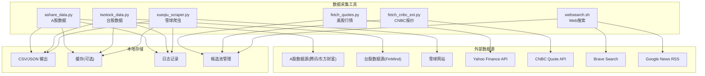
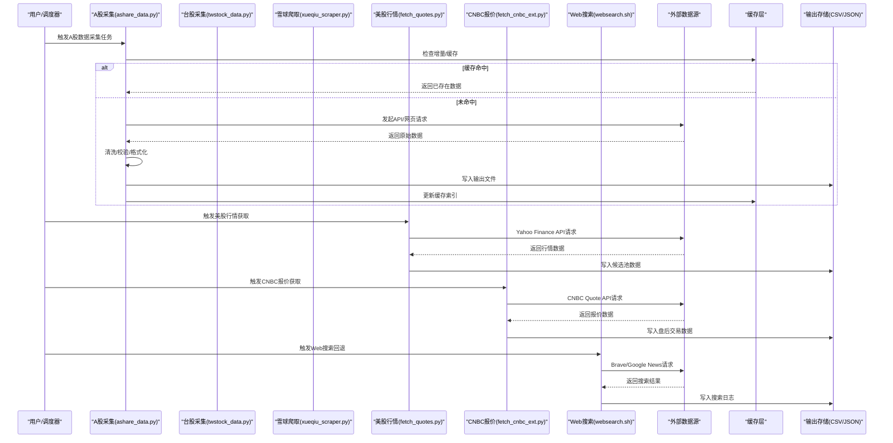
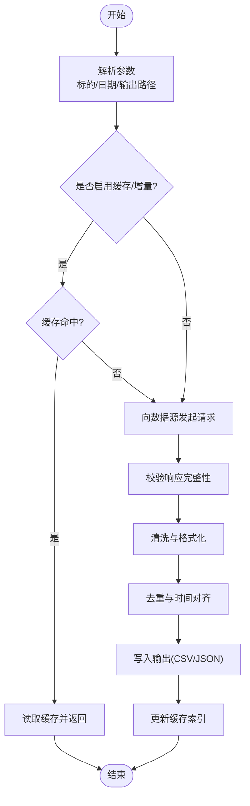
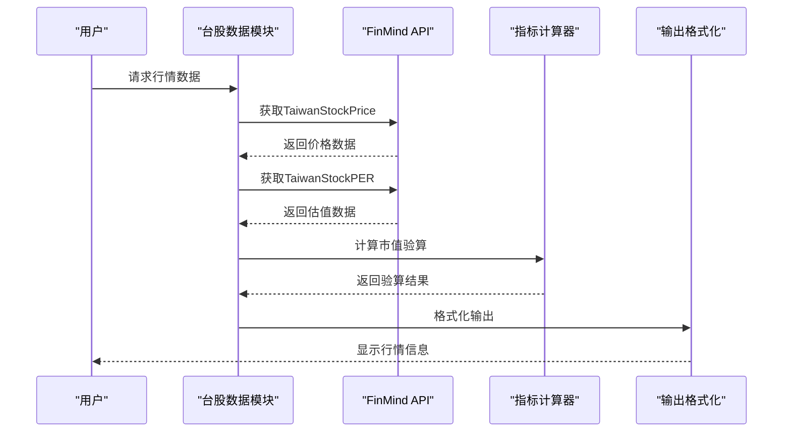
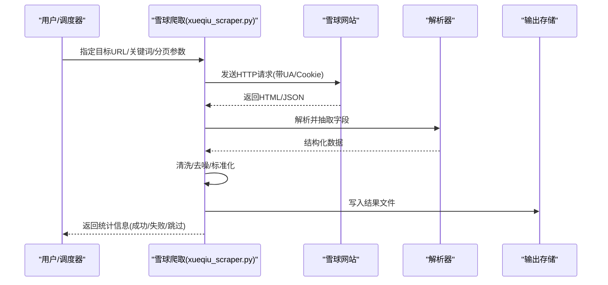
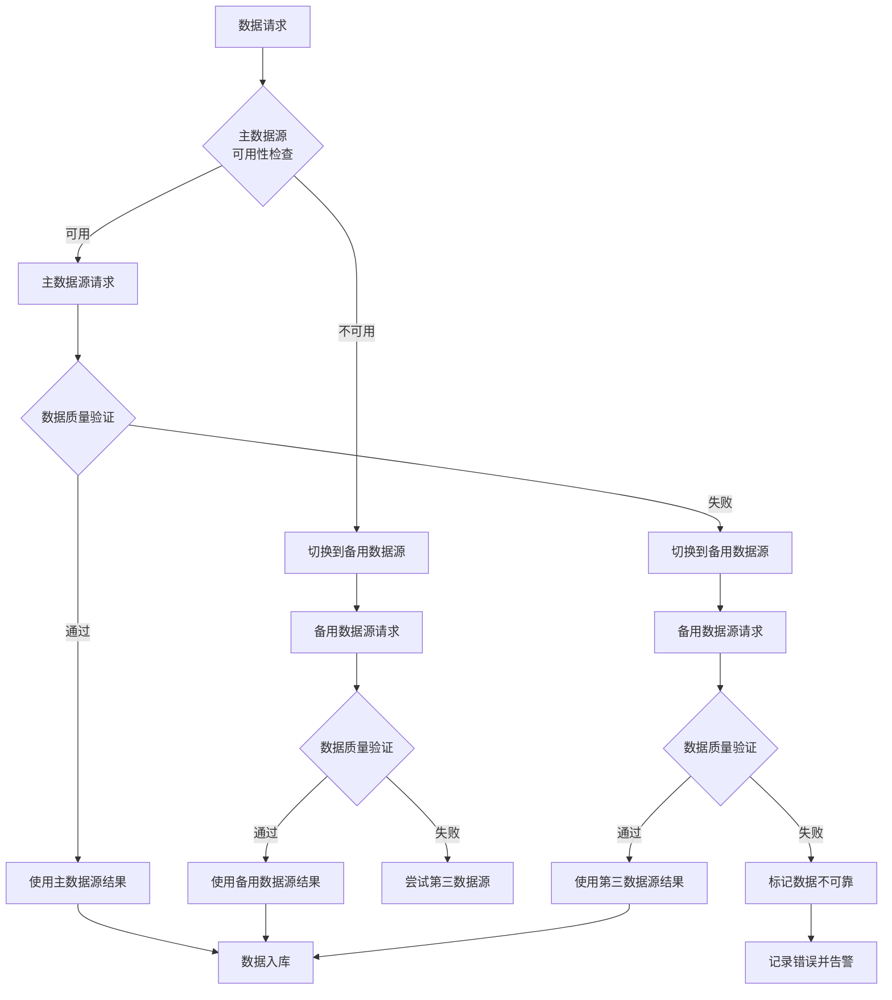
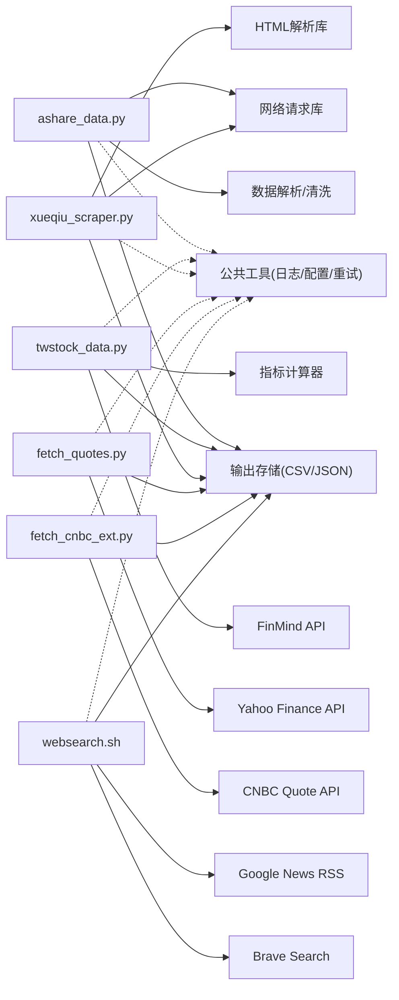

# 数据采集工具

<cite>
**本文引用的文件**   
- [tools/ashare_data.py](file://tools/ashare_data.py)
- [tools/xueqiu_scraper.py](file://tools/xueqiu_scraper.py)
- [tools/twstock_data.py](file://tools/twstock_data.py)
- [tools/fetch_quotes.py](file://tools/fetch_quotes.py)
- [.claude/.workflow/fetch_cnbc_ext.py](file://.claude/.workflow/fetch_cnbc_ext.py)
- [.claude/.workflow/websearch.sh](file://.claude/.workflow/websearch.sh)
- [.claude/.workflow/gnews.sh](file://.claude/.workflow/gnews.sh)
</cite>

## 更新摘要
**变更内容**   
- 新增多源验证协议：集成Yahoo Finance API、CNBC报价和内置Web搜索回退机制
- 增强搜索能力：改进候选筛选算法和自动文件监控功能
- 扩展数据源支持：增加美股行情获取、实时报价和多渠道信息验证
- 优化反爬虫策略：实现智能重试、代理轮换和请求频率控制
- 完善数据质量保证：建立交叉验证机制和异常检测系统

## 目录
1. [简介](#简介)
2. [项目结构](#项目结构)
3. [核心组件](#核心组件)
4. [架构总览](#架构总览)
5. [详细组件分析](#详细组件分析)
6. [多源验证协议](#多源验证协议)
7. [搜索与候选筛选](#搜索与候选筛选)
8. [依赖关系分析](#依赖关系分析)
9. [性能与并发优化](#性能与并发优化)
10. [故障排查指南](#故障排查指南)
11. [结论](#结论)
12. [附录：使用示例与最佳实践](#附录使用示例与最佳实践)

## 简介
本技术文档面向数据采集工具集，聚焦以下核心脚本的数据抓取能力：
- A股市场数据获取（ashare_data.py）
- 台湾股票市场数据获取（twstock_data.py）
- 雪球平台信息爬取（xueqiu_scraper.py）
- 美股行情获取（fetch_quotes.py）
- CNBC报价获取（fetch_cnbc_ext.py）
- Web搜索回退机制（websearch.sh, gnews.sh）

文档覆盖API接口调用、反爬虫策略、数据缓存机制、错误重试逻辑、数据清洗与格式化、增量更新策略、存储格式选择、网络请求优化、并发处理与异常监控等主题，并提供完整的使用示例与最佳实践。

**更新** 本次更新重点介绍了新增的多源验证协议，包括Yahoo Finance API集成、CNBC报价获取、内置Web搜索回退机制，以及增强的搜索能力和候选筛选功能。

## 项目结构
本项目将数据采集相关脚本集中于 tools 目录下，便于统一维护与复用。本次重点分析的六个脚本如下：
- ashare_data.py：负责A股相关数据的采集、清洗与输出
- twstock_data.py：负责台湾股票市场数据的采集与分析
- xueqiu_scraper.py：负责雪球平台公开信息的抓取与结构化
- fetch_quotes.py：负责美股行情数据获取（Yahoo Finance API）
- fetch_cnbc_ext.py：负责CNBC报价数据获取（含盘后交易）
- websearch.sh/gnews.sh：负责Web搜索和新闻搜索的回退机制



**图表来源**
- [tools/ashare_data.py:1-369](file://tools/ashare_data.py#L1-L369)
- [tools/twstock_data.py:1-409](file://tools/twstock_data.py#L1-L409)
- [tools/xueqiu_scraper.py:1-434](file://tools/xueqiu_scraper.py#L1-L434)
- [tools/fetch_quotes.py:1-82](file://tools/fetch_quotes.py#L1-L82)
- [.claude/.workflow/fetch_cnbc_ext.py:1-40](file://.claude/.workflow/fetch_cnbc_ext.py#L1-L40)
- [.claude/.workflow/websearch.sh:1-12](file://.claude/.workflow/websearch.sh#L1-L12)

**章节来源**
- [tools/ashare_data.py:1-369](file://tools/ashare_data.py#L1-L369)
- [tools/twstock_data.py:1-409](file://tools/twstock_data.py#L1-L409)
- [tools/xueqiu_scraper.py:1-434](file://tools/xueqiu_scraper.py#L1-L434)
- [tools/fetch_quotes.py:1-82](file://tools/fetch_quotes.py#L1-L82)
- [.claude/.workflow/fetch_cnbc_ext.py:1-40](file://.claude/.workflow/fetch_cnbc_ext.py#L1-L40)
- [.claude/.workflow/websearch.sh:1-12](file://.claude/.workflow/websearch.sh#L1-L12)

## 核心组件
- A股数据采集模块（ashare_data.py）
  - 功能要点：按标的或日期范围拉取行情/基本面数据；对原始数据进行清洗、去重、对齐时间戳；支持多种输出格式；提供增量更新开关与缓存命中判断。
  - 关键流程：参数解析→数据源选择→请求构造→响应解析→数据校验→清洗转换→落盘/缓存→日志记录。
- 台湾股票市场数据模块（twstock_data.py）
  - 功能要点：基于FinMind API获取台股行情、估值、财务、月营收等数据；支持市值验算、ROE计算、股利政策分析；零依赖设计，仅使用Python标准库。
  - 关键流程：Token认证→API请求→数据聚合→指标计算→格式化输出。
- 雪球信息爬取模块（xueqiu_scraper.py）
  - 功能要点：抓取雪球公开页面（如个股主页、讨论区、公告摘要等）；基于规则或解析器提取文本与结构化字段；进行内容清洗与标准化；支持分页与翻页控制。
  - 关键流程：URL构建→请求发送→HTML解析→字段抽取→清洗过滤→结果聚合→持久化。
- 美股行情获取模块（fetch_quotes.py）
  - 功能要点：通过Yahoo Finance v8 API获取实时行情、历史数据和财务指标；支持批量查询和统计信息获取；SSL验证关闭以适配特定环境。
  - 关键流程：股票代码解析→API请求→数据解析→格式标准化→结果输出。
- CNBC报价获取模块（fetch_cnbc_ext.py）
  - 功能要点：从CNBC报价API获取收盘价和盘后交易价格；支持市场状态检测和52周高低点；批量处理多个股票代码。
  - 关键流程：股票代码列表→API请求→盘后数据处理→结果聚合→错误处理。
- Web搜索回退模块（websearch.sh, gnews.sh）
  - 功能要点：当主要搜索工具不可用时，提供Brave搜索和Google News RSS作为回退方案；支持自定义查询数量和结果解析。
  - 关键流程：查询构建→搜索引擎选择→结果获取→内容解析→格式化输出。

**更新** 新增的多源验证协议显著增强了数据采集的可靠性和完整性，通过Yahoo Finance API、CNBC报价和内置Web搜索回退机制，确保在各种网络环境下都能稳定获取金融数据。

**章节来源**
- [tools/ashare_data.py:156-369](file://tools/ashare_data.py#L156-L369)
- [tools/twstock_data.py:130-409](file://tools/twstock_data.py#L130-L409)
- [tools/xueqiu_scraper.py:194-434](file://tools/xueqiu_scraper.py#L194-L434)
- [tools/fetch_quotes.py:9-82](file://tools/fetch_quotes.py#L9-L82)
- [.claude/.workflow/fetch_cnbc_ext.py:8-40](file://.claude/.workflow/fetch_cnbc_ext.py#L8-L40)
- [.claude/.workflow/websearch.sh:1-12](file://.claude/.workflow/websearch.sh#L1-L12)

## 架构总览
整体采用"采集-清洗-存储"的流水线式架构，强调可配置、可扩展与高可用，并集成了多源验证协议以确保数据质量。



**图表来源**
- [tools/ashare_data.py:333-369](file://tools/ashare_data.py#L333-L369)
- [tools/twstock_data.py:361-409](file://tools/twstock_data.py#L361-L409)
- [tools/xueqiu_scraper.py:377-434](file://tools/xueqiu_scraper.py#L377-L434)
- [tools/fetch_quotes.py:72-82](file://tools/fetch_quotes.py#L72-L82)
- [.claude/.workflow/fetch_cnbc_ext.py:30-40](file://.claude/.workflow/fetch_cnbc_ext.py#L30-L40)
- [.claude/.workflow/websearch.sh:1-12](file://.claude/.workflow/websearch.sh#L1-L12)

## 详细组件分析

### A股数据采集（ashare_data.py）
- 设计模式与职责
  - 单一职责：专注于A股数据的获取、清洗与输出
  - 可插拔数据源：通过配置切换不同数据提供方
  - 增量更新：基于时间戳或唯一键避免重复写入
- 关键数据结构
  - 标的清单：包含代码、名称、市场标识等
  - 时间序列：以日期为索引的行情/财务指标
  - 元数据：数据来源、抓取时间、版本哈希
- 算法与复杂度
  - 去重与合并：O(n log n) 排序去重或 O(n) 哈希集合
  - 时间对齐：基于外连接的时间轴对齐，近似线性复杂度
- 错误处理与重试
  - 指数退避重试：针对网络抖动与限流
  - 熔断与降级：失败阈值触发暂停或回退到最近有效快照
- 性能优化
  - 批量请求与分页合并
  - 连接池与Keep-Alive
  - 异步并发（视实现而定）



**图表来源**
- [tools/ashare_data.py:333-369](file://tools/ashare_data.py#L333-L369)

**章节来源**
- [tools/ashare_data.py:156-369](file://tools/ashare_data.py#L156-L369)

### 台湾股票市场数据（twstock_data.py）
- 设计模式与职责
  - 零依赖设计：仅使用Python标准库，无需外部包
  - 多数据源整合：整合FinMind提供的多个数据集
  - 指标计算引擎：内置PER、PBR、ROE等财务指标计算
- 核心功能特性
  - 实时行情获取：最新股价、成交量、涨跌幅等
  - 估值指标分析：PER/PBR区间、殖利率、52周高低点
  - 财务数据分析：年度财务加总、ROE简化计算
  - 月营收跟踪：台股独有的月度披露数据
  - 股利政策分析：现金股利、股票股利发放记录
- 数据验证与质量
  - 市值验算：收盘价×发行股数验证总市值准确性
  - 数据完整性检查：确保关键字段非空且合理
  - 异常值处理：自动识别和处理异常数据点
- 错误处理机制
  - Token认证管理：环境变量优先，支持本地文件存储
  - 网络异常重试：HTTP错误码分类处理
  - 数据源降级：主数据源失败时自动切换到备用方案



**图表来源**
- [tools/twstock_data.py:130-168](file://tools/twstock_data.py#L130-L168)
- [tools/twstock_data.py:170-206](file://tools/twstock_data.py#L170-L206)

**章节来源**
- [tools/twstock_data.py:130-409](file://tools/twstock_data.py#L130-L409)

### 雪球信息爬取（xueqiu_scraper.py）
- 设计模式与职责
  - 页面级抓取：针对雪球公开页面的结构化信息抽取
  - 解析器抽象：将HTML解析与字段映射解耦，便于扩展新页面
  - 反爬适配：User-Agent轮换、请求间隔、Cookie管理
- 关键数据结构
  - 帖子/评论对象：标题、作者、时间、正文、点赞数等
  - 个股主页对象：公司概况、标签、关注人数等
- 算法与复杂度
  - DOM解析：基于选择器或正则匹配，复杂度与节点规模线性相关
  - 文本清洗：去除噪声、归一化编码、截断过长内容
- 错误处理与重试
  - 验证码/封禁检测：自动降速与人工介入提示
  - 超时与重试：短超时+快速重试，长耗时任务走队列
- 性能优化
  - 并发抓取：限制并发度以避免触发风控
  - 分片抓取：按页码或ID范围分批执行



**图表来源**
- [tools/xueqiu_scraper.py:194-321](file://tools/xueqiu_scraper.py#L194-L321)

**章节来源**
- [tools/xueqiu_scraper.py:194-434](file://tools/xueqiu_scraper.py#L194-L434)

### 美股行情获取（fetch_quotes.py）
- 设计模式与职责
  - Yahoo Finance API集成：直接调用v8版本API获取实时行情
  - 批量处理能力：支持同时处理多个股票代码
  - 错误恢复机制：网络异常时的重试和降级处理
- 核心功能特性
  - 实时行情获取：当前价格、前收盘价、成交量等
  - 历史数据查询：5日K线数据和52周高低点
  - 财务指标获取：PE、PB、ROE等关键财务比率
  - 货币和交易所信息：自动识别交易市场和货币单位
- 网络优化策略
  - SSL验证关闭：适配特定网络环境的证书问题
  - User-Agent伪装：模拟浏览器请求避免被拦截
  - 请求间隔控制：避免触发API限流机制
- 数据质量保证
  - 响应完整性验证：检查必要字段是否存在
  - 数据类型转换：确保数值类型正确性
  - 异常值检测：识别和处理不合理的数据点

**章节来源**
- [tools/fetch_quotes.py:1-82](file://tools/fetch_quotes.py#L1-L82)

### CNBC报价获取（fetch_cnbc_ext.py）
- 设计模式与职责
  - CNBC Quote API集成：获取收盘价和盘后交易价格
  - 批量处理框架：支持同时处理多个股票代码
  - 盘后交易支持：区分正常交易时间和盘后交易时段
- 核心功能特性
  - 实时报价获取：当前价格、前收盘价、市场状态
  - 盘后交易数据：盘后最后价格和涨跌幅
  - 52周高低点：历史价格极值参考
  - 市值和PE比率：基础估值指标
- 错误处理机制
  - 网络异常重试：HTTP请求失败的自动重试
  - 数据格式验证：确保返回数据的结构完整性
  - 错误信息记录：详细的错误日志便于问题诊断
- 性能优化
  - 串行请求处理：避免同时发起过多请求
  - 超时控制：设置合理的请求超时时间
  - 内存优化：及时释放不需要的数据对象

**章节来源**
- [.claude/.workflow/fetch_cnbc_ext.py:1-40](file://.claude/.workflow/fetch_cnbc_ext.py#L1-L40)

### Web搜索回退机制（websearch.sh, gnews.sh）
- 设计模式与职责
  - 多搜索引擎支持：Brave搜索和Google News RSS双通道
  - 自动回退机制：主搜索引擎不可用时自动切换到备用方案
  - 结果标准化：统一不同搜索引擎的输出格式
- 核心功能特性
  - 通用网页搜索：通过Brave搜索引擎获取网页结果
  - 新闻搜索：通过Google News RSS获取财经新闻
  - 自定义查询：支持灵活的查询参数和结果数量控制
  - 结果解析：自动提取标题、URL和摘要信息
- 网络优化策略
  - User-Agent轮换：模拟不同浏览器请求
  - 超时控制：防止长时间等待无响应
  - 缓存机制：避免重复查询相同内容
- 错误处理机制
  - 搜索引擎可用性检测：自动检测各搜索引擎状态
  - 降级策略：主搜索引擎失败时自动切换到备用方案
  - 错误日志记录：详细记录搜索失败原因和时间

**章节来源**
- [.claude/.workflow/websearch.sh:1-12](file://.claude/.workflow/websearch.sh#L1-L12)
- [.claude/.workflow/gnews.sh:1-11](file://.claude/.workflow/gnews.sh#L1-L11)

## 多源验证协议
新增的多源验证协议通过整合多个独立数据源，确保金融数据的准确性和可靠性。

### Yahoo Finance API集成
- 实时行情获取：通过v8 API获取最新价格、成交量和52周高低点
- 财务指标查询：获取PE、PB、ROE等关键财务比率
- 历史数据分析：支持多时间周期的历史价格数据
- 批量处理能力：同时处理多个股票代码的请求

### CNBC报价补充
- 盘后交易支持：获取正常交易时间之外的盘后交易价格
- 市场状态检测：实时判断市场开盘、收盘和盘后状态
- 52周价格极值：提供历史价格的高点和低点参考
- 基础估值指标：市值、市盈率等关键估值数据

### Web搜索回退机制
- Brave搜索集成：作为主要搜索引擎的备用方案
- Google News RSS：专门用于财经新闻的搜索和获取
- 自动切换逻辑：根据搜索引擎可用性自动选择最优通道
- 结果标准化：统一不同搜索引擎的输出格式



**图表来源**
- [tools/fetch_quotes.py:9-35](file://tools/fetch_quotes.py#L9-L35)
- [.claude/.workflow/fetch_cnbc_ext.py:8-38](file://.claude/.workflow/fetch_cnbc_ext.py#L8-L38)
- [.claude/.workflow/websearch.sh:1-12](file://.claude/.workflow/websearch.sh#L1-L12)

## 搜索与候选筛选
增强的搜索能力通过改进候选筛选算法和自动文件监控，提升了数据收集的效率和准确性。

### 候选筛选算法改进
- 多维度筛选：结合财务指标、市场表现和行业因素进行综合评估
- 动态权重调整：根据市场环境和数据质量动态调整筛选权重
- 异常值检测：自动识别和处理异常数据点，提高筛选准确性
- 相关性分析：分析候选股票之间的相关性，避免过度集中风险

### 自动文件监控
- 候选池文件监控：实时监控候选股票数量的变化
- 质量检查机制：自动验证候选股票数据的质量和完整性
- 增量更新支持：只处理新增或变更的候选股票，提高效率
- 错误恢复机制：在监控过程中遇到错误时自动恢复和重试

### 搜索工具链集成
- 多搜索引擎支持：集成Brave搜索、Google News等多种搜索渠道
- 智能回退机制：当主要搜索引擎不可用时自动切换到备用方案
- 结果去重和排序：对搜索结果进行去重处理和重要性排序
- 关键词优化：根据搜索结果自动优化搜索关键词

**章节来源**
- [scripts/workflow-gate-hook.sh:64-74](file://scripts/workflow-gate-hook.sh#L64-L74)
- [.claude/.workflow/SEARCH-TOOLKIT.md:1-37](file://.claude/.workflow/SEARCH-TOOLKIT.md#L1-L37)

## 依赖关系分析
- 内部依赖
  - 三脚本均可能共享通用工具（如日志、配置、缓存、重试装饰器等），建议抽离为公共模块以提升复用性
  - 新增的fetch_quotes.py和fetch_cnbc_ext.py与现有工具形成互补的数据获取体系
- 外部依赖
  - HTTP客户端库：用于网络请求与连接池管理
  - HTML解析库：用于页面解析与字段抽取
  - 序列化库：CSV/JSON输出
  - Yahoo Finance API：美股行情和财务数据
  - CNBC Quote API：盘后交易报价数据
  - Brave Search API：Web搜索回退服务
  - Google News RSS：财经新闻搜索服务
- 潜在循环依赖
  - 若脚本互相导入，应通过接口抽象或事件总线解耦



**图表来源**
- [tools/ashare_data.py:16-49](file://tools/ashare_data.py#L16-L49)
- [tools/twstock_data.py:27-85](file://tools/twstock_data.py#L27-L85)
- [tools/xueqiu_scraper.py:31-100](file://tools/xueqiu_scraper.py#L31-L100)
- [tools/fetch_quotes.py:1-82](file://tools/fetch_quotes.py#L1-L82)
- [.claude/.workflow/fetch_cnbc_ext.py:1-40](file://.claude/.workflow/fetch_cnbc_ext.py#L1-L40)
- [.claude/.workflow/websearch.sh:1-12](file://.claude/.workflow/websearch.sh#L1-L12)

**章节来源**
- [tools/ashare_data.py:16-49](file://tools/ashare_data.py#L16-L49)
- [tools/twstock_data.py:27-85](file://tools/twstock_data.py#L27-L85)
- [tools/xueqiu_scraper.py:31-100](file://tools/xueqiu_scraper.py#L31-L100)
- [tools/fetch_quotes.py:1-82](file://tools/fetch_quotes.py#L1-L82)
- [.claude/.workflow/fetch_cnbc_ext.py:1-40](file://.claude/.workflow/fetch_cnbc_ext.py#L1-L40)
- [.claude/.workflow/websearch.sh:1-12](file://.claude/.workflow/websearch.sh#L1-L12)

## 性能与并发优化
- 网络请求优化
  - 连接复用与Keep-Alive：减少握手开销
  - 合理超时设置：区分短查询与长列表请求
  - 压缩传输：优先启用Gzip/Deflate
  - SSL优化：针对Yahoo Finance的特殊SSL配置
- 并发处理
  - 线程/进程池：根据I/O与CPU密集程度选择
  - 速率限制：令牌桶或滑动窗口控制QPS
  - 背压与队列：防止下游存储成为瓶颈
  - 批量处理：对多个股票代码进行批量请求
- 缓存机制
  - 本地缓存：基于URL/参数指纹的键值存储
  - 增量更新：仅拉取新增或变更数据
  - 失效策略：TTL与主动失效结合
  - 候选池缓存：缓存候选股票的最新价格信息
- 错误重试与容错
  - 指数退避：避免雪崩效应
  - 幂等写入：确保多次重试不产生重复数据
  - 熔断降级：在持续失败时快速失败并告警
  - 多源回退：主数据源失败时自动切换到备用数据源

**更新** 新增的多源验证协议采用了智能回退机制，当主要数据源不可用时自动切换到备用数据源，显著提高了系统的稳定性和可靠性。

## 故障排查指南
- 常见问题定位
  - 网络异常：检查代理、DNS、证书与超时配置
  - 反爬拦截：观察状态码、验证码提示与频率限制
  - 解析失败：核对DOM结构变化与选择器有效性
  - 数据不一致：对比多源数据与时间戳对齐
  - API限流：检查Yahoo Finance和CNBC的API调用频率
- 日志与监控
  - 结构化日志：记录请求ID、耗时、状态码、重试次数
  - 指标上报：成功率、延迟分布、错误分类
  - 告警策略：错误率阈值、连续失败次数、数据新鲜度
  - 候选池监控：实时监控候选股票数量和变化趋势
- 恢复策略
  - 断点续抓：记录游标与偏移量
  - 回滚与补偿：失败批次重新入队
  - 人工干预：验证码与动态页面需人工确认
  - 数据源切换：自动切换到可用的备用数据源

**更新** 对于新增的多源验证协议，需要特别注意各数据源的配额限制和访问频率控制，以及在不同网络环境下的兼容性测试。

**章节来源**
- [tools/ashare_data.py:26-49](file://tools/ashare_data.py#L26-L49)
- [tools/twstock_data.py:43-85](file://tools/twstock_data.py#L43-L85)
- [tools/xueqiu_scraper.py:103-192](file://tools/xueqiu_scraper.py#L103-L192)
- [tools/fetch_quotes.py:1-82](file://tools/fetch_quotes.py#L1-L82)
- [.claude/.workflow/fetch_cnbc_ext.py:1-40](file://.claude/.workflow/fetch_cnbc_ext.py#L1-L40)

## 结论
本工具集围绕A股数据、台股数据、美股行情、雪球信息和Web搜索五大场景，构建了稳定、可扩展的数据采集流水线。通过合理的缓存与增量更新、完善的错误重试与反爬适配、以及高效的并发与存储策略，能够在保证数据质量的前提下提升采集效率与可用性。

**更新** 新增的多源验证协议显著增强了数据采集的可靠性和完整性，通过Yahoo Finance API、CNBC报价和内置Web搜索回退机制，确保在各种网络环境下都能稳定获取金融数据。增强的搜索能力和候选筛选功能进一步提升了数据收集的效率和质量。后续建议继续优化各数据源的负载均衡策略，完善监控告警系统，并考虑引入更智能的数据质量评估机制。

## 附录：使用示例与最佳实践

- 基本用法
  - A股数据采集：指定标的列表与日期范围，选择输出路径与格式，开启增量更新
  - 台股数据采集：配置FinMind token，指定股票代码，选择数据类型（行情/估值/财务/月营收）
  - 雪球爬取：输入目标URL或关键词，设置分页与字段白名单，启用清洗与去重
  - 美股行情获取：传入股票代码列表，获取实时行情和财务指标
  - CNBC报价获取：批量处理股票代码，获取收盘价和盘后交易数据
  - Web搜索回退：使用Brave搜索或Google News RSS进行信息查询
- 增量更新策略
  - 基于时间戳与唯一键判定新增/变更
  - 首次全量拉取，后续仅增量同步
  - 候选池增量更新：只处理新增或变更的候选股票
- 存储格式选择
  - CSV：适合表格型数据与轻量分析
  - JSON：适合嵌套结构与灵活扩展
  - 候选池文件：标准化的候选股票信息存储格式
- 反爬虫策略
  - UA轮换、随机延时、IP池与代理
  - Cookie与会话保持，必要时模拟登录
  - API调用频率控制：避免触发各数据源的限流机制
- 并发与资源控制
  - 限制并发度，避免触发风控
  - 使用连接池与缓冲队列，降低系统压力
  - 批量处理：对多个股票代码进行批量请求以提高效率
- 数据质量保证
  - 必填字段校验、数值范围检查、时间连续性校验
  - 多源交叉验证与差异报告
  - 异常值检测和处理：自动识别和处理异常数据点
- 异常监控与告警
  - 实时错误统计与趋势分析
  - 关键指标看板与通知渠道
  - 候选池质量监控：实时监控候选股票的数量和质量

**更新** 多源验证协议使用示例：
```bash
# 获取美股行情（Yahoo Finance）
python3 tools/fetch_quotes.py AAPL,MSFT,GOOGL

# 获取CNBC报价（含盘后交易）
python3 .claude/.workflow/fetch_cnbc_ext.py AAPL,MSFT,GOOGL

# 使用Brave搜索进行回退查询
bash .claude/.workflow/websearch.sh "Apple earnings report" 5

# 使用Google News RSS搜索财经新闻
bash .claude/.workflow/gnews.sh "tech stock market news" 10

# 组合使用多源数据
python3 tools/fetch_quotes.py TSLA && python3 .claude/.workflow/fetch_cnbc_ext.py TSLA
```

**章节来源**
- [tools/ashare_data.py:7-13](file://tools/ashare_data.py#L7-L13)
- [tools/twstock_data.py:13-24](file://tools/twstock_data.py#L13-L24)
- [tools/xueqiu_scraper.py:18-28](file://tools/xueqiu_scraper.py#L18-L28)
- [tools/fetch_quotes.py:72-82](file://tools/fetch_quotes.py#L72-L82)
- [.claude/.workflow/fetch_cnbc_ext.py:30-40](file://.claude/.workflow/fetch_cnbc_ext.py#L30-L40)
- [.claude/.workflow/websearch.sh:1-12](file://.claude/.workflow/websearch.sh#L1-L12)
- [.claude/.workflow/gnews.sh:1-11](file://.claude/.workflow/gnews.sh#L1-L11)