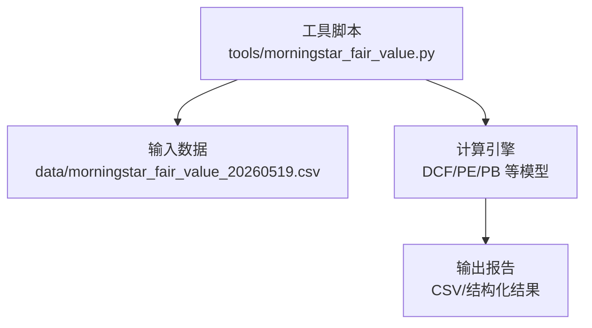
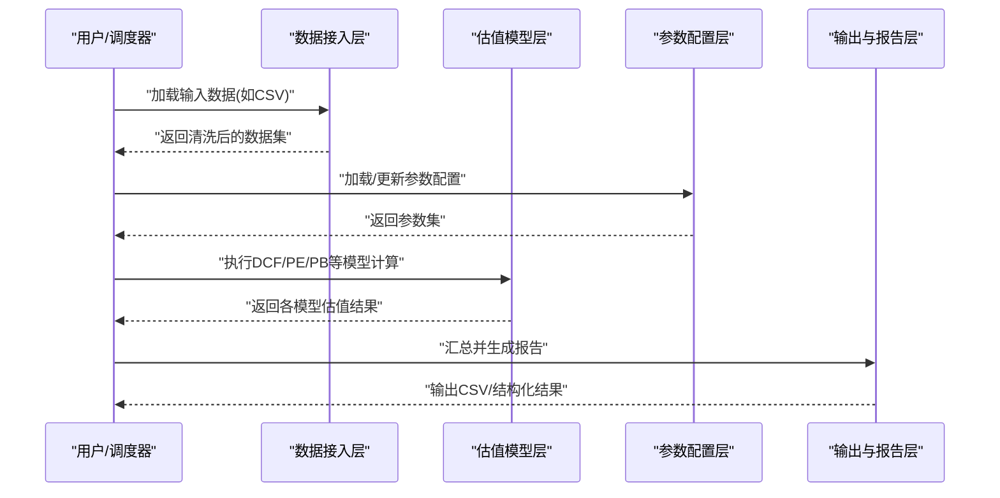
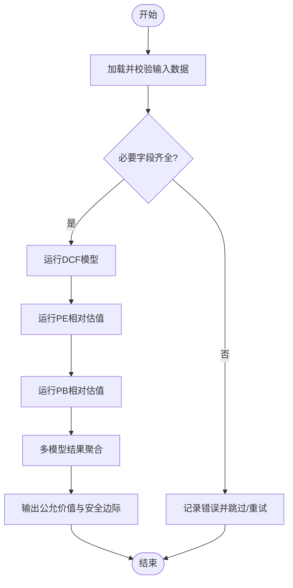
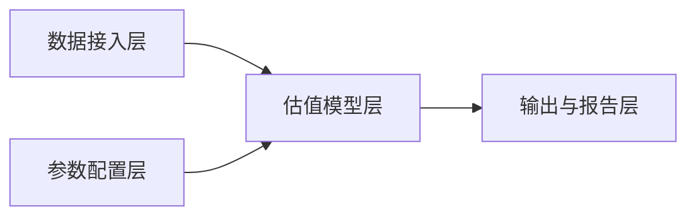
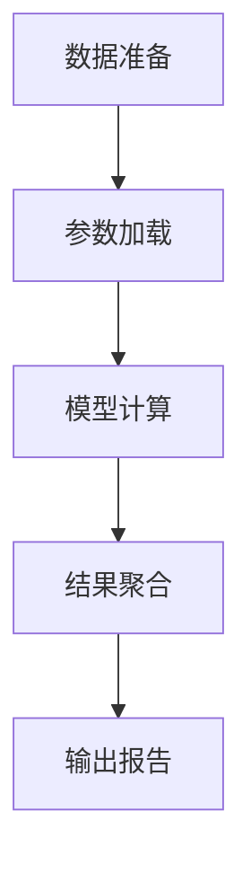

# 晨星公允价值计算

<cite>
**本文引用的文件**   
- [morningstar_fair_value.py](file://tools/morningstar_fair_value.py)
- [morningstar_fair_value_20260519.csv](file://data/morningstar_fair_value_20260519.csv)
</cite>

## 目录
1. [简介](#简介)
2. [项目结构](#项目结构)
3. [核心组件](#核心组件)
4. [架构总览](#架构总览)
5. [详细组件分析](#详细组件分析)
6. [依赖分析](#依赖分析)
7. [性能考虑](#性能考虑)
8. [故障排查指南](#故障排查指南)
9. [结论](#结论)
10. [附录](#附录)

## 简介
本技术文档面向“晨星公允价值计算工具”，围绕 tools/morningstar_fair_value.py 的核心算法与实现原理进行系统化说明。文档覆盖以下主题：
- DCF（现金流折现）模型、市盈率法（PE）、市净率法（PB）等估值方法的集成应用
- 输入数据要求、参数配置选项、计算逻辑流程与输出报告格式
- 调用示例，展示如何获取与分析晨星公允价值数据
- 估值模型的假设条件、敏感性分析与结果解读方法
- 数据源配置、错误处理与批量处理的实用指南

## 项目结构
本项目将估值计算脚本置于 tools/ 目录下，相关历史输出样例位于 data/ 目录中。整体组织遵循“工具脚本 + 数据产物”的轻量结构，便于在研究或自动化流水线中直接调用。

图表来源
- [morningstar_fair_value.py](file://tools/morningstar_fair_value.py)
- [morningstar_fair_value_20260519.csv](file://data/morningstar_fair_value_20260519.csv)

章节来源
- [morningstar_fair_value.py](file://tools/morningstar_fair_value.py)
- [morningstar_fair_value_20260519.csv](file://data/morningstar_fair_value_20260519.csv)

## 核心组件
本节聚焦 morningstar_fair_value.py 的关键能力与模块划分，帮助读者快速定位功能入口与扩展点。

- 数据接入层
  - 负责读取本地 CSV 或其他数据源，完成字段映射、类型转换与缺失值处理
  - 提供统一的数据校验接口，确保后续估值计算所需字段完整可用
- 估值模型层
  - DCF 模型：基于自由现金流预测与折现率计算内在价值
  - PE 相对估值：结合行业可比与历史分位确定合理倍数
  - PB 相对估值：结合净资产质量与资本成本评估合理倍数
  - 多模型融合：对多种方法的结果进行加权或区间聚合，形成综合公允价值
- 参数配置层
  - 集中管理增长假设、折现率、终值增长率、可比公司选择等关键参数
  - 支持按公司或策略维度覆盖默认参数
- 输出与报告层
  - 生成标准化 CSV/JSON 输出，包含各模型估值、综合公允价值、安全边际与置信度
  - 提供可复用的导出模板，便于下游研究与可视化

章节来源
- [morningstar_fair_value.py](file://tools/morningstar_fair_value.py)

## 架构总览
下图展示了从数据输入到估值输出的端到端流程，以及各模块之间的交互关系。

图表来源
- [morningstar_fair_value.py](file://tools/morningstar_fair_value.py)

## 详细组件分析

### 数据接入层
- 职责
  - 读取 data/morningstar_fair_value_20260519.csv 等输入文件
  - 字段校验与类型转换，缺失值填充策略
  - 异常记录与告警，保证计算链路稳定
- 关键点
  - 输入字段需包含：标的标识、财务指标（营收、利润、资产、权益等）、市场数据（股价、市值等）
  - 建议提供时间戳与数据来源标记，便于回溯与审计
- 扩展建议
  - 增加多数据源适配器（数据库、API、其他CSV）
  - 引入数据版本化与变更检测

章节来源
- [morningstar_fair_value.py](file://tools/morningstar_fair_value.py)
- [morningstar_fair_value_20260519.csv](file://data/morningstar_fair_value_20260519.csv)

### 估值模型层
- DCF 模型
  - 输入：自由现金流序列、折现率、终值增长率
  - 输出：企业价值与股权价值，折算每股公允价值
  - 假设：稳定期增长、资本结构与税率的合理性
- PE 相对估值
  - 输入：净利润、可比公司或行业均值、历史分位
  - 输出：合理PE倍数下的每股公允价值
  - 假设：盈利可持续性与可比性
- PB 相对估值
  - 输入：净资产、ROE、资本成本
  - 输出：合理PB倍数下的每股公允价值
  - 假设：资产质量与会计稳健性
- 多模型融合
  - 权重分配：可按行业特性或公司生命周期调整权重
  - 区间估计：给出上下界与置信度，辅助决策

图表来源
- [morningstar_fair_value.py](file://tools/morningstar_fair_value.py)

章节来源
- [morningstar_fair_value.py](file://tools/morningstar_fair_value.py)

### 参数配置层
- 关键参数
  - 增长假设：短期高增长期长度与增速、长期稳态增速
  - 折现率：WACC 或股权成本，反映风险与资本结构
  - 终值增长率：永续增长假设，通常贴近宏观长期增速
  - 可比公司选择：行业分类、规模与业务相似度
- 配置方式
  - 全局默认参数 + 公司级覆盖
  - 通过配置文件或命令行参数注入
- 敏感性分析
  - 对关键参数进行网格扫描或蒙特卡洛抽样
  - 输出敏感度热力图与区间分布，识别驱动因子

章节来源
- [morningstar_fair_value.py](file://tools/morningstar_fair_value.py)

### 输出与报告层
- 输出格式
  - CSV/JSON 结构化结果，包含：
    - 标的标识、日期、各模型估值、综合公允价值、安全边际、置信度
    - 关键假设与参数快照，便于复现
- 报告内容
  - 摘要：公允价值区间、当前价格对比、潜在涨幅/跌幅
  - 明细：DCF/PE/PB 分项结果与权重
  - 敏感性：关键参数变动对公允价值的影响
- 使用建议
  - 与可视化看板联动，生成日报/周报
  - 结合筛选器输出“低估/高估”清单

章节来源
- [morningstar_fair_value.py](file://tools/morningstar_fair_value.py)

## 依赖分析
- 内部依赖
  - 数据接入层依赖输入 CSV 的结构与字段定义
  - 估值模型层依赖参数配置层的假设与权重
- 外部依赖
  - 标准库：用于数据处理、数值计算与序列化
  - 可选第三方库：pandas、numpy、scipy 等（若存在）
- 耦合与内聚
  - 模块间通过清晰接口通信，降低耦合度
  - 估值模型独立封装，便于替换与扩展

图表来源
- [morningstar_fair_value.py](file://tools/morningstar_fair_value.py)

章节来源
- [morningstar_fair_value.py](file://tools/morningstar_fair_value.py)

## 性能考虑
- 批处理优化
  - 向量化计算：优先使用数组操作减少循环开销
  - 并行化：对独立标的进行并发计算，注意资源限制
- 内存管理
  - 流式读取大文件，避免一次性加载全部数据
  - 及时释放中间变量，控制峰值内存
- I/O 优化
  - 压缩存储与增量写入，减少磁盘压力
  - 缓存常用参数与中间结果，提升重复计算效率

[本节为通用指导，不直接分析具体文件]

## 故障排查指南
- 常见错误
  - 输入字段缺失或类型错误：检查 CSV 表头与数据类型
  - 参数不合理导致发散：调整增长假设与折现率范围
  - 并发任务失败：检查线程/进程池配置与异常捕获
- 诊断步骤
  - 启用日志与断点，定位失败节点
  - 打印关键中间变量，验证假设与边界条件
  - 使用小样本回归测试，逐步扩大规模
- 恢复策略
  - 自动重试与幂等设计，避免重复计算
  - 失败隔离与降级，保障主流程稳定

章节来源
- [morningstar_fair_value.py](file://tools/morningstar_fair_value.py)

## 结论
晨星公允价值计算工具以模块化架构整合了 DCF、PE、PB 等多类估值方法，并通过参数化配置与敏感性分析提升结果的稳健性与可解释性。建议在研究中结合行业特征与公司生命周期动态调整权重与假设，配合批处理与监控机制，构建高效可靠的估值流水线。

[本节为总结性内容，不直接分析具体文件]

## 附录

### 输入数据要求
- 必需字段
  - 标的标识（代码/名称）
  - 财务指标（营收、净利润、总资产、股东权益等）
  - 市场数据（收盘价、总市值、流通股数等）
  - 时间戳与数据来源标记
- 数据质量
  - 缺失值处理策略（填充/剔除）
  - 异常值检测与修正规则
  - 单位一致性（元/万元/亿美元等）

章节来源
- [morningstar_fair_value.py](file://tools/morningstar_fair_value.py)
- [morningstar_fair_value_20260519.csv](file://data/morningstar_fair_value_20260519.csv)

### 参数配置选项
- 增长假设
  - 短期高增长期长度与增速
  - 长期稳态增速（与宏观一致）
- 折现率
  - WACC 或股权成本，反映风险溢价与资本结构
- 终值增长率
  - 永续增长假设，谨慎设定
- 可比公司选择
  - 行业分类、规模与业务相似度
- 权重与置信度
  - 多模型权重分配与置信度计算方法

章节来源
- [morningstar_fair_value.py](file://tools/morningstar_fair_value.py)

### 计算逻辑流程
- 数据准备 → 参数加载 → 模型计算（DCF/PE/PB）→ 结果聚合 → 输出报告
- 异常处理贯穿全流程，确保鲁棒性

图表来源
- [morningstar_fair_value.py](file://tools/morningstar_fair_value.py)

章节来源
- [morningstar_fair_value.py](file://tools/morningstar_fair_value.py)

### 输出报告格式
- 字段建议
  - 标的标识、日期、DCF估值、PE估值、PB估值、综合公允价值
  - 安全边际、置信度、关键假设快照
- 文件格式
  - CSV/JSON，便于导入分析工具与看板系统

章节来源
- [morningstar_fair_value.py](file://tools/morningstar_fair_value.py)

### 调用示例
- 单标的计算
  - 指定输入文件路径与标的标识
  - 设置参数覆盖（如增长假设、折现率）
  - 执行计算并保存输出
- 批量处理
  - 遍历标的列表，复用参数配置
  - 并发执行，合并结果至统一报表
- 结果分析
  - 对比当前价格与公允价值，计算潜在涨幅/跌幅
  - 查看敏感性分析，识别关键驱动因素

章节来源
- [morningstar_fair_value.py](file://tools/morningstar_fair_value.py)

### 假设条件与敏感性分析
- 假设条件
  - 盈利可持续性与可比性
  - 资产质量与会计稳健性
  - 宏观环境与利率走势
- 敏感性分析
  - 网格扫描：增长假设、折现率、终值增长率
  - 蒙特卡洛：随机抽样生成区间分布
  - 输出：热力图、箱线图与关键参数排序

章节来源
- [morningstar_fair_value.py](file://tools/morningstar_fair_value.py)

### 结果解读方法
- 公允价值区间
  - 关注上下界与置信度，避免单一数值误导
- 安全边际
  - 当前价格低于公允价值且具备足够安全边际时更具吸引力
- 模型差异
  - DCF 侧重未来现金流，PE/PB 侧重相对估值，差异过大需复核假设

章节来源
- [morningstar_fair_value.py](file://tools/morningstar_fair_value.py)

### 数据源配置
- 本地 CSV
  - 指定路径与编码，校验表头与数据类型
- 数据库/API
  - 连接字符串与认证信息
  - 分页与限流策略
- 版本与回滚
  - 数据版本化与变更日志
  - 失败回滚与一致性检查

章节来源
- [morningstar_fair_value.py](file://tools/morningstar_fair_value.py)

### 错误处理与批量处理
- 错误处理
  - 异常捕获与日志记录
  - 失败重试与降级策略
- 批量处理
  - 任务队列与并发控制
  - 进度跟踪与断点续算

章节来源
- [morningstar_fair_value.py](file://tools/morningstar_fair_value.py)