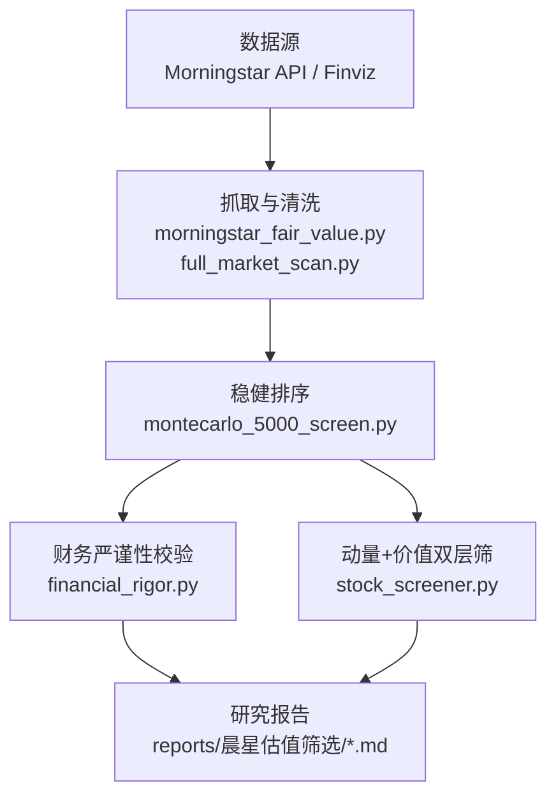
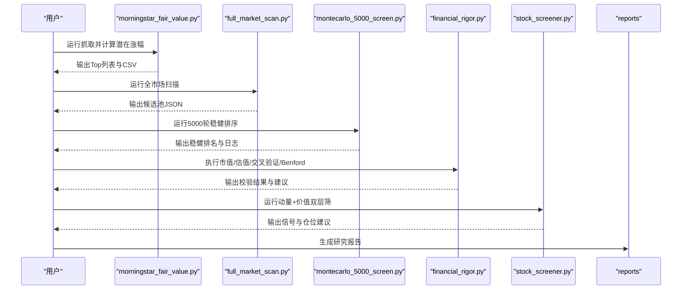
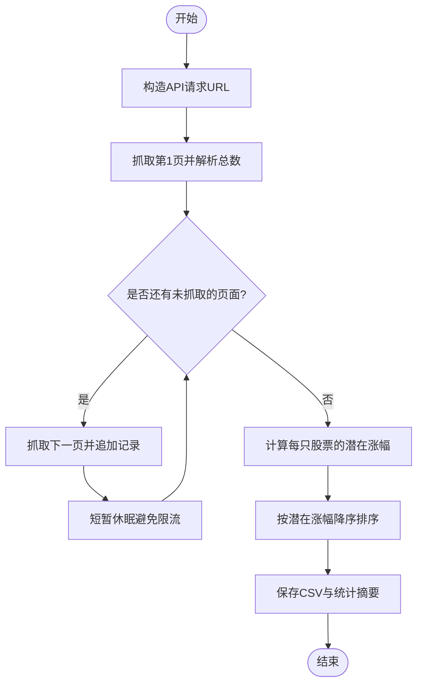
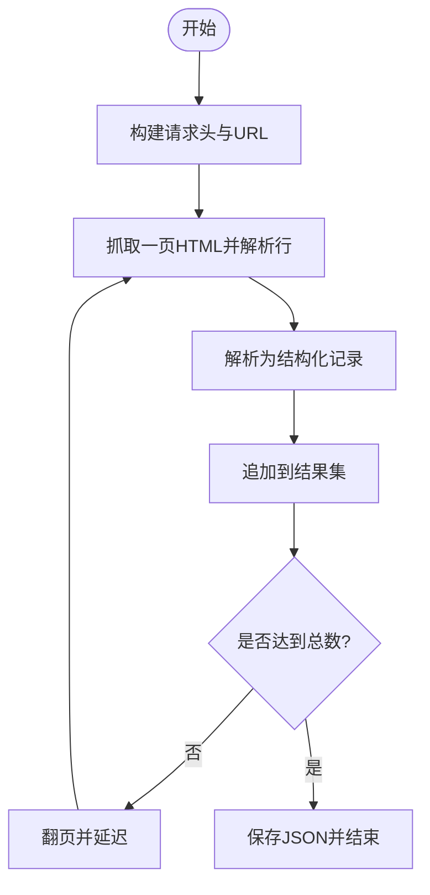
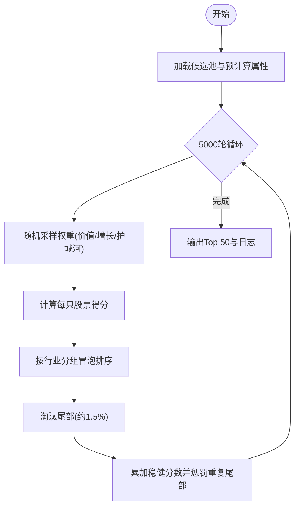
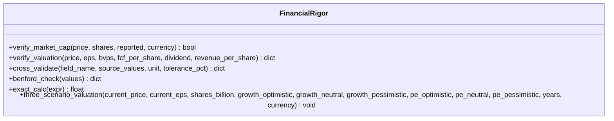
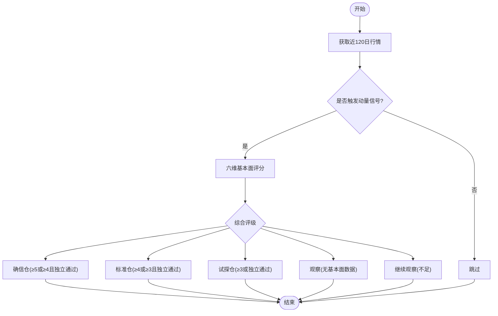
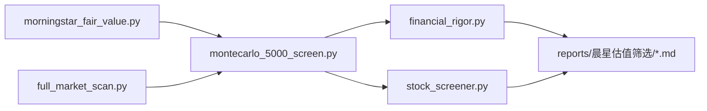

# 晨星宽护城河深度价值筛选系统

<cite>
**本文引用的文件**
- [README.md](file://README.md)
- [CONTEXT.md](file://CONTEXT.md)
- [tools/morningstar_fair_value.py](file://tools/morningstar_fair_value.py)
- [tools/full_market_scan.py](file://tools/full_market_scan.py)
- [tools/montecarlo_5000_screen.py](file://tools/montecarlo_5000_screen.py)
- [tools/financial_rigor.py](file://tools/financial_rigor.py)
- [tools/stock_screener.py](file://tools/stock_screener.py)
- [reports/晨星估值筛选/晨星宽护城河低估股票筛选-20260607.md](file://reports/晨星估值筛选/晨星宽护城河低估股票筛选-20260607.md)
- [reports/晨星估值筛选/晨星宽护城河全球低估筛选-20260607.md](file://reports/晨星估值筛选/晨星宽护城河全球低估筛选-20260607.md)
- [reports/5000轮筛选证据-20260811.md](file://reports/5000轮筛选证据-20260811.md)
</cite>

## 目录
1. [简介](#简介)
2. [项目结构](#项目结构)
3. [核心组件](#核心组件)
4. [架构总览](#架构总览)
5. [详细组件分析](#详细组件分析)
6. [依赖关系分析](#依赖关系分析)
7. [性能考量](#性能考量)
8. [故障排查指南](#故障排查指南)
9. [结论](#结论)
10. [附录](#附录)

## 简介
本系统围绕“晨星宽护城河 + 深度低估”的选股主题，构建从数据抓取、指标计算、稳健排序到报告输出的完整投研流水线。其目标是在美股、港股与A股范围内，识别具备宽护城河且存在显著折价的标的，并通过多源交叉验证与精确计算确保结论可审计、可复现。系统同时提供动量发现与价值验证的双层筛法，以及蒙特卡洛稳健排序，以增强结果在不同权重假设下的稳定性。

## 项目结构
- 工具层（tools）：负责数据抓取、指标计算、稳健排序与财务严谨性校验。
- 报告层（reports）：沉淀筛选结果与洞察，形成可阅读的研究文档。
- 配置与说明（根目录）：README 与 CONTEXT 定义整体理念、术语与编排思路。

图表来源
- [tools/morningstar_fair_value.py:14-25](file://tools/morningstar_fair_value.py#L14-L25)
- [tools/full_market_scan.py:8-12](file://tools/full_market_scan.py#L8-L12)
- [tools/montecarlo_5000_screen.py:1-10](file://tools/montecarlo_5000_screen.py#L1-L10)
- [tools/financial_rigor.py:1-16](file://tools/financial_rigor.py#L1-L16)
- [tools/stock_screener.py:1-18](file://tools/stock_screener.py#L1-L18)

章节来源
- [README.md:161-172](file://README.md#L161-L172)
- [CONTEXT.md:1-30](file://CONTEXT.md#L1-L30)

## 核心组件
- 晨星公允价值抓取与排序：从 Morningstar 筛选器 API 分页获取带公允价值估计的股票，计算潜在涨幅并输出 Top 列表与 CSV。
- 全市场扫描：基于 Finviz 的价值投资硬指标进行全市场扫描，产出候选池。
- 蒙特卡洛稳健排序：在5000轮随机扰动权重下，按行业分组冒泡排序淘汰尾部，聚合得到稳健分数。
- 财务严谨性工具：市值验算、估值指标验算、多源交叉验证、Benford 定律检测、精确计算器与三情景估值。
- 动量发现与价值验证双层筛：先通过价格动量进入待选池，再用六维基本面评分分级给出仓位建议。

章节来源
- [tools/morningstar_fair_value.py:47-152](file://tools/morningstar_fair_value.py#L47-L152)
- [tools/full_market_scan.py:53-102](file://tools/full_market_scan.py#L53-L102)
- [tools/montecarlo_5000_screen.py:73-129](file://tools/montecarlo_5000_screen.py#L73-L129)
- [tools/financial_rigor.py:74-173](file://tools/financial_rigor.py#L74-L173)
- [tools/stock_screener.py:122-277](file://tools/stock_screener.py#L122-L277)

## 架构总览
系统采用“数据抓取 → 指标计算 → 稳健排序 → 严谨校验 → 报告输出”的分层架构。Morningstar 与 Finviz 作为外部数据源，经清洗后进入排序与校验环节；最终输出结构化报告与可复现实验日志。

图表来源
- [tools/morningstar_fair_value.py:47-152](file://tools/morningstar_fair_value.py#L47-L152)
- [tools/full_market_scan.py:87-102](file://tools/full_market_scan.py#L87-L102)
- [tools/montecarlo_5000_screen.py:73-129](file://tools/montecarlo_5000_screen.py#L73-L129)
- [tools/financial_rigor.py:380-466](file://tools/financial_rigor.py#L380-L466)
- [tools/stock_screener.py:332-402](file://tools/stock_screener.py#L332-L402)

## 详细组件分析

### 晨星公允价值抓取与排序（morningstar_fair_value.py）
- 功能要点：分页调用 Morningstar 筛选器 API，提取收盘价与公允价值估计，计算潜在涨幅，输出 Top 100 与 CSV。
- 关键流程：初始化API参数 → 获取总数与页码 → 循环抓取剩余页 → 过滤无效记录 → 计算涨幅 → 排序 → 保存CSV与统计摘要。
- 异常处理：单页失败时打印警告并短暂休眠重试，保证鲁棒性。

图表来源
- [tools/morningstar_fair_value.py:14-25](file://tools/morningstar_fair_value.py#L14-L25)
- [tools/morningstar_fair_value.py:47-152](file://tools/morningstar_fair_value.py#L47-L152)

章节来源
- [tools/morningstar_fair_value.py:47-152](file://tools/morningstar_fair_value.py#L47-L152)

### 全市场扫描（full_market_scan.py）
- 功能要点：基于 Finviz 服务器端过滤器（PE、ROE、负债率等）遍历全市场，收集满足价值投资硬指标的候选股票。
- 关键流程：构造请求头与URL → 分页抓取表格行 → 解析字段 → 累计记录 → 写入 JSON。
- 容错机制：网络错误时重试并暂停，直至达到总数或无法继续。

图表来源
- [tools/full_market_scan.py:8-12](file://tools/full_market_scan.py#L8-L12)
- [tools/full_market_scan.py:53-102](file://tools/full_market_scan.py#L53-L102)

章节来源
- [tools/full_market_scan.py:53-102](file://tools/full_market_scan.py#L53-L102)

### 蒙特卡洛稳健排序（montecarlo_5000_screen.py）
- 功能要点：对候选池进行5000轮随机权重扰动，按行业分组冒泡排序淘汰尾部，累积稳健分数，输出Top 50与日志。
- 关键流程：读取候选池 → 预计算属性（PE、市值、行业倾斜）→ 每轮随机权重打分 → 行业内两两比较排序 → 淘汰尾部 → 累加稳健分 → 输出结果。
- 设计动机：不同分析师对价值/增长/护城河的权重存在分歧，通过多轮扰动评估结果的稳健性。

图表来源
- [tools/montecarlo_5000_screen.py:1-10](file://tools/montecarlo_5000_screen.py#L1-L10)
- [tools/montecarlo_5000_screen.py:73-129](file://tools/montecarlo_5000_screen.py#L73-L129)

章节来源
- [tools/montecarlo_5000_screen.py:73-129](file://tools/montecarlo_5000_screen.py#L73-L129)
- [reports/5000轮筛选证据-20260811.md:1-37](file://reports/5000轮筛选证据-20260811.md#L1-L37)

### 财务严谨性工具（financial_rigor.py）
- 功能要点：提供市值验算、估值指标验算、多源交叉验证、Benford 定律检测、精确计算器与三情景估值。
- 关键特性：全部计算使用 Python Decimal 精确十进制，避免浮点误差；支持 UTF-8 输出以确保告警信息可读。
- 典型用法：命令行子命令驱动，便于 Skill 在关键校验节点自动调用。

图表来源
- [tools/financial_rigor.py:74-173](file://tools/financial_rigor.py#L74-L173)
- [tools/financial_rigor.py:227-294](file://tools/financial_rigor.py#L227-L294)
- [tools/financial_rigor.py:301-373](file://tools/financial_rigor.py#L301-L373)
- [tools/financial_rigor.py:380-466](file://tools/financial_rigor.py#L380-L466)

章节来源
- [tools/financial_rigor.py:1-16](file://tools/financial_rigor.py#L1-L16)
- [tools/financial_rigor.py:74-173](file://tools/financial_rigor.py#L74-L173)
- [tools/financial_rigor.py:227-294](file://tools/financial_rigor.py#L227-L294)
- [tools/financial_rigor.py:301-373](file://tools/financial_rigor.py#L301-L373)
- [tools/financial_rigor.py:380-466](file://tools/financial_rigor.py#L380-L466)

### 动量发现与价值验证双层筛（stock_screener.py）
- 功能要点：第一层通过60日新高与放量确认触发动量信号；第二层用六维基本面评分（营收加速、毛利率方向、盈利惊喜、营收高增长、毛利率健康、毛利连续改善）进行价值验证，并给出信号分级与仓位建议。
- 改进点：引入独立通过条件（如毛利率连续两季改善且高于阈值、EPS超预期>30%），提升周期股与拐点股的捕捉能力。
- 输出：买入信号（试探仓/标准仓/确信仓）、观察（需补基本面）、跳过。

图表来源
- [tools/stock_screener.py:122-161](file://tools/stock_screener.py#L122-L161)
- [tools/stock_screener.py:167-249](file://tools/stock_screener.py#L167-L249)
- [tools/stock_screener.py:256-277](file://tools/stock_screener.py#L256-L277)
- [tools/stock_screener.py:332-402](file://tools/stock_screener.py#L332-L402)

章节来源
- [tools/stock_screener.py:1-18](file://tools/stock_screener.py#L1-L18)
- [tools/stock_screener.py:122-277](file://tools/stock_screener.py#L122-L277)
- [tools/stock_screener.py:332-402](file://tools/stock_screener.py#L332-L402)

## 依赖关系分析
- 数据源依赖：
  - Morningstar 筛选器 API：用于获取公允价值估计与护城河评级。
  - Finviz 筛选器：用于全市场价值投资硬指标扫描。
- 内部依赖：
  - morningstar_fair_value.py 与 full_market_scan.py 产出候选数据。
  - montecarlo_5000_screen.py 对候选数据进行稳健排序。
  - financial_rigor.py 对所有关键数值进行严谨校验。
  - stock_screener.py 提供动量与价值双层的交易信号。
- 输出依赖：
  - reports 目录中的 Markdown 报告汇总筛选结果与洞察。

图表来源
- [tools/morningstar_fair_value.py:47-152](file://tools/morningstar_fair_value.py#L47-L152)
- [tools/full_market_scan.py:87-102](file://tools/full_market_scan.py#L87-L102)
- [tools/montecarlo_5000_screen.py:73-129](file://tools/montecarlo_5000_screen.py#L73-L129)
- [tools/financial_rigor.py:380-466](file://tools/financial_rigor.py#L380-L466)
- [tools/stock_screener.py:332-402](file://tools/stock_screener.py#L332-L402)

章节来源
- [reports/晨星估值筛选/晨星宽护城河低估股票筛选-20260607.md:1-41](file://reports/晨星估值筛选/晨星宽护城河低估股票筛选-20260607.md#L1-L41)
- [reports/晨星估值筛选/晨星宽护城河全球低估筛选-20260607.md:91-116](file://reports/晨星估值筛选/晨星宽护城河全球低估筛选-20260607.md#L91-L116)

## 性能考量
- 网络抓取：
  - Morningstar 分页抓取设置短休眠，避免触发限流；失败时重试并记录警告。
  - Finviz 分页抓取设置超时与重试，遇到错误暂停后继续。
- 计算复杂度：
  - 蒙特卡洛排序每轮对候选池进行打分与行业分组冒泡排序，时间复杂度近似 O(R × N log N)，其中 R=5000，N 为候选数。
- 内存与存储：
  - 中间结果以 JSON/CSV 落盘，避免大对象驻留内存。
- 精确计算：
  - 财务严谨性工具统一使用 Decimal，避免浮点误差导致的误判。

[本节为通用指导，不直接分析具体文件]

## 故障排查指南
- 网络异常：
  - 若 Morningstar/Finviz 返回空或报错，检查代理与网络连通性；脚本已内置重试与休眠逻辑。
- 数据不一致：
  - 使用 cross-validate 对比多源数据，偏差超过阈值时优先采用公司年报或交易所数据。
- 计算误差：
  - 使用 verify-market-cap 与 verify-valuation 复核关键指标；若偏差>5%，检查股本、币种与股价时效。
- Benford 检测：
  - 当样本量不足或分布异常时，提示可能存在人为调整，需进一步调查。
- 动量信号误报：
  - 补充基本面数据或使用 --update 更新最新财报，结合独立通过条件降低假阳性。

章节来源
- [tools/financial_rigor.py:180-217](file://tools/financial_rigor.py#L180-L217)
- [tools/financial_rigor.py:227-294](file://tools/financial_rigor.py#L227-L294)
- [tools/stock_screener.py:98-115](file://tools/stock_screener.py#L98-L115)
- [tools/stock_screener.py:332-402](file://tools/stock_screener.py#L332-L402)

## 结论
本系统以晨星公允价值与护城河评级为核心，结合全市场扫描、蒙特卡洛稳健排序与财务严谨性校验，形成一套可复现、可审计的深度价值筛选体系。通过多层过滤与多源验证，有效降低单一数据源与单一权重假设带来的偏误，输出更具稳健性的候选标的与交易信号。建议在实盘中结合组合管理与再平衡策略，持续跟踪论文漂移与风险变化。

[本节为总结性内容，不直接分析具体文件]

## 附录
- 快速开始与使用方式参见 README 中各 Skill 的调用示例与安装指引。
- 术语与编排思路参见 CONTEXT 中对研报套餐、密钥、报告生成、编排与 Worker 引擎的定义。

章节来源
- [README.md:230-403](file://README.md#L230-L403)
- [CONTEXT.md:1-30](file://CONTEXT.md#L1-L30)