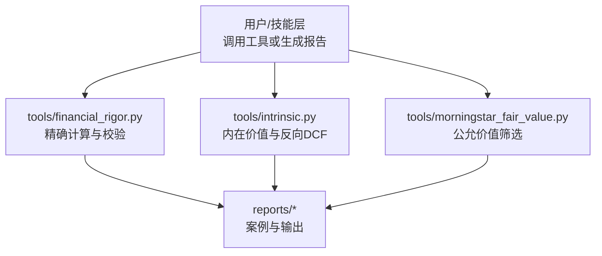
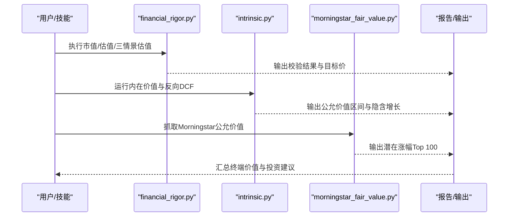
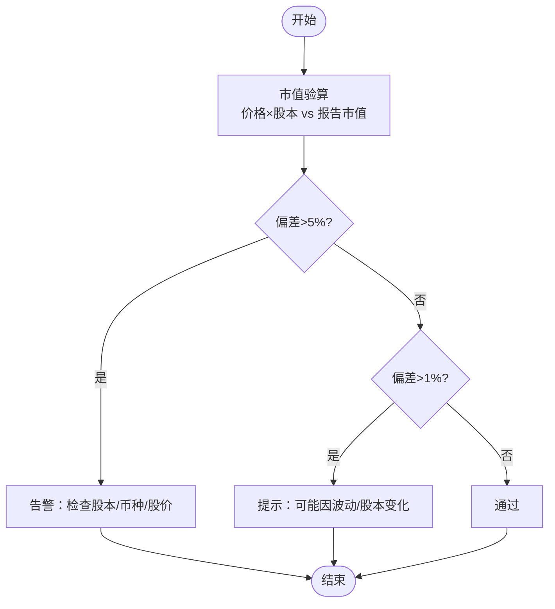
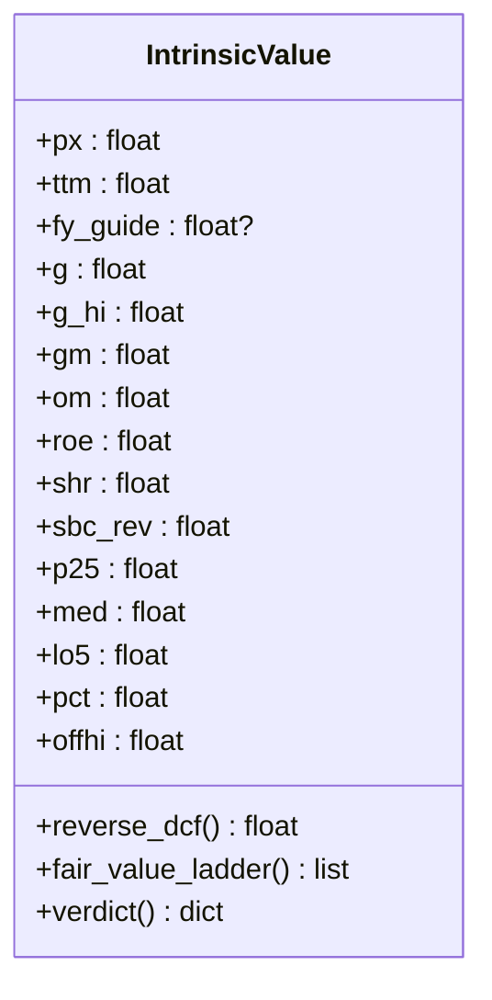
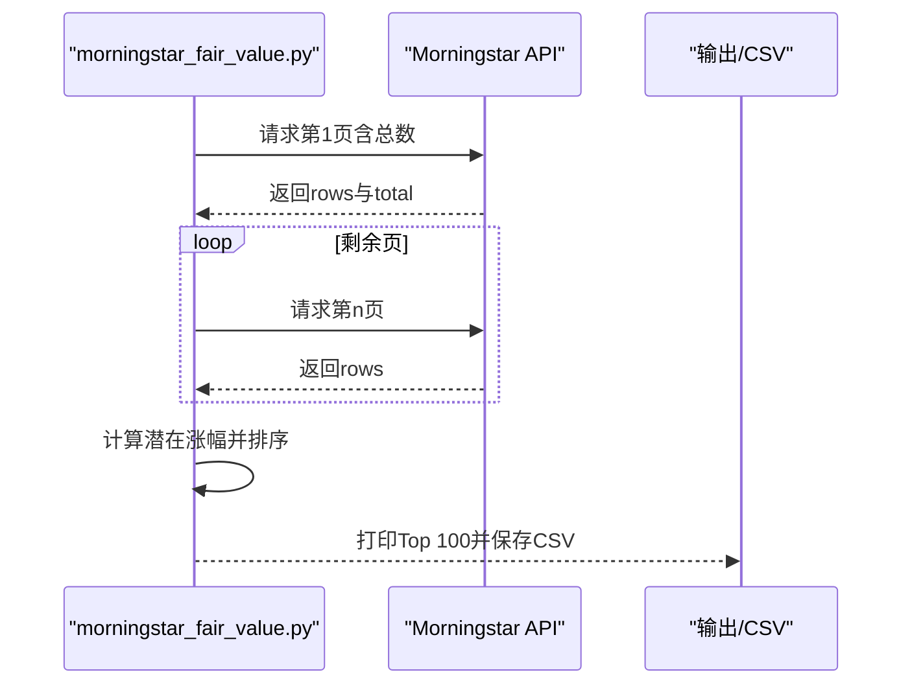
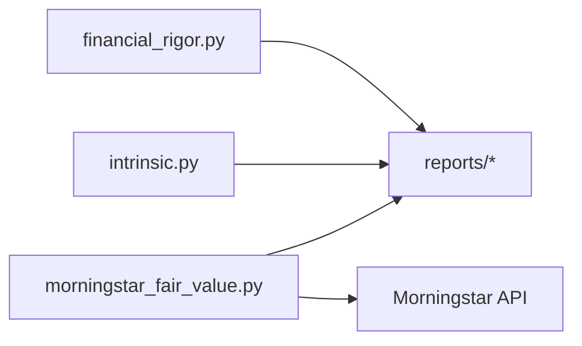

# 终端价值计算工具

<cite>
**本文引用的文件**
- [README.md](file://README.md)
- [CONTEXT.md](file://CONTEXT.md)
- [tools/financial_rigor.py](file://tools/financial_rigor.py)
- [tools/intrinsic.py](file://tools/intrinsic.py)
- [tools/morningstar_fair_value.py](file://tools/morningstar_fair_value.py)
- [reports/英伟达/英伟达-财务估值分析-20260420.md](file://reports/英伟达/英伟达-财务估值分析-20260420.md)
- [reports/50pct-upside-final-20260808.md](file://reports/50pct-upside-final-20260808.md)
</cite>

## 目录
1. [简介](#简介)
2. [项目结构](#项目结构)
3. [核心组件](#核心组件)
4. [架构总览](#架构总览)
5. [详细组件分析](#详细组件分析)
6. [依赖关系分析](#依赖关系分析)
7. [性能与精度考量](#性能与精度考量)
8. [故障排查指南](#故障排查指南)
9. [结论](#结论)
10. [附录](#附录)

## 简介
本仓库是一套面向投资研究的“AI Berkshire”框架，强调用严谨的金融计算、多源交叉验证与多视角对抗来生成可决策的投资报告。围绕“终端价值计算”，本项目提供了：
- 精确十进制计算引擎（避免浮点误差）
- 三情景估值模型（乐观/中性/悲观）
- 反向DCF（从现价反推隐含永续增长）
- 公允价值筛选（Morningstar API）
- 市值与估值指标校验、多源数据一致性检查、Benford定律异常检测

这些能力共同支撑了终端价值（Terminal Value）与内在价值的稳健估算，确保研究结论具备可审计性与可复现性。

## 项目结构
与终端价值计算直接相关的代码集中在 tools 目录，配合 reports 中的案例报告展示使用方法与结果。整体组织方式如下：
- tools/financial_rigor.py：提供命令行工具，覆盖市值验算、估值指标验算、多源交叉验证、Benford检测、精确计算器、三情景估值等
- tools/intrinsic.py：基于GAAP股东盈余进行“倍数法 + 反向DCF + FCF收益率”综合判断，并输出“是否低于可辩护公允价值50%以上”的结论
- tools/morningstar_fair_value.py：抓取Morningstar公允价值估计，计算潜在涨幅并输出Top 100
- reports/*：包含使用上述工具的实际案例与结果（如英伟达DCF、反向DCF等）

图表来源
- [tools/financial_rigor.py:1-466](file://tools/financial_rigor.py#L1-L466)
- [tools/intrinsic.py:1-97](file://tools/intrinsic.py#L1-L97)
- [tools/morningstar_fair_value.py:1-153](file://tools/morningstar_fair_value.py#L1-L153)
- [reports/英伟达/英伟达-财务估值分析-20260420.md:209-241](file://reports/英伟达/英伟达-财务估值分析-20260420.md#L209-L241)

章节来源
- [README.md:161-172](file://README.md#L161-L172)
- [CONTEXT.md:1-30](file://CONTEXT.md#L1-L30)

## 核心组件
- 精确计算与校验（financial_rigor.py）
  - 市值验算：股价×总股本 vs 报告市值，偏差阈值告警
  - 估值指标验算：PE/PB/ROE/FCF Yield/股息率/PS 等
  - 多源交叉验证：以中位数为参考，逐源偏差评估
  - Benford定律检测：首位数字分布异常提示
  - 精确计算器：安全表达式求值，Decimal运算
  - 三情景估值：按年增速与目标PE计算目标价与涨跌幅
- 内在价值与反向DCF（intrinsic.py）
  - 以GAAP股东盈余为基础，结合市场锚（S&P500远期PE）与自身历史分位
  - 反向DCF：由现价反推隐含永续增长率，并与共识短期增长对比
  - 输出“是否低于可辩护公允价值50%以上”的结论
- 公允价值筛选（morningstar_fair_value.py）
  - 抓取Morningstar公允价值估计，计算潜在涨幅，输出Top 100
  - 支持星级、护城河、不确定性等维度筛选与统计摘要

章节来源
- [tools/financial_rigor.py:70-173](file://tools/financial_rigor.py#L70-L173)
- [tools/financial_rigor.py:176-294](file://tools/financial_rigor.py#L176-L294)
- [tools/financial_rigor.py:297-373](file://tools/financial_rigor.py#L297-L373)
- [tools/intrinsic.py:1-97](file://tools/intrinsic.py#L1-L97)
- [tools/morningstar_fair_value.py:47-153](file://tools/morningstar_fair_value.py#L47-L153)

## 架构总览
终端价值计算在项目中通过“工具层”实现，被上层Skill或报告流程调用。其核心思想是：
- 所有数值计算采用Python decimal.Decimal，避免浮点误差
- 关键假设（WACC、终端增长率、目标PE）需明确且可审计
- 多方法交叉验证（倍数法、DCF、反向DCF、公允价值）降低单一模型风险

图表来源
- [tools/financial_rigor.py:330-373](file://tools/financial_rigor.py#L330-L373)
- [tools/intrinsic.py:77-97](file://tools/intrinsic.py#L77-L97)
- [tools/morningstar_fair_value.py:77-153](file://tools/morningstar_fair_value.py#L77-L153)

## 详细组件分析

### 组件A：精确计算与校验（financial_rigor.py）
- 设计要点
  - 使用decimal.Decimal构建精确计算上下文，避免float近似误差
  - 市值验算设置偏差阈值（>5%告警，>1%提示），单位一致性检查（币种）
  - 估值指标验算覆盖PE/PB/ROE/FCF Yield/股息率/PS，便于快速定位异常
  - 多源交叉验证以中位数为基准，逐源偏差评估，给出共识值
  - Benford定律检测用于财务数据异常初筛（样本量不足时提示不可靠）
  - 精确计算器限制表达式字符集，防止不安全执行
  - 三情景估值按年复合增长与目标PE计算目标价与涨跌幅
- 复杂度与性能
  - 主要操作为算术运算与排序，时间复杂度O(n log n)（排序）
  - 对大数格式化与Decimal运算开销可控，适合批量校验
- 错误处理
  - 非法表达式、除零、空输入均有保护与提示
  - 跨源不一致时给出建议（优先年报/交易所数据）

图表来源
- [tools/financial_rigor.py:70-104](file://tools/financial_rigor.py#L70-L104)

章节来源
- [tools/financial_rigor.py:70-173](file://tools/financial_rigor.py#L70-L173)
- [tools/financial_rigor.py:176-294](file://tools/financial_rigor.py#L176-L294)
- [tools/financial_rigor.py:297-373](file://tools/financial_rigor.py#L297-L373)

### 组件B：内在价值与反向DCF（intrinsic.py）
- 设计要点
  - 以GAAP股东盈余为基础，结合市场锚（S&P500远期PE）与自身历史分位（p25/中位数/低分位）
  - 反向DCF：由现价反推隐含永续增长率 g = (P·r - E)/(P + E)，并与公司指引/共识对比
  - 输出“是否低于可辩护公允价值50%以上”的结论，辅助投资决策
- 关键假设
  - 折现率 r=9%（示例），终端增长率隐含于现价
  - 使用TTM或FY Guide作为基础EPS，考虑回购影响（shr）
- 应用场景
  - 快速判断当前价格是否显著低于可辩护公允价值
  - 识别市场定价隐含的增长假设是否合理

图表来源
- [tools/intrinsic.py:9-22](file://tools/intrinsic.py#L9-L22)
- [tools/intrinsic.py:77-97](file://tools/intrinsic.py#L77-L97)

章节来源
- [tools/intrinsic.py:1-97](file://tools/intrinsic.py#L1-L97)

### 组件C：公允价值筛选（morningstar_fair_value.py）
- 设计要点
  - 通过Morningstar筛选器API获取有公允价值估计的股票
  - 计算潜在涨幅（(公允价值-现价)/现价），输出Top 100
  - 支持星级、护城河、不确定性等维度统计与筛选
- 数据流
  - 分页抓取 → 解析JSON → 过滤无效记录 → 计算涨幅 → 排序 → 输出CSV与控制台表格
- 适用场景
  - 快速发现低估标的，结合其他工具进行深度验证

图表来源
- [tools/morningstar_fair_value.py:31-75](file://tools/morningstar_fair_value.py#L31-L75)
- [tools/morningstar_fair_value.py:77-153](file://tools/morningstar_fair_value.py#L77-L153)

章节来源
- [tools/morningstar_fair_value.py:1-153](file://tools/morningstar_fair_value.py#L1-L153)

### 组件D：报告与案例（reports）
- 英伟达DCF案例
  - 展示自由现金流折现法的三情景估值，WACC与终端增长率假设明确
  - 与EPS增长法对比，解释差异原因（终端PE定价 vs WACC折现）
- 反向DCF应用
  - 以GAAP净利作股东盈余，贴现率9%，反推隐含永续增长
  - 与市场指引/共识对比，识别定价合理性

章节来源
- [reports/英伟达/英伟达-财务估值分析-20260420.md:209-241](file://reports/英伟达/英伟达-财务估值分析-20260420.md#L209-L241)
- [reports/50pct-upside-final-20260808.md:742-765](file://reports/50pct-upside-final-20260808.md#L742-L765)

## 依赖关系分析
- 内部依赖
  - financial_rigor.py 被 Skill 或报告流程调用，提供精确计算与校验
  - intrinsic.py 独立运行，输出内在价值与反向DCF结论
  - morningstar_fair_value.py 依赖外部API（Morningstar），输出公允价值筛选结果
- 外部依赖
  - Python标准库（decimal、json、math、argparse、subprocess、csv、os、datetime）
  - Morningstar API（HTTP请求）
- 耦合度与内聚性
  - 各工具职责清晰，内聚性强；耦合度低，便于替换或扩展
  - 报告层仅消费工具输出，不直接参与计算逻辑

图表来源
- [tools/financial_rigor.py:1-466](file://tools/financial_rigor.py#L1-L466)
- [tools/intrinsic.py:1-97](file://tools/intrinsic.py#L1-L97)
- [tools/morningstar_fair_value.py:1-153](file://tools/morningstar_fair_value.py#L1-L153)

章节来源
- [README.md:697-709](file://README.md#L697-L709)

## 性能与精度考量
- 精度
  - 全部计算使用decimal.Decimal，避免浮点误差（如0.1+0.2=0.3）
  - 市值验算与估值指标验算确保关键比率无舍入误差
- 性能
  - 排序与循环操作规模较小，性能瓶颈不在算法本身
  - Morningstar API分页抓取需注意速率限制与超时处理
- 可扩展性
  - 新增估值方法可通过模块化函数扩展，不影响现有逻辑
  - 报告模板可复用工具输出，保持格式一致

[本节为通用指导，无需特定文件引用]

## 故障排查指南
- 市值验算偏差过大
  - 检查股本是否最新（回购/增发）、币种是否一致、股价是否为实时
  - 参考：市值验算逻辑与阈值
- 多源数据不一致
  - 以中位数为参考，逐源偏差评估；优先采用年报/交易所数据
  - 参考：交叉验证逻辑与容差设置
- Benford检测样本不足
  - 样本量<50时结果不可靠，需扩大样本或结合其他方法
- Morningstar API失败
  - 检查网络、User-Agent、分页参数；重试机制已内置
- 反向DCF隐含增长异常
  - 检查折现率假设、股东盈余口径（GAAP净利，SBC费用化）
  - 参考：反向DCF公式与示例

章节来源
- [tools/financial_rigor.py:70-104](file://tools/financial_rigor.py#L70-L104)
- [tools/financial_rigor.py:176-217](file://tools/financial_rigor.py#L176-L217)
- [tools/financial_rigor.py:220-294](file://tools/financial_rigor.py#L220-L294)
- [tools/morningstar_fair_value.py:60-75](file://tools/morningstar_fair_value.py#L60-L75)
- [tools/intrinsic.py:77-97](file://tools/intrinsic.py#L77-L97)

## 结论
本项目的终端价值计算体系以精确计算为核心，结合多方法交叉验证与多源数据校验，确保估值结论稳健、可审计、可复现。通过三情景估值、反向DCF与公允价值筛选，能够全面评估标的的内在价值与安全边际，为投资决策提供坚实依据。

[本节为总结，无需特定文件引用]

## 附录
- 快速开始
  - 安装Python环境，确保decimal模块可用
  - 运行financial_rigor.py子命令进行市值/估值/三情景估值
  - 运行intrinsic.py进行内在价值与反向DCF分析
  - 运行morningstar_fair_value.py抓取公允价值并输出Top 100
- 使用示例路径
  - 市值验算：tools/financial_rigor.py verify-market-cap
  - 估值指标验算：tools/financial_rigor.py verify-valuation
  - 三情景估值：tools/financial_rigor.py three-scenario
  - 内在价值：tools/intrinsic.py
  - 公允价值筛选：tools/morningstar_fair_value.py

[本节为操作指引，无需特定文件引用]