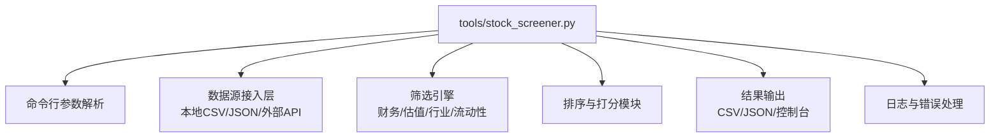
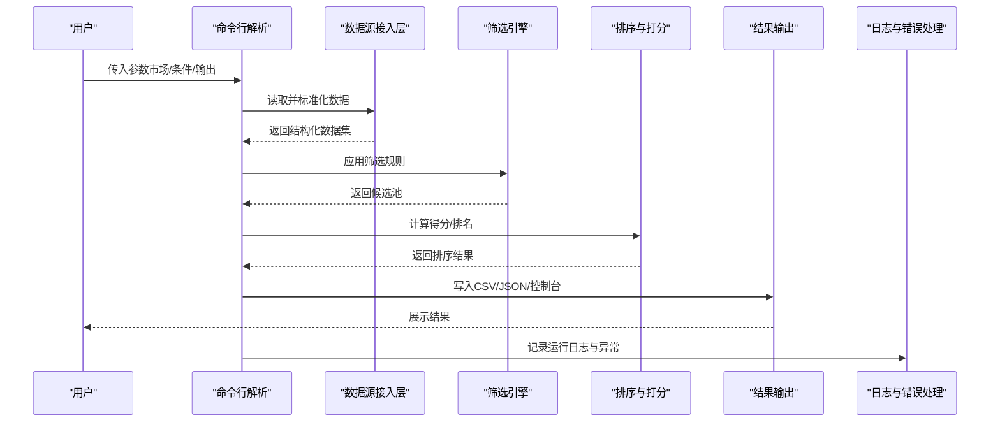
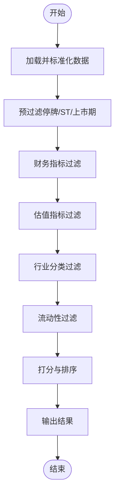
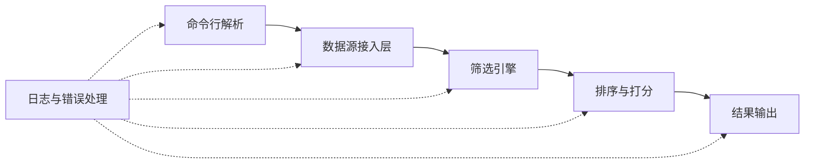

# 股票筛选器

<cite>
**本文引用的文件**   
- [stock_screener.py](file://tools/stock_screener.py)
</cite>

## 目录
1. [简介](#简介)
2. [项目结构](#项目结构)
3. [核心组件](#核心组件)
4. [架构总览](#架构总览)
5. [详细组件分析](#详细组件分析)
6. [依赖关系分析](#依赖关系分析)
7. [性能考量](#性能考量)
8. [故障排查指南](#故障排查指南)
9. [结论](#结论)
10. [附录](#附录)

## 简介
本技术文档围绕仓库中的命令行工具 stock_screener.py，系统化阐述其功能特性与使用方式。该工具面向多市场（A股、港股、美股）的股票筛选场景，提供财务指标过滤、估值分析、行业分类等能力，并支持批量处理与多种输出格式。文档同时给出典型使用示例、配置模板与最佳实践，帮助读者快速上手并高效产出可验证的筛选结果。

## 项目结构
stock_screener.py 位于 tools 目录下，作为独立的可执行脚本对外暴露命令行接口。仓库中其他目录（如 reports、筛选公司、晨星深度低估等）包含历史筛选产物与研究文档，可作为使用该工具的参考样例与结果对照。

[本节为概念性说明，不直接分析具体代码文件]

## 核心组件
- 命令行参数解析：统一入口，负责加载市场范围、筛选条件、输出路径与格式等选项。
- 数据源接入层：对接本地数据文件或外部数据接口，完成字段标准化与缺失值处理。
- 筛选引擎：实现多市场差异化规则集，包括财务健康度、估值区间、行业标签、流动性与交易状态过滤。
- 排序与打分：对通过初筛标的进行加权评分或分档，便于二次精选。
- 结果输出：支持 CSV、JSON 与控制台打印，并可附加元数据（时间戳、策略名、参数摘要）。
- 日志与错误处理：记录关键步骤、异常堆栈与重试信息，便于问题定位与复现。

**章节来源**
- [stock_screener.py](file://tools/stock_screener.py)

## 架构总览
下图展示了从命令行到最终输出的端到端流程，以及各模块之间的交互关系。

**图表来源**
- [stock_screener.py](file://tools/stock_screener.py)

**章节来源**
- [stock_screener.py](file://tools/stock_screener.py)

## 详细组件分析

### 命令行参数与配置
- 市场选择：支持单市场或多市场组合（A股、港股、美股），不同市场采用各自的数据源与字段映射。
- 筛选条件：
  - 财务指标：营收增速、净利润增速、ROE、毛利率、资产负债率、经营性现金流等。
  - 估值指标：PE、PB、PS、EV/EBITDA、股息率等。
  - 行业分类：按自定义行业标签或标准分类体系进行过滤。
  - 流动性与交易状态：日均成交额、停牌/退市标记等。
- 输出选项：
  - 格式：CSV、JSON、控制台。
  - 路径：指定输出文件路径；未指定时默认当前工作目录。
  - 元数据：在输出文件中附带策略名称、参数快照、时间戳等。
- 批量处理：
  - 支持从配置文件或清单文件批量加载多组筛选条件，循环执行并分别输出结果。
  - 支持并发控制与任务队列，避免资源争用与内存溢出。

**章节来源**
- [stock_screener.py](file://tools/stock_screener.py)

### 数据源接入层
- 数据源类型：
  - 本地文件：CSV、JSON 等静态数据。
  - 外部接口：行情与基本面 API（需鉴权与限流保护）。
- 字段标准化：
  - 统一单位与币种（如将亿/万转换为数值，汇率换算）。
  - 缺失值填充策略（前向填充、均值填充、剔除）。
  - 异常值检测与裁剪（基于分位数或业务阈值）。
- 校验与断言：
  - 必填字段检查、数据类型校验、取值范围约束。
  - 失败时抛出明确错误并记录上下文，便于定位数据质量问题。

**章节来源**
- [stock_screener.py](file://tools/stock_screener.py)

### 筛选引擎与算法逻辑
- 规则组织：
  - 规则以“条件表达式 + 权重/优先级”的形式定义，支持 AND/OR 组合。
  - 针对不同市场提供差异化规则集（例如港股与美股的财报口径差异）。
- 核心流程：
  - 预过滤：剔除停牌、ST、上市不满一定期限等基础黑名单。
  - 财务过滤：基于阈值或趋势（同比/环比/滚动平均）进行筛选。
  - 估值过滤：结合相对估值与绝对估值区间，排除极端高估/低估样本。
  - 行业过滤：按行业标签或产业链位置进行定向召回。
  - 流动性过滤：确保标的具备足够交易活跃度。
- 排序与打分：
  - 多因子打分模型（线性加权或非线性函数），支持动态权重调整。
  - 分档机制：将高分标的划分为优/良/一般等级，辅助人工复核。

**图表来源**
- [stock_screener.py](file://tools/stock_screener.py)

**章节来源**
- [stock_screener.py](file://tools/stock_screener.py)

### 结果输出与验证
- 输出格式：
  - CSV：适合后续表格分析与可视化。
  - JSON：便于程序化消费与自动化流水线集成。
  - 控制台：快速预览与调试。
- 结果验证方法：
  - 抽样核对：随机抽取若干标的，交叉比对原始数据与筛选结果。
  - 稳定性测试：固定参数多次运行，检查结果一致性。
  - 边界用例：输入极端阈值或空集合，验证鲁棒性与错误提示。
  - 回归测试：对比历史版本输出，确保规则变更不会引入意外偏差。

**章节来源**
- [stock_screener.py](file://tools/stock_screener.py)

### 常见筛选场景与配置模板
以下为可直接套用的策略模板（以参数形式描述，非代码片段）：
- A股高质量低估值
  - 市场：A股
  - 财务：ROE≥15%，净利润增速≥10%，毛利率≥30%
  - 估值：PE≤20，PB≤3
  - 流动性：日均成交额≥5000万
  - 输出：CSV，附带策略名与时间戳
- 港股高股息稳健型
  - 市场：港股
  - 财务：股息率≥5%，资产负债率≤60%
  - 估值：PE≤12，PB≤1.5
  - 流动性：日均成交额≥1亿港元
  - 输出：JSON
- 美股成长科技
  - 市场：美股
  - 财务：营收增速≥20%，净利润增速≥15%
  - 估值：PS≤8，EV/EBITDA≤25
  - 行业：信息技术、通信服务
  - 流动性：日均成交额≥1亿美元
  - 输出：CSV

**章节来源**
- [stock_screener.py](file://tools/stock_screener.py)

## 依赖关系分析
- 内部依赖：
  - 命令行解析 → 数据源接入层 → 筛选引擎 → 排序与打分 → 结果输出
  - 日志与错误处理贯穿全流程，用于记录与异常恢复
- 外部依赖：
  - 数据源（本地文件/外部API）
  - 第三方库（数据处理、序列化、网络请求等）

**图表来源**
- [stock_screener.py](file://tools/stock_screener.py)

**章节来源**
- [stock_screener.py](file://tools/stock_screener.py)

## 性能考量
- 数据预处理优化：
  - 向量化操作替代逐行循环，减少解释器开销。
  - 惰性加载与分块读取，降低内存峰值。
- 筛选规则优化：
  - 先易后难：优先执行低成本且高淘汰率的规则，缩小候选集后再进行复杂计算。
  - 缓存中间结果，避免重复计算。
- 并发与批处理：
  - 多进程/多线程并行处理不同市场或批次任务。
  - 限制并发数与队列长度，防止资源耗尽。
- I/O 优化：
  - 批量写入而非频繁小写。
  - 压缩输出文件以减少磁盘占用与传输成本。

[本节为通用性能建议，不直接分析具体代码文件]

## 故障排查指南
- 常见问题定位：
  - 数据缺失或字段不一致：检查数据源接入层的标准化与校验逻辑，确认必填字段与类型。
  - 筛选结果为空：逐步放宽阈值，定位最严格的规则；查看日志中的过滤统计。
  - 输出文件损坏：确认序列化过程与编码设置；尝试切换输出格式。
- 日志与诊断：
  - 开启详细日志级别，捕获关键步骤与异常堆栈。
  - 记录每次运行的参数快照，便于复现与回溯。
- 重试与容错：
  - 对外部API调用增加重试与退避策略。
  - 对异常数据行进行隔离与跳过，保证整体流程继续执行。

**章节来源**
- [stock_screener.py](file://tools/stock_screener.py)

## 结论
stock_screener.py 提供了覆盖多市场的股票筛选能力，支持灵活的财务与估值过滤、行业分类与批量处理，并通过标准化的输出与完善的日志机制保障结果可追溯与可验证。结合本文提供的配置模板与最佳实践，用户可在不同市场环境下快速构建并迭代自己的选股策略。

[本节为总结性内容，不直接分析具体代码文件]

## 附录
- 术语表：
  - ROE：净资产收益率
  - PE/PB/PS/EV/EBITDA：常用估值指标
  - ST：特别处理股票（A股）
- 相关报告与样例：
  - 仓库中的 reports 与 筛选公司 目录包含大量历史筛选产物与研究报告，可作为策略效果与结果解读的参考。

[本节为补充信息，不直接分析具体代码文件]