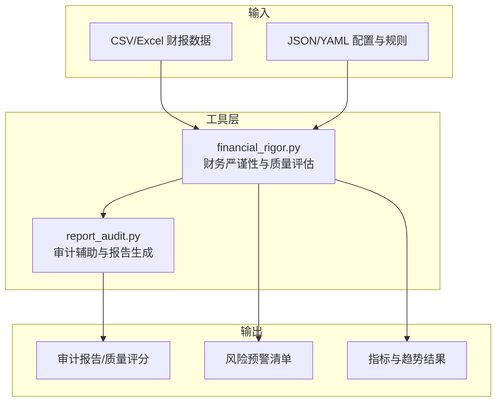
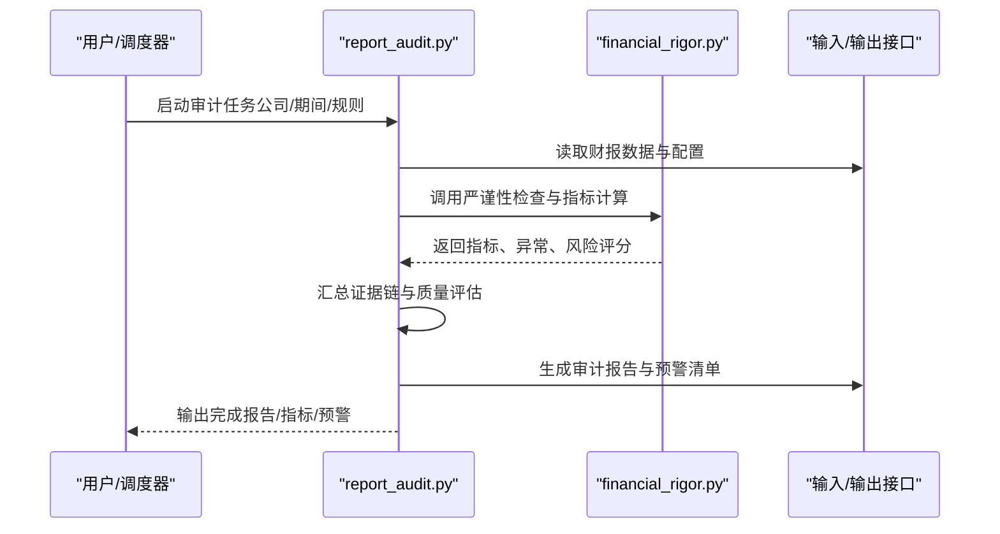
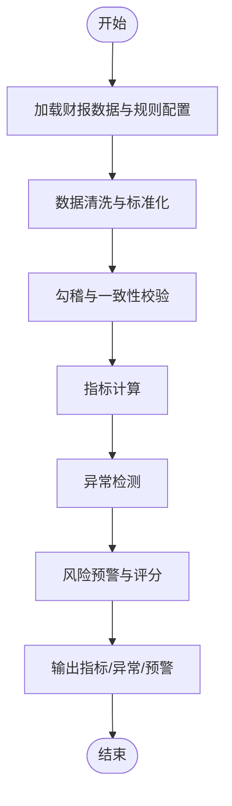
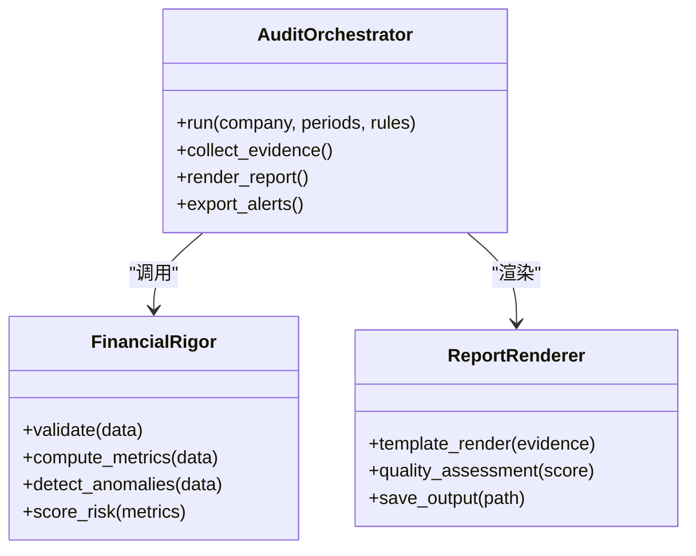
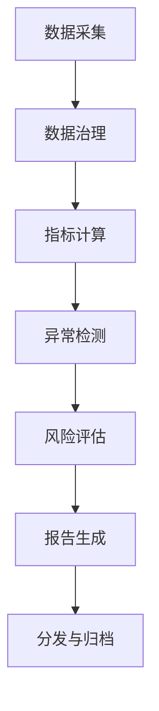
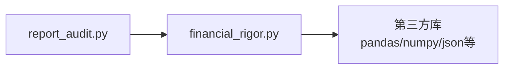

# 财务分析工具

<cite>
**本文引用的文件**   
- [financial_rigor.py](file://tools/financial_rigor.py)
- [report_audit.py](file://tools/report_audit.py)
</cite>

## 目录
1. [简介](#简介)
2. [项目结构](#项目结构)
3. [核心组件](#核心组件)
4. [架构总览](#架构总览)
5. [详细组件分析](#详细组件分析)
6. [依赖关系分析](#依赖关系分析)
7. [性能考虑](#性能考虑)
8. [故障排查指南](#故障排查指南)
9. [结论](#结论)
10. [附录](#附录)

## 简介
本技术文档面向财务分析工具集，聚焦以下两个核心脚本：
- financial_rigor.py：财务报表严谨性检查与质量评估模块，提供数据验证、异常检测、风险预警与指标计算。
- report_audit.py：审计辅助分析与报告生成流程，支持对上市公司财报进行自动化分析与质量评估。

文档将系统阐述财务数据的验证规则、异常检测算法、风险预警机制和报告生成流程；解释财务比率的计算方法、行业标准对比与趋势分析方法；并提供完整使用示例与扩展开发指导，帮助读者快速上手并二次开发。

## 项目结构
本项目为多用途投研与数据分析仓库，财务分析相关能力集中在 tools 目录下的 Python 脚本中。本次文档重点围绕以下两个脚本展开：
- tools/financial_rigor.py：负责财务数据清洗、校验、指标计算、异常检测与风险评分。
- tools/report_audit.py：负责审计辅助分析、报告组装与输出（如文本或结构化结果）。

[本节为概念性结构说明，不直接分析具体代码文件，故无“章节来源”]

## 核心组件
本节从功能维度梳理两大脚本的核心职责与交互关系，便于读者建立整体认知后再进入细节。

- 财务严谨性检查（financial_rigor.py）
  - 数据接入与标准化：统一字段命名、单位换算、缺失值处理。
  - 报表勾稽校验：资产负债表恒等式、利润表与现金流量表的衔接校验。
  - 指标计算：盈利能力、偿债能力、营运效率、成长性与现金流质量等。
  - 异常检测：离群点识别、波动率突变、结构性断点。
  - 风险预警：阈值触发、组合风险评分、行业基准对比。
  - 结果输出：指标表、异常清单、风险等级与可解释提示。

- 审计辅助与报告生成（report_audit.py）
  - 审计工作流编排：按公司/期间批量拉取数据、执行检查、汇总结果。
  - 证据链整理：关键指标、异常项、风险提示的溯源与索引。
  - 报告模板渲染：生成可读的报告文本或结构化结果。
  - 质量评估：综合评分、问题分级、改进建议。

**章节来源**
- [financial_rigor.py](file://tools/financial_rigor.py)
- [report_audit.py](file://tools/report_audit.py)

## 架构总览
下图展示从数据输入到报告输出的端到端流程，以及各模块的职责边界。

**图表来源**
- [financial_rigor.py](file://tools/financial_rigor.py)
- [report_audit.py](file://tools/report_audit.py)

## 详细组件分析

### 组件A：财务严谨性检查（financial_rigor.py）
该组件承担财务数据质量把关与量化评估的核心逻辑，包括数据校验、指标计算、异常检测与风险预警。

#### 主要职责
- 数据校验与标准化
  - 字段映射与单位统一
  - 缺失值与重复值处理
  - 时间序列对齐与口径一致性
- 报表勾稽校验
  - 资产=负债+所有者权益
  - 净利润与经营性现金流的衔接
  - 分部加总与合并口径核对
- 指标计算
  - 盈利能力：毛利率、净利率、ROE、ROA
  - 偿债能力：资产负债率、流动比率、速动比率、利息保障倍数
  - 营运效率：存货周转率、应收周转率、应付周转率、总资产周转率
  - 成长性：营收增速、利润增速、EPS增速
  - 现金流质量：经营现金流/净利润、自由现金流
- 异常检测
  - 单期离群点检测（基于分位数或Z分数）
  - 时序波动率突变（滚动窗口方差变化）
  - 结构性断点（前后均值差异显著）
- 风险预警
  - 阈值触发（如资产负债率超阈、连续亏损）
  - 组合风险评分（加权聚合）
  - 行业基准对比（分位排名）
- 结果输出
  - 指标表、异常清单、风险等级与可解释提示

**图表来源**
- [financial_rigor.py](file://tools/financial_rigor.py)

**章节来源**
- [financial_rigor.py](file://tools/financial_rigor.py)

### 组件B：审计辅助与报告生成（report_audit.py）
该组件负责审计工作流编排、证据链整理与报告渲染，串联财务严谨性检查结果，形成可交付的分析产物。

#### 主要职责
- 任务编排
  - 批量公司/期间扫描
  - 并行执行与失败重试
- 证据链整理
  - 关键指标快照
  - 异常项与风险提示溯源
- 报告渲染
  - 模板化文本/结构化结果
  - 质量评估与改进建议
- 输出管理
  - 报告归档与版本标记
  - 预警清单导出

**图表来源**
- [report_audit.py](file://tools/report_audit.py)
- [financial_rigor.py](file://tools/financial_rigor.py)

**章节来源**
- [report_audit.py](file://tools/report_audit.py)

### 概念性概览
以下为通用工作流程示意，用于帮助理解端到端分析过程，不直接对应具体代码结构。

[本节为概念性流程图，未映射到具体源码文件，故无“图表来源”]

## 依赖关系分析
- 内部依赖
  - report_audit.py 依赖 financial_rigor.py 提供的数据校验、指标计算、异常检测与风险评分能力。
- 外部依赖（常见于同类实现）
  - 数据处理：pandas/numpy
  - 可视化：matplotlib/seaborn（可选）
  - 序列化：json/yaml
  - 日志与配置：logging、configparser/env

**图表来源**
- [financial_rigor.py](file://tools/financial_rigor.py)
- [report_audit.py](file://tools/report_audit.py)

**章节来源**
- [financial_rigor.py](file://tools/financial_rigor.py)
- [report_audit.py](file://tools/report_audit.py)

## 性能考虑
- 批处理与并行
  - 对多公司/多期间任务采用并发执行，降低端到端耗时。
- 内存与I/O优化
  - 大表分块读取、增量更新、避免全量复制。
- 缓存策略
  - 中间指标与历史基线缓存，减少重复计算。
- 异常路径短路
  - 早期校验失败即中止后续步骤，节省资源。

[本节提供一般性指导，不直接分析具体文件，故无“章节来源”]

## 故障排查指南
- 常见问题定位
  - 数据缺失/格式不一致：检查字段映射与单位换算。
  - 勾稽失败：核对报表口径与合并范围。
  - 指标异常：确认窗口长度与异常检测参数。
  - 报告生成失败：检查模板变量与输出路径权限。
- 调试建议
  - 开启详细日志，记录关键中间结果。
  - 对异常样本进行最小复现，逐步缩小范围。
  - 使用单元测试覆盖典型场景与边界条件。

**章节来源**
- [financial_rigor.py](file://tools/financial_rigor.py)
- [report_audit.py](file://tools/report_audit.py)

## 结论
financial_rigor.py 与 report_audit.py 共同构成一套完整的财务分析工具链：前者负责数据质量把关与量化评估，后者负责审计工作流编排与报告产出。通过标准化的验证规则、稳健的异常检测与清晰的风险预警机制，可对上市公司财报进行自动化分析与质量评估，并为投资决策与研究提供可靠依据。

[本节为总结性内容，不直接分析具体文件，故无“章节来源”]

## 附录

### 使用示例（端到端）
- 准备数据
  - 准备标准格式的财报数据（CSV/Excel），包含资产负债表、利润表、现金流量表及必要注释。
  - 准备规则与阈值配置文件（JSON/YAML），定义指标、异常阈值与行业基准。
- 运行财务严谨性检查
  - 调用 financial_rigor.py，传入数据与配置，获取指标、异常与风险评分。
- 生成审计报告
  - 调用 report_audit.py，指定公司与期间，自动编排任务、汇总证据链并输出报告。
- 审阅与归档
  - 审阅报告中的关键指标、异常项与风险提示，归档至研究知识库。

[本节为操作指引，不直接分析具体文件，故无“章节来源”]

### 财务比率计算方法与口径
- 盈利能力
  - 毛利率 = 毛利 / 营业收入
  - 净利率 = 净利润 / 营业收入
  - ROE = 净利润 / 平均净资产
  - ROA = 净利润 / 平均总资产
- 偿债能力
  - 资产负债率 = 总负债 / 总资产
  - 流动比率 = 流动资产 / 流动负债
  - 速动比率 = (流动资产 - 存货) / 流动负债
  - 利息保障倍数 = 息税前利润 / 利息费用
- 营运效率
  - 存货周转率 = 营业成本 / 平均存货
  - 应收周转率 = 营业收入 / 平均应收账款
  - 应付周转率 = 营业成本 / 平均应付账款
  - 总资产周转率 = 营业收入 / 平均总资产
- 成长性
  - 营收增速 = (本期营收 - 上期营收) / 上期营收
  - 利润增速 = (本期净利润 - 上期净利润) / 上期净利润
- 现金流质量
  - 经营现金流/净利润 = 经营活动现金流净额 / 净利润
  - 自由现金流 = 经营活动现金流净额 - 资本支出

[本节为通用方法说明，不直接分析具体文件，故无“章节来源”]

### 行业标准对比与趋势分析
- 行业基准
  - 以行业中位数或四分位数为基准，计算公司在各指标上的分位排名。
- 趋势分析
  - 滚动窗口（如3年/5年）观察指标趋势，识别拐点与持续性。
- 组合视角
  - 多维度加权评分，结合异常与风险预警，形成综合质量评估。

[本节为通用方法说明，不直接分析具体文件，故无“章节来源”]

### 自定义分析规则与扩展开发
- 新增指标
  - 在指标计算模块注册新公式，定义输入字段与输出口径。
- 调整异常检测
  - 修改阈值或算法（如改用MAD或Isolation Forest），并增加可解释性输出。
- 扩展报告模板
  - 在报告渲染模块添加新的章节与图表，支持更多受众需求。
- 集成外部数据
  - 对接行业数据库或宏观指标，增强基准对比与前瞻性分析。

[本节为扩展指导，不直接分析具体文件，故无“章节来源”]