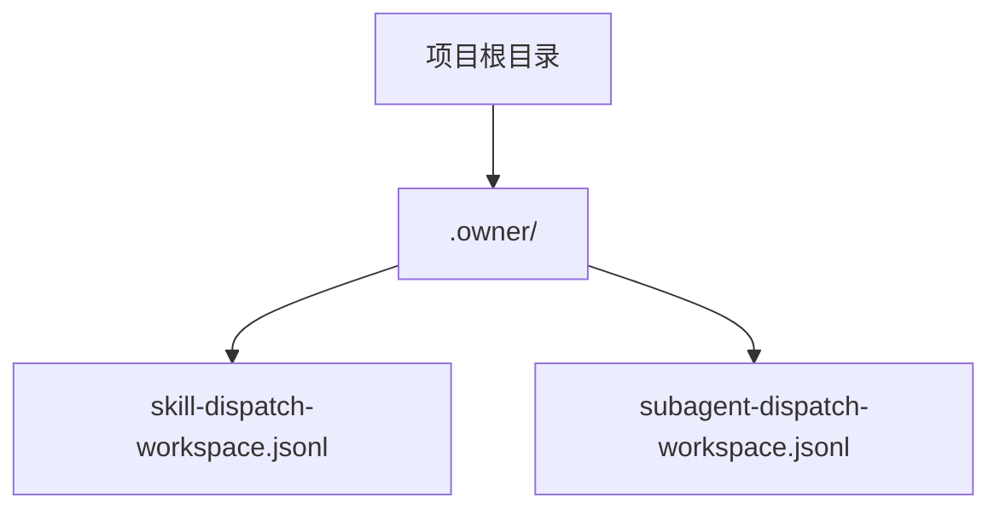
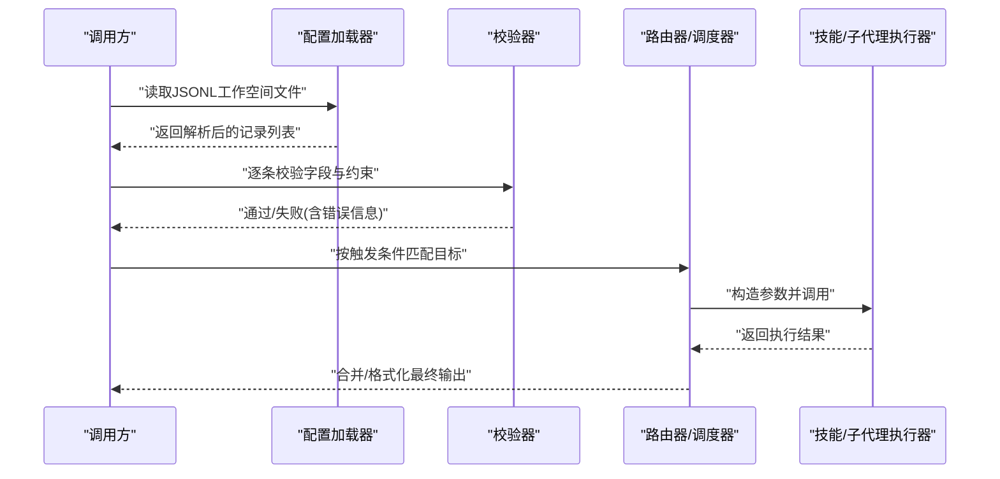
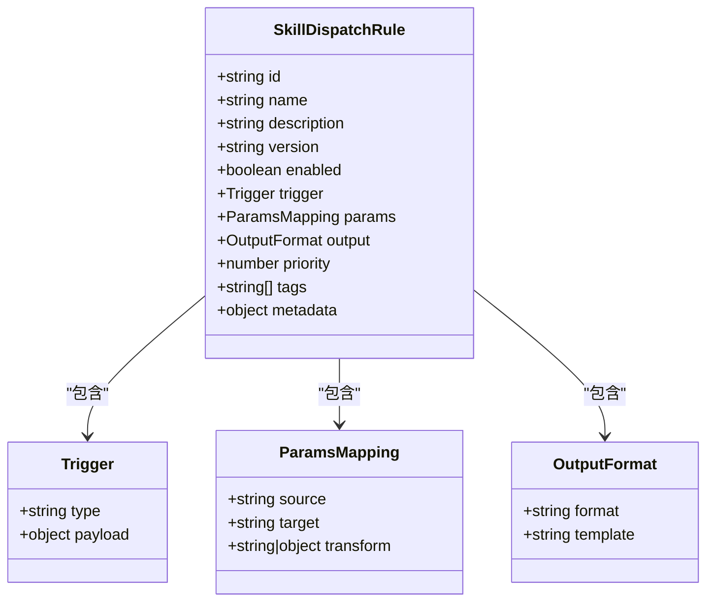
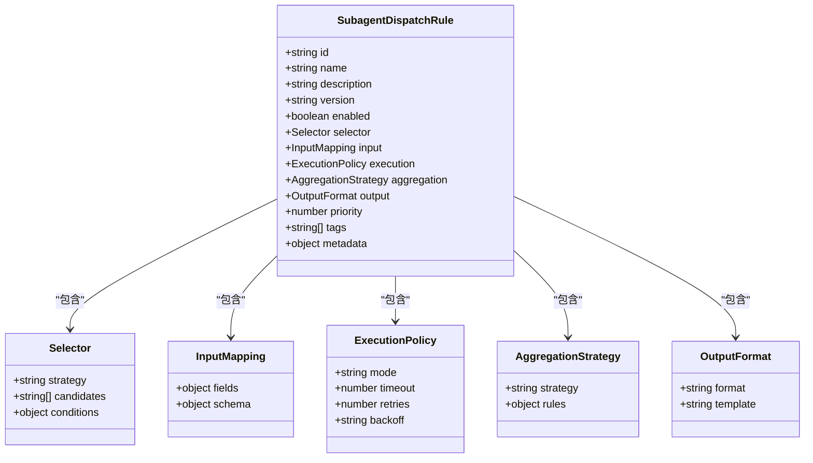
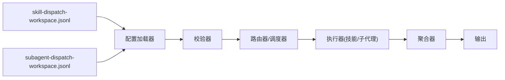
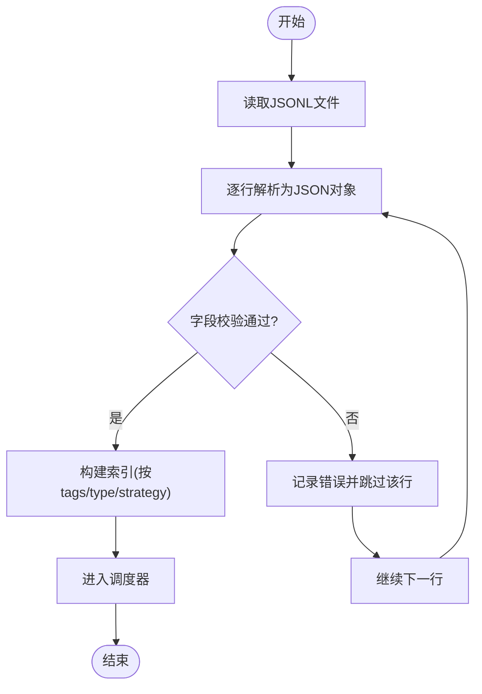

# JSONL配置文件语法

<cite>
**本文引用的文件**   
- [.owner/skill-dispatch-workspace.jsonl](file://.owner/skill-dispatch-workspace.jsonl)
- [.owner/subagent-dispatch-workspace.jsonl](file://.owner/subagent-dispatch-workspace.jsonl)
</cite>

## 目录
1. [简介](#简介)
2. [项目结构](#项目结构)
3. [核心组件](#核心组件)
4. [架构总览](#架构总览)
5. [详细组件分析](#详细组件分析)
6. [依赖关系分析](#依赖关系分析)
7. [性能与可扩展性](#性能与可扩展性)
8. [故障排查指南](#故障排查指南)
9. [结论](#结论)
10. [附录：字段规范与示例](#附录字段规范与示例)

## 简介
本文件为“JSONL配置文件系统”的技术文档，聚焦于技能调度工作空间配置与子代理调度配置的完整语法规范。内容涵盖：
- JSONL格式在项目中的具体应用
- 每个配置字段的数据类型、必填项、可选参数与默认值
- 完整的配置示例（以路径引用形式提供）
- 配置加载机制、验证规则与错误处理策略
- 版本兼容性与迁移指南
- 最佳实践与常见陷阱

## 项目结构
本项目使用两个核心JSONL配置文件来描述“技能调度工作空间”和“子代理调度工作空间”。它们位于仓库根目录的 .owner 目录下：
- 技能调度工作空间：.owner/skill-dispatch-workspace.jsonl
- 子代理调度工作空间：.owner/subagent-dispatch-workspace.jsonl

图表来源
- [.owner/skill-dispatch-workspace.jsonl](file://.owner/skill-dispatch-workspace.jsonl)
- [.owner/subagent-dispatch-workspace.jsonl](file://.owner/subagent-dispatch-workspace.jsonl)

章节来源
- [.owner/skill-dispatch-workspace.jsonl](file://.owner/skill-dispatch-workspace.jsonl)
- [.owner/subagent-dispatch-workspace.jsonl](file://.owner/subagent-dispatch-workspace.jsonl)

## 核心组件
- 技能调度工作空间（Skill Dispatch Workspace）
  - 作用：定义技能触发条件、参数映射、输出格式等，用于在运行时将用户意图或上游事件路由到合适的技能执行单元。
  - 典型用途：根据输入文本、标签、时间窗口、上下文变量等条件匹配并调用对应技能。
- 子代理调度工作空间（Subagent Dispatch Workspace）
  - 作用：定义子代理的调度策略与编排规则，包括子代理选择、参数传递、结果聚合与回传。
  - 典型用途：在主流程中按需启动一个或多个子代理，完成细分任务并汇总结果。

章节来源
- [.owner/skill-dispatch-workspace.jsonl](file://.owner/skill-dispatch-workspace.jsonl)
- [.owner/subagent-dispatch-workspace.jsonl](file://.owner/subagent-dispatch-workspace.jsonl)

## 架构总览
下图展示了从“配置加载”到“调度执行”的高层流程。该流程适用于技能与子代理两类工作空间配置。

[此图为概念流程图，不直接映射具体源码文件，故无图表来源]

## 详细组件分析

### 技能调度工作空间（skill-dispatch-workspace.jsonl）
- 文件格式：JSON Lines（每行一个独立的JSON对象）
- 语义：每条记录代表一个“技能调度规则”，包含触发条件、参数映射、输出格式等
- 关键字段（建议）：
  - id: 字符串，唯一标识
  - name: 字符串，可读名称
  - description: 字符串，说明
  - version: 字符串或数字，配置版本
  - enabled: 布尔，是否启用
  - trigger: 对象，触发条件集合
    - type: 字符串，如“关键词/正则/标签/时间/自定义表达式”
    - payload: 对象，条件参数
  - params: 对象，参数映射表
    - source: 字符串，来源（如“user_input/context/env”）
    - target: 字符串，目标键名
    - transform: 字符串或对象，转换函数或规则
  - output: 对象，输出格式
    - format: 字符串，如“json/text/markdown”
    - template: 字符串，模板表达式
  - priority: 数字，优先级（数值越小越优先）
  - tags: 字符串数组，分类标签
  - metadata: 对象，扩展元数据

- 示例位置（不含代码片段，仅路径）：
  - [技能调度示例记录](file://.owner/skill-dispatch-workspace.jsonl)

章节来源
- [.owner/skill-dispatch-workspace.jsonl](file://.owner/skill-dispatch-workspace.jsonl)

#### 类图（概念模型）

[此图为概念类图，不直接映射具体源码文件，故无图表来源]

### 子代理调度工作空间（subagent-dispatch-workspace.jsonl）
- 文件格式：JSON Lines（每行一个独立的JSON对象）
- 语义：每条记录代表一个“子代理调度规则”，包含子代理选择、参数传递、结果聚合与回传策略
- 关键字段（建议）：
  - id: 字符串，唯一标识
  - name: 字符串，可读名称
  - description: 字符串，说明
  - version: 字符串或数字，配置版本
  - enabled: 布尔，是否启用
  - selector: 对象，子代理选择策略
    - strategy: 字符串，如“固定/轮询/权重/条件路由”
    - candidates: 字符串数组，候选子代理ID列表
    - conditions: 对象，条件映射
  - input: 对象，入参映射
    - fields: 对象，字段映射表
    - schema: 对象，输入校验模式
  - execution: 对象，执行策略
    - mode: 字符串，如“串行/并行/流水线”
    - timeout: 数字，超时毫秒
    - retries: 数字，重试次数
    - backoff: 字符串，退避策略
  - aggregation: 对象，结果聚合
    - strategy: 字符串，如“拼接/合并/投票/加权”
    - rules: 对象，聚合规则
  - output: 对象，输出格式
    - format: 字符串
    - template: 字符串
  - priority: 数字，优先级
  - tags: 字符串数组
  - metadata: 对象

- 示例位置（不含代码片段，仅路径）：
  - [子代理调度示例记录](file://.owner/subagent-dispatch-workspace.jsonl)

章节来源
- [.owner/subagent-dispatch-workspace.jsonl](file://.owner/subagent-dispatch-workspace.jsonl)

#### 类图（概念模型）

[此图为概念类图，不直接映射具体源码文件，故无图表来源]

## 依赖关系分析
- 文件内依赖
  - 两条JSONL文件相互独立，分别承载不同维度的调度规则
- 运行时依赖
  - 配置加载器：负责读取并解析JSONL
  - 校验器：对每条记录的字段进行类型与约束检查
  - 路由器/调度器：依据trigger/selector等条件进行匹配与分发
  - 执行器：实际调用技能或子代理，并返回结果
  - 聚合器：对多个子代理的结果进行合并与格式化

[此图为概念依赖图，不直接映射具体源码文件，故无图表来源]

## 性能与可扩展性
- 批量加载与流式解析：建议对大文件采用流式读取，避免一次性加载全部记录导致内存峰值过高
- 索引与缓存：对高频触发的规则建立索引（如按tags、type），并在热路径上缓存解析结果
- 并发执行：子代理并行执行时注意限流与熔断，避免下游服务过载
- 超时与重试：合理设置timeout与retries，配合指数退避降低抖动影响
- 版本化与灰度：通过version字段实现渐进式发布与A/B测试

[本节为通用指导，不涉及具体文件分析]

## 故障排查指南
- 常见错误
  - JSONL语法错误：行尾逗号缺失、引号不匹配、非法字符
  - 字段类型不符：期望字符串却传入数字、布尔值误用
  - 必填字段缺失：id、name、trigger/selector等关键对象未提供
  - 条件冲突：多条规则优先级相同且触发条件重叠，导致不确定路由
  - 超时与重试风暴：重试次数过多或退避策略不当引发雪崩
- 定位方法
  - 逐行校验：对JSONL逐行打印解析状态与错误位置
  - 白名单与黑名单：通过tags快速过滤问题范围
  - 日志增强：在路由与执行阶段记录关键上下文（输入、命中规则、耗时）
- 恢复策略
  - 降级：当某条规则异常时，跳过并继续处理其他规则
  - 回滚：基于version字段快速切换至上一稳定版本
  - 隔离：将问题规则标记为disabled，待修复后重新启用

章节来源
- [.owner/skill-dispatch-workspace.jsonl](file://.owner/skill-dispatch-workspace.jsonl)
- [.owner/subagent-dispatch-workspace.jsonl](file://.owner/subagent-dispatch-workspace.jsonl)

## 结论
通过统一的JSONL工作空间配置，项目实现了可声明式的技能与子代理调度能力。清晰的字段规范、严格的校验与完善的错误处理策略，使得系统在复杂场景下仍具备高可用与易维护性。建议在持续演进中保持版本化与灰度发布，结合监控与告警提升整体稳定性。

[本节为总结性内容，不涉及具体文件分析]

## 附录：字段规范与示例

### 字段规范速查
- 通用字段
  - id: 字符串，必填，唯一
  - name: 字符串，必填，可读
  - description: 字符串，可选
  - version: 字符串或数字，可选，建议用于兼容性控制
  - enabled: 布尔，可选，默认true
  - priority: 数字，可选，默认0（越小越优先）
  - tags: 字符串数组，可选
  - metadata: 对象，可选
- 技能调度特有
  - trigger.type: 字符串，必填
  - trigger.payload: 对象，必填
  - params.source/target/transform: 对象或字符串，必填
  - output.format/template: 字符串，必填
- 子代理调度特有
  - selector.strategy/candidates/conditions: 对象或数组，必填
  - input.fields/schema: 对象，必填
  - execution.mode/timeout/retries/backoff: 字符串/数字，必填
  - aggregation.strategy/rules: 对象，必填
  - output.format/template: 字符串，必填

章节来源
- [.owner/skill-dispatch-workspace.jsonl](file://.owner/skill-dispatch-workspace.jsonl)
- [.owner/subagent-dispatch-workspace.jsonl](file://.owner/subagent-dispatch-workspace.jsonl)

### 配置示例（路径引用）
- 技能调度示例
  - [示例记录路径](file://.owner/skill-dispatch-workspace.jsonl)
- 子代理调度示例
  - [示例记录路径](file://.owner/subagent-dispatch-workspace.jsonl)

[以上示例仅提供路径，不包含具体代码片段]

### 加载机制与验证流程

[此图为概念流程图，不直接映射具体源码文件，故无图表来源]

### 版本兼容性与迁移指南
- 向后兼容
  - 新增字段应为可选并提供默认值
  - 废弃字段应保留一段时间并给出警告
- 向前兼容
  - 通过version字段区分配置版本
  - 在加载器中根据version分支处理差异
- 迁移步骤
  - 备份旧版配置
  - 生成新版配置草案（自动或半自动）
  - 逐条校验并人工复核
  - 灰度发布并观察指标
  - 全量切换并清理旧版

[本节为通用指导，不涉及具体文件分析]

### 最佳实践与常见陷阱
- 最佳实践
  - 明确命名与注释：name/description/tags保持一致性
  - 最小权限原则：只暴露必要字段与参数
  - 幂等设计：重复触发不会产生副作用
  - 可观测性：为每条规则添加trace_id便于追踪
- 常见陷阱
  - 条件过于宽泛导致误匹配
  - 参数映射遗漏导致下游空指针
  - 超时过短导致频繁重试
  - 聚合策略不当造成结果丢失

[本节为通用指导，不涉及具体文件分析]