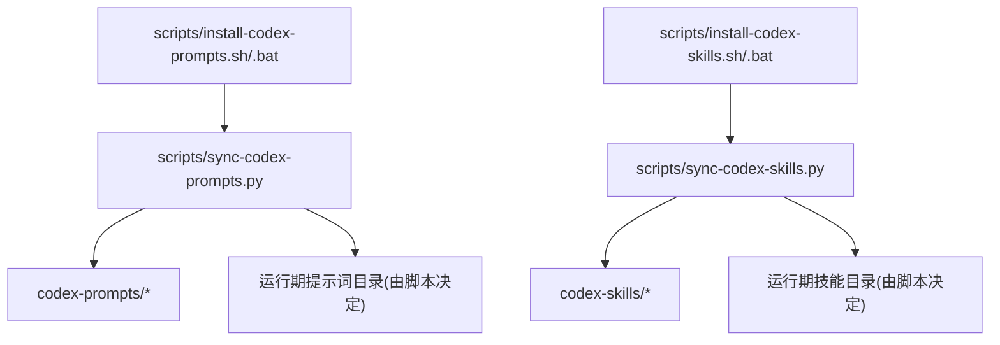
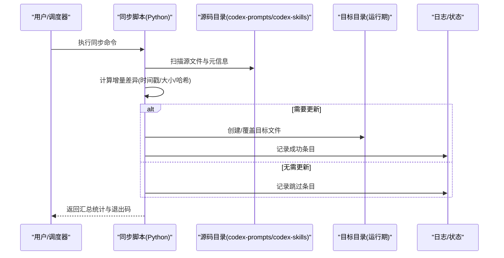
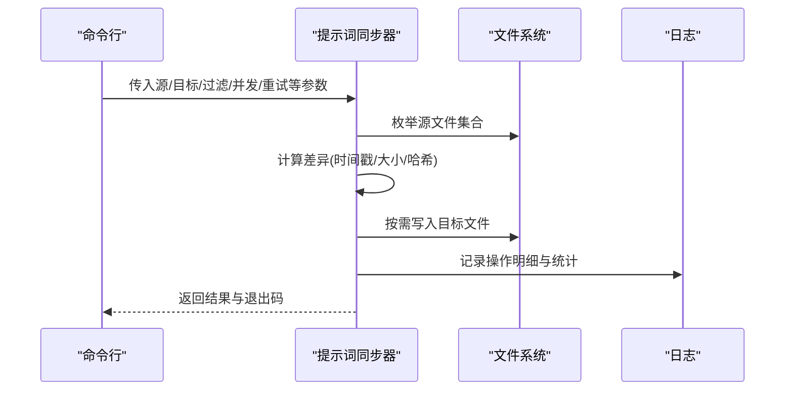
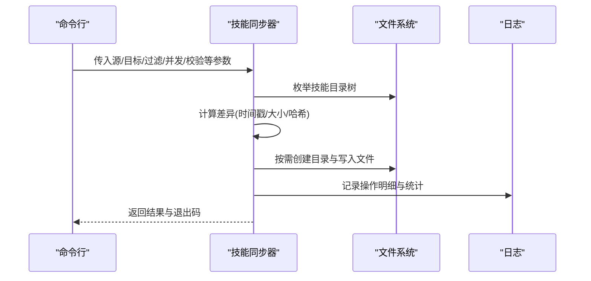
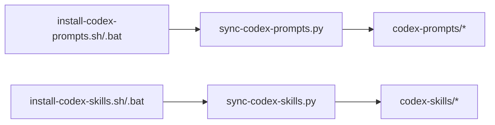

# 同步自动化

<cite>
**本文引用的文件**   
- [scripts/sync-codex-prompts.py](file://scripts/sync-codex-prompts.py)
- [scripts/sync-codex-skills.py](file://scripts/sync-codex-skills.py)
- [scripts/install-codex-prompts.sh](file://scripts/install-codex-prompts.sh)
- [scripts/install-codex-prompts.bat](file://scripts/install-codex-prompts.bat)
- [scripts/install-codex-skills.sh](file://scripts/install-codex-skills.sh)
- [scripts/install-codex-skills.bat](file://scripts/install-codex-skills.bat)
- [codex-prompts/bottleneck-hunter.md](file://codex-prompts/bottleneck-hunter.md)
- [codex-skills/bottleneck-hunter/SKILL.md](file://codex-skills/bottleneck-hunter/SKILL.md)
</cite>

## 目录
1. [简介](#简介)
2. [项目结构](#项目结构)
3. [核心组件](#核心组件)
4. [架构总览](#架构总览)
5. [详细组件分析](#详细组件分析)
6. [依赖关系分析](#依赖关系分析)
7. [性能考虑](#性能考虑)
8. [故障排查指南](#故障排查指南)
9. [结论](#结论)
10. [附录](#附录)

## 简介
本技术文档围绕仓库中的“提示词同步”和“技能同步”两个自动化脚本展开，系统性说明其工作原理、实现机制与使用方式。内容涵盖：
- 数据源配置与目标路径设置
- 增量同步策略与冲突解决机制
- 日志记录、错误重试与状态跟踪
- 大规模同步的性能优化与监控方案
- 失败恢复策略与手动干预方法

该体系以Python脚本为核心，配合Shell/批处理安装脚本，将版本化资源（提示词与技能）从源码目录同步到运行时目录，确保多环境一致性与可重复部署。

## 项目结构
与同步自动化直接相关的代码与资源分布如下：
- Python同步脚本位于 scripts 目录
- 安装/初始化脚本（Shell/Bat）位于 scripts 目录
- 提示词资源位于 codex-prompts 目录
- 技能资源位于 codex-skills 目录

图表来源
- [scripts/sync-codex-prompts.py](file://scripts/sync-codex-prompts.py)
- [scripts/sync-codex-skills.py](file://scripts/sync-codex-skills.py)
- [scripts/install-codex-prompts.sh](file://scripts/install-codex-prompts.sh)
- [scripts/install-codex-prompts.bat](file://scripts/install-codex-prompts.bat)
- [scripts/install-codex-skills.sh](file://scripts/install-codex-skills.sh)
- [scripts/install-codex-skills.bat](file://scripts/install-codex-skills.bat)

章节来源
- [scripts/sync-codex-prompts.py](file://scripts/sync-codex-prompts.py)
- [scripts/sync-codex-skills.py](file://scripts/sync-codex-skills.py)
- [scripts/install-codex-prompts.sh](file://scripts/install-codex-prompts.sh)
- [scripts/install-codex-prompts.bat](file://scripts/install-codex-prompts.bat)
- [scripts/install-codex-skills.sh](file://scripts/install-codex-skills.sh)
- [scripts/install-codex-skills.bat](file://scripts/install-codex-skills.bat)

## 核心组件
- 提示词同步器：负责将 codex-prompts 下的提示词资源同步至目标目录，支持增量更新与幂等写入。
- 技能同步器：负责将 codex-skills 下的技能资源（含子目录与SKILL.md）同步至目标目录，保持目录结构与文件一致性。
- 安装脚本：封装调用逻辑，提供跨平台一键安装能力，并输出标准化日志。

章节来源
- [scripts/sync-codex-prompts.py](file://scripts/sync-codex-prompts.py)
- [scripts/sync-codex-skills.py](file://scripts/sync-codex-skills.py)
- [scripts/install-codex-prompts.sh](file://scripts/install-codex-prompts.sh)
- [scripts/install-codex-skills.sh](file://scripts/install-codex-skills.sh)

## 架构总览
整体流程为“读取源 -> 计算差异 -> 执行写入 -> 记录状态”。

图表来源
- [scripts/sync-codex-prompts.py](file://scripts/sync-codex-prompts.py)
- [scripts/sync-codex-skills.py](file://scripts/sync-codex-skills.py)

## 详细组件分析

### 提示词同步器（sync-codex-prompts.py）
- 功能要点
  - 遍历 codex-prompts 目录，识别所有提示词文件
  - 基于时间戳或文件大小进行增量判断；必要时采用内容哈希校验
  - 在目标目录下重建相同相对路径，避免覆盖无关文件
  - 记录每次同步的统计信息（新增、更新、跳过、失败）
- 关键参数（建议）
  - 源路径：指向 codex-prompts
  - 目标路径：指向运行期提示词目录
  - 过滤规则：按扩展名或文件名前缀匹配
  - 并发度：控制并行复制线程数
  - 重试次数与退避间隔：用于网络或文件系统异常
  - 日志级别与输出路径：便于审计与排障
- 冲突解决
  - 默认策略：以源为准覆盖目标
  - 可选策略：若目标存在且未被标记为“锁定”，则比较后决定是否覆盖
- 幂等性
  - 通过差异检测保证多次执行不会产生多余写入
- 典型调用序列

图表来源
- [scripts/sync-codex-prompts.py](file://scripts/sync-codex-prompts.py)

章节来源
- [scripts/sync-codex-prompts.py](file://scripts/sync-codex-prompts.py)

### 技能同步器（sync-codex-skills.py）
- 功能要点
  - 递归遍历 codex-skills 下各技能目录
  - 保留目录层级结构，确保 SKILL.md 与相关资源一并同步
  - 对大目录场景采用分片与并发策略提升吞吐
- 关键参数（建议）
  - 源路径：指向 codex-skills
  - 目标路径：指向运行期技能目录
  - 包含/排除模式：按目录名或文件类型过滤
  - 并发度与队列长度：平衡I/O与CPU占用
  - 校验开关：是否启用内容哈希比对
- 冲突解决
  - 当目标目录已存在同名文件时，依据差异检测结果决定是否覆盖
  - 对于删除场景，可选择是否清理目标中不再存在于源的冗余文件
- 典型调用序列

图表来源
- [scripts/sync-codex-skills.py](file://scripts/sync-codex-skills.py)

章节来源
- [scripts/sync-codex-skills.py](file://scripts/sync-codex-skills.py)

### 安装脚本（install-codex-prompts.sh/.bat 与 install-codex-skills.sh/.bat）
- 作用
  - 封装Python同步脚本的调用，统一参数与环境变量
  - 提供跨平台入口，简化运维与CI集成
- 行为
  - 解析环境变量或配置文件中的源/目标路径
  - 调用对应Python脚本并透传参数
  - 输出结构化日志，便于集中采集

章节来源
- [scripts/install-codex-prompts.sh](file://scripts/install-codex-prompts.sh)
- [scripts/install-codex-prompts.bat](file://scripts/install-codex-prompts.bat)
- [scripts/install-codex-skills.sh](file://scripts/install-codex-skills.sh)
- [scripts/install-codex-skills.bat](file://scripts/install-codex-skills.bat)

### 示例资源
- 提示词示例：bottleneck-hunter.md
- 技能示例：bottleneck-hunter/SKILL.md

章节来源
- [codex-prompts/bottleneck-hunter.md](file://codex-prompts/bottleneck-hunter.md)
- [codex-skills/bottleneck-hunter/SKILL.md](file://codex-skills/bottleneck-hunter/SKILL.md)

## 依赖关系分析
- 外部依赖
  - Python标准库（文件I/O、路径处理、并发、日志）
  - 操作系统命令（安装脚本调用Python解释器）
- 内部耦合
  - 安装脚本仅作为调用壳，核心逻辑集中在Python脚本
  - 同步脚本之间相互独立，分别维护各自的源/目标映射

图表来源
- [scripts/install-codex-prompts.sh](file://scripts/install-codex-prompts.sh)
- [scripts/install-codex-prompts.bat](file://scripts/install-codex-prompts.bat)
- [scripts/install-codex-skills.sh](file://scripts/install-codex-skills.sh)
- [scripts/install-codex-skills.bat](file://scripts/install-codex-skills.bat)
- [scripts/sync-codex-prompts.py](file://scripts/sync-codex-prompts.py)
- [scripts/sync-codex-skills.py](file://scripts/sync-codex-skills.py)

章节来源
- [scripts/sync-codex-prompts.py](file://scripts/sync-codex-prompts.py)
- [scripts/sync-codex-skills.py](file://scripts/sync-codex-skills.py)
- [scripts/install-codex-prompts.sh](file://scripts/install-codex-prompts.sh)
- [scripts/install-codex-skills.sh](file://scripts/install-codex-skills.sh)

## 性能考虑
- 增量同步
  - 优先使用时间戳与文件大小判断，减少不必要的I/O
  - 对关键文件启用内容哈希校验，保障一致性
- 并发与批处理
  - 合理设置并发度，避免磁盘争用导致抖动
  - 对超大目录采用分片与队列限流
- 缓存与去重
  - 对相同内容的文件进行去重，降低重复写入
- 监控指标
  - 同步耗时、吞吐（文件数/秒）、失败率、重试次数
  - 差异比例（新增/更新/跳过）
- 存储优化
  - 目标目录使用高效文件系统（如本地SSD）
  - 避免频繁小文件写入，必要时合并打包再解压

[本节为通用指导，不直接分析具体文件]

## 故障排查指南
- 常见问题
  - 权限不足：检查目标目录写权限
  - 路径不存在：确认源/目标路径正确且存在
  - 文件被占用：Windows下常见，等待释放或重启进程
  - 网络/远程盘延迟：增大超时与重试间隔
- 日志定位
  - 查看安装脚本与Python脚本输出的结构化日志
  - 关注失败条目与堆栈信息，定位具体文件与操作阶段
- 恢复策略
  - 断点续传：基于差异检测自动跳过已完成项
  - 回滚：保留上一版本快照，失败时快速回滚
  - 人工干预：对个别文件进行手动修复后重新执行增量同步
- 重试与退避
  - 指数退避避免雪崩
  - 最大重试次数限制，防止无限循环

章节来源
- [scripts/install-codex-prompts.sh](file://scripts/install-codex-prompts.sh)
- [scripts/install-codex-skills.sh](file://scripts/install-codex-skills.sh)
- [scripts/sync-codex-prompts.py](file://scripts/sync-codex-prompts.py)
- [scripts/sync-codex-skills.py](file://scripts/sync-codex-skills.py)

## 结论
本同步自动化体系通过清晰的职责划分与幂等设计，实现了提示词与技能的稳定、可观测、可扩展同步。结合增量策略、并发优化与完善的日志与重试机制，可在大规模数据场景下保持高可用与高性能。建议在CI/CD中集成安装脚本，并结合监控告警形成闭环运维。

[本节为总结性内容，不直接分析具体文件]

## 附录

### 配置参考（字段说明）
以下为常用配置项说明，实际键名以脚本实现为准：
- 源路径：提示词或技能的源码根目录
- 目标路径：运行期资源目录
- 过滤规则：包含/排除的文件或目录模式
- 并发度：并行任务数量
- 校验开关：是否启用内容哈希校验
- 重试次数与退避间隔：失败重试策略
- 日志级别与输出路径：调试与审计所需

章节来源
- [scripts/sync-codex-prompts.py](file://scripts/sync-codex-prompts.py)
- [scripts/sync-codex-skills.py](file://scripts/sync-codex-skills.py)

### 使用示例（步骤）
- 首次安装
  - 执行安装脚本，指定源/目标路径
  - 验证目标目录结构与文件完整性
- 日常同步
  - 定时触发安装脚本或Python脚本
  - 观察日志输出与统计信息
- 故障恢复
  - 根据日志定位失败条目
  - 修正问题后再次执行增量同步

章节来源
- [scripts/install-codex-prompts.sh](file://scripts/install-codex-prompts.sh)
- [scripts/install-codex-skills.sh](file://scripts/install-codex-skills.sh)