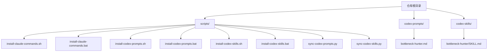
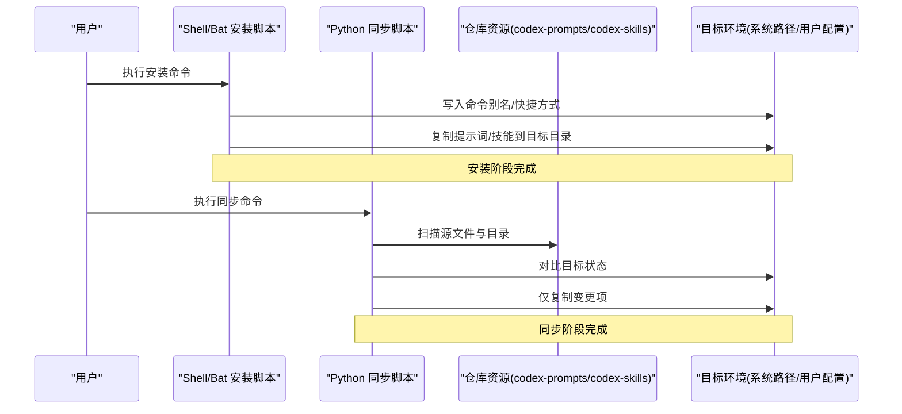
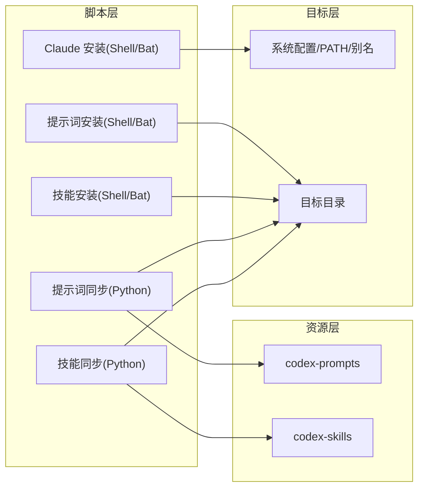

# 安装部署脚本

<cite>
**本文引用的文件**   
- [scripts/install-claude-commands.sh](file://scripts/install-claude-commands.sh)
- [scripts/install-claude-commands.bat](file://scripts/install-claude-commands.bat)
- [scripts/install-codex-prompts.sh](file://scripts/install-codex-prompts.sh)
- [scripts/install-codex-prompts.bat](file://scripts/install-codex-prompts.bat)
- [scripts/install-codex-skills.sh](file://scripts/install-codex-skills.sh)
- [scripts/install-codex-skills.bat](file://scripts/install-codex-skills.bat)
- [scripts/sync-codex-prompts.py](file://scripts/sync-codex-prompts.py)
- [scripts/sync-codex-skills.py](file://scripts/sync-codex-skills.py)
- [codex-prompts/bottleneck-hunter.md](file://codex-prompts/bottleneck-hunter.md)
- [codex-skills/bottleneck-hunter/SKILL.md](file://codex-skills/bottleneck-hunter/SKILL.md)
</cite>

## 目录
1. [简介](#简介)
2. [项目结构](#项目结构)
3. [核心组件](#核心组件)
4. [架构总览](#架构总览)
5. [详细组件分析](#详细组件分析)
6. [依赖关系分析](#依赖关系分析)
7. [性能考虑](#性能考虑)
8. [故障排除指南](#故障排除指南)
9. [结论](#结论)
10. [附录](#附录)

## 简介
本仓库提供一套面向 Claude 命令与 Codex 技能/提示词的安装与同步脚本，覆盖 Windows 与 Linux/macOS 平台。通过统一的脚本入口，用户可完成以下自动化流程：
- 安装 Claude 命令（CLI 快捷方式或别名）
- 部署 Codex 提示词（将 codex-prompts 内容复制到目标位置）
- 部署 Codex 技能（将 codex-skills 内容复制到目标位置）
- 增量同步提示词与技能（对比源与目标后仅更新变更项）

这些脚本旨在简化多环境、多用户的批量部署与企业级集成，并提供跨平台的执行体验。

## 项目结构
与安装部署相关的脚本集中在 scripts 目录下，同时包含两类资源目录：
- codex-prompts：存放提示词模板（Markdown 文档）
- codex-skills：存放技能定义（每个技能一个目录，内含 SKILL.md 等）

图表来源
- [scripts/install-claude-commands.sh](file://scripts/install-claude-commands.sh)
- [scripts/install-claude-commands.bat](file://scripts/install-claude-commands.bat)
- [scripts/install-codex-prompts.sh](file://scripts/install-codex-prompts.sh)
- [scripts/install-codex-prompts.bat](file://scripts/install-codex-prompts.bat)
- [scripts/install-codex-skills.sh](file://scripts/install-codex-skills.sh)
- [scripts/install-codex-skills.bat](file://scripts/install-codex-skills.bat)
- [scripts/sync-codex-prompts.py](file://scripts/sync-codex-prompts.py)
- [scripts/sync-codex-skills.py](file://scripts/sync-codex-skills.py)
- [codex-prompts/bottleneck-hunter.md](file://codex-prompts/bottleneck-hunter.md)
- [codex-skills/bottleneck-hunter/SKILL.md](file://codex-skills/bottleneck-hunter/SKILL.md)

章节来源
- [scripts/install-claude-commands.sh](file://scripts/install-claude-commands.sh)
- [scripts/install-claude-commands.bat](file://scripts/install-claude-commands.bat)
- [scripts/install-codex-prompts.sh](file://scripts/install-codex-prompts.sh)
- [scripts/install-codex-prompts.bat](file://scripts/install-codex-prompts.bat)
- [scripts/install-codex-skills.sh](file://scripts/install-codex-skills.sh)
- [scripts/install-codex-skills.bat](file://scripts/install-codex-skills.bat)
- [scripts/sync-codex-prompts.py](file://scripts/sync-codex-prompts.py)
- [scripts/sync-codex-skills.py](file://scripts/sync-codex-skills.py)
- [codex-prompts/bottleneck-hunter.md](file://codex-prompts/bottleneck-hunter.md)
- [codex-skills/bottleneck-hunter/SKILL.md](file://codex-skills/bottleneck-hunter/SKILL.md)

## 核心组件
- Claude 命令安装脚本（Shell/Bat）
  - 功能：在目标环境中创建 Claude CLI 的快捷方式或别名，便于从任意路径调用。
  - 平台：Linux/macOS 使用 Shell 脚本；Windows 使用批处理脚本。
- Codex 提示词安装脚本（Shell/Bat）
  - 功能：将 codex-prompts 下的提示词文件复制到目标目录，支持覆盖策略与选择性跳过。
  - 平台：Linux/macOS 使用 Shell 脚本；Windows 使用批处理脚本。
- Codex 技能安装脚本（Shell/Bat）
  - 功能：将 codex-skills 下的技能目录结构复制到目标目录，保持层级一致。
  - 平台：Linux/macOS 使用 Shell 脚本；Windows 使用批处理脚本。
- 同步脚本（Python）
  - 功能：对提示词与技能进行增量同步，比较源与目标差异，仅复制变更项，减少不必要操作。
  - 平台：需要 Python 运行环境。

章节来源
- [scripts/install-claude-commands.sh](file://scripts/install-claude-commands.sh)
- [scripts/install-claude-commands.bat](file://scripts/install-claude-commands.bat)
- [scripts/install-codex-prompts.sh](file://scripts/install-codex-prompts.sh)
- [scripts/install-codex-prompts.bat](file://scripts/install-codex-prompts.bat)
- [scripts/install-codex-skills.sh](file://scripts/install-codex-skills.sh)
- [scripts/install-codex-skills.bat](file://scripts/install-codex-skills.bat)
- [scripts/sync-codex-prompts.py](file://scripts/sync-codex-prompts.py)
- [scripts/sync-codex-skills.py](file://scripts/sync-codex-skills.py)

## 架构总览
整体流程分为“一次性安装”和“持续同步”两条主线：
- 一次性安装：分别执行 Claude 命令安装、Codex 提示词安装、Codex 技能安装，完成基础环境准备。
- 持续同步：定期或按需运行同步脚本，确保本地环境与仓库保持一致。

图表来源
- [scripts/install-claude-commands.sh](file://scripts/install-claude-commands.sh)
- [scripts/install-claude-commands.bat](file://scripts/install-claude-commands.bat)
- [scripts/install-codex-prompts.sh](file://scripts/install-codex-prompts.sh)
- [scripts/install-codex-prompts.bat](file://scripts/install-codex-prompts.bat)
- [scripts/install-codex-skills.sh](file://scripts/install-codex-skills.sh)
- [scripts/install-codex-skills.bat](file://scripts/install-codex-skills.bat)
- [scripts/sync-codex-prompts.py](file://scripts/sync-codex-prompts.py)
- [scripts/sync-codex-skills.py](file://scripts/sync-codex-skills.py)

## 详细组件分析

### Claude 命令安装脚本
- 职责
  - 检测当前平台并选择对应实现（Shell 或 Bat）。
  - 在目标环境中注册 Claude CLI 的调用方式（如 shell alias、profile 配置或 Windows 快捷方式）。
  - 提供参数控制是否覆盖已有配置、是否静默执行、是否输出日志等。
- 关键行为
  - 参数解析：支持自定义安装路径、目标配置文件、是否强制覆盖等。
  - 权限检查：在需要写系统路径时提示以管理员/root 权限运行。
  - 回滚机制：若写入失败，尝试恢复原配置或保留备份。
- 错误处理
  - 捕获常见错误（路径不存在、权限不足、目标文件被占用），给出明确提示与修复建议。
- 平台差异
  - Linux/macOS：通常写入 ~/.bashrc、~/.zshrc 或 /etc/profile.d/ 等。
  - Windows：可能写入环境变量 PATH、创建 .bat/.cmd 快捷方式或注册表项。

章节来源
- [scripts/install-claude-commands.sh](file://scripts/install-claude-commands.sh)
- [scripts/install-claude-commands.bat](file://scripts/install-claude-commands.bat)

### Codex 提示词安装脚本
- 职责
  - 将 codex-prompts 下的所有提示词文件复制到目标目录。
  - 支持按名称过滤、版本标记、覆盖策略等选项。
- 关键行为
  - 参数解析：支持指定目标目录、是否跳过已存在文件、是否生成清单等。
  - 一致性校验：可选计算文件哈希，避免重复复制。
  - 日志记录：记录复制结果与异常信息。
- 错误处理
  - 针对不可写目录、文件名冲突、编码问题等进行友好提示。
- 平台差异
  - Linux/macOS：使用 cp/rsync 等工具。
  - Windows：使用 xcopy/robocopy 等工具。

章节来源
- [scripts/install-codex-prompts.sh](file://scripts/install-codex-prompts.sh)
- [scripts/install-codex-prompts.bat](file://scripts/install-codex-prompts.bat)
- [codex-prompts/bottleneck-hunter.md](file://codex-prompts/bottleneck-hunter.md)

### Codex 技能安装脚本
- 职责
  - 将 codex-skills 下的技能目录完整复制到目标目录，保持层级结构。
  - 支持选择性安装特定技能、忽略某些目录等。
- 关键行为
  - 参数解析：支持目标目录、白名单/黑名单、是否清理旧版本等。
  - 结构验证：确保每个技能目录包含必要的元数据（如 SKILL.md）。
  - 幂等性：多次执行不会产生重复副本。
- 错误处理
  - 针对权限、路径过长、符号链接等问题进行处理与提示。
- 平台差异
  - Linux/macOS：递归复制并保持权限。
  - Windows：注意路径长度限制与大小写敏感性。

章节来源
- [scripts/install-codex-skills.sh](file://scripts/install-codex-skills.sh)
- [scripts/install-codex-skills.bat](file://scripts/install-codex-skills.bat)
- [codex-skills/bottleneck-hunter/SKILL.md](file://codex-skills/bottleneck-hunter/SKILL.md)

### 同步脚本（提示词与技能）
- 职责
  - 对比仓库源与目标环境的差异，仅复制变更项，提升效率。
  - 支持断点续传、并发复制、失败重试等高级特性。
- 关键行为
  - 参数解析：支持源/目标路径、增量模式、并发度、日志级别等。
  - 差异算法：基于文件列表与哈希比对，识别新增、修改、删除项。
  - 事务性：在批量复制过程中保证原子性，失败时可回滚。
- 错误处理
  - 网络/磁盘 I/O 异常重试、超时处理、部分失败报告。
- 平台差异
  - 统一由 Python 实现，跨平台一致；需确保 Python 解释器可用。

章节来源
- [scripts/sync-codex-prompts.py](file://scripts/sync-codex-prompts.py)
- [scripts/sync-codex-skills.py](file://scripts/sync-codex-skills.py)

## 依赖关系分析
- 平台依赖
  - Shell 脚本：依赖 Bash/Zsh（Linux/macOS）、PowerShell/CMD（Windows）。
  - Python 脚本：依赖 Python 3.x 运行时。
- 外部工具
  - 文件复制工具：cp/rsync（Linux/macOS）、xcopy/robocopy（Windows）。
  - 文件系统：具备读写权限的目标目录。
- 组件耦合
  - 安装脚本与同步脚本相对独立，前者负责初始部署，后者负责持续维护。
  - 资源目录（codex-prompts、codex-skills）为只读输入，不随脚本执行而改变。

图表来源
- [scripts/install-claude-commands.sh](file://scripts/install-claude-commands.sh)
- [scripts/install-claude-commands.bat](file://scripts/install-claude-commands.bat)
- [scripts/install-codex-prompts.sh](file://scripts/install-codex-prompts.sh)
- [scripts/install-codex-prompts.bat](file://scripts/install-codex-prompts.bat)
- [scripts/install-codex-skills.sh](file://scripts/install-codex-skills.sh)
- [scripts/install-codex-skills.bat](file://scripts/install-codex-skills.bat)
- [scripts/sync-codex-prompts.py](file://scripts/sync-codex-prompts.py)
- [scripts/sync-codex-skills.py](file://scripts/sync-codex-skills.py)

## 性能考虑
- 增量同步优先：使用 Python 同步脚本进行差异比对，避免全量复制带来的 I/O 压力。
- 并发复制：在同步脚本中合理设置并发度，平衡 CPU 与磁盘 I/O。
- 缓存与去重：对大文件采用哈希校验，避免重复传输。
- 日志分级：生产环境降低日志级别，减少磁盘写入开销。
- 批处理优化：在企业级批量部署中，结合任务队列与并行作业，缩短总体耗时。

## 故障排除指南
- 常见问题
  - 权限不足：在 Linux/macOS 下使用 sudo，或在 Windows 下以管理员身份运行。
  - 路径不存在：确认目标目录存在且可写，必要时先创建目录。
  - 文件被占用：关闭占用文件的进程后再执行安装/同步。
  - 编码问题：确保终端与编辑器使用 UTF-8 编码。
- 定位方法
  - 查看脚本输出的错误信息与日志文件。
  - 手动验证目标目录结构与权限。
  - 使用 diff 工具对比源与目标差异。
- 回滚步骤
  - 若安装失败，根据脚本生成的备份恢复原配置。
  - 对于同步失败，重新运行同步脚本，利用其事务性与重试机制。

章节来源
- [scripts/install-claude-commands.sh](file://scripts/install-claude-commands.sh)
- [scripts/install-claude-commands.bat](file://scripts/install-claude-commands.bat)
- [scripts/install-codex-prompts.sh](file://scripts/install-codex-prompts.sh)
- [scripts/install-codex-prompts.bat](file://scripts/install-codex-prompts.bat)
- [scripts/install-codex-skills.sh](file://scripts/install-codex-skills.sh)
- [scripts/install-codex-skills.bat](file://scripts/install-codex-skills.bat)
- [scripts/sync-codex-prompts.py](file://scripts/sync-codex-prompts.py)
- [scripts/sync-codex-skills.py](file://scripts/sync-codex-skills.py)

## 结论
本套安装部署脚本提供了跨平台的 Claude 命令与 Codex 资源管理能力，兼顾一次性安装与持续同步需求。通过参数化配置与错误处理机制，能够满足个人用户与企业级批量部署场景。建议在正式环境中启用增量同步与日志审计，并结合 CI/CD 流水线实现自动化运维。

## 附录
- 最佳实践
  - 企业级集成：将脚本纳入配置管理工具（如 Ansible、Chef、Puppet），统一管理目标环境。
  - 安全加固：最小权限原则，仅授予必要目录的写权限；敏感配置使用密钥管理。
  - 版本控制：为每次安装/同步生成版本号与变更清单，便于追踪与回滚。
  - 监控告警：对同步失败与权限异常设置告警，及时介入处理。
- 参考资源
  - 提示词示例：[codex-prompts/bottleneck-hunter.md](file://codex-prompts/bottleneck-hunter.md)
  - 技能示例：[codex-skills/bottleneck-hunter/SKILL.md](file://codex-skills/bottleneck-hunter/SKILL.md)