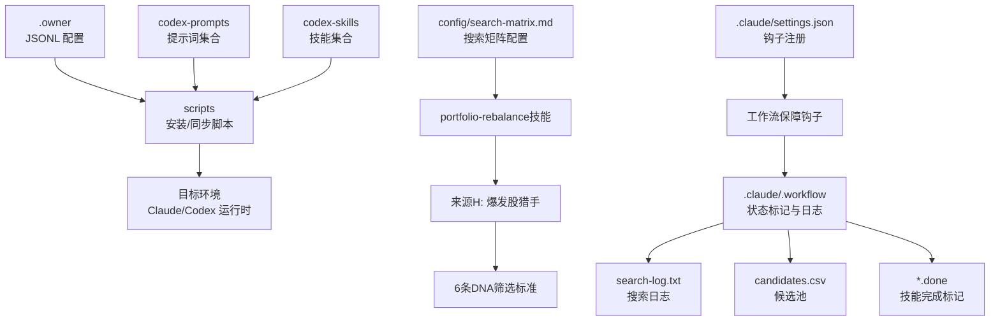
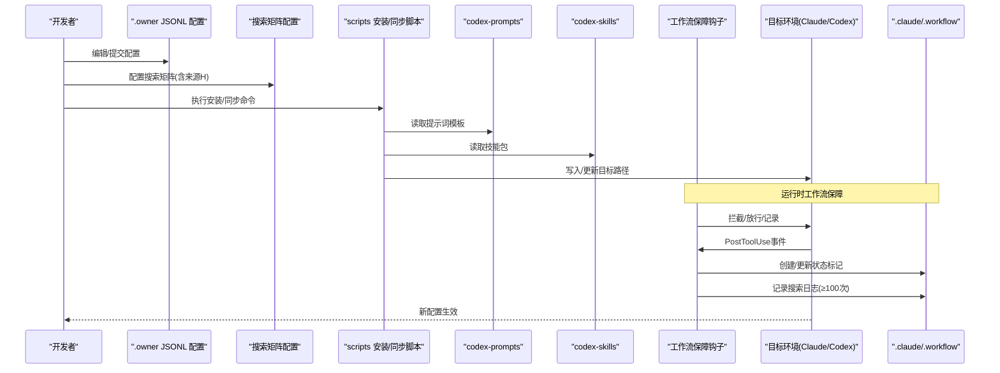
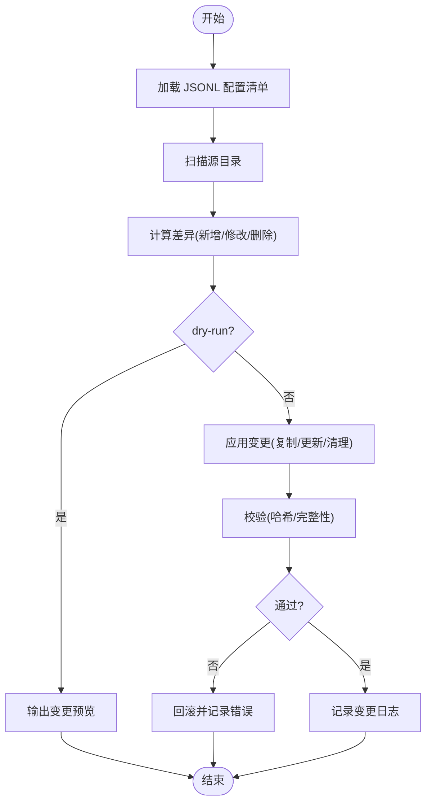
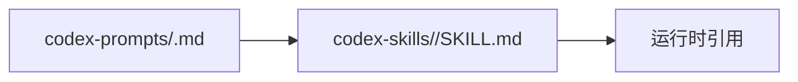
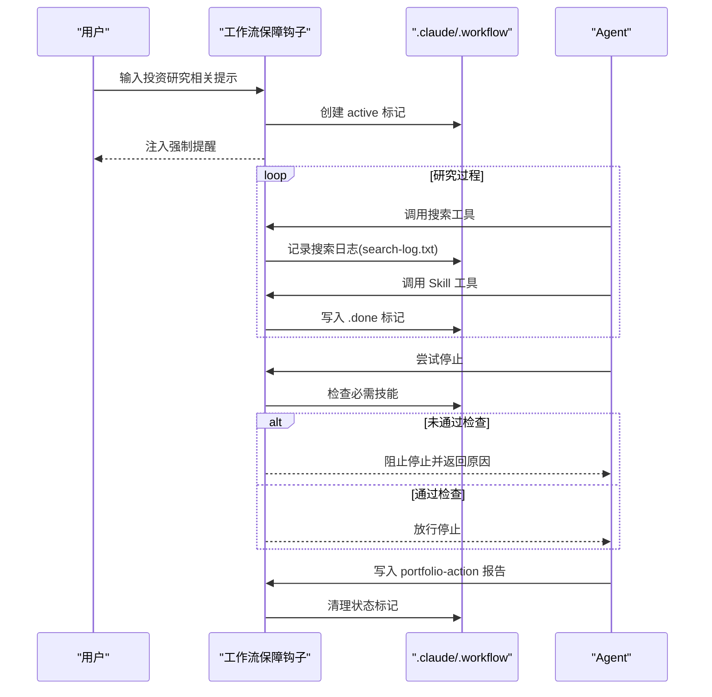
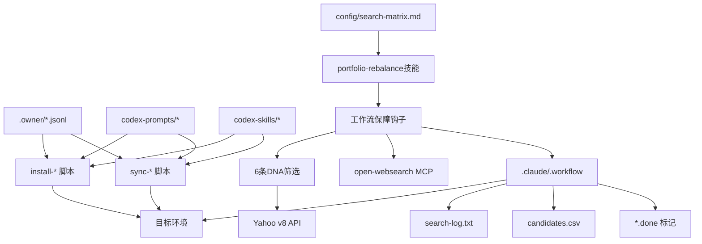

# 配置管理

<cite>
**本文引用的文件**
- [.owner/subagent-dispatch-026-08-08.jsonl](file://.owner/subagent-dispatch-026-08-08.jsonl)
- [scripts/workflow-gate-hook.sh](file://scripts/workflow-gate-hook.sh)
- [scripts/skill-enforcement-hook.sh](file://scripts/skill-enforcement-hook.sh)
- [scripts/search-tracker-hook.sh](file://scripts/search-tracker-hook.sh)
- [scripts/skill-tracker-hook.sh](file://scripts/skill-tracker-hook.sh)
- [scripts/workflow-cleanup-hook.sh](file://scripts/workflow-cleanup-hook.sh)
- [scripts/install-claude-commands.sh](file://scripts/install-claude-commands.sh)
- [scripts/install-codex-prompts.sh](file://scripts/install-codex-prompts.sh)
- [scripts/install-codex-skills.sh](file://scripts/install-codex-skills.sh)
- [scripts/sync-codex-prompts.py](file://scripts/sync-codex-prompts.py)
- [scripts/sync-codex-skills.py](file://scripts/sync-codex-skills.py)
- [codex-prompts/bottleneck-hunter.md](file://codex-prompts/bottleneck-hunter.md)
- [codex-skills/bottleneck-hunter/SKILL.md](file://codex-skills/bottleneck-hunter/SKILL.md)
- [.claude/settings.json](file://.claude/settings.json)
- [config/search-matrix.md](file://config/search-matrix.md)
- [codex-skills/portfolio-rebalance/SKILL.md](file://codex-skills/portfolio-rebalance/SKILL.md)
</cite>

## 更新摘要
**变更内容**
- **v5.0重构核心变更**：搜索矩阵配置新增来源H（爆发股猎手），包含6条DNA筛选标准（收入增速≥100%/盈利拐点/市值$3-50B/赛道纯正/积压可见/覆盖不足）
- **搜索总量要求提升**：从≥80次提升至≥100次，确保更全面的搜索覆盖度
- **爆发股猎手机制**：通过open-websearch MCP执行4轮×≥20次全网扫描，寻找早期爆发标的
- **工作流关卡增强**：workflow-gate-hook.sh中搜索总量检查阈值从80提升至100次
- **候选来源扩展**：8路并行候选来源A-H，其中H为必选爆发股猎手来源

## 目录
1. [简介](#简介)
2. [项目结构](#项目结构)
3. [核心组件](#核心组件)
4. [架构总览](#架构总览)
5. [详细组件分析](#详细组件分析)
6. [依赖关系分析](#依赖关系分析)
7. [性能考虑](#性能考虑)
8. [故障排查指南](#故障排查指南)
9. [结论](#结论)
10. [附录](#附录)

## 简介
本技术文档面向配置管理系统，聚焦于 JSONL 配置文件与安装/同步脚本的协同工作，并新增工作流执行保障系统。内容涵盖：
- JSONL 配置文件的结构与语法（技能调度、子代理调度、环境变量等）
- 安装脚本的功能与使用方法（Claude 命令安装、Codex 技能部署、提示词同步）
- **v5.0重构**：爆发股猎手搜索矩阵配置与6条DNA筛选标准
- 工作流执行保障：通过钩子强制必需技能执行、搜索多样性与候选数量门槛
- 版本管理与迁移策略
- 定制与扩展配置选项的方法
- 常见问题排查与性能优化建议
- 完整示例与最佳实践，确保系统稳定运行与高效配置

## 项目结构
仓库中与配置管理直接相关的核心位置包括：
- .owner 目录：存放 JSONL 形式的调度配置（子代理调度）
- scripts 目录：包含安装与同步脚本（Shell/Python），以及工作流执行保障钩子
- codex-prompts 与 codex-skills 目录：存放提示词与技能定义，供脚本同步到目标环境
- .claude 目录：存放 Claude 运行时配置与钩子注册
- config 目录：存放搜索矩阵配置等参数文件

**图表来源**
- [.owner/subagent-dispatch-026-08-08.jsonl](file://.owner/subagent-dispatch-026-08-08.jsonl)
- [scripts/install-claude-commands.sh](file://scripts/install-claude-commands.sh)
- [scripts/install-codex-prompts.sh](file://scripts/install-codex-prompts.sh)
- [scripts/install-codex-skills.sh](file://scripts/install-codex-skills.sh)
- [scripts/sync-codex-prompts.py](file://scripts/sync-codex-prompts.py)
- [scripts/sync-codex-skills.py](file://scripts/sync-codex-skills.py)
- [scripts/workflow-gate-hook.sh](file://scripts/workflow-gate-hook.sh)
- [scripts/skill-enforcement-hook.sh](file://scripts/skill-enforcement-hook.sh)
- [scripts/search-tracker-hook.sh](file://scripts/search-tracker-hook.sh)
- [scripts/skill-tracker-hook.sh](file://scripts/skill-tracker-hook.sh)
- [scripts/workflow-cleanup-hook.sh](file://scripts/workflow-cleanup-hook.sh)
- [.claude/settings.json](file://.claude/settings.json)
- [config/search-matrix.md](file://config/search-matrix.md)
- [codex-skills/portfolio-rebalance/SKILL.md](file://codex-skills/portfolio-rebalance/SKILL.md)

**章节来源**
- [.owner/subagent-dispatch-026-08-08.jsonl](file://.owner/subagent-dispatch-026-08-08.jsonl)
- [scripts/install-claude-commands.sh](file://scripts/install-claude-commands.sh)
- [scripts/install-codex-prompts.sh](file://scripts/install-codex-prompts.sh)
- [scripts/install-codex-skills.sh](file://scripts/install-codex-skills.sh)
- [scripts/sync-codex-prompts.py](file://scripts/sync-codex-prompts.py)
- [scripts/sync-codex-skills.py](file://scripts/sync-codex-skills.py)
- [scripts/workflow-gate-hook.sh](file://scripts/workflow-gate-hook.sh)
- [scripts/skill-enforcement-hook.sh](file://scripts/skill-enforcement-hook.sh)
- [scripts/search-tracker-hook.sh](file://scripts/search-tracker-hook.sh)
- [scripts/skill-tracker-hook.sh](file://scripts/skill-tracker-hook.sh)
- [scripts/workflow-cleanup-hook.sh](file://scripts/workflow-cleanup-hook.sh)
- [.claude/settings.json](file://.claude/settings.json)
- [config/search-matrix.md](file://config/search-matrix.md)

## 核心组件
本节从"配置即数据"的角度，梳理 JSONL 配置项与脚本职责边界，帮助读者快速理解系统如何被驱动。

- JSONL 配置（.owner 目录）
  - 子代理调度配置：描述子代理身份、能力范围、路由规则、资源配额等，记录于 .owner/subagent-dispatch-*.jsonl
  - 典型字段（概念性说明）：ts、tool、feature、subagent_type、agent_id、description、prompt_preview、captured_by
  - 环境变量设置：集中声明密钥、端点、超时、重试等运行时参数，便于多环境复用
- 安装脚本（scripts 目录）
  - Claude 命令安装：将本地命令或快捷方式安装至用户环境，便于 CLI 调用
  - Codex 提示词安装：将 codex-prompts 下的模板复制到目标路径
  - Codex 技能安装：将 codex-skills 下的技能包复制到目标路径
- 同步脚本（scripts 目录）
  - 提示词同步：增量对比源与目标，仅更新变更项，避免全量覆盖
  - 技能同步：按技能清单进行差异比对与选择性更新，支持回滚标记
- 工作流执行保障（scripts 目录）
  - Skill 执行铁律：在用户输入触发投资研究时自动注入强制提醒与工作流激活
  - 搜索追踪：每次搜索工具调用后记录到 search-log.txt，支持搜索总量验证
  - 技能追踪：每次 Skill 调用后写入 .done 标记文件，记录 skill 名称、参数与时间戳
  - 工作流关卡：在 Agent 尝试停止时检查必需技能是否全部执行，未通过则阻止结束
  - 工作流清理：当 portfolio-action 报告写入后清理 .done 标记、active 状态与搜索日志
- **v5.0新增：搜索矩阵配置**
  - 搜索总量要求从≥80次提升至≥100次
  - 新增来源H（爆发股猎手）作为必选候选来源
  - 6条DNA筛选标准确保高质量候选发现

**章节来源**
- [.owner/subagent-dispatch-026-08-08.jsonl](file://.owner/subagent-dispatch-026-08-08.jsonl)
- [scripts/install-claude-commands.sh](file://scripts/install-claude-commands.sh)
- [scripts/install-codex-prompts.sh](file://scripts/install-codex-prompts.sh)
- [scripts/install-codex-skills.sh](file://scripts/install-codex-skills.sh)
- [scripts/sync-codex-prompts.py](file://scripts/sync-codex-prompts.py)
- [scripts/sync-codex-skills.py](file://scripts/sync-codex-skills.py)
- [scripts/skill-enforcement-hook.sh](file://scripts/skill-enforcement-hook.sh)
- [scripts/search-tracker-hook.sh](file://scripts/search-tracker-hook.sh)
- [scripts/skill-tracker-hook.sh](file://scripts/skill-tracker-hook.sh)
- [scripts/workflow-gate-hook.sh](file://scripts/workflow-gate-hook.sh)
- [scripts/workflow-cleanup-hook.sh](file://scripts/workflow-cleanup-hook.sh)
- [config/search-matrix.md](file://config/search-matrix.md)

## 架构总览
下图展示了配置驱动的端到端流程：从 JSONL 配置到脚本执行，再到目标环境的生效，并新增工作流执行保障钩子的介入点。

**图表来源**
- [.owner/subagent-dispatch-026-08-08.jsonl](file://.owner/subagent-dispatch-026-08-08.jsonl)
- [scripts/install-claude-commands.sh](file://scripts/install-claude-commands.sh)
- [scripts/install-codex-prompts.sh](file://scripts/install-codex-prompts.sh)
- [scripts/install-codex-skills.sh](file://scripts/install-codex-skills.sh)
- [scripts/sync-codex-prompts.py](file://scripts/sync-codex-prompts.py)
- [scripts/sync-codex-skills.py](file://scripts/sync-codex-skills.py)
- [scripts/workflow-gate-hook.sh](file://scripts/workflow-gate-hook.sh)
- [scripts/skill-enforcement-hook.sh](file://scripts/skill-enforcement-hook.sh)
- [scripts/search-tracker-hook.sh](file://scripts/search-tracker-hook.sh)
- [scripts/skill-tracker-hook.sh](file://scripts/skill-tracker-hook.sh)
- [scripts/workflow-cleanup-hook.sh](file://scripts/workflow-cleanup-hook.sh)
- [config/search-matrix.md](file://config/search-matrix.md)

## 详细组件分析

### JSONL 配置结构与语法
- 文件组织
  - 子代理调度：位于 .owner/subagent-dispatch-*.jsonl
- 行级记录
  - 每行为一个独立的 JSON 对象，表示一条配置记录
  - 典型字段（基于实际文件）：
    - ts：时间戳
    - tool：工具类型（如 Agent）
    - feature：功能标识（如 026-08-08）
    - subagent_type：子代理类型（如 GeneralPurpose）
    - agent_id：代理标识
    - description：任务描述
    - prompt_preview：提示词预览
    - captured_by：捕获来源（如 owner:subagent-dispatch-log）
- 校验与容错
  - 建议提供 schema 校验工具，拒绝非法字段或缺失必填项
  - 对缺失的环境变量提供默认值或告警
- 示例参考
  - 可参考现有 JSONL 文件以了解实际字段命名与取值风格

**章节来源**
- [.owner/subagent-dispatch-026-08-08.jsonl](file://.owner/subagent-dispatch-026-08-08.jsonl)

### 安装脚本功能与用法
- Claude 命令安装
  - 作用：在用户环境中创建/更新 Claude 相关命令或快捷方式
  - 输入：命令定义、别名、参数模板
  - 输出：可执行的 CLI 入口
- Codex 提示词安装
  - 作用：将 codex-prompts 下的模板复制到目标目录
  - 特性：支持覆盖策略与备份
- Codex 技能安装
  - 作用：将 codex-skills 下的技能包复制到目标目录
  - 特性：支持按清单选择性安装

**图表来源**
- [scripts/install-claude-commands.sh](file://scripts/install-claude-commands.sh)
- [scripts/install-codex-prompts.sh](file://scripts/install-codex-prompts.sh)
- [scripts/install-codex-skills.sh](file://scripts/install-codex-skills.sh)

**章节来源**
- [scripts/install-claude-commands.sh](file://scripts/install-claude-commands.sh)
- [scripts/install-codex-prompts.sh](file://scripts/install-codex-prompts.sh)
- [scripts/install-codex-skills.sh](file://scripts/install-codex-skills.sh)

### 同步脚本逻辑与差异处理
- 提示词同步
  - 扫描源与目标差异，仅更新变更文件
  - 支持 dry-run 模式预览变更
  - 生成变更日志与回滚快照
- 技能同步
  - 基于清单进行增量更新
  - 失败幂等：重复执行不破坏状态
  - 可选校验：签名/哈希校验保证一致性

**图表来源**
- [scripts/sync-codex-prompts.py](file://scripts/sync-codex-prompts.py)
- [scripts/sync-codex-skills.py](file://scripts/sync-codex-skills.py)
- [.owner/subagent-dispatch-026-08-08.jsonl](file://.owner/subagent-dispatch-026-08-08.jsonl)

**章节来源**
- [scripts/sync-codex-prompts.py](file://scripts/sync-codex-prompts.py)
- [scripts/sync-codex-skills.py](file://scripts/sync-codex-skills.py)
- [.owner/subagent-dispatch-026-08-08.jsonl](file://.owner/subagent-dispatch-026-08-08.jsonl)

### 提示词与技能的关联关系
- 提示词模板与技能包通常一一对应或一对多
- 同步时建议保持两者版本一致，避免运行时找不到对应模板
- 建议在 JSONL 中显式声明依赖关系，以便校验与排序

**图表来源**
- [codex-prompts/bottleneck-hunter.md](file://codex-prompts/bottleneck-hunter.md)
- [codex-skills/bottleneck-hunter/SKILL.md](file://codex-skills/bottleneck-hunter/SKILL.md)

**章节来源**
- [codex-prompts/bottleneck-hunter.md](file://codex-prompts/bottleneck-hunter.md)
- [codex-skills/bottleneck-hunter/SKILL.md](file://codex-skills/bottleneck-hunter/SKILL.md)

### v5.0重构：搜索矩阵配置与爆发股猎手
**新增** v5.0重构引入了全新的搜索矩阵配置和爆发股猎手机制：

#### 搜索矩阵配置升级
- **搜索总量要求提升**：从≥80次提升至≥100次，确保更全面的搜索覆盖度
- **构成要素**：GICS 25组×2视角=50 + AI赛道17×2=34 + 非AI主题≥8 + 7维补充 ≈ 95+，留冗余
- **候选池两侧均衡**：AI相关候选占比不得超过65%，非AI候选至少35%

#### 来源H：爆发股猎手（必选）
- **目的**：寻找"NBIS@$70""CRCL@$50"级别的早期爆发标的
- **扫描工具**：使用 open-websearch MCP（`CallMcpTool server_name="open-websearch" tool_name="search"`）
- **搜索强度**：4轮×≥20次搜索，每组独立关键词，默认duckduckgo引擎

#### 6条DNA筛选标准
1. **收入增速≥100% YoY**（最近一季，非预测）
2. **盈利拐点**：EBITDA/净利润刚转正或即将转正（≤2个季度）
3. **市值$3B-$50B**（太小=流动性风险；太大=弹性不足）
4. **赛道纯正**：主业收入≥70%来自单一高增长主题（AI Cloud/AI网络/HBM/光互连/机器人等）
5. **合同/积压可见性**：backlog≥年收入1.5x 或 大额合同公告（>$1B）
6. **卖方覆盖不足**：分析师≤15人 或 最近3个月新增覆盖≤3家

#### 四轮搜索关键词矩阵
| 轮次 | 搜索词（每组独立搜索） | 目的 |
|------|----------------------|------|
| 第1轮·增速发现 | "revenue growth over 100% stocks 2026 earnings"、"triple digit revenue growth AI stocks quarterly"、"fastest growing companies revenue 2026 stock"、"500% revenue growth stock 2026"、"revenue doubled year over year stocks 2026" | 按增速横切全市场 |
| 第2轮·拐点发现 | "EBITDA positive first time 2026 stock AI"、"profitability inflection point stocks 2026"、"breakeven quarter AI company stock 2026"、"backlog billion dollars AI stocks 2026"、"contract wins billion AI infrastructure 2026" | 按盈利拐点+积压筛选 |
| 第3轮·赛道纯正 | "pure play AI cloud stock 2026"、"AI networking only company stock"、"HBM memory pure play stocks"、"optical interconnect AI pure play"、"humanoid robot pure play stock 2026"、"AI inference chip pure play" | 按赛道纯正度筛选 |
| 第4轮·被忽视发现 | "undercovered AI stocks institutional ownership low"、"small cap AI stocks analyst coverage under 10"、"recent IPO AI stocks 2025 2026 revenue growth"、"hidden AI stocks not owned by hedge funds"、"AI stocks Wall Street hasn't discovered yet 2026" | 按覆盖不足/被忽视筛选 |

#### 筛选流程
1. 4轮搜索汇总所有出现的ticker（去重）
2. 对每只候选用Yahoo v8 API获取现价/市值，过滤市值不在$3-50B区间的
3. 对剩余候选逐一验证6条DNA（搜索"{ticker} revenue growth Q2 2026"确认增速）
4. 6条全满足 → 写入candidates.csv（source列标注"H-爆发股"）
5. 从H来源候选中选Top 3-5 → 进入双重验证（/investment-checklist + /investment-team）

**章节来源**
- [config/search-matrix.md](file://config/search-matrix.md)
- [codex-skills/portfolio-rebalance/SKILL.md](file://codex-skills/portfolio-rebalance/SKILL.md)

### 工作流执行保障系统
工作流执行保障系统通过多个钩子脚本确保研究质量与搜索多样性：

#### Skill 执行铁律钩子（skill-enforcement-hook.sh）
- 触发时机：用户输入包含投资研究关键词时
- 功能：激活工作流（创建 active 标记），注入强制提醒
- 关键要求：必须通过 Skill 工具调用，不可用 WebSearch 替代；持仓分析需 /investment-team；候选验证需 /investment-checklist + /investment-team；行业扫描需 /industry-funnel + /bottleneck-hunter

#### 搜索追踪钩子（search-tracker-hook.sh）
- 触发时机：每次 Agent 调用搜索工具后
- 功能：记录搜索工具使用情况和搜索词到 search-log.txt
- 支持的搜索工具：mcp__web-search__search、mcp__kepler__web_search、mcp__web-search-prime__web_search_prime、WebSearch
- 搜索日志格式：ISO时间 | 工具名 | 搜索词

#### 技能追踪钩子（skill-tracker-hook.sh）
- 触发时机：每次 Agent 调用 Skill 工具后
- 功能：记录 skill 名称、参数与时间戳到 .done 标记文件
- 过滤：跳过非投研 skill（如 update-config、using-superpowers 等）

#### 工作流关卡钩子（workflow-gate-hook.sh）
- 触发时机：Agent 尝试停止时
- 功能：检查必需技能是否全部执行，未通过则阻止结束
- **v5.0更新**：搜索总量检查从≥80次提升至≥100次
- 检查项：
  - /investment-team（持仓四大师分析）至少 1 个
  - /investment-checklist（巴菲特六关准入）至少 1 个
  - /industry-funnel（行业漏斗筛选）
  - /bottleneck-hunter（瓶颈扫描）
  - mcp__web-search__search 必须使用过
  - 候选股票数量 ≥ 300 只（理想 350 只）
  - 推荐标的覆盖检查：recommended-buys.txt 中每个 ticker 必须有对应 checklist .done
  - **搜索总量 ≥ 100 次**（防止AI/非AI关键词片面性——v5.0提升）

#### 工作流清理钩子（workflow-cleanup-hook.sh）
- 触发时机：portfolio-action 报告写入后或 Session 启动时
- 功能：清理 .done 标记、active 状态与搜索日志

**图表来源**
- [scripts/skill-enforcement-hook.sh](file://scripts/skill-enforcement-hook.sh)
- [scripts/search-tracker-hook.sh](file://scripts/search-tracker-hook.sh)
- [scripts/skill-tracker-hook.sh](file://scripts/skill-tracker-hook.sh)
- [scripts/workflow-gate-hook.sh](file://scripts/workflow-gate-hook.sh)
- [scripts/workflow-cleanup-hook.sh](file://scripts/workflow-cleanup-hook.sh)

**章节来源**
- [scripts/skill-enforcement-hook.sh](file://scripts/skill-enforcement-hook.sh)
- [scripts/search-tracker-hook.sh](file://scripts/search-tracker-hook.sh)
- [scripts/skill-tracker-hook.sh](file://scripts/skill-tracker-hook.sh)
- [scripts/workflow-gate-hook.sh](file://scripts/workflow-gate-hook.sh)
- [scripts/workflow-cleanup-hook.sh](file://scripts/workflow-cleanup-hook.sh)

## 依赖关系分析
- 配置到脚本
  - JSONL 清单驱动脚本的执行顺序与范围
- 脚本到资源
  - 安装/同步脚本依赖 codex-prompts 与 codex-skills 目录
- 脚本到目标环境
  - 写入目标路径后由 Claude/Codex 运行时消费
- 钩子到工作流状态
  - 工作流保障钩子依赖 .claude/.workflow 目录中的状态标记与日志
- **v5.0新增依赖**
  - 搜索矩阵配置驱动portfolio-rebalance技能执行
  - 爆发股猎手依赖open-websearch MCP工具
  - 6条DNA筛选标准需要Yahoo v8 API支持

**图表来源**
- [.owner/subagent-dispatch-026-08-08.jsonl](file://.owner/subagent-dispatch-026-08-08.jsonl)
- [scripts/install-claude-commands.sh](file://scripts/install-claude-commands.sh)
- [scripts/install-codex-prompts.sh](file://scripts/install-codex-prompts.sh)
- [scripts/install-codex-skills.sh](file://scripts/install-codex-skills.sh)
- [scripts/sync-codex-prompts.py](file://scripts/sync-codex-prompts.py)
- [scripts/sync-codex-skills.py](file://scripts/sync-codex-skills.py)
- [scripts/workflow-gate-hook.sh](file://scripts/workflow-gate-hook.sh)
- [scripts/skill-enforcement-hook.sh](file://scripts/skill-enforcement-hook.sh)
- [scripts/search-tracker-hook.sh](file://scripts/search-tracker-hook.sh)
- [scripts/skill-tracker-hook.sh](file://scripts/skill-tracker-hook.sh)
- [scripts/workflow-cleanup-hook.sh](file://scripts/workflow-cleanup-hook.sh)
- [config/search-matrix.md](file://config/search-matrix.md)

**章节来源**
- [.owner/subagent-dispatch-026-08-08.jsonl](file://.owner/subagent-dispatch-026-08-08.jsonl)
- [scripts/install-claude-commands.sh](file://scripts/install-claude-commands.sh)
- [scripts/install-codex-prompts.sh](file://scripts/install-codex-prompts.sh)
- [scripts/install-codex-skills.sh](file://scripts/install-codex-skills.sh)
- [scripts/sync-codex-prompts.py](file://scripts/sync-codex-prompts.py)
- [scripts/sync-codex-skills.py](file://scripts/sync-codex-skills.py)
- [scripts/workflow-gate-hook.sh](file://scripts/workflow-gate-hook.sh)
- [scripts/skill-enforcement-hook.sh](file://scripts/skill-enforcement-hook.sh)
- [scripts/search-tracker-hook.sh](file://scripts/search-tracker-hook.sh)
- [scripts/skill-tracker-hook.sh](file://scripts/skill-tracker-hook.sh)
- [scripts/workflow-cleanup-hook.sh](file://scripts/workflow-cleanup-hook.sh)
- [config/search-matrix.md](file://config/search-matrix.md)

## 性能考虑
- 增量同步优先
  - 使用差异比较与最小化变更，减少 I/O 与网络开销
- 并发控制
  - 批量复制/上传时限制并发度，避免打满磁盘或带宽
- 缓存与去重
  - 对大文件采用哈希去重，避免重复传输
- 幂等设计
  - 重复执行不影响最终状态，降低重试成本
- 预检与回滚
  - 在执行前进行空间/权限检查，失败时自动回滚，缩短恢复时间
- 工作流状态管理
  - .done 标记文件轻量且原子写入，避免锁竞争
  - 搜索日志追加写入，支持断点续查
  - 候选池文件增量更新，避免全量重写
- **v5.0性能优化**
  - 爆发股猎手使用open-websearch MCP而非内置WebSearch，确保更好的覆盖度和性能
  - 6条DNA筛选标准通过API批量验证，减少重复查询
  - 搜索总量提升至100次，但通过智能关键词组合提高搜索效率

## 故障排查指南
- 常见症状
  - 命令不可用：检查安装脚本是否成功写入 PATH 或等价入口
  - 提示词未生效：确认同步脚本是否覆盖目标路径且未被后续操作覆盖
  - 技能缺失：核对 JSONL 清单中的路径与文件名是否与源码一致
  - 工作流被阻止：检查 .claude/.workflow 中的 .done 标记是否齐全
  - 搜索不足：查看 search-log.txt 是否记录足够搜索次数
  - 候选数量不足：检查 candidates.csv 文件是否存在且包含足够的候选股票
  - **v5.0新增问题**：爆发股猎手无法执行、open-websearch MCP连接失败、6条DNA验证失败
- 定位步骤
  - 查看脚本输出与日志，关注错误码与堆栈
  - 验证环境变量是否注入正确
  - 使用 dry-run 模式预览变更，确认差异符合预期
  - 检查工作流状态：ls .claude/.workflow/*.done 确认技能执行情况
  - 检查搜索日志：wc -l .claude/.workflow/search-log.txt 确认搜索次数（v5.0要求≥100次）
  - 检查候选池：cat .claude/.workflow/candidates.csv | wc -l 确认候选数量
  - 验证爆发股猎手：检查是否有H来源的候选记录和DNA验证结果
- 修复建议
  - 修正 JSONL 中的路径/字段拼写
  - 重新执行安装/同步脚本
  - 若涉及权限问题，调整目标目录权限或切换用户
  - 对于工作流关卡拦截，按提示执行缺失的 Skill 并满足搜索与候选数量要求
  - 确保搜索工具调用正常，检查网络连接和API密钥配置
  - **v5.0修复**：确保open-websearch MCP服务可用，检查API密钥配置，验证6条DNA筛选标准的实现

**章节来源**
- [scripts/install-claude-commands.sh](file://scripts/install-claude-commands.sh)
- [scripts/install-codex-prompts.sh](file://scripts/install-codex-prompts.sh)
- [scripts/install-codex-skills.sh](file://scripts/install-codex-skills.sh)
- [scripts/sync-codex-prompts.py](file://scripts/sync-codex-prompts.py)
- [scripts/sync-codex-skills.py](file://scripts/sync-codex-skills.py)
- [scripts/workflow-gate-hook.sh](file://scripts/workflow-gate-hook.sh)
- [scripts/skill-enforcement-hook.sh](file://scripts/skill-enforcement-hook.sh)
- [scripts/search-tracker-hook.sh](file://scripts/search-tracker-hook.sh)
- [scripts/skill-tracker-hook.sh](file://scripts/skill-tracker-hook.sh)
- [scripts/workflow-cleanup-hook.sh](file://scripts/workflow-cleanup-hook.sh)
- [config/search-matrix.md](file://config/search-matrix.md)

## 结论
通过将 JSONL 配置与安装/同步脚本解耦，并引入工作流执行保障系统和v5.0重构的搜索矩阵配置，本系统实现了"配置驱动、脚本落地、运行时消费、质量保障"的清晰分层。v5.0重构新增的爆发股猎手机制和6条DNA筛选标准显著提升了候选发现的质量和全面性，搜索总量要求从80次提升至100次确保了更深入的搜索覆盖。配合增量同步、幂等设计与回滚机制，可在保证稳定性的同时提升迭代效率。新增的搜索追踪、候选池管理和质量强制钩子确保了研究方法论的一致性和完整性。建议在生产环境引入校验与审计，持续完善配置治理。

## 附录

### 版本管理与迁移策略
- 版本规范
  - 使用语义化版本（主.次.修订）或时间戳标注每次变更
  - 在 JSONL 中维护 version 字段，并在变更日志中记录影响面
- 迁移流程
  - 先在小范围环境验证，再灰度推广
  - 保留旧版本快照，支持一键回滚
- 兼容性
  - 新增字段需向后兼容，废弃字段需给出过渡期与替代方案
- **v5.0迁移注意事项**
  - 搜索总量阈值从80次调整为100次，需更新相关检查和验证逻辑
  - 新增来源H（爆发股猎手）作为必选来源，需在workflows中强制执行
  - 6条DNA筛选标准需要相应的API支持和验证逻辑
  - open-websearch MCP工具需要在环境中正确配置

### 定制与扩展配置选项
- 新增技能
  - 在 codex-skills 下新增目录与 SKILL.md
  - 在 JSONL 中添加对应条目，声明 source/target 与参数
- 新增提示词
  - 在 codex-prompts 下新增模板文件
  - 在 JSONL 中建立与技能的关联
- 环境变量
  - 在 JSONL 的 env 段集中声明，避免硬编码
  - 提供默认值与校验规则，防止空值导致运行时异常
- 工作流扩展
  - 新增必需 Skill：在 workflow-gate-hook.sh 中添加检查逻辑
  - 新增搜索维度：在 search-log.txt 记录规则中扩展关键词
  - 新增候选数量阈值：根据业务需求调整 candidates.csv 的下限
  - 新增搜索工具支持：在 search-tracker-hook.sh 中添加新的工具匹配规则
- **v5.0扩展点**
  - 可扩展6条DNA筛选标准，添加更多筛选维度
  - 可调整爆发股猎手的搜索轮次和关键词矩阵
  - 可自定义open-websearch MCP的配置和搜索引擎
  - 可调整搜索总量阈值以适应不同场景需求

### 完整示例与最佳实践
- 示例参考
  - 技能示例：bottleneck-hunter（提示词与技能包成对出现）
  - 配置示例：参考 .owner 下的 JSONL 文件，遵循一致的字段命名与结构
  - **v5.0示例**：参考codex-skills/portfolio-rebalance/SKILL.md中的爆发股猎手实现
- 最佳实践
  - 小步快跑：每次只改少量配置，便于定位问题
  - 明确依赖：在 JSONL 中显式声明依赖关系
  - 统一命名：目录与文件命名保持一致，便于脚本匹配
  - 充分测试：在开发环境先行验证，再发布到生产
  - 工作流纪律：严格遵守 Skill 执行铁律，确保研究质量与搜索多样性
  - 搜索策略：确保搜索词覆盖不同维度，避免信息偏差
  - 候选管理：维护完整的候选池，确保研究广度
  - **v5.0最佳实践**：严格执行爆发股猎手的6条DNA筛选标准，确保候选质量；使用open-websearch MCP而非内置WebSearch以获得更好的覆盖度；合理分配搜索资源，确保达到100次搜索总量的要求

**章节来源**
- [codex-prompts/bottleneck-hunter.md](file://codex-prompts/bottleneck-hunter.md)
- [codex-skills/bottleneck-hunter/SKILL.md](file://codex-skills/bottleneck-hunter/SKILL.md)
- [.owner/subagent-dispatch-026-08-08.jsonl](file://.owner/subagent-dispatch-026-08-08.jsonl)
- [scripts/workflow-gate-hook.sh](file://scripts/workflow-gate-hook.sh)
- [scripts/skill-enforcement-hook.sh](file://scripts/skill-enforcement-hook.sh)
- [scripts/search-tracker-hook.sh](file://scripts/search-tracker-hook.sh)
- [scripts/skill-tracker-hook.sh](file://scripts/skill-tracker-hook.sh)
- [scripts/workflow-cleanup-hook.sh](file://scripts/workflow-cleanup-hook.sh)
- [config/search-matrix.md](file://config/search-matrix.md)
- [codex-skills/portfolio-rebalance/SKILL.md](file://codex-skills/portfolio-rebalance/SKILL.md)