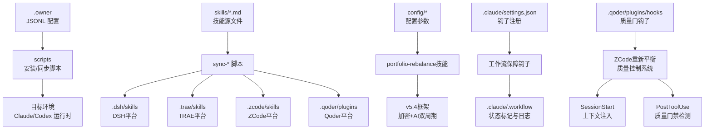
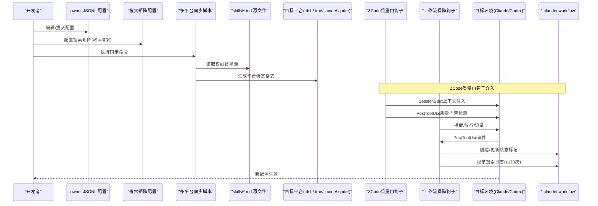
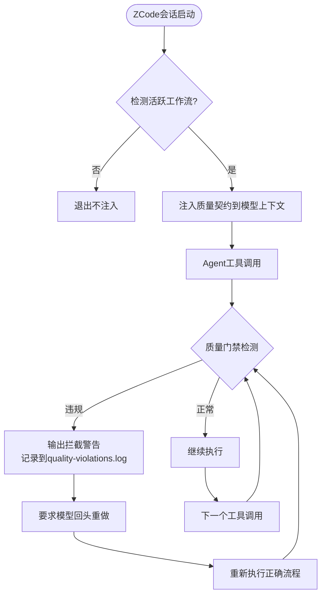
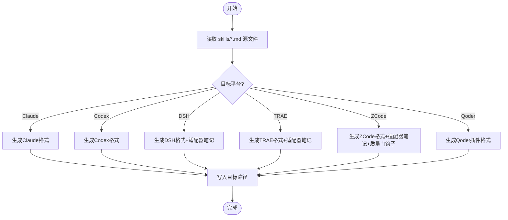
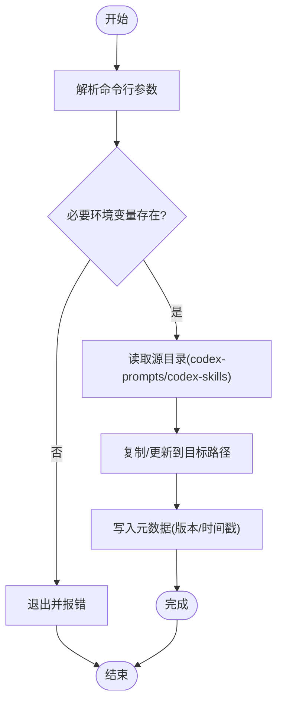
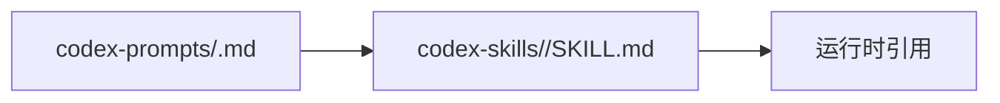
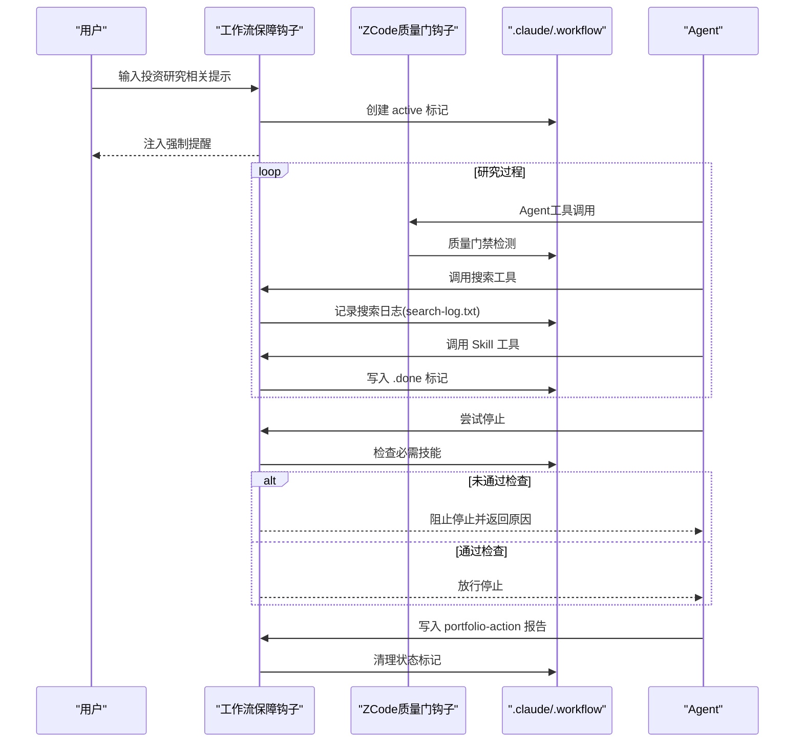
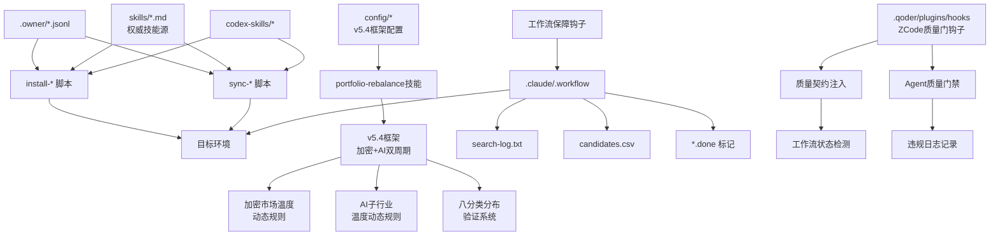

# 配置管理

<cite>
**本文引用的文件**
- [.zcode/config.json](file://.zcode/config.json)
- [.qoder/plugins/ai-berkshire-investment/hooks/rebalance-context](file://.qoder/plugins/ai-berkshire-investment/hooks/rebalance-context)
- [.qoder/plugins/ai-berkshire-investment/hooks/agent-quality-gate](file://.qoder/plugins/ai-berkshire-investment/hooks/agent-quality-gate)
- [scripts/rebalance-validate.py](file://scripts/rebalance-validate.py)
- [scripts/workflow-session-cleanup.sh](file://scripts/workflow-session-cleanup.sh)
- [scripts/search-tracker-hook.sh](file://scripts/search-tracker-hook.sh)
- [scripts/skill-enforcement-hook.sh](file://scripts/skill-enforcement-hook.sh)
- [scripts/skill-tracker-hook.sh](file://scripts/skill-tracker-hook.sh)
- [scripts/workflow-gate-hook.sh](file://scripts/workflow-gate-hook.sh)
- [scripts/workflow-cleanup-hook.sh](file://scripts/workflow-cleanup-hook.sh)
- [scripts/install-claude-commands.sh](file://scripts/install-claude-commands.sh)
- [scripts/install-codex-prompts.sh](file://scripts/install-codex-prompts.sh)
- [scripts/install-codex-skills.sh](file://scripts/install-codex-skills.sh)
- [scripts/sync-codex-prompts.py](file://scripts/sync-codex-prompts.py)
- [scripts/sync-codex-skills.py](file://scripts/sync-codex-skills.py)
- [scripts/sync-qoder-skills.py](file://scripts/sync-qoder-skills.py)
- [scripts/sync-dsh-skills.py](file://scripts/sync-dsh-skills.py)
- [scripts/sync-trae-skills.py](file://scripts/sync-trae-skills.py)
- [scripts/sync-zcode-skills.py](file://scripts/sync-zcode-skills.py)
- [codex-prompts/bottleneck-hunter.md](file://codex-prompts/bottleneck-hunter.md)
- [codex-skills/bottleneck-hunter/SKILL.md](file://codex-skills/bottleneck-hunter/SKILL.md)
- [.claude/settings.json](file://.claude/settings.json)
- [config/portfolio-targets.md](file://config/portfolio-targets.md)
- [config/search-matrix.md](file://config/search-matrix.md)
- [scripts/learnings-digest.sh](file://scripts/learnings-digest.sh)
</cite>

## 更新摘要
**变更内容**
- **ZCode重新平衡质量门钩子系统**：新增SessionStart钩子用于重新平衡上下文注入，PostToolUse钩子用于Agent质量门禁检测
- **质量契约自动注入**：在会话启动时自动检测活跃工作流并注入投资组合重新平衡执行质量契约
- **Agent质量门禁检查**：实时检测"偷懒合并"行为，防止多只股票或大师视角的违规合并分析
- **阶段验证脚本增强**：rebalance-validate.py提供6个阶段的完整合规性检查
- **v5.4框架重构**：组合目标分布新增加密独立类别，支持加密市场温度动态规则和八分类分布验证系统
- **搜索要求升级**：总搜索量要求从≥80次提升至≥120次，Source I拆分为AI修复(≥5组)和加密修复(≥15组)
- **持仓上限优化**：最大持仓数量从≤11只调整为≤10只，实现极致集中管理
- **多平台同步生态系统**：完整的跨平台技能同步体系（Claude/Codex/TRAE/DSH/ZCode/Qoder）

## 目录
1. [简介](#简介)
2. [项目结构](#项目结构)
3. [核心组件](#核心组件)
4. [架构总览](#架构总览)
5. [详细组件分析](#详细组件分析)
6. [依赖关系分析](#依赖关系分析)
7. [性能考虑](#性能考虑)
8. [故障排查指南](#故障排查指南)
9. [结论](#结论)
10. [附录](#附录)

## 简介
本技术文档面向配置管理系统，聚焦于 JSONL 配置文件与安装/同步脚本的协同工作，并新增工作流执行保障系统和ZCode重新平衡质量门钩子系统。内容涵盖：
- JSONL 配置文件的结构与语法（技能调度、子代理调度、环境变量等）
- 安装脚本的功能与使用方法（Claude 命令安装、Codex 技能部署、提示词同步）
- **ZCode重新平衡质量门钩子系统**：SessionStart上下文注入和PostToolUse质量门禁检测
- **v5.4框架重构**：组合目标分布与加密市场动态规则，新增八分类分布验证系统
- **多平台同步生态系统**：统一的技能分发到Claude、Codex、TRAE、DSH、ZCode、Qoder等平台
- 工作流执行保障：通过钩子强制必需技能执行、搜索多样性与候选数量门槛
- 版本管理与迁移策略
- 定制与扩展配置选项的方法
- 常见问题排查与性能优化建议
- 完整示例与最佳实践，确保系统稳定运行与高效配置

## 项目结构
仓库中与配置管理直接相关的核心位置包括：
- .owner 目录：存放 JSONL 形式的调度配置（子代理调度）
- scripts 目录：包含安装与同步脚本（Shell/Python），以及工作流执行保障钩子
- codex-prompts 与 codex-skills 目录：存放提示词与技能定义，供脚本同步到目标环境
- .claude 目录：存放 Claude 运行时配置与钩子注册
- config 目录：存放搜索矩阵配置等参数文件
- .dsh/.trae/.zcode 目录：各平台的本地化技能副本
- .qoder 目录：Qoder平台插件技能和钩子（新增）
- **.qoder/plugins/ai-berkshire-investment/hooks**：ZCode重新平衡质量门钩子（新增）

**图表来源**
- [.zcode/config.json:1-107](file://.zcode/config.json#L1-L107)
- [.qoder/plugins/ai-berkshire-investment/hooks/rebalance-context:1-76](file://.qoder/plugins/ai-berkshire-investment/hooks/rebalance-context#L1-L76)
- [.qoder/plugins/ai-berkshire-investment/hooks/agent-quality-gate:1-72](file://.qoder/plugins/ai-berkshire-investment/hooks/agent-quality-gate#L1-L72)
- [scripts/sync-qoder-skills.py](file://scripts/sync-qoder-skills.py)
- [scripts/sync-dsh-skills.py](file://scripts/sync-dsh-skills.py)
- [scripts/sync-trae-skills.py](file://scripts/sync-trae-skills.py)
- [scripts/sync-zcode-skills.py](file://scripts/sync-zcode-skills.py)
- [config/portfolio-targets.md](file://config/portfolio-targets.md)
- [config/search-matrix.md](file://config/search-matrix.md)

**章节来源**
- [.zcode/config.json](file://.zcode/config.json)
- [.qoder/plugins/ai-berkshire-investment/hooks/rebalance-context](file://.qoder/plugins/ai-berkshire-investment/hooks/rebalance-context)
- [.qoder/plugins/ai-berkshire-investment/hooks/agent-quality-gate](file://.qoder/plugins/ai-berkshire-investment/hooks/agent-quality-gate)
- [scripts/sync-qoder-skills.py](file://scripts/sync-qoder-skills.py)
- [scripts/sync-dsh-skills.py](file://scripts/sync-dsh-skills.py)
- [scripts/sync-trae-skills.py](file://scripts/sync-trae-skills.py)
- [scripts/sync-zcode-skills.py](file://scripts/sync-zcode-skills.py)
- [config/portfolio-targets.md](file://config/portfolio-targets.md)
- [config/search-matrix.md](file://config/search-matrix.md)

## 核心组件
本节从"配置即数据"的角度，梳理 JSONL 配置项与脚本职责边界，帮助读者快速理解系统如何被驱动。

- JSONL 配置（.owner 目录）
  - 子代理调度配置：描述子代理身份、能力范围、路由规则、资源配额等，记录于 .owner/subagent-dispatch-*.jsonl
  - 典型字段（概念性说明）：ts、tool、feature、subagent_type、agent_id、description、prompt_preview、captured_by
  - 环境变量设置：集中声明密钥、端点、超时、重试等运行时参数，便于多环境复用
- 安装脚本（scripts 目录）
  - Claude 命令安装：将本地命令或快捷方式安装至用户环境，便于 CLI 调用
  - Codex 提示词安装：将 codex-prompts 下的模板复制到目标路径
  - Codex 技能安装：将 codex-skills 下的技能包复制到目标路径
- **ZCode重新平衡质量门钩子系统（新增）**
  - SessionStart钩子：检测活跃工作流并注入投资组合重新平衡质量契约到模型上下文
  - PostToolUse钩子：实时检测Agent工具调用中的违规合并行为，防止"偷懒"分析
  - 质量契约内容：四大师反退化铁律、搜索正文铁律、阶段验证要求、持仓上限约束
- **多平台同步脚本生态系统**
  - 统一技能源：所有平台共享 skills/*.md 作为权威源
  - 平台适配：每个平台有专门的同步脚本处理格式差异
  - 增量更新：支持 --check 模式验证一致性，避免全量覆盖
- 工作流执行保障（scripts 目录）
  - Skill 执行铁律：在用户输入触发投资研究时自动注入强制提醒与工作流激活
  - 搜索追踪：每次搜索工具调用后记录到 search-log.txt，支持搜索总量验证
  - 技能追踪：每次 Skill 调用后写入 .done 标记文件，记录 skill 名称、参数与时间戳
  - 工作流关卡：在 Agent 尝试停止时检查必需技能是否全部执行，未通过则阻止结束
  - 工作流清理：当 portfolio-action 报告写入后清理 .done 标记、active 状态与搜索日志
- **v5.4框架重构：组合目标分布**
  - 新增加密独立类别，支持加密市场温度动态规则
  - 持仓上限调整为≤10只，集中度规则优化为top 1/top 2
  - AI子行业温度动态规则双层配置（整体水位+子行业水位）
  - 八分类分布验证系统：AI硬件、AI软件、AI平台、估值修复、爆发仓、加密、非AI对冲、现金
- **搜索矩阵扩展**
  - AI赛道从15个扩展至17个，非AI主题从12个扩展至14个，确保更全面的候选发现覆盖
  - 搜索总量要求从≥80次提升至≥120次
  - Source I拆分为AI修复(≥5组)和加密修复(≥15组)，合计≥20次

**章节来源**
- [.zcode/config.json:1-107](file://.zcode/config.json#L1-L107)
- [.qoder/plugins/ai-berkshire-investment/hooks/rebalance-context:1-76](file://.qoder/plugins/ai-berkshire-investment/hooks/rebalance-context#L1-L76)
- [.qoder/plugins/ai-berkshire-investment/hooks/agent-quality-gate:1-72](file://.qoder/plugins/ai-berkshire-investment/hooks/agent-quality-gate#L1-L72)
- [scripts/rebalance-validate.py:1-197](file://scripts/rebalance-validate.py#L1-L197)
- [scripts/sync-qoder-skills.py](file://scripts/sync-qoder-skills.py)
- [scripts/sync-dsh-skills.py](file://scripts/sync-dsh-skills.py)
- [scripts/sync-trae-skills.py](file://scripts/sync-trae-skills.py)
- [scripts/sync-zcode-skills.py](file://scripts/sync-zcode-skills.py)
- [config/portfolio-targets.md](file://config/portfolio-targets.md)
- [config/search-matrix.md](file://config/search-matrix.md)

## 架构总览
下图展示了配置驱动的端到端流程：从 JSONL 配置到脚本执行，再到目标环境的生效，并新增ZCode重新平衡质量门钩子和v5.4框架的工作流执行保障钩子的介入点。

**图表来源**
- [.zcode/config.json:1-107](file://.zcode/config.json#L1-L107)
- [.qoder/plugins/ai-berkshire-investment/hooks/rebalance-context:1-76](file://.qoder/plugins/ai-berkshire-investment/hooks/rebalance-context#L1-L76)
- [.qoder/plugins/ai-berkshire-investment/hooks/agent-quality-gate:1-72](file://.qoder/plugins/ai-berkshire-investment/hooks/agent-quality-gate#L1-L72)
- [scripts/sync-qoder-skills.py](file://scripts/sync-qoder-skills.py)
- [scripts/sync-dsh-skills.py](file://scripts/sync-dsh-skills.py)
- [scripts/sync-trae-skills.py](file://scripts/sync-trae-skills.py)
- [scripts/sync-zcode-skills.py](file://scripts/sync-zcode-skills.py)
- [scripts/workflow-gate-hook.sh](file://scripts/workflow-gate-hook.sh)
- [scripts/skill-enforcement-hook.sh](file://scripts/skill-enforcement-hook.sh)
- [scripts/search-tracker-hook.sh](file://scripts/search-tracker-hook.sh)
- [scripts/skill-tracker-hook.sh](file://scripts/skill-tracker-hook.sh)
- [scripts/workflow-cleanup-hook.sh](file://scripts/workflow-cleanup-hook.sh)
- [config/search-matrix.md](file://config/search-matrix.md)

## 详细组件分析

### JSONL 配置结构与语法
- 文件组织
  - 子代理调度：位于 .owner/subagent-dispatch-*.jsonl
- 行级记录
  - 每行为一个独立的 JSON 对象，表示一条配置记录
  - 典型字段（基于实际文件）：
    - ts：时间戳
    - tool：工具类型（如 Agent）
    - feature：功能标识（如 026-08-08）
    - subagent_type：子代理类型（如 GeneralPurpose）
    - agent_id：代理标识
    - description：任务描述
    - prompt_preview：提示词预览
    - captured_by：捕获来源（如 owner:subagent-dispatch-log）
- 校验与容错
  - 建议提供 schema 校验工具，拒绝非法字段或缺失必填项
  - 对缺失的环境变量提供默认值或告警
- 示例参考
  - 可参考现有 JSONL 文件以了解实际字段命名与取值风格

**章节来源**
- [.owner/subagent-dispatch-026-08-08.jsonl](file://.owner/subagent-dispatch-026-08-08.jsonl)

### ZCode重新平衡质量门钩子系统（新增）
**新增** ZCode平台新增了完整的质量门钩子系统，确保投资组合重新平衡执行的严格质量控制：

#### SessionStart钩子 - 质量契约注入
- **触发时机**：ZCode会话启动时
- **功能**：检测是否有活跃的rebalance工作流，如有则注入质量契约到模型上下文
- **质量契约内容**：
  - 最高优先级原则：质量 > 速度，准确全面分析比省时间和token重要一万倍
  - 四大师反退化铁律：每只股票必须4个独立GeneralPurpose Agent（段永平/巴菲特/芒格/李录）
  - 搜索正文铁律：验证阶段必须fetch正文，禁止仅凭snippet片段数字写入报告
  - 阶段验证：每完成一个阶段运行rebalance-validate.py进行合规检查
  - 持仓上限与集中度：≤10只，各类top1/max top2，八类分布约束

#### PostToolUse钩子 - Agent质量门禁检测
- **触发时机**：每次Agent工具调用后
- **功能**：检测是否存在"偷懒合并"行为，如果检测到违规输出拦截信息要求模型回头重做
- **违规检测模式**：
  - 多ticker合并：单个Agent中包含多个持仓股票
  - 视角合并：单个Agent试图同时执行多个大师视角
  - 效率借口：使用"节省时间"、"for efficiency"等理由进行合并分析
- **拦截机制**：记录违规到quality-violations.log，输出警告JSON告知模型立即停止并重做

#### 阶段验证脚本增强
- **6个阶段验证**：预检环境、持仓核实、持仓分析（4Agent反退化）、候选扫描、冒泡排序、最终报告
- **严格检查**：每只股票的4个独立Agent执行证据、搜索次数≥120次、候选数量≥300只
- **违规处理**：检测到违规输出🔴 BLOCK，必须修正后才能继续

**图表来源**
- [.qoder/plugins/ai-berkshire-investment/hooks/rebalance-context:1-76](file://.qoder/plugins/ai-berkshire-investment/hooks/rebalance-context#L1-L76)
- [.qoder/plugins/ai-berkshire-investment/hooks/agent-quality-gate:1-72](file://.qoder/plugins/ai-berkshire-investment/hooks/agent-quality-gate#L1-L72)
- [scripts/rebalance-validate.py:1-197](file://scripts/rebalance-validate.py#L1-L197)

**章节来源**
- [.qoder/plugins/ai-berkshire-investment/hooks/rebalance-context](file://.qoder/plugins/ai-berkshire-investment/hooks/rebalance-context)
- [.qoder/plugins/ai-berkshire-investment/hooks/agent-quality-gate](file://.qoder/plugins/ai-berkshire-investment/hooks/agent-quality-gate)
- [scripts/rebalance-validate.py](file://scripts/rebalance-validate.py)

### 多平台同步生态系统
**更新** 系统现已支持六个平台的统一技能分发：

#### 同步脚本架构
- **统一源文件**：所有平台共享 `skills/*.md` 作为权威技能源
- **平台适配器**：每个平台有专门的同步脚本处理格式差异
  - `sync-codex-skills.py`：Codex平台
  - `sync-dsh-skills.py`：DeepSeek Harness平台
  - `sync-trae-skills.py`：TRAE平台
  - `sync-zcode-skills.py`：ZCode平台
  - `sync-qoder-skills.py`：Qoder平台（新增）
- **增量更新**：支持 `--check` 模式验证一致性，避免全量覆盖

#### 平台特性对比
| 平台 | 输出路径 | 特殊功能 | 适配器笔记 |
|------|----------|----------|------------|
| Claude Code | `.claude/skills/` | 原生支持 | 无 |
| Codex | `codex-skills/` | 传统格式 | 无 |
| DSH | `.dsh/skills/` | 最高优先级(local rank 100) | 工具映射说明 |
| TRAE | `.trae/skills/` | PowerShell支持 | 工具映射说明 |
| ZCode | `.zcode/skills/` | 工作区级别 + 质量门钩子 | 工具映射说明 + 质量控制系统 |
| Qoder | `.qoder/plugins/ai-berkshire-investment/skills/` | 项目级插件 | 基础frontmatter |

#### Qoder平台集成（新增）
- **插件结构**：`.qoder/plugins/ai-berkshire-investment/skills/<name>/SKILL.md`
- **Frontmatter格式**：包含name和description字段
- **中文描述**：每个技能都有详细的中文使用说明
- **验证机制**：支持 `--check` 模式验证同步状态
- **质量门钩子**：集成rebalance-context和agent-quality-gate钩子

**图表来源**
- [scripts/sync-qoder-skills.py](file://scripts/sync-qoder-skills.py)
- [scripts/sync-dsh-skills.py](file://scripts/sync-dsh-skills.py)
- [scripts/sync-trae-skills.py](file://scripts/sync-trae-skills.py)
- [scripts/sync-zcode-skills.py](file://scripts/sync-zcode-skills.py)

**章节来源**
- [scripts/sync-qoder-skills.py](file://scripts/sync-qoder-skills.py)
- [scripts/sync-dsh-skills.py](file://scripts/sync-dsh-skills.py)
- [scripts/sync-trae-skills.py](file://scripts/sync-trae-skills.py)
- [scripts/sync-zcode-skills.py](file://scripts/sync-zcode-skills.py)

### v5.4框架重构：组合目标分布
**更新** v5.4框架引入了全新的组合目标分布和加密市场动态规则：

#### 核心架构升级
- **加密独立类别**：新增独立的加密资产类别，与AI完全解耦
- **八分类分布验证系统**：AI硬件、AI软件、AI平台、估值修复、爆发仓、加密、非AI对冲、现金
- **双层动态配置**：AI整体水位 + AI子行业水位的分层管理
- **持仓上限优化**：从之前的≤11只调整为≤10只，实现极致集中
- **集中度规则强化**：每个类别只持有top 1（该类别中最强的唯一一只），最多到top 2（仅当该类别有两个不可舍的标的且组合总股数未超10时才允许）
- **现金动态规则**：市场温度决定攻守策略，不再是固定比例

#### 加密市场温度动态规则
- **独立周期判定**：加密与AI是完全独立的周期，需要分别实时搜索判定
- **四档水位系统**：积累期底部(10-15%)、复苏期(8-12%)、狂热期(3-5%)、崩盘期(0-3%)
- **内部双路径**：加密修复（复用估值修复逻辑）+ 加密爆发（复用来源H逻辑）
- **退出规则**：估值回归兑现1/2，币价周期反转切换为"只持有不新建"

#### AI子行业温度动态规则
- **第一层：AI整体水位** → 决定AI总暴露（50-75%，硬上限80%）
- **第二层：子行业水位** → 决定AI总暴露内的相对权重
  - AI硬件：供不应求(40-50%)、供需平衡(30-40%)、产能过剩(15-25%)
  - AI软件：变现加速(30-40%)、投入验证中(20-30%)、恐惧/颠覆期(15-25%)
  - AI平台：拐点确认(30-40%)、投入期(25-35%)、无底洞(10-20%)

#### 约束分级优化
- **硬约束（🔴强制修正）**：AI总暴露 50-75%/cap 80、非AI对冲 10-15%/cap 20、**单一非美国家敞口≤15%**（含中概ADR/港股）、**加密货币暴露限制**
- **软约束（⚠️仅提示）**：AI核心/爆发仓/AI平台三个子区间
- **战术上浮通道**：满足条件时可运行至硬上限而非区间上限

**章节来源**
- [config/portfolio-targets.md](file://config/portfolio-targets.md)

### 搜索矩阵扩展
**更新** 搜索矩阵已扩展至更全面的市场覆盖：

#### AI赛道扩展（15→17个）
- **新增赛道16**：端侧AI/边缘推理芯片（AI PC/手机NPU升级周期）
- **新增赛道17**：AI数据/标注/合成数据（数据基础设施与治理）
- **代表标的方向**：QCOM、MTK、数据标注公司、合成数据供应商

#### 非AI主题扩展（12→14个）
- **新增主题13**：中国/新兴市场消费复苏（政策刺激+估值修复）
- **新增主题14**：黄金/贵金属（尾部对冲+自身动量）
- **优先纳入**：主题13/14因催化剂密度高且构成对冲闭环而优先纳入

#### 搜索总量与均衡要求
- **搜索总量**：保持≥120次（GICS 25组×2视角=50 + AI赛道17×2=34 + 非AI主题≥8 + 7维补充 ≈ 132+）
- **候选池两侧均衡**：AI相关候选占比不得超过65%，非AI候选至少35%
- **防错教训**：NBIS教训导致搜索词设计优化，避免系统性过滤高增长股

#### Source I拆分要求
- **AI修复**：≥5组搜索词，专注于AI相关公司的估值修复机会
- **加密修复**：≥15组搜索词，覆盖交易所、稳定币、矿企、DeFi等全维度
- **合计要求**：Source I总计≥20次搜索

**章节来源**
- [config/search-matrix.md](file://config/search-matrix.md)

### 安装脚本功能与用法
- Claude 命令安装
  - 作用：在用户环境中创建/更新 Claude 相关命令或快捷方式
  - 输入：命令定义、别名、参数模板
  - 输出：可执行的 CLI 入口
- Codex 提示词安装
  - 作用：将 codex-prompts 下的模板复制到目标目录
  - 特性：支持覆盖策略与备份
- Codex 技能安装
  - 作用：将 codex-skills 下的技能包复制到目标目录
  - 特性：支持按清单选择性安装

**图表来源**
- [scripts/install-claude-commands.sh](file://scripts/install-claude-commands.sh)
- [scripts/install-codex-prompts.sh](file://scripts/install-codex-prompts.sh)
- [scripts/install-codex-skills.sh](file://scripts/install-codex-skills.sh)

**章节来源**
- [scripts/install-claude-commands.sh](file://scripts/install-claude-commands.sh)
- [scripts/install-codex-prompts.sh](file://scripts/install-codex-prompts.sh)
- [scripts/install-codex-skills.sh](file://scripts/install-codex-skills.sh)

### 同步脚本逻辑与差异处理
- 提示词同步
  - 扫描源与目标差异，仅更新变更文件
  - 支持 dry-run 模式预览变更
  - 生成变更日志与回滚快照
- 技能同步
  - 基于清单进行增量更新
  - 失败幂等：重复执行不破坏状态
  - 可选校验：签名/哈希校验保证一致性

**图表来源**
- [scripts/sync-codex-prompts.py](file://scripts/sync-codex-prompts.py)
- [scripts/sync-codex-skills.py](file://scripts/sync-codex-skills.py)
- [.owner/subagent-dispatch-026-08-08.jsonl](file://.owner/subagent-dispatch-026-08-08.jsonl)

**章节来源**
- [scripts/sync-codex-prompts.py](file://scripts/sync-codex-prompts.py)
- [scripts/sync-codex-skills.py](file://scripts/sync-codex-skills.py)
- [.owner/subagent-dispatch-026-08-08.jsonl](file://.owner/subagent-dispatch-026-08-08.jsonl)

### 提示词与技能的关联关系
- 提示词模板与技能包通常一一对应或一对多
- 同步时建议保持两者版本一致，避免运行时找不到对应模板
- 建议在 JSONL 中显式声明依赖关系，以便校验与排序

**图表来源**
- [codex-prompts/bottleneck-hunter.md](file://codex-prompts/bottleneck-hunter.md)
- [codex-skills/bottleneck-hunter/SKILL.md](file://codex-skills/bottleneck-hunter/SKILL.md)

**章节来源**
- [codex-prompts/bottleneck-hunter.md](file://codex-prompts/bottleneck-hunter.md)
- [codex-skills/bottleneck-hunter/SKILL.md](file://codex-skills/bottleneck-hunter/SKILL.md)

### 工作流执行保障系统
工作流执行保障系统通过多个钩子脚本确保研究质量与搜索多样性：

#### Skill 执行铁律钩子（skill-enforcement-hook.sh）
- 触发时机：用户输入包含投资研究关键词时
- 功能：激活工作流（创建 active 标记），注入强制提醒
- 关键要求：必须通过 Skill 工具调用，不可用 WebSearch 替代；持仓分析需 /investment-team；候选验证需 /investment-checklist + /investment-team；行业扫描需 /industry-funnel + /bottleneck-hunter

#### 搜索追踪钩子（search-tracker-hook.sh）
- 触发时机：每次 Agent 调用搜索工具后
- 功能：记录搜索工具使用情况和搜索词到 search-log.txt
- 支持的搜索工具：mcp__web-search__search、mcp__kepler__web_search、mcp__web-search-prime__web_search_prime、WebSearch
- 搜索日志格式：ISO时间 | 工具名 | 搜索词

#### 技能追踪钩子（skill-tracker-hook.sh）
- 触发时机：每次 Agent 调用 Skill 工具后
- 功能：记录 skill 名称、参数与时间戳到 .done 标记文件
- 过滤：跳过非投研 skill（如 update-config、using-superpowers 等）

#### 工作流关卡钩子（workflow-gate-hook.sh）
- 触发时机：Agent 尝试停止时
- 功能：检查必需技能是否全部执行，未通过则阻止结束
- 检查项：
  - /investment-team（持仓四大师分析）至少 1 个
  - /investment-checklist（巴菲特六关准入）至少 1 个
  - /industry-funnel（行业漏斗筛选）
  - /bottleneck-hunter（瓶颈扫描）
  - mcp__web-search__search 必须使用过
  - 候选股票数量 ≥ 300 只（理想 350 只）
  - 推荐标的覆盖检查：recommended-buys.txt 中每个 ticker 必须有对应 checklist .done
  - **搜索总量 ≥ 120 次**（防止AI/非AI关键词片面性——v5.4更新）

#### 工作流清理钩子（workflow-cleanup-hook.sh）
- 触发时机：portfolio-action 报告写入后或 Session 启动时
- 功能：清理 .done 标记、active 状态与搜索日志

**图表来源**
- [scripts/skill-enforcement-hook.sh](file://scripts/skill-enforcement-hook.sh)
- [scripts/search-tracker-hook.sh](file://scripts/search-tracker-hook.sh)
- [scripts/skill-tracker-hook.sh](file://scripts/skill-tracker-hook.sh)
- [scripts/workflow-gate-hook.sh](file://scripts/workflow-gate-hook.sh)
- [scripts/workflow-cleanup-hook.sh](file://scripts/workflow-cleanup-hook.sh)
- [.qoder/plugins/ai-berkshire-investment/hooks/agent-quality-gate:1-72](file://.qoder/plugins/ai-berkshire-investment/hooks/agent-quality-gate#L1-L72)

**章节来源**
- [scripts/skill-enforcement-hook.sh](file://scripts/skill-enforcement-hook.sh)
- [scripts/search-tracker-hook.sh](file://scripts/search-tracker-hook.sh)
- [scripts/skill-tracker-hook.sh](file://scripts/skill-tracker-hook.sh)
- [scripts/workflow-gate-hook.sh](file://scripts/workflow-gate-hook.sh)
- [scripts/workflow-cleanup-hook.sh](file://scripts/workflow-cleanup-hook.sh)

## 依赖关系分析
- 配置到脚本
  - JSONL 清单驱动脚本的执行顺序与范围
- 脚本到资源
  - 安装/同步脚本依赖 codex-prompts 与 codex-skills 目录
- 脚本到目标环境
  - 写入目标路径后由 Claude/Codex 运行时消费
- 钩子到工作流状态
  - 工作流保障钩子依赖 .claude/.workflow 目录中的状态标记与日志
- **ZCode质量门钩子依赖**
  - SessionStart钩子依赖.active工作流标记检测
  - PostToolUse钩子依赖TOOL_INPUT环境变量获取工具调用数据
  - 质量门禁检查依赖quality-violations.log记录违规
- **v5.4新增依赖**
  - 组合目标分布配置驱动portfolio-rebalance技能执行
  - 加密市场温度动态规则需要实时搜索支持
  - 多平台同步依赖统一的skills源文件
  - 八分类分布验证系统需要严格的约束检查

**图表来源**
- [.zcode/config.json:1-107](file://.zcode/config.json#L1-L107)
- [.qoder/plugins/ai-berkshire-investment/hooks/rebalance-context:1-76](file://.qoder/plugins/ai-berkshire-investment/hooks/rebalance-context#L1-L76)
- [.qoder/plugins/ai-berkshire-investment/hooks/agent-quality-gate:1-72](file://.qoder/plugins/ai-berkshire-investment/hooks/agent-quality-gate#L1-L72)
- [scripts/sync-qoder-skills.py](file://scripts/sync-qoder-skills.py)
- [scripts/sync-dsh-skills.py](file://scripts/sync-dsh-skills.py)
- [scripts/sync-trae-skills.py](file://scripts/sync-trae-skills.py)
- [scripts/sync-zcode-skills.py](file://scripts/sync-zcode-skills.py)
- [scripts/workflow-gate-hook.sh](file://scripts/workflow-gate-hook.sh)
- [scripts/skill-enforcement-hook.sh](file://scripts/skill-enforcement-hook.sh)
- [scripts/search-tracker-hook.sh](file://scripts/search-tracker-hook.sh)
- [scripts/skill-tracker-hook.sh](file://scripts/skill-tracker-hook.sh)
- [scripts/workflow-cleanup-hook.sh](file://scripts/workflow-cleanup-hook.sh)
- [config/portfolio-targets.md](file://config/portfolio-targets.md)
- [config/search-matrix.md](file://config/search-matrix.md)

**章节来源**
- [.zcode/config.json](file://.zcode/config.json)
- [.qoder/plugins/ai-berkshire-investment/hooks/rebalance-context](file://.qoder/plugins/ai-berkshire-investment/hooks/rebalance-context)
- [.qoder/plugins/ai-berkshire-investment/hooks/agent-quality-gate](file://.qoder/plugins/ai-berkshire-investment/hooks/agent-quality-gate)
- [scripts/sync-qoder-skills.py](file://scripts/sync-qoder-skills.py)
- [scripts/sync-dsh-skills.py](file://scripts/sync-dsh-skills.py)
- [scripts/sync-trae-skills.py](file://scripts/sync-trae-skills.py)
- [scripts/sync-zcode-skills.py](file://scripts/sync-zcode-skills.py)
- [scripts/workflow-gate-hook.sh](file://scripts/workflow-gate-hook.sh)
- [scripts/skill-enforcement-hook.sh](file://scripts/skill-enforcement-hook.sh)
- [scripts/search-tracker-hook.sh](file://scripts/search-tracker-hook.sh)
- [scripts/skill-tracker-hook.sh](file://scripts/skill-tracker-hook.sh)
- [scripts/workflow-cleanup-hook.sh](file://scripts/workflow-cleanup-hook.sh)
- [config/portfolio-targets.md](file://config/portfolio-targets.md)
- [config/search-matrix.md](file://config/search-matrix.md)

## 性能考虑
- 增量同步优先
  - 使用差异比较与最小化变更，减少 I/O 与网络开销
- 并发控制
  - 批量复制/上传时限制并发度，避免打满磁盘或带宽
- 缓存与去重
  - 对大文件采用哈希去重，避免重复传输
- 幂等设计
  - 重复执行不影响最终状态，降低重试成本
- 预检与回滚
  - 在执行前进行空间/权限检查，失败时自动回滚，缩短恢复时间
- 工作流状态管理
  - .done 标记文件轻量且原子写入，避免锁竞争
  - 搜索日志追加写入，支持断点续查
  - 候选池文件增量更新，避免全量重写
- **ZCode质量门钩子性能优化**
  - SessionStart钩子仅在检测到活跃工作流时注入上下文，避免每次会话都执行
  - PostToolUse钩子使用正则表达式快速检测违规模式，性能开销极小
  - 质量门禁检查静默通过正常调用，仅违规时输出警告
  - 违规日志追加写入，支持历史追溯
- **多平台同步优化**
  - 统一源文件减少维护成本，单点更新多平台生效
  - 平台特定格式转换在同步时完成，运行时零开销
  - `--check` 模式支持CI/CD流水线中的质量门禁
- **v5.4框架性能优化**
  - 加密与AI双周期独立判定，避免相互干扰
  - 双层动态配置减少不必要的重新平衡
  - 搜索矩阵扩展但通过智能关键词组合提高效率
  - 八分类分布验证系统提高配置准确性

## 故障排查指南
- 常见症状
  - 命令不可用：检查安装脚本是否成功写入 PATH 或等价入口
  - 提示词未生效：确认同步脚本是否覆盖目标路径且未被后续操作覆盖
  - 技能缺失：核对 JSONL 清单中的路径与文件名是否与源码一致
  - 工作流被阻止：检查 .claude/.workflow 中的 .done 标记是否齐全
  - 搜索不足：查看 search-log.txt 是否记录足够搜索次数
  - 候选数量不足：检查 candidates.csv 文件是否存在且包含足够的候选股票
  - **ZCode质量门问题**：质量契约未注入、Agent质量门禁误拦截、违规日志异常
  - **多平台同步问题**：某平台技能未更新、格式不兼容、描述信息不一致
  - **v5.4框架问题**：加密市场温度判定错误、AI子行业水位误判、持仓超限、分布验证失败
- 定位步骤
  - 查看脚本输出与日志，关注错误码与堆栈
  - 验证环境变量是否注入正确
  - 使用 dry-run 模式预览变更，确认差异符合预期
  - 检查工作流状态：ls .claude/.workflow/*.done 确认技能执行情况
  - 检查搜索日志：wc -l .claude/.workflow/search-log.txt 确认搜索次数（要求≥120次）
  - 检查候选池：cat .claude/.workflow/candidates.csv | wc -l 确认候选数量
  - **ZCode质量门检查**：查看.qoder/plugins/ai-berkshire-investment/hooks/目录是否存在，检查.rebalance-context和.agent-quality-gate脚本权限
  - **违规日志检查**：cat .claude/.workflow/quality-violations.log查看质量门禁拦截记录
  - **多平台验证**：对每个平台执行 `python scripts/sync-*-skills.py --check` 验证一致性
  - **v5.4框架验证**：检查portfolio-targets.md中的当前判定是否正确，验证加密与AI周期的独立性，确认八分类分布验证通过
- 修复建议
  - 修正 JSONL 中的路径/字段拼写
  - 重新执行安装/同步脚本
  - 若涉及权限问题，调整目标目录权限或切换用户
  - 对于工作流关卡拦截，按提示执行缺失的 Skill 并满足搜索与候选数量要求
  - 确保搜索工具调用正常，检查网络连接和API密钥配置
  - **ZCode质量门修复**：确保hooks目录存在且脚本有执行权限，检查active工作流标记文件，验证TOOL_INPUT环境变量传递
  - **多平台修复**：确保所有平台同步脚本都成功执行，检查各平台特定的格式要求
  - **v5.4框架修复**：重新执行搜索矩阵获取最新市场数据，验证动态规则的判定逻辑，确保Source I的AI修复(≥5组)和加密修复(≥15组)搜索要求得到满足

**章节来源**
- [.zcode/config.json:1-107](file://.zcode/config.json#L1-L107)
- [.qoder/plugins/ai-berkshire-investment/hooks/rebalance-context:1-76](file://.qoder/plugins/ai-berkshire-investment/hooks/rebalance-context#L1-L76)
- [.qoder/plugins/ai-berkshire-investment/hooks/agent-quality-gate:1-72](file://.qoder/plugins/ai-berkshire-investment/hooks/agent-quality-gate#L1-L72)
- [scripts/rebalance-validate.py:1-197](file://scripts/rebalance-validate.py#L1-L197)
- [scripts/sync-qoder-skills.py](file://scripts/sync-qoder-skills.py)
- [scripts/sync-dsh-skills.py](file://scripts/sync-dsh-skills.py)
- [scripts/sync-trae-skills.py](file://scripts/sync-trae-skills.py)
- [scripts/sync-zcode-skills.py](file://scripts/sync-zcode-skills.py)
- [scripts/workflow-gate-hook.sh](file://scripts/workflow-gate-hook.sh)
- [scripts/skill-enforcement-hook.sh](file://scripts/skill-enforcement-hook.sh)
- [scripts/search-tracker-hook.sh](file://scripts/search-tracker-hook.sh)
- [scripts/skill-tracker-hook.sh](file://scripts/skill-tracker-hook.sh)
- [scripts/workflow-cleanup-hook.sh](file://scripts/workflow-cleanup-hook.sh)
- [config/portfolio-targets.md](file://config/portfolio-targets.md)
- [config/search-matrix.md](file://config/search-matrix.md)

## 结论
通过将 JSONL 配置与安装/同步脚本解耦，并引入ZCode重新平衡质量门钩子系统、工作流执行保障系统和v5.4框架重构的多平台同步生态系统，本系统实现了"配置驱动、脚本落地、运行时消费、质量保障"的清晰分层。**ZCode质量门钩子系统的核心价值在于：通过SessionStart钩子自动注入投资组合重新平衡质量契约，确保模型始终遵循四大师反退化铁律；通过PostToolUse钩子实时检测"偷懒合并"行为，防止多只股票或大师视角的违规合并分析**。v5.4框架重构新增的加密独立类别和八分类分布验证系统显著提升了组合管理的灵活性和准确性，双层动态配置确保了AI与加密市场的独立管理。多平台同步生态系统确保了技能的一致性和可移植性。配合增量同步、幂等设计与回滚机制，可在保证稳定性的同时提升迭代效率。新增的搜索追踪、候选池管理和质量强制钩子确保了研究方法论的一致性和完整性。**v5.4框架的核心改进包括：搜索要求从≥80次提升至≥120次、Source I拆分为AI修复(≥5组)和加密修复(≥15组)、持仓上限从≤11只优化至≤10只、新增加密货币暴露限制和单一国家敞口约束**。建议在生产环境引入校验与审计，持续完善配置治理。

## 附录

### 版本管理与迁移策略
- 版本规范
  - 使用语义化版本（主.次.修订）或时间戳标注每次变更
  - 在 JSONL 中维护 version 字段，并在变更日志中记录影响面
- 迁移流程
  - 先在小范围环境验证，再灰度推广
  - 保留旧版本快照，支持一键回滚
- 兼容性
  - 新增字段需向后兼容，废弃字段需给出过渡期与替代方案
- **ZCode质量门钩子迁移注意事项**
  - 确保.qoder/plugins/ai-berkshire-investment/hooks目录存在且脚本有执行权限
  - 迁移rebalance-context和agent-quality-gate钩子脚本
  - 更新.zcode/config.json中的钩子配置
  - 验证SessionStart和PostToolUse事件正确触发
- **v5.4迁移注意事项**
  - 新增加密独立类别，需在workflows中强制执行加密市场温度判定
  - 双层动态配置需要相应的搜索支持和判定逻辑
  - 持仓上限调整为≤10只，需更新相关检查和约束逻辑
  - 搜索矩阵扩展至17个AI赛道和14个非AI主题，需更新搜索执行计划
  - **搜索要求升级**：总搜索量从≥80次提升至≥120次，Source I拆分为AI修复(≥5组)和加密修复(≥15组)
  - **八分类分布验证**：确保AI硬件、AI软件、AI平台、估值修复、爆发仓、加密、非AI对冲、现金八个类别的精确分配

### 定制与扩展配置选项
- 新增技能
  - 在 skills 目录下新增源文件
  - 在各平台同步脚本中添加对应的描述和适配逻辑
  - 在 JSONL 中添加对应条目，声明 source/target 与参数
- 新增提示词
  - 在 codex-prompts 下新增模板文件
  - 在 JSONL 中建立与技能的关联
- 环境变量
  - 在 JSONL 的 env 段集中声明，避免硬编码
  - 提供默认值与校验规则，防止空值导致运行时异常
- 工作流扩展
  - 新增必需 Skill：在 workflow-gate-hook.sh 中添加检查逻辑
  - 新增搜索维度：在 search-log.txt 记录规则中扩展关键词
  - 新增候选数量阈值：根据业务需求调整 candidates.csv 的下限
  - 新增搜索工具支持：在 search-tracker-hook.sh 中添加新的工具匹配规则
  - **搜索要求调整**：如需调整搜索总量要求，需同步更新workflow-gate-hook.sh中的检查逻辑
- **ZCode质量门钩子扩展**
  - 新增违规检测模式：在agent-quality-gate脚本中添加新的正则表达式匹配
  - 扩展质量契约内容：在rebalance-context脚本中增加新的约束规则
  - 自定义拦截策略：调整质量门禁的严格程度和警告消息
  - 新增阶段验证：在rebalance-validate.py中添加新的检查阶段
- **多平台扩展**
  - 新增平台：创建新的同步脚本，遵循现有脚本的架构模式
  - 平台特定功能：在适配器笔记中说明平台特有的工具和限制
  - 统一描述：确保各平台的技能描述保持一致性
- **v5.4框架扩展**
  - 可扩展加密市场温度判定规则，添加更多信号指标
  - 可调整AI子行业水位判定标准，适应市场变化
  - 可自定义搜索矩阵中的关键词组合，优化候选发现效果
  - 可调整持仓上限和集中度规则，满足不同风险偏好
  - **八分类扩展**：可根据需要调整各分类的目标占比和硬上限

### 完整示例与最佳实践
- 示例参考
  - 技能示例：bottleneck-hunter（提示词与技能包成对出现）
  - 配置示例：参考 .owner 下的 JSONL 文件，遵循一致的字段命名与结构
  - **ZCode质量门示例**：参考.qoder/plugins/ai-berkshire-investment/hooks/目录中的钩子脚本
  - **v5.4示例**：参考config/portfolio-targets.md中的动态规则实现
- 最佳实践
  - 小步快跑：每次只改少量配置，便于定位问题
  - 明确依赖：在 JSONL 中显式声明依赖关系
  - 统一命名：目录与文件命名保持一致，便于脚本匹配
  - 充分测试：在开发环境先行验证，再发布到生产
  - 工作流纪律：严格遵守 Skill 执行铁律，确保研究质量与搜索多样性
  - 搜索策略：确保搜索词覆盖不同维度，避免信息偏差
  - 候选管理：维护完整的候选池，确保研究广度
  - **ZCode质量门最佳实践**：严格执行四大师反退化铁律，确保每只股票4个独立Agent分析；实时监控质量门禁拦截记录，及时纠正违规行为；定期审查quality-violations.log，识别系统性问题
  - **多平台最佳实践**：始终从统一源文件更新，定期执行 `--check` 验证一致性
  - **v5.4最佳实践**：严格执行双层动态配置规则，确保加密与AI周期的独立性；实时监控市场温度，及时调整配置；维护完整的搜索矩阵，确保候选发现的全面性；**确保Source I的AI修复(≥5组)和加密修复(≥15组)搜索要求得到满足**；**遵守≤10只持仓上限和八分类分布验证要求**

**章节来源**
- [codex-prompts/bottleneck-hunter.md](file://codex-prompts/bottleneck-hunter.md)
- [codex-skills/bottleneck-hunter/SKILL.md](file://codex-skills/bottleneck-hunter/SKILL.md)
- [.owner/subagent-dispatch-026-08-08.jsonl](file://.owner/subagent-dispatch-026-08-08.jsonl)
- [.zcode/config.json:1-107](file://.zcode/config.json#L1-L107)
- [.qoder/plugins/ai-berkshire-investment/hooks/rebalance-context:1-76](file://.qoder/plugins/ai-berkshire-investment/hooks/rebalance-context#L1-L76)
- [.qoder/plugins/ai-berkshire-investment/hooks/agent-quality-gate:1-72](file://.qoder/plugins/ai-berkshire-investment/hooks/agent-quality-gate#L1-L72)
- [scripts/rebalance-validate.py:1-197](file://scripts/rebalance-validate.py#L1-L197)
- [scripts/sync-qoder-skills.py](file://scripts/sync-qoder-skills.py)
- [scripts/sync-dsh-skills.py](file://scripts/sync-dsh-skills.py)
- [scripts/sync-trae-skills.py](file://scripts/sync-trae-skills.py)
- [scripts/sync-zcode-skills.py](file://scripts/sync-zcode-skills.py)
- [scripts/workflow-gate-hook.sh](file://scripts/workflow-gate-hook.sh)
- [scripts/skill-enforcement-hook.sh](file://scripts/skill-enforcement-hook.sh)
- [scripts/search-tracker-hook.sh](file://scripts/search-tracker-hook.sh)
- [scripts/skill-tracker-hook.sh](file://scripts/skill-tracker-hook.sh)
- [scripts/workflow-cleanup-hook.sh](file://scripts/workflow-cleanup-hook.sh)
- [config/portfolio-targets.md](file://config/portfolio-targets.md)
- [config/search-matrix.md](file://config/search-matrix.md)