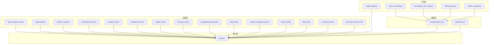
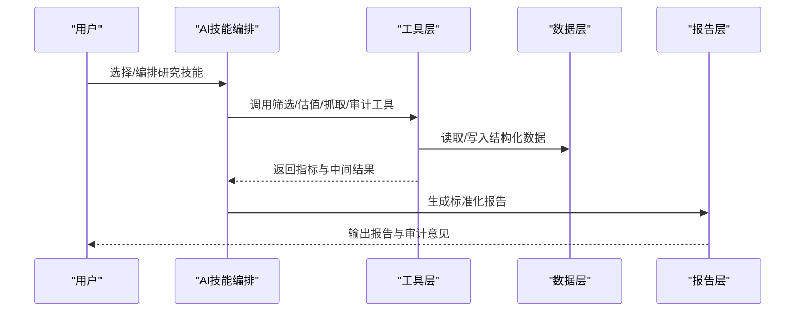
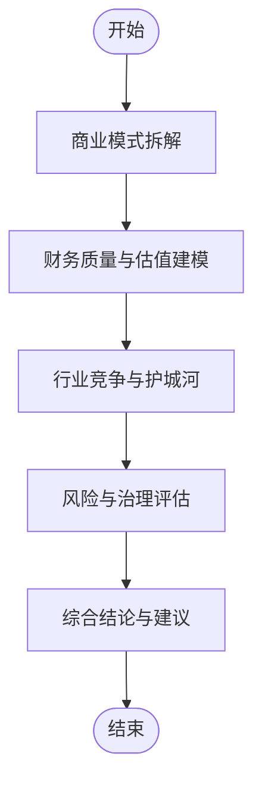
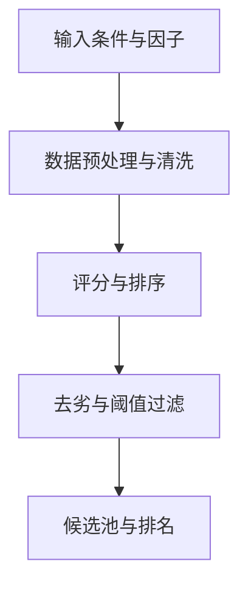
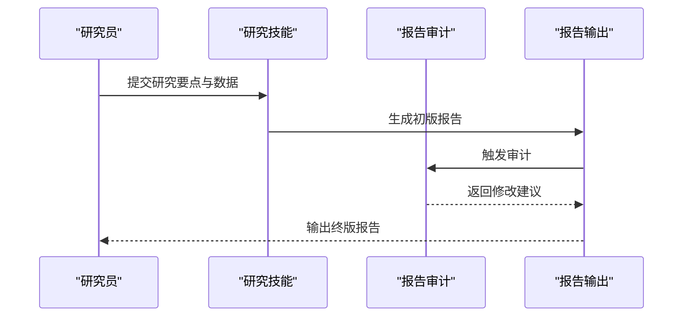
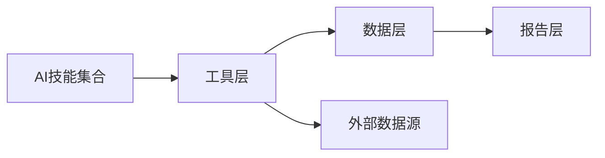

# 主要功能特性

<cite>
**本文引用的文件**   
- [README_EN.md](file://README_EN.md)
- [AGENTS.md](file://AGENTS.md)
- [CLAUDE.md](file://CLAUDE.md)
- [codex-skills/deep-company-series/SKILL.md](file://codex-skills/deep-company-series/SKILL.md)
- [codex-skills/financial-data/SKILL.md](file://codex-skills/financial-data/SKILL.md)
- [codex-skills/industry-research/SKILL.md](file://codex-skills/industry-research/SKILL.md)
- [codex-skills/investment-research/SKILL.md](file://codex-skills/investment-research/SKILL.md)
- [codex-skills/portfolio-review/SKILL.md](file://codex-skills/portfolio-review/SKILL.md)
- [codex-skills/bottleneck-hunter/SKILL.md](file://codex-skills/bottleneck-hunter/SKILL.md)
- [codex-skills/quality-screen/SKILL.md](file://codex-skills/quality-screen/SKILL.md)
- [codex-skills/earnings-review/SKILL.md](file://codex-skills/earnings-review/SKILL.md)
- [codex-skills/management-deep-dive/SKILL.md](file://codex-skills/management-deep-dive/SKILL.md)
- [codex-skills/news-pulse/SKILL.md](file://codex-skills/news-pulse/SKILL.md)
- [codex-skills/private-company-research/SKILL.md](file://codex-skills/private-company-research/SKILL.md)
- [codex-skills/thesis-tracker/SKILL.md](file://codex-skills/thesis-tracker/SKILL.md)
- [codex-skills/thesis-drift/SKILL.md](file://codex-skills/thesis-drift/SKILL.md)
- [codex-skills/investment-team/SKILL.md](file://codex-skills/investment-team/SKILL.md)
- [codex-skills/investment-memo-craft/SKILL.md](file://codex-skills/investment-memo-craft/SKILL.md)
- [tools/stock_screener.py](file://tools/stock_screener.py)
- [tools/morningstar_fair_value.py](file://tools/morningstar_fair_value.py)
- [tools/ashare_data.py](file://tools/ashare_data.py)
- [tools/report_audit.py](file://tools/report_audit.py)
- [tools/xueqiu_scraper.py](file://tools/xueqiu_scraper.py)
- [data/fundamentals.json](file://data/fundamentals.json)
- [data/watchlist.json](file://data/watchlist.json)
- [reports/AI产业研究/AI五层蛋糕-产业全景研究-20260605.md](file://reports/AI产业研究/AI五层蛋糕-产业全景研究-20260605.md)
- [reports/晨星深度低估/Broadridge-宽护城河-低估69%/报告.md](file://reports/晨星深度低估/Broadridge-宽护城河-低估69%/报告.md)
</cite>

## 目录
1. [简介](#简介)
2. [项目结构](#项目结构)
3. [核心组件](#核心组件)
4. [架构总览](#架构总览)
5. [详细组件分析](#详细组件分析)
6. [依赖关系分析](#依赖关系分析)
7. [性能与可扩展性](#性能与可扩展性)
8. [故障排查指南](#故障排查指南)
9. [结论](#结论)
10. [附录：技能清单与用途](#附录技能清单与用途)

## 简介
本文件面向投资研究与资产管理从业者，系统性介绍AI投资研究平台的核心功能特性。平台围绕“企业深度研究、AI技能系统、数据处理与分析工具、标准化报告生成、投资组合管理、多市场覆盖”六大能力构建，提供从线索发现到投研落地的全链路支持。通过可组合的AI技能与脚本化工具，平台将分散的数据源、分析方法与输出格式统一起来，形成可复用、可审计、可追踪的研究工作流。

## 项目结构
仓库采用“技能+脚本+数据+报告”的分层组织方式：
- codex-skills：以SKILL.md为入口的AI技能定义，覆盖商业模式、财务估值、行业竞争、风险管理、财报审阅、管理层深挖、新闻跟踪、主题追踪等。
- tools：数据处理与分析脚本（股票筛选器、晨星公允价值、A股数据抓取、报告审计、雪球爬虫等）。
- data：结构化数据样例（基本面快照、关注列表等）。
- reports：按公司与主题归档的研究报告与子报告，体现标准化输出与多场景应用。
- scripts：安装与同步脚本，便于部署与更新技能与提示词。

图表来源
- [codex-skills/deep-company-series/SKILL.md](file://codex-skills/deep-company-series/SKILL.md)
- [codex-skills/financial-data/SKILL.md](file://codex-skills/financial-data/SKILL.md)
- [codex-skills/industry-research/SKILL.md](file://codex-skills/industry-research/SKILL.md)
- [codex-skills/investment-research/SKILL.md](file://codex-skills/investment-research/SKILL.md)
- [codex-skills/portfolio-review/SKILL.md](file://codex-skills/portfolio-review/SKILL.md)
- [codex-skills/bottleneck-hunter/SKILL.md](file://codex-skills/bottleneck-hunter/SKILL.md)
- [codex-skills/quality-screen/SKILL.md](file://codex-skills/quality-screen/SKILL.md)
- [codex-skills/earnings-review/SKILL.md](file://codex-skills/earnings-review/SKILL.md)
- [codex-skills/management-deep-dive/SKILL.md](file://codex-skills/management-deep-dive/SKILL.md)
- [codex-skills/news-pulse/SKILL.md](file://codex-skills/news-pulse/SKILL.md)
- [codex-skills/private-company-research/SKILL.md](file://codex-skills/private-company-research/SKILL.md)
- [codex-skills/thesis-tracker/SKILL.md](file://codex-skills/thesis-tracker/SKILL.md)
- [codex-skills/thesis-drift/SKILL.md](file://codex-skills/thesis-drift/SKILL.md)
- [codex-skills/investment-team/SKILL.md](file://codex-skills/investment-team/SKILL.md)
- [codex-skills/investment-memo-craft/SKILL.md](file://codex-skills/investment-memo-craft/SKILL.md)
- [tools/stock_screener.py](file://tools/stock_screener.py)
- [tools/morningstar_fair_value.py](file://tools/morningstar_fair_value.py)
- [tools/ashare_data.py](file://tools/ashare_data.py)
- [tools/report_audit.py](file://tools/report_audit.py)
- [tools/xueqiu_scraper.py](file://tools/xueqiu_scraper.py)
- [data/fundamentals.json](file://data/fundamentals.json)
- [data/watchlist.json](file://data/watchlist.json)
- [reports/AI产业研究/AI五层蛋糕-产业全景研究-20260605.md](file://reports/AI产业研究/AI五层蛋糕-产业全景研究-20260605.md)

章节来源
- [README_EN.md](file://README_EN.md)
- [AGENTS.md](file://AGENTS.md)
- [CLAUDE.md](file://CLAUDE.md)

## 核心组件
- 企业深度研究：围绕商业模式、财务估值、行业竞争、风险治理四大维度展开，结合大师视角模板与团队协同流程，形成可复用的深度研究范式。
- AI技能系统：20+个可组合技能，覆盖从线索筛选、行业扫描、公司深挖、财报审阅、管理层评估、主题追踪到投研备忘录撰写的全流程。
- 数据处理与分析工具：提供股票筛选器、晨星公允价值计算、A股数据抓取、报告审计与外部信息爬取等工具，支撑高质量输入与一致性校验。
- 报告生成系统：基于标准模板与审计工具，输出结构化研究报告，适配内部评审、对外发布、公众号传播等多场景。
- 投资组合管理：持仓跟踪、绩效归因、风险暴露与论点漂移监控，辅助动态调仓与风险控制。
- 多市场覆盖：统一分析框架兼容A股、港股、美股，支持跨市场对比与轮动策略验证。

章节来源
- [codex-skills/deep-company-series/SKILL.md](file://codex-skills/deep-company-series/SKILL.md)
- [codex-skills/financial-data/SKILL.md](file://codex-skills/financial-data/SKILL.md)
- [codex-skills/industry-research/SKILL.md](file://codex-skills/industry-research/SKILL.md)
- [codex-skills/investment-research/SKILL.md](file://codex-skills/investment-research/SKILL.md)
- [codex-skills/portfolio-review/SKILL.md](file://codex-skills/portfolio-review/SKILL.md)
- [tools/stock_screener.py](file://tools/stock_screener.py)
- [tools/morningstar_fair_value.py](file://tools/morningstar_fair_value.py)
- [tools/ashare_data.py](file://tools/ashare_data.py)
- [tools/report_audit.py](file://tools/report_audit.py)

## 架构总览
平台采用“技能驱动+工具赋能+数据沉淀+报告输出”的闭环架构。用户通过选择或编排技能完成研究任务，工具层负责数据获取、清洗与指标计算，数据层提供持久化存储，报告层进行标准化输出与审计。

图表来源
- [codex-skills/investment-research/SKILL.md](file://codex-skills/investment-research/SKILL.md)
- [tools/stock_screener.py](file://tools/stock_screener.py)
- [tools/morningstar_fair_value.py](file://tools/morningstar_fair_value.py)
- [tools/ashare_data.py](file://tools/ashare_data.py)
- [tools/report_audit.py](file://tools/report_audit.py)
- [data/fundamentals.json](file://data/fundamentals.json)
- [reports/AI产业研究/AI五层蛋糕-产业全景研究-20260605.md](file://reports/AI产业研究/AI五层蛋糕-产业全景研究-20260605.md)

## 详细组件分析

### 企业深度研究
- 商业模式分析：从收入模型、客户价值、渠道与定价机制入手，识别盈利驱动与增长杠杆。
- 财务估值分析：结合历史财务质量与未来现金流假设，给出合理估值区间与安全边际判断。
- 行业竞争分析：运用波特五力与差异化定位，评估竞争格局与进入壁垒。
- 风险管理评估：从治理结构、合规风险、供应链与宏观周期角度进行压力测试。

使用场景与实际价值
- 场景：对目标公司进行“四段式”深度研究，快速形成可汇报的投资备忘录。
- 价值：降低主观偏差，提升研究一致性与可比性；为投委会决策提供结构化证据链。

章节来源
- [codex-skills/deep-company-series/SKILL.md](file://codex-skills/deep-company-series/SKILL.md)
- [codex-skills/financial-data/SKILL.md](file://codex-skills/financial-data/SKILL.md)
- [codex-skills/industry-research/SKILL.md](file://codex-skills/industry-research/SKILL.md)
- [codex-skills/management-deep-dive/SKILL.md](file://codex-skills/management-deep-dive/SKILL.md)

#### 企业深度研究流程图

图表来源
- [codex-skills/deep-company-series/SKILL.md](file://codex-skills/deep-company-series/SKILL.md)
- [codex-skills/financial-data/SKILL.md](file://codex-skills/financial-data/SKILL.md)
- [codex-skills/industry-research/SKILL.md](file://codex-skills/industry-research/SKILL.md)
- [codex-skills/management-deep-dive/SKILL.md](file://codex-skills/management-deep-dive/SKILL.md)

### AI技能系统（20+专业投资研究技能）
- 分类与用途
  - 研究与洞察：deep-company-series、industry-research、investment-research、private-company-research
  - 数据与筛选：financial-data、quality-screen、bottleneck-hunter
  - 财报与管理：earnings-review、management-deep-dive
  - 组合与风控：portfolio-review、thesis-tracker、thesis-drift
  - 协作与产出：investment-team、investment-memo-craft
  - 信息与舆情：news-pulse
- 编排方式：通过SKILL.md定义输入、步骤与输出规范，可按需组合形成端到端工作流。

使用场景与实际价值
- 场景：在热点赛道中快速拉出候选池，再对Top标的进行深度研究并生成投研备忘录。
- 价值：将专家经验固化为可执行流程，提高规模化研究与团队协作效率。

章节来源
- [codex-skills/deep-company-series/SKILL.md](file://codex-skills/deep-company-series/SKILL.md)
- [codex-skills/financial-data/SKILL.md](file://codex-skills/financial-data/SKILL.md)
- [codex-skills/industry-research/SKILL.md](file://codex-skills/industry-research/SKILL.md)
- [codex-skills/investment-research/SKILL.md](file://codex-skills/investment-research/SKILL.md)
- [codex-skills/portfolio-review/SKILL.md](file://codex-skills/portfolio-review/SKILL.md)
- [codex-skills/bottleneck-hunter/SKILL.md](file://codex-skills/bottleneck-hunter/SKILL.md)
- [codex-skills/quality-screen/SKILL.md](file://codex-skills/quality-screen/SKILL.md)
- [codex-skills/earnings-review/SKILL.md](file://codex-skills/earnings-review/SKILL.md)
- [codex-skills/management-deep-dive/SKILL.md](file://codex-skills/management-deep-dive/SKILL.md)
- [codex-skills/news-pulse/SKILL.md](file://codex-skills/news-pulse/SKILL.md)
- [codex-skills/private-company-research/SKILL.md](file://codex-skills/private-company-research/SKILL.md)
- [codex-skills/thesis-tracker/SKILL.md](file://codex-skills/thesis-tracker/SKILL.md)
- [codex-skills/thesis-drift/SKILL.md](file://codex-skills/thesis-drift/SKILL.md)
- [codex-skills/investment-team/SKILL.md](file://codex-skills/investment-team/SKILL.md)
- [codex-skills/investment-memo-craft/SKILL.md](file://codex-skills/investment-memo-craft/SKILL.md)

### 数据处理与分析工具
- 股票筛选器：基于多维因子与去劣规则，快速生成候选池与排名。
- 晨星公允价值：结合护城河与估值指标，输出公允价值与折溢价率。
- A股数据抓取：自动化采集行情与基本面数据，减少手工整理成本。
- 报告审计：对报告结构与关键结论进行一致性检查，提升输出质量。
- 外部信息爬取：补充非结构化信息源，增强研究广度与时效性。

使用场景与实际价值
- 场景：每日自动扫描市场，筛选符合策略条件的标的，并生成初筛报告。
- 价值：将重复性工作自动化，释放研究员精力用于高附加值分析与判断。

章节来源
- [tools/stock_screener.py](file://tools/stock_screener.py)
- [tools/morningstar_fair_value.py](file://tools/morningstar_fair_value.py)
- [tools/ashare_data.py](file://tools/ashare_data.py)
- [tools/report_audit.py](file://tools/report_audit.py)
- [tools/xueqiu_scraper.py](file://tools/xueqiu_scraper.py)
- [data/fundamentals.json](file://data/fundamentals.json)
- [data/watchlist.json](file://data/watchlist.json)

#### 股票筛选流程（概念图）

图表来源
- [tools/stock_screener.py](file://tools/stock_screener.py)
- [data/fundamentals.json](file://data/fundamentals.json)

### 报告生成系统
- 标准化输出：统一的章节结构、数据口径与可视化规范，确保不同作者与团队间的一致性。
- 多场景应用：内部投委会材料、对外研报、公众号文章、专题简报等。
- 审计与回溯：通过审计工具校验关键结论与数据来源，形成可追溯的证据链。

使用场景与实际价值
- 场景：将深度研究过程转化为可直接发布的报告，缩短从研究到传播的时间。
- 价值：提升品牌影响力与投研透明度，便于复盘与知识沉淀。

章节来源
- [reports/AI产业研究/AI五层蛋糕-产业全景研究-20260605.md](file://reports/AI产业研究/AI五层蛋糕-产业全景研究-20260605.md)
- [tools/report_audit.py](file://tools/report_audit.py)

#### 报告生成序列图（概念）

图表来源
- [tools/report_audit.py](file://tools/report_audit.py)
- [reports/AI产业研究/AI五层蛋糕-产业全景研究-20260605.md](file://reports/AI产业研究/AI五层蛋糕-产业全景研究-20260605.md)

### 投资组合管理
- 持仓跟踪：记录买入逻辑、仓位变化与事件驱动因素。
- 绩效分析：收益分解、回撤与波动特征、相对基准表现。
- 风险评估：集中度、流动性、风格暴露与尾部风险监测。
- 论点追踪与漂移：持续对照初始投资论点，识别偏离与修正点。

使用场景与实际价值
- 场景：季度组合回顾与调仓决策，明确哪些论点被验证、哪些需要调整。
- 价值：避免情绪化交易，提升纪律性与长期胜率。

章节来源
- [codex-skills/portfolio-review/SKILL.md](file://codex-skills/portfolio-review/SKILL.md)
- [codex-skills/thesis-tracker/SKILL.md](file://codex-skills/thesis-tracker/SKILL.md)
- [codex-skills/thesis-drift/SKILL.md](file://codex-skills/thesis-drift/SKILL.md)

### 多市场覆盖能力
- 统一分析框架：同一套技能与工具适用于A股、港股、美股，保证方法论一致性。
- 跨市场对比：同赛道公司在不同市场的估值与成长差异一目了然。
- 轮动与配置：基于统一因子体系进行跨市场比较与权重优化。

使用场景与实际价值
- 场景：在全球科技产业链中寻找最具性价比的标的，实现跨市场配置。
- 价值：扩大机会集，提升组合的风险调整后收益。

章节来源
- [codex-skills/investment-research/SKILL.md](file://codex-skills/investment-research/SKILL.md)
- [tools/ashare_data.py](file://tools/ashare_data.py)
- [tools/morningstar_fair_value.py](file://tools/morningstar_fair_value.py)

## 依赖关系分析
- 技能与工具耦合：各技能通过工具层获取数据与计算指标，降低硬编码依赖，提升可替换性。
- 数据与报告解耦：数据层以JSON/CSV等形式持久化，报告层仅消费稳定接口，便于版本管理与回滚。
- 外部依赖最小化：优先使用本地脚本与开源库，必要时通过爬虫补充非结构化信息。

图表来源
- [codex-skills/investment-research/SKILL.md](file://codex-skills/investment-research/SKILL.md)
- [tools/stock_screener.py](file://tools/stock_screener.py)
- [tools/morningstar_fair_value.py](file://tools/morningstar_fair_value.py)
- [tools/ashare_data.py](file://tools/ashare_data.py)
- [tools/report_audit.py](file://tools/report_audit.py)
- [tools/xueqiu_scraper.py](file://tools/xueqiu_scraper.py)
- [data/fundamentals.json](file://data/fundamentals.json)

章节来源
- [AGENTS.md](file://AGENTS.md)
- [CLAUDE.md](file://CLAUDE.md)

## 性能与可扩展性
- 批处理与并行：筛选与估值类工具适合批量运行，结合任务队列提升吞吐。
- 缓存与增量更新：对高频数据采用增量更新与缓存策略，减少重复计算。
- 模块化扩展：新增技能只需遵循SKILL.md约定，即可无缝接入现有流水线。

[本节为通用指导，不直接分析具体文件]

## 故障排查指南
- 数据缺失或异常：核对数据源可用性、字段映射与时间窗口；使用审计工具定位不一致项。
- 工具执行失败：检查依赖环境、权限与网络连通性；查看日志与错误码。
- 报告质量不稳定：强化审计规则与模板约束，增加关键结论的交叉验证。

章节来源
- [tools/report_audit.py](file://tools/report_audit.py)
- [tools/xueqiu_scraper.py](file://tools/xueqiu_scraper.py)

## 结论
平台以“技能化研究+工具化执行+标准化输出”为核心，打通从线索到报告的完整链路。通过可组合的AI技能与稳健的工具链，平台显著提升了研究效率与一致性，并为跨市场、多场景的投资决策提供了可靠支撑。

[本节为总结性内容，不直接分析具体文件]

## 附录：技能清单与用途
- deep-company-series：企业深度研究系列，覆盖商业模式、财务、竞争与风险。
- financial-data：财务数据分析与指标计算。
- industry-research：行业研究与竞争格局梳理。
- investment-research：投资研究全流程指引。
- portfolio-review：投资组合回顾与归因。
- bottleneck-hunter：瓶颈与卡脖子环节挖掘。
- quality-screen：质量筛选与去劣规则。
- earnings-review：财报审阅与业绩解读。
- management-deep-dive：管理层与公司治理深挖。
- news-pulse：新闻与舆情跟踪。
- private-company-research：非上市公司研究。
- thesis-tracker：投资论点追踪。
- thesis-drift：论点漂移检测。
- investment-team：投研团队协作流程。
- investment-memo-craft：投研备忘录撰写。

章节来源
- [codex-skills/deep-company-series/SKILL.md](file://codex-skills/deep-company-series/SKILL.md)
- [codex-skills/financial-data/SKILL.md](file://codex-skills/financial-data/SKILL.md)
- [codex-skills/industry-research/SKILL.md](file://codex-skills/industry-research/SKILL.md)
- [codex-skills/investment-research/SKILL.md](file://codex-skills/investment-research/SKILL.md)
- [codex-skills/portfolio-review/SKILL.md](file://codex-skills/portfolio-review/SKILL.md)
- [codex-skills/bottleneck-hunter/SKILL.md](file://codex-skills/bottleneck-hunter/SKILL.md)
- [codex-skills/quality-screen/SKILL.md](file://codex-skills/quality-screen/SKILL.md)
- [codex-skills/earnings-review/SKILL.md](file://codex-skills/earnings-review/SKILL.md)
- [codex-skills/management-deep-dive/SKILL.md](file://codex-skills/management-deep-dive/SKILL.md)
- [codex-skills/news-pulse/SKILL.md](file://codex-skills/news-pulse/SKILL.md)
- [codex-skills/private-company-research/SKILL.md](file://codex-skills/private-company-research/SKILL.md)
- [codex-skills/thesis-tracker/SKILL.md](file://codex-skills/thesis-tracker/SKILL.md)
- [codex-skills/thesis-drift/SKILL.md](file://codex-skills/thesis-drift/SKILL.md)
- [codex-skills/investment-team/SKILL.md](file://codex-skills/investment-team/SKILL.md)
- [codex-skills/investment-memo-craft/SKILL.md](file://codex-skills/investment-memo-craft/SKILL.md)