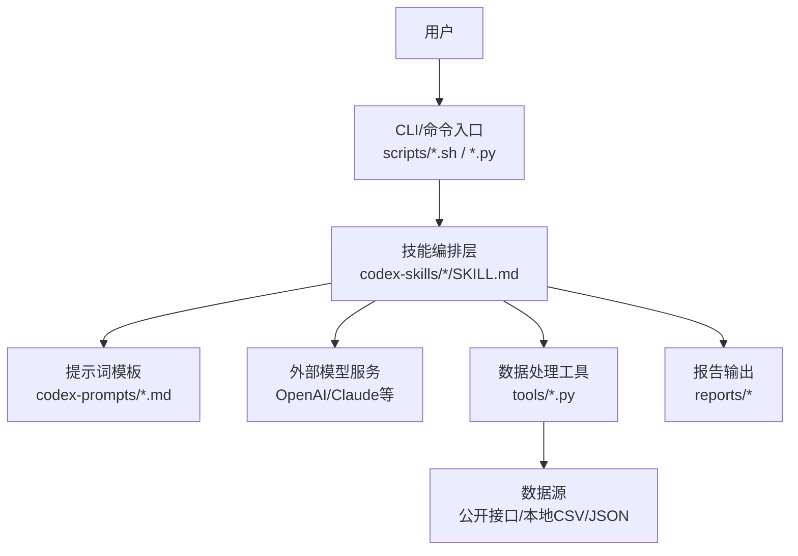
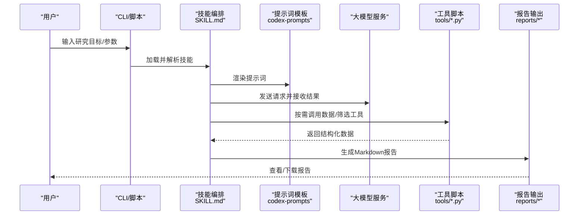
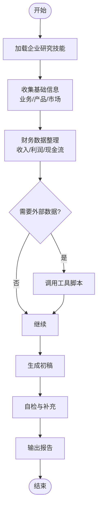
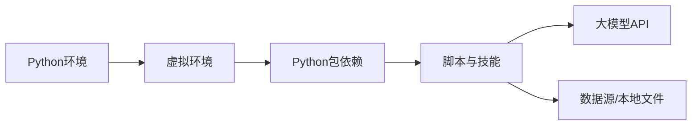

# 快速开始指南

<cite>
**本文引用的文件**   
- [README_EN.md](file://README_EN.md)
- [AGENTS.md](file://AGENTS.md)
- [CLAUDE.md](file://CLAUDE.md)
- [install-codex-skills.sh](file://scripts/install-codex-skills.sh)
- [install-codex-prompts.sh](file://scripts/install-codex-prompts.sh)
- [sync-codex-skills.py](file://scripts/sync-codex-skills.py)
- [sync-codex-prompts.py](file://scripts/sync-codex-prompts.py)
- [SKILL.md](file://codex-skills/investment-research/SKILL.md)
- [SKILL.md](file://codex-skills/earnings-review/SKILL.md)
- [SKILL.md](file://codex-skills/industry-research/SKILL.md)
- [SKILL.md](file://codex-skills/financial-data/SKILL.md)
- [investment-memo-craft.yaml](file://codex-skills/investment-memo-craft/agents/openai.yaml)
- [stock_screener.py](file://tools/stock_screener.py)
- [morningstar_fair_value.py](file://tools/morningstar_fair_value.py)
- [xueqiu_scraper.py](file://tools/xueqiu_scraper.py)
</cite>

## 目录
1. [简介](#简介)
2. [项目结构](#项目结构)
3. [核心组件](#核心组件)
4. [架构总览](#架构总览)
5. [详细组件分析](#详细组件分析)
6. [依赖分析](#依赖分析)
7. [性能考虑](#性能考虑)
8. [故障排除指南](#故障排除指南)
9. [结论](#结论)
10. [附录](#附录)

## 简介
本指南面向首次使用者，帮助你在30分钟内完成AI投资研究平台的安装、配置与首次使用。你将学会：
- 准备Python环境并安装依赖
- 配置必要的API密钥
- 启动智能体、选择分析技能、输入研究目标并获取报告
- 通过命令行工具执行企业研究、财报分析、行业扫描等典型任务
- 了解配置文件的基本结构与常用选项
- 快速定位和解决常见问题

## 项目结构
仓库采用“技能+提示词+脚本+示例报告”的组织方式：
- codex-skills：可插拔的分析技能（如企业研究、财报审阅、行业研究、财务数据）
- codex-prompts：对应技能的提示词模板
- scripts：一键安装与同步脚本（Shell/Python）
- tools：辅助工具（选股器、晨星公允价值、雪球爬虫等）
- reports：历史研究报告样例，便于参考输出格式与深度
- data：示例数据与中间结果

图表来源
- [install-codex-skills.sh](file://scripts/install-codex-skills.sh)
- [install-codex-prompts.sh](file://scripts/install-codex-prompts.sh)
- [SKILL.md](file://codex-skills/investment-research/SKILL.md)
- [stock_screener.py](file://tools/stock_screener.py)

章节来源
- [README_EN.md](file://README_EN.md)
- [AGENTS.md](file://AGENTS.md)
- [CLAUDE.md](file://CLAUDE.md)

## 核心组件
- 技能系统（codex-skills）：以SKILL.md定义能力边界、输入输出与流程，支持组合调用多个子技能
- 提示词库（codex-prompts）：为不同场景提供高质量提示词模板，驱动大模型生成结构化内容
- 安装与同步脚本（scripts）：自动化安装技能与提示词，保持本地与仓库一致
- 工具集（tools）：提供选股筛选、估值计算、信息抓取等实用脚本
- 报告输出（reports）：标准化Markdown报告，便于归档与分享

章节来源
- [SKILL.md](file://codex-skills/investment-research/SKILL.md)
- [SKILL.md](file://codex-skills/earnings-review/SKILL.md)
- [SKILL.md](file://codex-skills/industry-research/SKILL.md)
- [SKILL.md](file://codex-skills/financial-data/SKILL.md)
- [install-codex-skills.sh](file://scripts/install-codex-skills.sh)
- [install-codex-prompts.sh](file://scripts/install-codex-prompts.sh)
- [stock_screener.py](file://tools/stock_screener.py)
- [morningstar_fair_value.py](file://tools/morningstar_fair_value.py)
- [xueqiu_scraper.py](file://tools/xueqiu_scraper.py)

## 架构总览
整体工作流由“用户指令→技能编排→提示词渲染→模型推理→工具增强→报告生成”构成。

图表来源
- [SKILL.md](file://codex-skills/investment-research/SKILL.md)
- [install-codex-skills.sh](file://scripts/install-codex-skills.sh)
- [stock_screener.py](file://tools/stock_screener.py)

## 详细组件分析

### 技能：企业研究（investment-research）
- 职责：围绕公司商业模式、竞争格局、财务质量、风险与估值进行系统性研究
- 输入：公司名称/代码、关注点、时间范围、对比公司
- 输出：结构化研究报告（Markdown），包含关键指标、风险提示与结论

图表来源
- [SKILL.md](file://codex-skills/investment-research/SKILL.md)

章节来源
- [SKILL.md](file://codex-skills/investment-research/SKILL.md)

### 技能：财报审阅（earnings-review）
- 职责：聚焦最新财报的关键变化、管理层指引、异常项与后续影响
- 输入：公司/报告期、关注科目、同业对比
- 输出：财报要点、趋势判断与风险提示

章节来源
- [SKILL.md](file://codex-skills/earnings-review/SKILL.md)

### 技能：行业研究（industry-research）
- 职责：梳理产业链结构、关键环节、竞争态势与增长驱动
- 输入：行业名称、细分赛道、地域范围
- 输出：产业全景图、重点公司与机会清单

章节来源
- [SKILL.md](file://codex-skills/industry-research/SKILL.md)

### 技能：财务数据（financial-data）
- 职责：拉取与清洗财务指标，生成可视化或表格化结果
- 输入：标的列表、指标集合、时间窗口
- 输出：标准化数据集与简要解读

章节来源
- [SKILL.md](file://codex-skills/financial-data/SKILL.md)

### 配置：Agent与模型（openai.yaml）
- 用途：指定模型提供商、模型名、温度、最大长度等参数
- 位置：codex-skills/investment-memo-craft/agents/openai.yaml
- 建议：根据可用模型与预算调整并发与上限

章节来源
- [investment-memo-craft.yaml](file://codex-skills/investment-memo-craft/agents/openai.yaml)

### 命令行与脚本
- 安装技能：scripts/install-codex-skills.sh
- 安装提示词：scripts/install-codex-prompts.sh
- 同步更新：scripts/sync-codex-skills.py、scripts/sync-codex-prompts.py
- 工具脚本：tools/stock_screener.py、tools/morningstar_fair_value.py、tools/xueqiu_scraper.py

章节来源
- [install-codex-skills.sh](file://scripts/install-codex-skills.sh)
- [install-codex-prompts.sh](file://scripts/install-codex-prompts.sh)
- [sync-codex-skills.py](file://scripts/sync-codex-skills.py)
- [sync-codex-prompts.py](file://scripts/sync-codex-prompts.py)
- [stock_screener.py](file://tools/stock_screener.py)
- [morningstar_fair_value.py](file://tools/morningstar_fair_value.py)
- [xueqiu_scraper.py](file://tools/xueqiu_scraper.py)

## 依赖分析
- Python环境：建议使用Python 3.10+；虚拟环境隔离依赖
- 第三方库：各脚本的requirements通常位于同级目录或根级；若未提供，请根据导入语句补齐
- 外部服务：大模型API（OpenAI/Claude等）、可选的数据源（如晨星、雪球等）
- 文件权限：确保对reports与data目录有写入权限

[此图为概念性依赖关系，无需图表来源]

## 性能考虑
- 并发控制：在openai.yaml中合理设置并发与超时，避免触发限流
- 缓存策略：对重复查询的财务/行情数据做本地缓存，减少重复请求
- 增量更新：优先增量拉取数据，避免全量重算
- 批处理：批量选股与批量研报生成时，分批次提交，降低峰值压力

[本节为通用指导，无需章节来源]

## 故障排除指南
- 无法连接大模型API
  - 检查网络与代理设置
  - 确认API密钥已正确配置且未过期
  - 查看openai.yaml中的模型与端点配置
- 技能或提示词缺失
  - 重新运行安装脚本，确保路径正确
  - 使用同步脚本拉取最新版本
- 工具脚本报错
  - 检查是否缺少Python依赖
  - 核对输入参数与数据文件格式
  - 查看日志输出定位具体错误
- 报告未生成或为空
  - 检查输出目录权限
  - 确认技能执行链完整，无中断错误
  - 适当增加重试次数或放宽限制

章节来源
- [investment-memo-craft.yaml](file://codex-skills/investment-memo-craft/agents/openai.yaml)
- [install-codex-skills.sh](file://scripts/install-codex-skills.sh)
- [install-codex-prompts.sh](file://scripts/install-codex-prompts.sh)
- [sync-codex-skills.py](file://scripts/sync-codex-skills.py)
- [sync-codex-prompts.py](file://scripts/sync-codex-prompts.py)
- [stock_screener.py](file://tools/stock_screener.py)
- [morningstar_fair_value.py](file://tools/morningstar_fair_value.py)
- [xueqiu_scraper.py](file://tools/xueqiu_scraper.py)

## 结论
通过本指南，你已完成环境搭建、技能安装与首次研究任务。建议从“企业研究”入手，逐步扩展至“财报审阅”“行业研究”“财务数据”等技能，并结合工具脚本提升效率。遇到问题时，优先检查API配置、脚本安装与权限设置。

[本节为总结性内容，无需章节来源]

## 附录

### 安装与环境配置步骤
- 准备Python环境
  - 安装Python 3.10+
  - 创建并激活虚拟环境
- 安装依赖
  - 进入项目根目录
  - 运行安装脚本：scripts/install-codex-skills.sh、scripts/install-codex-prompts.sh
  - 如需更新，运行同步脚本：scripts/sync-codex-skills.py、scripts/sync-codex-prompts.py
- 配置API密钥
  - 在openai.yaml中填写模型与密钥信息
  - 保存后重启相关进程或重新加载配置
- 验证安装
  - 运行一个简单技能（如企业研究）
  - 检查reports目录下是否生成报告

章节来源
- [install-codex-skills.sh](file://scripts/install-codex-skills.sh)
- [install-codex-prompts.sh](file://scripts/install-codex-prompts.sh)
- [sync-codex-skills.py](file://scripts/sync-codex-skills.py)
- [sync-codex-prompts.py](file://scripts/sync-codex-prompts.py)
- [investment-memo-craft.yaml](file://codex-skills/investment-memo-craft/agents/openai.yaml)

### 基本使用流程
- 启动智能体：通过CLI或脚本加载所需技能
- 选择分析技能：根据需求选择企业研究、财报审阅、行业研究或财务数据
- 输入研究目标：明确公司/行业、时间范围、关注点
- 获取分析报告：查看reports目录下的Markdown报告，必要时二次迭代

章节来源
- [SKILL.md](file://codex-skills/investment-research/SKILL.md)
- [SKILL.md](file://codex-skills/earnings-review/SKILL.md)
- [SKILL.md](file://codex-skills/industry-research/SKILL.md)
- [SKILL.md](file://codex-skills/financial-data/SKILL.md)

### 典型使用示例
- 企业研究
  - 目标：评估某公司的商业模式与护城河
  - 步骤：选择“企业研究”技能→输入公司名与关注点→生成报告→结合工具脚本补充数据
- 财报分析
  - 目标：解读最新季报的核心变化
  - 步骤：选择“财报审阅”技能→指定报告期与科目→输出要点与风险提示
- 行业扫描
  - 目标：梳理AI算力产业链关键环节
  - 步骤：选择“行业研究”技能→输入行业与细分→产出全景图与公司清单
- 财务数据提取
  - 目标：批量拉取多家公司财务指标
  - 步骤：选择“财务数据”技能→设定指标与时间窗口→导出标准化数据
- 选股筛选
  - 目标：基于估值与质量因子筛选标的
  - 步骤：运行stock_screener.py→配置筛选条件→输出候选池

章节来源
- [SKILL.md](file://codex-skills/investment-research/SKILL.md)
- [SKILL.md](file://codex-skills/earnings-review/SKILL.md)
- [SKILL.md](file://codex-skills/industry-research/SKILL.md)
- [SKILL.md](file://codex-skills/financial-data/SKILL.md)
- [stock_screener.py](file://tools/stock_screener.py)

### 配置文件结构与常用选项
- openai.yaml
  - 模型与端点：provider、model、base_url
  - 生成参数：temperature、max_tokens、top_p
  - 并发与重试：concurrency、retries、timeout
- 其他配置
  - 数据源开关：是否启用外部数据接口
  - 输出路径：reports与data目录映射
  - 日志级别：INFO/WARN/ERROR

章节来源
- [investment-memo-craft.yaml](file://codex-skills/investment-memo-craft/agents/openai.yaml)

### 命令行工具速查
- 安装与同步
  - install-codex-skills.sh：安装技能
  - install-codex-prompts.sh：安装提示词
  - sync-codex-skills.py：同步技能版本
  - sync-codex-prompts.py：同步提示词版本
- 工具脚本
  - stock_screener.py：股票筛选
  - morningstar_fair_value.py：晨星公允价值计算
  - xueqiu_scraper.py：雪球信息抓取

章节来源
- [install-codex-skills.sh](file://scripts/install-codex-skills.sh)
- [install-codex-prompts.sh](file://scripts/install-codex-prompts.sh)
- [sync-codex-skills.py](file://scripts/sync-codex-skills.py)
- [sync-codex-prompts.py](file://scripts/sync-codex-prompts.py)
- [stock_screener.py](file://tools/stock_screener.py)
- [morningstar_fair_value.py](file://tools/morningstar_fair_value.py)
- [xueqiu_scraper.py](file://tools/xueqiu_scraper.py)