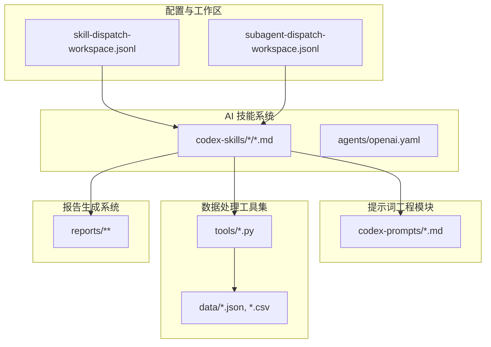
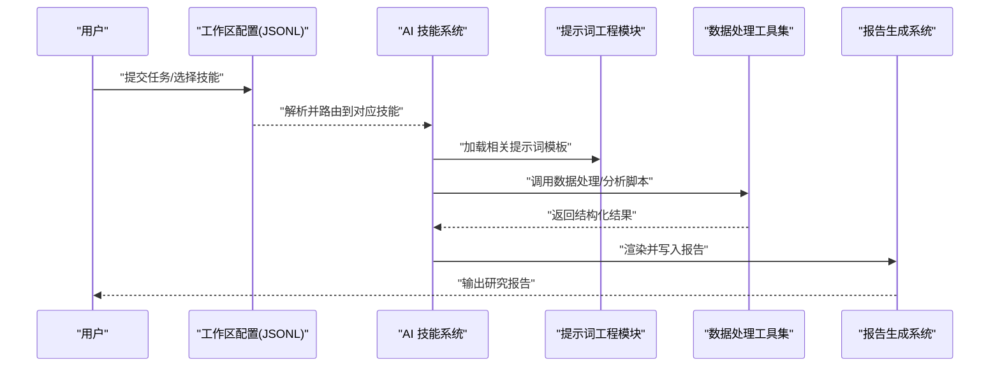
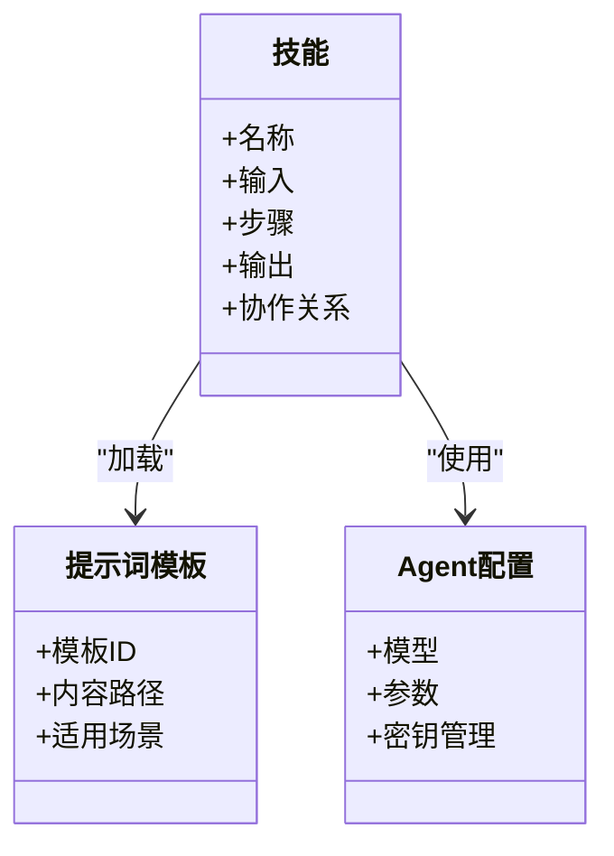
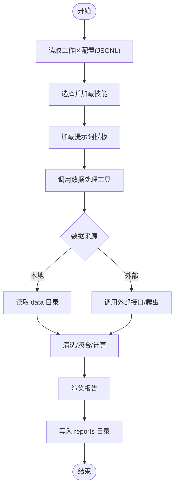
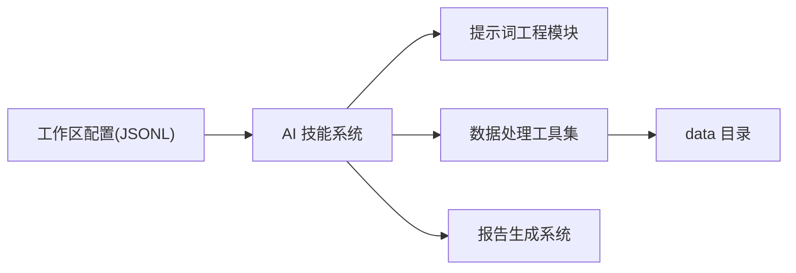

# 核心架构概览

<cite>
**本文引用的文件**   
- [README_EN.md](file://README_EN.md)
- [AGENTS.md](file://AGENTS.md)
- [CLAUDE.md](file://CLAUDE.md)
- [skill-dispatch-workspace.jsonl](file://.owner/skill-dispatch-workspace.jsonl)
- [subagent-dispatch-workspace.jsonl](file://.owner/subagent-dispatch-workspace.jsonl)
- [investment-memo-craft/SKILL.md](file://codex-skills/investment-memo-craft/SKILL.md)
- [investment-memo-craft/agents/openai.yaml](file://codex-skills/investment-memo-craft/agents/openai.yaml)
- [financial-data/SKILL.md](file://codex-skills/financial-data/SKILL.md)
- [industry-research/SKILL.md](file://codex-skills/industry-research/SKILL.md)
- [investment-research/SKILL.md](file://codex-skills/investment-research/SKILL.md)
- [earnings-review/SKILL.md](file://codex-skills/earnings-review/SKILL.md)
- [portfolio-review/SKILL.md](file://codex-skills/portfolio-review/SKILL.md)
- [bottleneck-hunter/SKILL.md](file://codex-skills/bottleneck-hunter/SKILL.md)
- [quality-screen/SKILL.md](file://codex-skills/quality-screen/SKILL.md)
- [thesis-tracker/SKILL.md](file://codex-skills/thesis-tracker/SKILL.md)
- [deep-company-series/SKILL.md](file://codex-skills/deep-company-series/SKILL.md)
- [management-deep-dive/SKILL.md](file://codex-skills/management-deep-dive/SKILL.md)
- [news-pulse/SKILL.md](file://codex-skills/news-pulse/SKILL.md)
- [private-company-research/SKILL.md](file://codex-skills/private-company-research/SKILL.md)
- [dyp-ask/SKILL.md](file://codex-skills/dyp-ask/SKILL.md)
- [wechat-article/SKILL.md](file://codex-skills/wechat-article/SKILL.md)
- [investment-checklist/SKILL.md](file://codex-skills/investment-checklist/SKILL.md)
- [investment-team/SKILL.md](file://codex-skills/investment-team/SKILL.md)
- [earnings-team/SKILL.md](file://codex-skills/earnings-team/SKILL.md)
- [industry-funnel/SKILL.md](file://codex-skills/industry-funnel/SKILL.md)
- [thesis-drift/SKILL.md](file://codex-skills/thesis-drift/SKILL.md)
- [stock_screener.py](file://tools/stock_screener.py)
- [morningstar_fair_value.py](file://tools/morningstar_fair_value.py)
- [ashare_data.py](file://tools/ashare_data.py)
- [xueqiu_scraper.py](file://tools/xueqiu_scraper.py)
- [momentum_backtest.py](file://tools/momentum_backtest.py)
- [momentum_backtest_v2.py](file://tools/momentum_backtest_v2.py)
- [report_audit.py](file://tools/report_audit.py)
- [financial_rigor.py](file://tools/financial_rigor.py)
- [install-codex-prompts.sh](file://scripts/install-codex-prompts.sh)
- [sync-codex-prompts.py](file://scripts/sync-codex-prompts.py)
- [install-codex-skills.sh](file://scripts/install-codex-skills.sh)
- [sync-codex-skills.py](file://scripts/sync-codex-skills.py)
- [fundamentals.json](file://data/fundamentals.json)
- [watchlist.json](file://data/watchlist.json)
- [AI五层蛋糕-产业全景研究-20260605.md](file://reports/AI产业研究/AI五层蛋糕-产业全景研究-20260605.md)
</cite>

## 目录
1. [简介](#简介)
2. [项目结构](#项目结构)
3. [核心组件](#核心组件)
4. [架构总览](#架构总览)
5. [详细组件分析](#详细组件分析)
6. [依赖关系分析](#依赖关系分析)
7. [性能与可扩展性](#性能与可扩展性)
8. [故障排查指南](#故障排查指南)
9. [结论](#结论)
10. [附录](#附录)

## 简介
本文件面向开发者与投研使用者，系统化阐述 AI 投资研究平台的整体架构。平台围绕四大核心组件构建：AI 技能系统、提示词工程模块、数据处理工具集、报告生成系统。通过“配置驱动”的设计（以 JSONL 工作区与 SKILL 定义为核心），实现可插拔的技能编排、模板化的输出格式与可扩展的工具生态，形成从用户输入到 AI 处理再到报告输出的端到端流水线。

## 项目结构
仓库采用“能力即配置”的模块化组织方式：
- codex-skills：按业务场景划分的“技能包”，每个技能包含 SKILL.md 描述其职责、输入输出与协作方式；部分技能附带 agents 配置（如 openai.yaml）用于模型选择与参数控制。
- codex-prompts：提示词模板集合，覆盖行业研究、财报审阅、组合复盘等任务，供技能在运行时加载。
- tools：数据处理与分析脚本，涵盖选股筛选、财务数据抓取、回测、审计校验等。
- scripts：安装与同步脚本，负责将 prompts 与 skills 部署到本地或代理环境。
- data：结构化数据与清单（如 fundamentals.json、watchlist.json）。
- reports：最终研究报告与子报告的持久化输出。
- .owner：JSONL 工作区配置文件，用于调度技能与子智能体。

图示来源
- [skill-dispatch-workspace.jsonl](file://.owner/skill-dispatch-workspace.jsonl)
- [subagent-dispatch-workspace.jsonl](file://.owner/subagent-dispatch-workspace.jsonl)
- [investment-memo-craft/SKILL.md](file://codex-skills/investment-memo-craft/SKILL.md)
- [investment-memo-craft/agents/openai.yaml](file://codex-skills/investment-memo-craft/agents/openai.yaml)
- [financial-data/SKILL.md](file://codex-skills/financial-data/SKILL.md)
- [industry-research/SKILL.md](file://codex-skills/industry-research/SKILL.md)
- [investment-research/SKILL.md](file://codex-skills/investment-research/SKILL.md)
- [earnings-review/SKILL.md](file://codex-skills/earnings-review/SKILL.md)
- [portfolio-review/SKILL.md](file://codex-skills/portfolio-review/SKILL.md)
- [bottleneck-hunter/SKILL.md](file://codex-skills/bottleneck-hunter/SKILL.md)
- [quality-screen/SKILL.md](file://codex-skills/quality-screen/SKILL.md)
- [thesis-tracker/SKILL.md](file://codex-skills/thesis-tracker/SKILL.md)
- [deep-company-series/SKILL.md](file://codex-skills/deep-company-series/SKILL.md)
- [management-deep-dive/SKILL.md](file://codex-skills/management-deep-dive/SKILL.md)
- [news-pulse/SKILL.md](file://codex-skills/news-pulse/SKILL.md)
- [private-company-research/SKILL.md](file://codex-skills/private-company-research/SKILL.md)
- [dyp-ask/SKILL.md](file://codex-skills/dyp-ask/SKILL.md)
- [wechat-article/SKILL.md](file://codex-skills/wechat-article/SKILL.md)
- [investment-checklist/SKILL.md](file://codex-skills/investment-checklist/SKILL.md)
- [investment-team/SKILL.md](file://codex-skills/investment-team/SKILL.md)
- [earnings-team/SKILL.md](file://codex-skills/earnings-team/SKILL.md)
- [industry-funnel/SKILL.md](file://codex-skills/industry-funnel/SKILL.md)
- [thesis-drift/SKILL.md](file://codex-skills/thesis-drift/SKILL.md)
- [stock_screener.py](file://tools/stock_screener.py)
- [morningstar_fair_value.py](file://tools/morningstar_fair_value.py)
- [ashare_data.py](file://tools/ashare_data.py)
- [xueqiu_scraper.py](file://tools/xueqiu_scraper.py)
- [momentum_backtest.py](file://tools/momentum_backtest.py)
- [momentum_backtest_v2.py](file://tools/momentum_backtest_v2.py)
- [report_audit.py](file://tools/report_audit.py)
- [financial_rigor.py](file://tools/financial_rigor.py)
- [fundamentals.json](file://data/fundamentals.json)
- [watchlist.json](file://data/watchlist.json)
- [AI五层蛋糕-产业全景研究-20260605.md](file://reports/AI产业研究/AI五层蛋糕-产业全景研究-20260605.md)

章节来源
- [README_EN.md](file://README_EN.md)
- [AGENTS.md](file://AGENTS.md)
- [CLAUDE.md](file://CLAUDE.md)

## 核心组件
- AI 技能系统
  - 以 codex-skills 为单元，每个技能通过 SKILL.md 声明目标、输入、步骤、输出与协作关系；支持多模型 agent 配置（如 openai.yaml）。
  - 典型技能包括：行业研究、财报审阅、组合复盘、瓶颈挖掘、质量筛选、主题跟踪、深度公司系列、管理层深挖、新闻脉冲、非上市公司研究、DYP问答、公众号文章、投资检查清单、投研团队协同、盈利团队、行业漏斗、论点漂移监控等。
- 提示词工程模块
  - codex-prompts 提供标准化提示词模板，被各技能在运行时按需加载，确保风格一致、口径统一。
- 数据处理工具集
  - tools 下 Python 脚本提供数据获取、清洗、筛选、回测与审计能力；data 目录存放基础数据集与清单。
- 报告生成系统
  - reports 作为最终产物落盘目录，按主题与公司维度组织，便于检索与归档。

章节来源
- [investment-memo-craft/SKILL.md](file://codex-skills/investment-memo-craft/SKILL.md)
- [investment-memo-craft/agents/openai.yaml](file://codex-skills/investment-memo-craft/agents/openai.yaml)
- [financial-data/SKILL.md](file://codex-skills/financial-data/SKILL.md)
- [industry-research/SKILL.md](file://codex-skills/industry-research/SKILL.md)
- [investment-research/SKILL.md](file://codex-skills/investment-research/SKILL.md)
- [earnings-review/SKILL.md](file://codex-skills/earnings-review/SKILL.md)
- [portfolio-review/SKILL.md](file://codex-skills/portfolio-review/SKILL.md)
- [bottleneck-hunter/SKILL.md](file://codex-skills/bottleneck-hunter/SKILL.md)
- [quality-screen/SKILL.md](file://codex-skills/quality-screen/SKILL.md)
- [thesis-tracker/SKILL.md](file://codex-skills/thesis-tracker/SKILL.md)
- [deep-company-series/SKILL.md](file://codex-skills/deep-company-series/SKILL.md)
- [management-deep-dive/SKILL.md](file://codex-skills/management-deep-dive/SKILL.md)
- [news-pulse/SKILL.md](file://codex-skills/news-pulse/SKILL.md)
- [private-company-research/SKILL.md](file://codex-skills/private-company-research/SKILL.md)
- [dyp-ask/SKILL.md](file://codex-skills/dyp-ask/SKILL.md)
- [wechat-article/SKILL.md](file://codex-skills/wechat-article/SKILL.md)
- [investment-checklist/SKILL.md](file://codex-skills/investment-checklist/SKILL.md)
- [investment-team/SKILL.md](file://codex-skills/investment-team/SKILL.md)
- [earnings-team/SKILL.md](file://codex-skills/earnings-team/SKILL.md)
- [industry-funnel/SKILL.md](file://codex-skills/industry-funnel/SKILL.md)
- [thesis-drift/SKILL.md](file://codex-skills/thesis-drift/SKILL.md)
- [stock_screener.py](file://tools/stock_screener.py)
- [morningstar_fair_value.py](file://tools/morningstar_fair_value.py)
- [ashare_data.py](file://tools/ashare_data.py)
- [xueqiu_scraper.py](file://tools/xueqiu_scraper.py)
- [momentum_backtest.py](file://tools/momentum_backtest.py)
- [momentum_backtest_v2.py](file://tools/momentum_backtest_v2.py)
- [report_audit.py](file://tools/report_audit.py)
- [financial_rigor.py](file://tools/financial_rigor.py)
- [fundamentals.json](file://data/fundamentals.json)
- [watchlist.json](file://data/watchlist.json)
- [AI五层蛋糕-产业全景研究-20260605.md](file://reports/AI产业研究/AI五层蛋糕-产业全景研究-20260605.md)

## 架构总览
下图展示从用户输入到报告输出的端到端流程，以及配置驱动如何贯穿全链路。

图示来源
- [skill-dispatch-workspace.jsonl](file://.owner/skill-dispatch-workspace.jsonl)
- [subagent-dispatch-workspace.jsonl](file://.owner/subagent-dispatch-workspace.jsonl)
- [investment-memo-craft/SKILL.md](file://codex-skills/investment-memo-craft/SKILL.md)
- [financial-data/SKILL.md](file://codex-skills/financial-data/SKILL.md)
- [industry-research/SKILL.md](file://codex-skills/industry-research/SKILL.md)
- [investment-research/SKILL.md](file://codex-skills/investment-research/SKILL.md)
- [earnings-review/SKILL.md](file://codex-skills/earnings-review/SKILL.md)
- [portfolio-review/SKILL.md](file://codex-skills/portfolio-review/SKILL.md)
- [bottleneck-hunter/SKILL.md](file://codex-skills/bottleneck-hunter/SKILL.md)
- [quality-screen/SKILL.md](file://codex-skills/quality-screen/SKILL.md)
- [thesis-tracker/SKILL.md](file://codex-skills/thesis-tracker/SKILL.md)
- [deep-company-series/SKILL.md](file://codex-skills/deep-company-series/SKILL.md)
- [management-deep-dive/SKILL.md](file://codex-skills/management-deep-dive/SKILL.md)
- [news-pulse/SKILL.md](file://codex-skills/news-pulse/SKILL.md)
- [private-company-research/SKILL.md](file://codex-skills/private-company-research/SKILL.md)
- [dyp-ask/SKILL.md](file://codex-skills/dyp-ask/SKILL.md)
- [wechat-article/SKILL.md](file://codex-skills/wechat-article/SKILL.md)
- [investment-checklist/SKILL.md](file://codex-skills/investment-checklist/SKILL.md)
- [investment-team/SKILL.md](file://codex-skills/investment-team/SKILL.md)
- [earnings-team/SKILL.md](file://codex-skills/earnings-team/SKILL.md)
- [industry-funnel/SKILL.md](file://codex-skills/industry-funnel/SKILL.md)
- [thesis-drift/SKILL.md](file://codex-skills/thesis-drift/SKILL.md)
- [stock_screener.py](file://tools/stock_screener.py)
- [morningstar_fair_value.py](file://tools/morningstar_fair_value.py)
- [ashare_data.py](file://tools/ashare_data.py)
- [xueqiu_scraper.py](file://tools/xueqiu_scraper.py)
- [momentum_backtest.py](file://tools/momentum_backtest.py)
- [momentum_backtest_v2.py](file://tools/momentum_backtest_v2.py)
- [report_audit.py](file://tools/report_audit.py)
- [financial_rigor.py](file://tools/financial_rigor.py)
- [fundamentals.json](file://data/fundamentals.json)
- [watchlist.json](file://data/watchlist.json)
- [AI五层蛋糕-产业全景研究-20260605.md](file://reports/AI产业研究/AI五层蛋糕-产业全景研究-20260605.md)

## 详细组件分析

### AI 技能系统
- 设计要点
  - 每个技能以 SKILL.md 为中心，明确角色、输入、步骤、输出与与其他技能的协作关系。
  - 支持多模型 agent 配置（例如 investment-memo-craft/agents/openai.yaml），便于在不同 LLM 间切换与参数调优。
  - 通过 .owner 下的 JSONL 工作区进行编排与分发，实现“配置即编排”。
- 关键技能示例
  - 行业研究、投资研究、财报审阅、组合复盘、瓶颈挖掘、质量筛选、主题跟踪、深度公司系列、管理层深挖、新闻脉冲、非上市公司研究、DYP问答、公众号文章、投资检查清单、投研团队协同、盈利团队、行业漏斗、论点漂移监控等。
- 优势
  - 可插拔：新增/替换技能无需改动核心逻辑。
  - 可观测：SKILL.md 天然成为文档与契约。
  - 可组合：多技能串联形成复杂投研流水线。

图示来源
- [investment-memo-craft/SKILL.md](file://codex-skills/investment-memo-craft/SKILL.md)
- [investment-memo-craft/agents/openai.yaml](file://codex-skills/investment-memo-craft/agents/openai.yaml)
- [financial-data/SKILL.md](file://codex-skills/financial-data/SKILL.md)
- [industry-research/SKILL.md](file://codex-skills/industry-research/SKILL.md)
- [investment-research/SKILL.md](file://codex-skills/investment-research/SKILL.md)
- [earnings-review/SKILL.md](file://codex-skills/earnings-review/SKILL.md)
- [portfolio-review/SKILL.md](file://codex-skills/portfolio-review/SKILL.md)
- [bottleneck-hunter/SKILL.md](file://codex-skills/bottleneck-hunter/SKILL.md)
- [quality-screen/SKILL.md](file://codex-skills/quality-screen/SKILL.md)
- [thesis-tracker/SKILL.md](file://codex-skills/thesis-tracker/SKILL.md)
- [deep-company-series/SKILL.md](file://codex-skills/deep-company-series/SKILL.md)
- [management-deep-dive/SKILL.md](file://codex-skills/management-deep-dive/SKILL.md)
- [news-pulse/SKILL.md](file://codex-skills/news-pulse/SKILL.md)
- [private-company-research/SKILL.md](file://codex-skills/private-company-research/SKILL.md)
- [dyp-ask/SKILL.md](file://codex-skills/dyp-ask/SKILL.md)
- [wechat-article/SKILL.md](file://codex-skills/wechat-article/SKILL.md)
- [investment-checklist/SKILL.md](file://codex-skills/investment-checklist/SKILL.md)
- [investment-team/SKILL.md](file://codex-skills/investment-team/SKILL.md)
- [earnings-team/SKILL.md](file://codex-skills/earnings-team/SKILL.md)
- [industry-funnel/SKILL.md](file://codex-skills/industry-funnel/SKILL.md)
- [thesis-drift/SKILL.md](file://codex-skills/thesis-drift/SKILL.md)

章节来源
- [investment-memo-craft/SKILL.md](file://codex-skills/investment-memo-craft/SKILL.md)
- [investment-memo-craft/agents/openai.yaml](file://codex-skills/investment-memo-craft/agents/openai.yaml)
- [financial-data/SKILL.md](file://codex-skills/financial-data/SKILL.md)
- [industry-research/SKILL.md](file://codex-skills/industry-research/SKILL.md)
- [investment-research/SKILL.md](file://codex-skills/investment-research/SKILL.md)
- [earnings-review/SKILL.md](file://codex-skills/earnings-review/SKILL.md)
- [portfolio-review/SKILL.md](file://codex-skills/portfolio-review/SKILL.md)
- [bottleneck-hunter/SKILL.md](file://codex-skills/bottleneck-hunter/SKILL.md)
- [quality-screen/SKILL.md](file://codex-skills/quality-screen/SKILL.md)
- [thesis-tracker/SKILL.md](file://codex-skills/thesis-tracker/SKILL.md)
- [deep-company-series/SKILL.md](file://codex-skills/deep-company-series/SKILL.md)
- [management-deep-dive/SKILL.md](file://codex-skills/management-deep-dive/SKILL.md)
- [news-pulse/SKILL.md](file://codex-skills/news-pulse/SKILL.md)
- [private-company-research/SKILL.md](file://codex-skills/private-company-research/SKILL.md)
- [dyp-ask/SKILL.md](file://codex-skills/dyp-ask/SKILL.md)
- [wechat-article/SKILL.md](file://codex-skills/wechat-article/SKILL.md)
- [investment-checklist/SKILL.md](file://codex-skills/investment-checklist/SKILL.md)
- [investment-team/SKILL.md](file://codex-skills/investment-team/SKILL.md)
- [earnings-team/SKILL.md](file://codex-skills/earnings-team/SKILL.md)
- [industry-funnel/SKILL.md](file://codex-skills/industry-funnel/SKILL.md)
- [thesis-drift/SKILL.md](file://codex-skills/thesis-drift/SKILL.md)

### 提示词工程模块
- 作用
  - 集中管理提示词模板，保证不同技能输出风格与口径一致。
  - 支持按场景快速切换模板，降低维护成本。
- 集成方式
  - 技能在运行期根据上下文选择匹配的提示词模板，注入变量后调用 LLM。
- 最佳实践
  - 模板命名清晰、版本可控；对敏感信息做脱敏；对长上下文进行分段与摘要。

章节来源
- [AGENTS.md](file://AGENTS.md)
- [CLAUDE.md](file://CLAUDE.md)

### 数据处理工具集
- 能力范围
  - 股票筛选、晨星公允价值计算、A股数据抓取、雪球爬虫、动量回测（含 v2）、报告审计、财务严谨性校验等。
- 数据源
  - 本地 data 目录（fundamentals.json、watchlist.json 等）与外部接口（由脚本访问）。
- 与技能协作
  - 技能通过命令行或函数调用触发工具，获得结构化中间结果，再进入报告生成阶段。

图示来源
- [skill-dispatch-workspace.jsonl](file://.owner/skill-dispatch-workspace.jsonl)
- [subagent-dispatch-workspace.jsonl](file://.owner/subagent-dispatch-workspace.jsonl)
- [stock_screener.py](file://tools/stock_screener.py)
- [morningstar_fair_value.py](file://tools/morningstar_fair_value.py)
- [ashare_data.py](file://tools/ashare_data.py)
- [xueqiu_scraper.py](file://tools/xueqiu_scraper.py)
- [momentum_backtest.py](file://tools/momentum_backtest.py)
- [momentum_backtest_v2.py](file://tools/momentum_backtest_v2.py)
- [report_audit.py](file://tools/report_audit.py)
- [financial_rigor.py](file://tools/financial_rigor.py)
- [fundamentals.json](file://data/fundamentals.json)
- [watchlist.json](file://data/watchlist.json)

章节来源
- [stock_screener.py](file://tools/stock_screener.py)
- [morningstar_fair_value.py](file://tools/morningstar_fair_value.py)
- [ashare_data.py](file://tools/ashare_data.py)
- [xueqiu_scraper.py](file://tools/xueqiu_scraper.py)
- [momentum_backtest.py](file://tools/momentum_backtest.py)
- [momentum_backtest_v2.py](file://tools/momentum_backtest_v2.py)
- [report_audit.py](file://tools/report_audit.py)
- [financial_rigor.py](file://tools/financial_rigor.py)
- [fundamentals.json](file://data/fundamentals.json)
- [watchlist.json](file://data/watchlist.json)

### 报告生成系统
- 职责
  - 将技能与工具产出的结构化结果渲染为可读的报告，并按主题/公司归档至 reports 目录。
- 模板化输出
  - 结合提示词模板与固定章节结构，确保报告一致性。
- 示例
  - 产业研究类报告（如“AI五层蛋糕-产业全景研究”）体现多技能协作与工具链整合后的综合产出。

章节来源
- [AI五层蛋糕-产业全景研究-20260605.md](file://reports/AI产业研究/AI五层蛋糕-产业全景研究-20260605.md)

## 依赖关系分析
- 组件耦合
  - 技能系统与提示词模块松耦合，通过约定好的模板 ID 与变量注入机制交互。
  - 技能与工具之间通过标准输入/输出契约连接，便于替换与扩展。
  - 报告生成系统仅消费结构化中间结果，不关心具体实现细节。
- 外部依赖
  - LLM 服务（通过 agents 配置指定模型与参数）。
  - 数据源（本地 JSON/CSV 与外部 API/网站）。
- 潜在循环依赖
  - 当前以“配置驱动+单向调用”为主，未见明显循环依赖。

图示来源
- [skill-dispatch-workspace.jsonl](file://.owner/skill-dispatch-workspace.jsonl)
- [subagent-dispatch-workspace.jsonl](file://.owner/subagent-dispatch-workspace.jsonl)
- [investment-memo-craft/SKILL.md](file://codex-skills/investment-memo-craft/SKILL.md)
- [financial-data/SKILL.md](file://codex-skills/financial-data/SKILL.md)
- [industry-research/SKILL.md](file://codex-skills/industry-research/SKILL.md)
- [investment-research/SKILL.md](file://codex-skills/investment-research/SKILL.md)
- [earnings-review/SKILL.md](file://codex-skills/earnings-review/SKILL.md)
- [portfolio-review/SKILL.md](file://codex-skills/portfolio-review/SKILL.md)
- [bottleneck-hunter/SKILL.md](file://codex-skills/bottleneck-hunter/SKILL.md)
- [quality-screen/SKILL.md](file://codex-skills/quality-screen/SKILL.md)
- [thesis-tracker/SKILL.md](file://codex-skills/thesis-tracker/SKILL.md)
- [deep-company-series/SKILL.md](file://codex-skills/deep-company-series/SKILL.md)
- [management-deep-dive/SKILL.md](file://codex-skills/management-deep-dive/SKILL.md)
- [news-pulse/SKILL.md](file://codex-skills/news-pulse/SKILL.md)
- [private-company-research/SKILL.md](file://codex-skills/private-company-research/SKILL.md)
- [dyp-ask/SKILL.md](file://codex-skills/dyp-ask/SKILL.md)
- [wechat-article/SKILL.md](file://codex-skills/wechat-article/SKILL.md)
- [investment-checklist/SKILL.md](file://codex-skills/investment-checklist/SKILL.md)
- [investment-team/SKILL.md](file://codex-skills/investment-team/SKILL.md)
- [earnings-team/SKILL.md](file://codex-skills/earnings-team/SKILL.md)
- [industry-funnel/SKILL.md](file://codex-skills/industry-funnel/SKILL.md)
- [thesis-drift/SKILL.md](file://codex-skills/thesis-drift/SKILL.md)
- [stock_screener.py](file://tools/stock_screener.py)
- [morningstar_fair_value.py](file://tools/morningstar_fair_value.py)
- [ashare_data.py](file://tools/ashare_data.py)
- [xueqiu_scraper.py](file://tools/xueqiu_scraper.py)
- [momentum_backtest.py](file://tools/momentum_backtest.py)
- [momentum_backtest_v2.py](file://tools/momentum_backtest_v2.py)
- [report_audit.py](file://tools/report_audit.py)
- [financial_rigor.py](file://tools/financial_rigor.py)
- [fundamentals.json](file://data/fundamentals.json)
- [watchlist.json](file://data/watchlist.json)
- [AI五层蛋糕-产业全景研究-20260605.md](file://reports/AI产业研究/AI五层蛋糕-产业全景研究-20260605.md)

## 性能与可扩展性
- 性能考量
  - 工具侧建议引入缓存与增量更新，减少重复 I/O 与网络请求。
  - 报告渲染阶段避免大对象反复序列化，优先流式写入。
- 可扩展性
  - 新增技能只需添加 SKILL.md 并在 JSONL 中注册，即可接入现有编排。
  - 新增工具遵循标准输入/输出契约，无需修改核心编排逻辑。
  - 提示词模板可按领域拆分，支持多语言与多风格。

[本节为通用指导，不涉及具体文件分析]

## 故障排查指南
- 常见问题定位
  - 工作区配置错误：检查 skill-dispatch-workspace.jsonl 与 subagent-dispatch-workspace.jsonl 的语法与字段完整性。
  - 提示词缺失或变量未注入：核对 codex-prompts 中的模板是否存在且路径正确。
  - 工具执行失败：确认 data 目录存在必要文件，外部接口可达，权限与密钥配置正确。
  - 报告未生成：检查 reports 目录权限与渲染模板是否完整。
- 辅助脚本
  - 使用 install-codex-prompts.sh 与 sync-codex-prompts.py 同步提示词。
  - 使用 install-codex-skills.sh 与 sync-codex-skills.py 同步技能。
- 日志与审计
  - 借助 report_audit.py 与 financial_rigor.py 进行报告与财务数据的合规性与严谨性检查。

章节来源
- [skill-dispatch-workspace.jsonl](file://.owner/skill-dispatch-workspace.jsonl)
- [subagent-dispatch-workspace.jsonl](file://.owner/subagent-dispatch-workspace.jsonl)
- [install-codex-prompts.sh](file://scripts/install-codex-prompts.sh)
- [sync-codex-prompts.py](file://scripts/sync-codex-prompts.py)
- [install-codex-skills.sh](file://scripts/install-codex-skills.sh)
- [sync-codex-skills.py](file://scripts/sync-codex-skills.py)
- [report_audit.py](file://tools/report_audit.py)
- [financial_rigor.py](file://tools/financial_rigor.py)

## 结论
本架构以“配置驱动”为核心，通过 JSONL 工作区与 SKILL 定义实现高度解耦与可插拔。AI 技能系统负责编排与决策，提示词工程模块保障输出一致性，数据处理工具集提供强大的数据能力，报告生成系统完成最终交付。该设计兼顾灵活性与可维护性，适合持续演进的投研场景。

[本节为总结性内容，不涉及具体文件分析]

## 附录
- 技术选型权衡
  - 文本型配置（JSONL/Markdown）易于审查与版本管理，但需严格约束字段与语义。
  - 脚本化工具集（Python）开发成本低、生态丰富，适合快速迭代与复用。
  - 模板化提示词提升一致性，但需要良好的模板治理与回归测试策略。
- 开发者入门建议
  - 先理解工作区配置与技能契约，再逐步扩展新技能与工具。
  - 在本地 data 目录准备最小可用数据集，验证端到端流程后再接入外部数据源。

[本节为补充说明，不涉及具体文件分析]