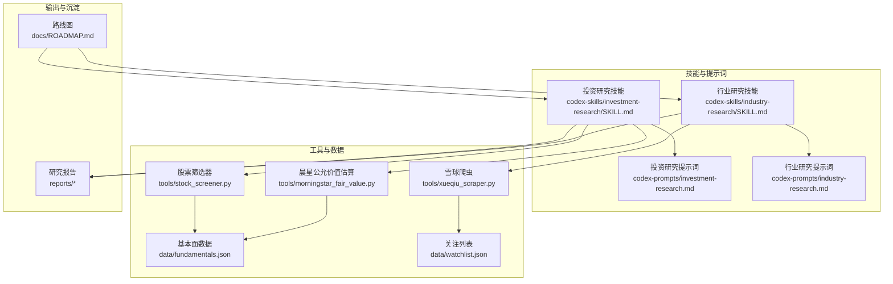
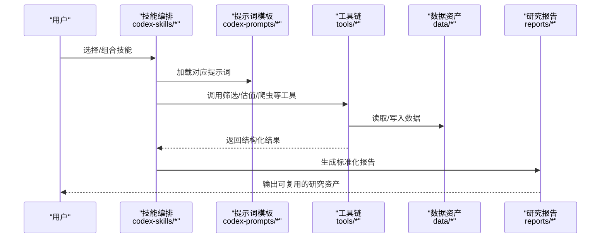
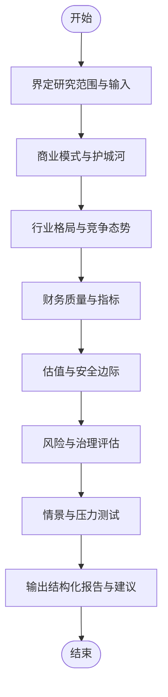
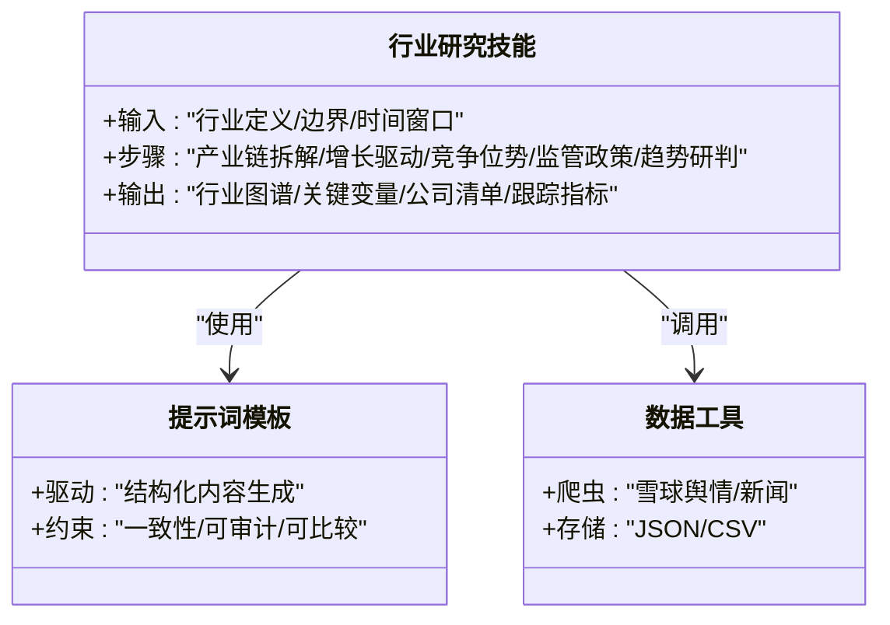
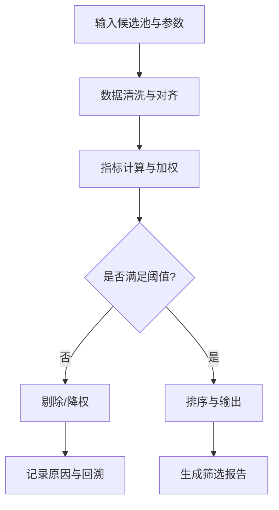
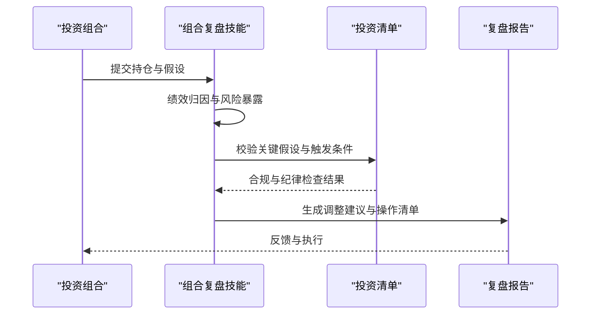
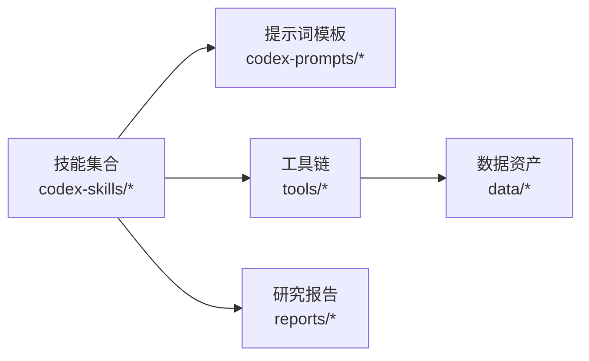

# 项目介绍与目标

<cite>
**本文引用的文件**   
- [README_EN.md](file://README_EN.md)
- [AGENTS.md](file://AGENTS.md)
- [CLAUDE.md](file://CLAUDE.md)
- [ROADMAP.md](file://docs/ROADMAP.md)
- [investment-research/SKILL.md](file://codex-skills/investment-research/SKILL.md)
- [industry-research/SKILL.md](file://codex-skills/industry-research/SKILL.md)
- [financial-data/SKILL.md](file://codex-skills/financial-data/SKILL.md)
- [quality-screen/SKILL.md](file://codex-skills/quality-screen/SKILL.md)
- [portfolio-review/SKILL.md](file://codex-skills/portfolio-review/SKILL.md)
- [investment-checklist/SKILL.md](file://codex-skills/investment-checklist/SKILL.md)
- [stock_screener.py](file://tools/stock_screener.py)
- [morningstar_fair_value.py](file://tools/morningstar_fair_value.py)
- [xueqiu_scraper.py](file://tools/xueqiu_scraper.py)
- [fundamentals.json](file://data/fundamentals.json)
- [watchlist.json](file://data/watchlist.json)
</cite>

## 目录
1. [引言](#引言)
2. [项目结构](#项目结构)
3. [核心组件](#核心组件)
4. [架构总览](#架构总览)
5. [详细组件分析](#详细组件分析)
6. [依赖关系分析](#依赖关系分析)
7. [性能考量](#性能考量)
8. [故障排查指南](#故障排查指南)
9. [结论](#结论)
10. [附录](#附录)

## 引言
本项目定位为“AI投资研究平台”，旨在以人工智能为核心能力，为个人投资者、专业分析师与机构研究员提供标准化、可复现、多市场覆盖的投资研究基础设施。传统投研工作普遍面临三大痛点：效率瓶颈（海量信息难以快速消化）、信息过载（噪音与信号混杂）、分析深度不足（经验驱动导致一致性差）。本平台通过“技能化”的研究框架与工具链，将投研流程拆解为可组合的模块，结合数据抓取、财务与估值计算、质量筛选与组合复盘等能力，显著提升研究效率与一致性，降低认知偏差带来的决策风险。

项目的独特价值主张包括：
- AI驱动的分析能力：以提示词与技能模板驱动的多角色协作，形成从行业扫描到公司深研的闭环。
- 标准化的研究框架：统一的“技能+提示词”范式，确保不同用户产出一致的结构化报告。
- 多市场覆盖：面向A股、港股、美股等多市场标的，支持跨市场对比与轮动判断。
- 可复用的资产与数据：内置基础数据与示例，便于快速上手与二次开发。

目标用户群体：
- 个人投资者：需要高效、系统化的研究与决策辅助。
- 专业分析师：追求高质量、可追溯、可协作的研究流程。
- 投资机构研究员：需要规模化、可审计、可沉淀的研究资产。

整体定位与差异化优势：
- 以“技能化”和“提示词工程”为核心的投研操作系统，强调流程标准化与结果可复用。
- 将“数据—模型—人”三者解耦，既保留人类洞察，又放大AI在信息处理与结构化输出上的优势。
- 以开源方式沉淀方法论与工具，持续演进，形成社区生态。

[本节不直接分析具体源文件]

## 项目结构
仓库采用“技能+提示词+工具+数据+报告”的分层组织方式：
- codex-skills：定义投研“技能”，每个技能包含SKILL.md，描述输入、步骤、输出规范与约束。
- codex-prompts：对应技能的提示词模板，用于驱动大模型生成结构化内容。
- tools：数据处理与量化脚本，如股票筛选、晨星公允价值估算、雪球爬虫等。
- data：基础数据与示例，如基本面快照、关注列表等。
- reports：按公司与主题归档的研究成果，体现“技能+提示词”产出的标准化报告。
- docs：路线图与方法论文档。
- scripts：安装与同步脚本，便于部署与更新。

图示来源
- [investment-research/SKILL.md](file://codex-skills/investment-research/SKILL.md)
- [industry-research/SKILL.md](file://codex-skills/industry-research/SKILL.md)
- [investment-research.md](file://codex-prompts/investment-research.md)
- [industry-research.md](file://codex-prompts/industry-research.md)
- [stock_screener.py](file://tools/stock_screener.py)
- [morningstar_fair_value.py](file://tools/morningstar_fair_value.py)
- [xueqiu_scraper.py](file://tools/xueqiu_scraper.py)
- [fundamentals.json](file://data/fundamentals.json)
- [watchlist.json](file://data/watchlist.json)
- [ROADMAP.md](file://docs/ROADMAP.md)

章节来源
- [AGENTS.md](file://AGENTS.md)
- [CLAUDE.md](file://CLAUDE.md)
- [ROADMAP.md](file://docs/ROADMAP.md)

## 核心组件
- 技能体系（codex-skills）：将投研流程拆分为“投资研究、行业研究、财务数据、质量筛选、组合复盘、投资清单”等可复用技能，每个技能明确输入、步骤、输出与约束，保证研究的一致性与可审计性。
- 提示词库（codex-prompts）：为每项技能配套提示词模板，驱动大模型生成结构化、可比较的内容，减少主观差异。
- 工具链（tools）：提供数据获取与量化计算能力，包括股票筛选、公允价值估算、舆情与新闻抓取等，支撑技能的数据需求。
- 数据资产（data）：维护基础数据与示例，作为技能运行的输入或验证基准。
- 研究成果（reports）：以公司或主题为单位沉淀报告，体现“技能+提示词+工具”的端到端产出。
- 路线图（docs/ROADMAP.md）：规划功能演进与里程碑，指导团队与社区协同推进。

章节来源
- [investment-research/SKILL.md](file://codex-skills/investment-research/SKILL.md)
- [industry-research/SKILL.md](file://codex-skills/industry-research/SKILL.md)
- [financial-data/SKILL.md](file://codex-skills/financial-data/SKILL.md)
- [quality-screen/SKILL.md](file://codex-skills/quality-screen/SKILL.md)
- [portfolio-review/SKILL.md](file://codex-skills/portfolio-review/SKILL.md)
- [investment-checklist/SKILL.md](file://codex-skills/investment-checklist/SKILL.md)
- [stock_screener.py](file://tools/stock_screener.py)
- [morningstar_fair_value.py](file://tools/morningstar_fair_value.py)
- [xueqiu_scraper.py](file://tools/xueqiu_scraper.py)
- [fundamentals.json](file://data/fundamentals.json)
- [watchlist.json](file://data/watchlist.json)
- [ROADMAP.md](file://docs/ROADMAP.md)

## 架构总览
平台采用“技能编排 + 提示词驱动 + 工具执行 + 数据支撑 + 报告沉淀”的整体架构。用户通过选择或组合技能，调用相应提示词与工具，完成从宏观到微观、从行业到公司的研究任务，最终输出标准化报告并归档至reports目录，形成可检索、可复用的知识资产。

图示来源
- [investment-research/SKILL.md](file://codex-skills/investment-research/SKILL.md)
- [industry-research/SKILL.md](file://codex-skills/industry-research/SKILL.md)
- [investment-research.md](file://codex-prompts/investment-research.md)
- [industry-research.md](file://codex-prompts/industry-research.md)
- [stock_screener.py](file://tools/stock_screener.py)
- [morningstar_fair_value.py](file://tools/morningstar_fair_value.py)
- [xueqiu_scraper.py](file://tools/xueqiu_scraper.py)
- [fundamentals.json](file://data/fundamentals.json)
- [watchlist.json](file://data/watchlist.json)

## 详细组件分析

### 投资研究技能（Investment Research Skill）
- 职责：定义公司级研究的输入、步骤、输出规范与约束，确保报告结构一致、逻辑清晰、证据可追溯。
- 关键要素：
  - 输入：公司名称/代码、时间窗口、数据来源偏好。
  - 步骤：商业模式梳理、竞争格局、财务质量、估值与安全边际、风险与治理、情景推演。
  - 输出：结构化报告、关键假设、敏感性分析与结论建议。
- 关联提示词：投资研究提示词模板驱动各步骤的内容生成。
- 关联工具：股票筛选器用于初筛与对比；晨星公允价值估算用于估值锚定。

图示来源
- [investment-research/SKILL.md](file://codex-skills/investment-research/SKILL.md)
- [investment-research.md](file://codex-prompts/investment-research.md)
- [stock_screener.py](file://tools/stock_screener.py)
- [morningstar_fair_value.py](file://tools/morningstar_fair_value.py)

章节来源
- [investment-research/SKILL.md](file://codex-skills/investment-research/SKILL.md)
- [investment-research.md](file://codex-prompts/investment-research.md)
- [stock_screener.py](file://tools/stock_screener.py)
- [morningstar_fair_value.py](file://tools/morningstar_fair_value.py)

### 行业研究技能（Industry Research Skill）
- 职责：聚焦产业全景、技术路线、供需格局与政策环境，形成自上而下的机会识别与跟踪框架。
- 关键要素：
  - 输入：行业定义、边界、关键参与者、时间维度。
  - 步骤：产业链拆解、增长驱动、竞争位势、进入壁垒、监管与政策、未来趋势。
  - 输出：行业图谱、关键变量、重点公司清单与跟踪指标。
- 关联提示词：行业研究提示词模板驱动结构化内容生成。
- 关联工具：雪球爬虫用于新闻与舆情采集，辅助把握行业动态。

图示来源
- [industry-research/SKILL.md](file://codex-skills/industry-research/SKILL.md)
- [industry-research.md](file://codex-prompts/industry-research.md)
- [xueqiu_scraper.py](file://tools/xueqiu_scraper.py)

章节来源
- [industry-research/SKILL.md](file://codex-skills/industry-research/SKILL.md)
- [industry-research.md](file://codex-prompts/industry-research.md)
- [xueqiu_scraper.py](file://tools/xueqiu_scraper.py)

### 财务数据与质量筛选（Financial Data & Quality Screen）
- 职责：基于统一口径的财务指标与质量因子进行初筛与对比，提升选股效率与一致性。
- 关键要素：
  - 输入：候选池、指标阈值、权重配置。
  - 步骤：数据清洗、指标计算、排序与过滤、异常值处理。
  - 输出：筛选结果、排名与解释、可复现实验记录。
- 关联工具：股票筛选器与晨星公允价值估算。

图示来源
- [financial-data/SKILL.md](file://codex-skills/financial-data/SKILL.md)
- [quality-screen/SKILL.md](file://codex-skills/quality-screen/SKILL.md)
- [stock_screener.py](file://tools/stock_screener.py)
- [morningstar_fair_value.py](file://tools/morningstar_fair_value.py)
- [fundamentals.json](file://data/fundamentals.json)

章节来源
- [financial-data/SKILL.md](file://codex-skills/financial-data/SKILL.md)
- [quality-screen/SKILL.md](file://codex-skills/quality-screen/SKILL.md)
- [stock_screener.py](file://tools/stock_screener.py)
- [morningstar_fair_value.py](file://tools/morningstar_fair_value.py)
- [fundamentals.json](file://data/fundamentals.json)

### 组合复盘与投资管理（Portfolio Review & Checklist）
- 职责：对现有持仓进行定期复盘，检视假设漂移、风险暴露与再平衡策略；配合投资清单确保决策纪律。
- 关键要素：
  - 输入：持仓清单、历史交易、关键假设与触发条件。
  - 步骤：绩效归因、风险暴露分析、假设校验、再平衡建议。
  - 输出：复盘报告、调整建议与操作清单。
- 关联技能：组合复盘与投资清单。

图示来源
- [portfolio-review/SKILL.md](file://codex-skills/portfolio-review/SKILL.md)
- [investment-checklist/SKILL.md](file://codex-skills/investment-checklist/SKILL.md)

章节来源
- [portfolio-review/SKILL.md](file://codex-skills/portfolio-review/SKILL.md)
- [investment-checklist/SKILL.md](file://codex-skills/investment-checklist/SKILL.md)

## 依赖关系分析
- 技能与提示词：每个技能绑定对应的提示词模板，确保输出结构与风格一致。
- 技能与工具：技能在执行阶段按需调用工具完成数据获取与计算。
- 工具与数据：工具读写data目录中的基础数据，形成可复用的数据资产。
- 输出与沉淀：所有研究产物归档至reports，便于检索与版本管理。

图示来源
- [investment-research/SKILL.md](file://codex-skills/investment-research/SKILL.md)
- [industry-research/SKILL.md](file://codex-skills/industry-research/SKILL.md)
- [financial-data/SKILL.md](file://codex-skills/financial-data/SKILL.md)
- [quality-screen/SKILL.md](file://codex-skills/quality-screen/SKILL.md)
- [portfolio-review/SKILL.md](file://codex-skills/portfolio-review/SKILL.md)
- [investment-checklist/SKILL.md](file://codex-skills/investment-checklist/SKILL.md)
- [stock_screener.py](file://tools/stock_screener.py)
- [morningstar_fair_value.py](file://tools/morningstar_fair_value.py)
- [xueqiu_scraper.py](file://tools/xueqiu_scraper.py)
- [fundamentals.json](file://data/fundamentals.json)
- [watchlist.json](file://data/watchlist.json)

章节来源
- [AGENTS.md](file://AGENTS.md)
- [CLAUDE.md](file://CLAUDE.md)

## 性能考量
- 数据规模与批处理：对于大规模筛选与回测，建议采用批处理与增量更新，避免重复计算。
- I/O优化：集中读写data目录，减少网络请求频率，必要时引入缓存机制。
- 并行与异步：在工具链中合理并发调用外部接口，注意限流与错误重试。
- 内存与资源：对大型数据集进行分块处理，避免一次性加载导致内存溢出。
- 可观测性：为关键步骤增加日志与指标，便于定位瓶颈与回归问题。

[本节提供通用指导，不直接分析具体源文件]

## 故障排查指南
- 数据缺失或格式不一致：检查data目录的基础数据与字段命名，确保工具输入符合预期。
- 工具运行失败：确认依赖与环境，查看脚本输出与错误日志，逐步缩小问题范围。
- 报告质量不稳定：核对对应技能的SKILL.md与提示词模板，确保步骤与约束完整。
- 爬取受限或反爬：调整请求频率与代理策略，遵循目标站点的使用条款。
- 版本与依赖冲突：使用scripts中的安装与同步脚本，保持环境与依赖一致。

章节来源
- [stock_screener.py](file://tools/stock_screener.py)
- [morningstar_fair_value.py](file://tools/morningstar_fair_value.py)
- [xueqiu_scraper.py](file://tools/xueqiu_scraper.py)
- [fundamentals.json](file://data/fundamentals.json)
- [watchlist.json](file://data/watchlist.json)

## 结论
本AI投资研究平台以“技能化+提示词驱动+工具链+数据资产”为核心，构建了一套标准化、可复用、可扩展的投资研究基础设施。它有效缓解传统投研的效率瓶颈与信息过载问题，提升分析深度与一致性，并通过多市场覆盖与可审计的流程，服务于个人投资者、专业分析师与机构研究员。随着路线图推进与社区贡献，平台将持续增强数据能力、模型能力与协作能力，成为投资研究领域的差异化利器。

[本节总结性内容，不直接分析具体源文件]

## 附录
- 快速上手建议：
  - 阅读相关技能的SKILL.md，理解输入、步骤与输出规范。
  - 根据需求选择提示词模板，结合工具完成数据准备与分析。
  - 将产出归档至reports，建立个人与公司知识库。
- 扩展方向：
  - 新增更多行业与公司案例，丰富报告样例。
  - 完善数据源与指标体系，提升筛选与估值的稳健性。
  - 强化团队协作与版本管理，推动研究资产的持续沉淀。

[本节为补充说明，不直接分析具体源文件]