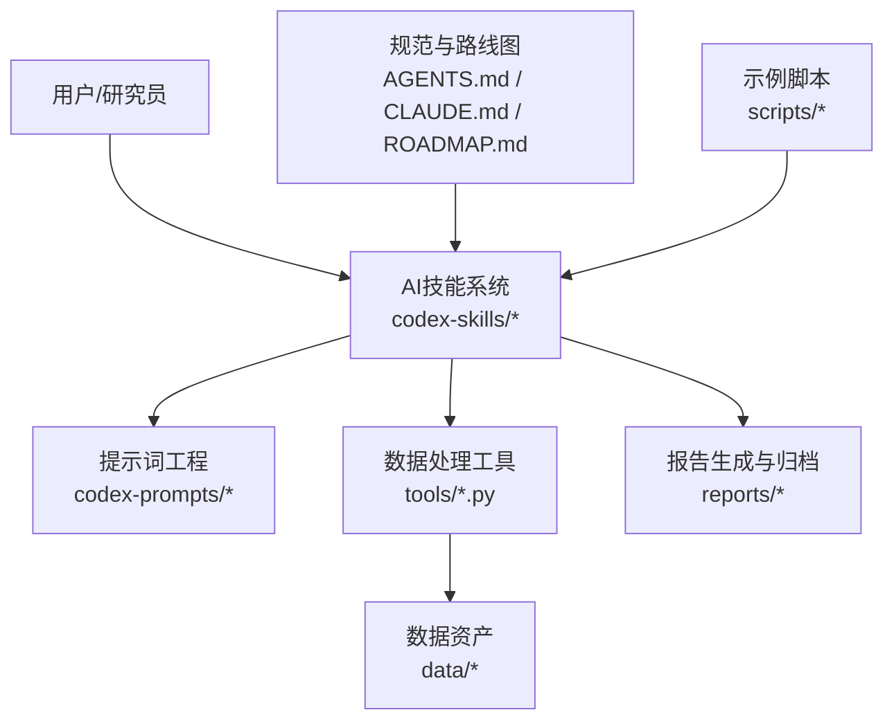
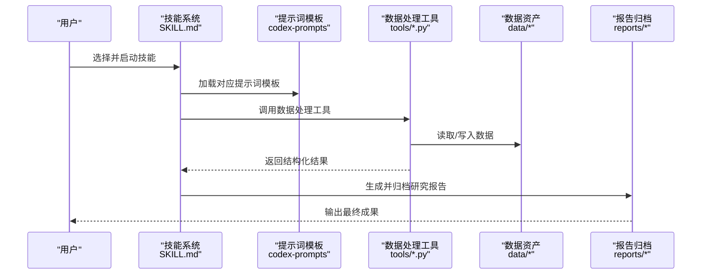
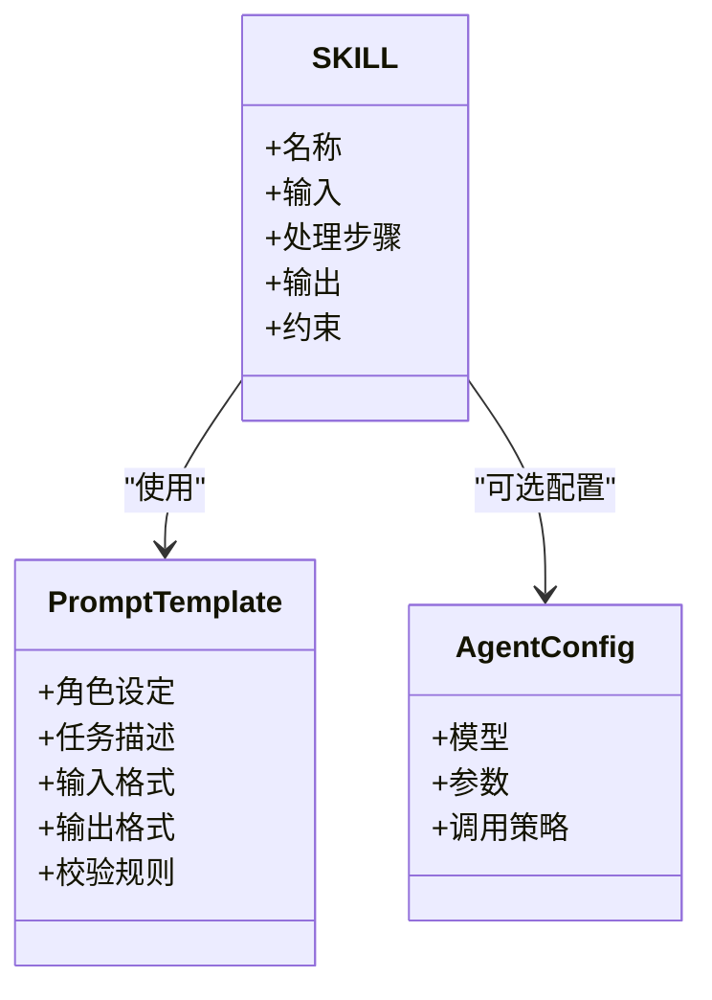
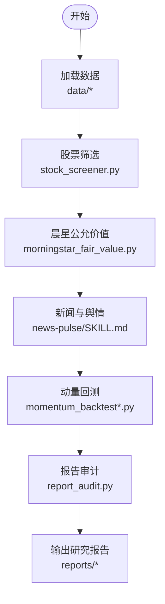
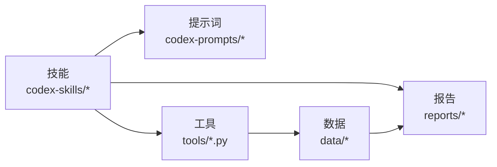

# 项目概述

<cite>
**本文引用的文件**   
- [README_EN.md](file://README_EN.md)
- [AGENTS.md](file://AGENTS.md)
- [CLAUDE.md](file://CLAUDE.md)
- [ROADMAP.md](file://docs/ROADMAP.md)
- [investment-research/SKILL.md](file://codex-skills/investment-research/SKILL.md)
- [financial-data/SKILL.md](file://codex-skills/financial-data/SKILL.md)
- [industry-research/SKILL.md](file://codex-skills/industry-research/SKILL.md)
- [management-deep-dive/SKILL.md](file://codex-skills/management-deep-dive/SKILL.md)
- [quality-screen/SKILL.md](file://codex-skills/quality-screen/SKILL.md)
- [portfolio-review/SKILL.md](file://codex-skills/portfolio-review/SKILL.md)
- [investment-team/SKILL.md](file://codex-skills/investment-team/SKILL.md)
- [earnings-team/SKILL.md](file://codex-skills/earnings-team/SKILL.md)
- [investment-memo-craft/SKILL.md](file://codex-skills/investment-memo-craft/SKILL.md)
- [investment-memo-craft/agents/openai.yaml](file://codex-skills/investment-memo-craft/agents/openai.yaml)
- [stock_screener.py](file://tools/stock_screener.py)
- [morningstar_fair_value.py](file://tools/morningstar_fair_value.py)
- [ashare_data.py](file://tools/ashare_data.py)
- [xueqiu_scraper.py](file://tools/xueqiu_scraper.py)
- [report_audit.py](file://tools/report_audit.py)
- [momentum_backtest.py](file://tools/momentum_backtest.py)
- [momentum_backtest_v2.py](file://tools/momentum_backtest_v2.py)
- [fundamentals.json](file://data/fundamentals.json)
- [watchlist.json](file://data/watchlist.json)
- [morningstar_fair_value_20260519.csv](file://data/morningstar_fair_value_20260519.csv)
- [correlation_3stocks_2021-2026.csv](file://data/correlation_3stocks_2021-2026.csv)
- [cross_asset_10y_2016-2026.csv](file://data/cross_asset_10y_2016-2026.csv)
- [dyp-ask/SKILL.md](file://codex-skills/dyp-ask/SKILL.md)
- [bottleneck-hunter/SKILL.md](file://codex-skills/bottleneck-hunter/SKILL.md)
- [deep-company-series/SKILL.md](file://codex-skills/deep-company-series/SKILL.md)
- [earnings-review/SKILL.md](file://codex-skills/earnings-review/SKILL.md)
- [industry-funnel/SKILL.md](file://codex-skills/industry-funnel/SKILL.md)
- [news-pulse/SKILL.md](file://codex-skills/news-pulse/SKILL.md)
- [private-company-research/SKILL.md](file://codex-skills/private-company-research/SKILL.md)
- [thesis-drift/SKILL.md](file://codex-skills/thesis-drift/SKILL.md)
- [thesis-tracker/SKILL.md](file://codex-skills/thesis-tracker/SKILL.md)
- [wechat-article/SKILL.md](file://codex-skills/wechat-article/SKILL.md)
- [investment-checklist/SKILL.md](file://codex-skills/investment-checklist/SKILL.md)
</cite>

## 目录
1. [简介](#简介)
2. [项目结构](#项目结构)
3. [核心组件](#核心组件)
4. [架构总览](#架构总览)
5. [详细组件分析](#详细组件分析)
6. [依赖关系分析](#依赖关系分析)
7. [性能与可扩展性](#性能与可扩展性)
8. [快速开始指南](#快速开始指南)
9. [故障排查](#故障排查)
10. [结论](#结论)

## 简介
本项目是一个面向投资研究的AI平台，围绕“四大师分析法”（巴菲特、芒格、段永平、李录）构建体系化的投研方法论，并通过AI技能系统、提示词工程、数据处理工具与报告生成系统协同工作，形成从数据到洞察再到可执行研究产物的闭环。其核心价值主张在于：
- 将经典价值投资框架与AI能力结合，提升研究效率与一致性
- 以“技能+提示词”的模块化方式组织投研流程，便于复用与扩展
- 提供从行业筛选、公司深研、财务估值到组合复盘的全链路工具链
- 输出标准化研究报告与团队评审材料，支持多市场、多资产类别的研究场景

独特优势包括：
- 方法论驱动：以四大师视角贯穿商业模式、竞争格局、管理层评估与风险管理
- 工程化落地：通过SKILL与Prompt模板实现流程标准化与可复制性
- 数据与工具集成：内置股票筛选、晨星公允价值、动量回测等实用工具
- 产出即服务：自动生成结构化报告，沉淀为可检索的知识资产

## 项目结构
仓库采用“方法-技能-提示词-工具-数据-报告”的分层组织方式：
- 顶层说明与规范：README、AGENTS、CLAUDE、ROADMAP
- AI技能定义：codex-skills 下按任务域划分技能目录，每个技能包含SKILL.md与可选配置
- 提示词模板：codex-prompts 下对应各研究任务的提示词文档
- 数据处理与工具：tools 下的Python脚本，覆盖选股、财报抓取、回测、审计等
- 数据资产：data 下的基础数据与中间结果
- 研究成果：reports 下按公司与主题归档的研究报告
- 示例与脚本：scripts 用于安装与同步技能/提示词

图表来源
- [AGENTS.md:1-50](file://AGENTS.md#L1-L50)
- [CLAUDE.md:1-50](file://CLAUDE.md#L1-L50)
- [ROADMAP.md:1-50](file://docs/ROADMAP.md#L1-L50)
- [investment-research/SKILL.md:1-50](file://codex-skills/investment-research/SKILL.md#L1-L50)
- [stock_screener.py:1-50](file://tools/stock_screener.py#L1-L50)
- [fundamentals.json:1-50](file://data/fundamentals.json#L1-L50)
- [reports/腾讯/腾讯-research-20260620.md:1-50](file://reports/腾讯/腾讯-research-20260620.md#L1-L50)

章节来源
- [README_EN.md:1-50](file://README_EN.md#L1-L50)
- [AGENTS.md:1-50](file://AGENTS.md#L1-L50)
- [CLAUDE.md:1-50](file://CLAUDE.md#L1-L50)
- [ROADMAP.md:1-50](file://docs/ROADMAP.md#L1-L50)

## 核心组件
- AI技能系统（codex-skills）
  - 以SKILL.md为核心契约，描述输入、处理步骤、输出格式与约束，确保不同模型与Agent对同一任务的一致理解
  - 典型技能包括：投资研究、财务数据、行业研究、管理层深研、质量筛选、组合复盘、投研团队、财报团队、备忘录撰写等
- 提示词工程（codex-prompts）
  - 针对具体任务提供高质量提示词模板，如深度公司系列、财报审阅、行业漏斗、新闻脉搏、私企研究、论点漂移追踪等
- 数据处理工具（tools）
  - 股票筛选器、晨星公允价值计算、A股数据获取、雪球爬虫、动量回测、报告审计等
- 数据资产（data）
  - 基本面快照、关注列表、晨星公允价值CSV、相关性矩阵、跨资产长周期数据等
- 报告生成与归档（reports）
  - 按公司与主题归档的结构化研究报告，体现四大师视角与团队评审流程

章节来源
- [investment-research/SKILL.md:1-50](file://codex-skills/investment-research/SKILL.md#L1-L50)
- [financial-data/SKILL.md:1-50](file://codex-skills/financial-data/SKILL.md#L1-L50)
- [industry-research/SKILL.md:1-50](file://codex-skills/industry-research/SKILL.md#L1-L50)
- [management-deep-dive/SKILL.md:1-50](file://codex-skills/management-deep-dive/SKILL.md#L1-L50)
- [quality-screen/SKILL.md:1-50](file://codex-skills/quality-screen/SKILL.md#L1-L50)
- [portfolio-review/SKILL.md:1-50](file://codex-skills/portfolio-review/SKILL.md#L1-L50)
- [investment-team/SKILL.md:1-50](file://codex-skills/investment-team/SKILL.md#L1-L50)
- [earnings-team/SKILL.md:1-50](file://codex-skills/earnings-team/SKILL.md#L1-L50)
- [investment-memo-craft/SKILL.md:1-50](file://codex-skills/investment-memo-craft/SKILL.md#L1-L50)
- [stock_screener.py:1-50](file://tools/stock_screener.py#L1-L50)
- [morningstar_fair_value.py:1-50](file://tools/morningstar_fair_value.py#L1-L50)
- [ashare_data.py:1-50](file://tools/ashare_data.py#L1-L50)
- [xueqiu_scraper.py:1-50](file://tools/xueqiu_scraper.py#L1-L50)
- [report_audit.py:1-50](file://tools/report_audit.py#L1-L50)
- [momentum_backtest.py:1-50](file://tools/momentum_backtest.py#L1-L50)
- [momentum_backtest_v2.py:1-50](file://tools/momentum_backtest_v2.py#L1-L50)
- [fundamentals.json:1-50](file://data/fundamentals.json#L1-L50)
- [watchlist.json:1-50](file://data/watchlist.json#L1-L50)
- [morningstar_fair_value_20260519.csv:1-50](file://data/morningstar_fair_value_20260519.csv#L1-L50)
- [correlation_3stocks_2021-2026.csv:1-50](file://data/correlation_3stocks_2021-2026.csv#L1-L50)
- [cross_asset_10y_2016-2026.csv:1-50](file://data/cross_asset_10y_2016-2026.csv#L1-L50)

## 架构总览
平台采用“技能编排 + 提示词驱动 + 工具集成”的架构模式：
- 技能层：定义任务边界、输入输出、质量控制与协作规则
- 提示词层：将方法论转化为可执行的指令模板，保证一致性与可复现性
- 工具层：封装数据获取、指标计算、回测与审计等工程能力
- 数据层：集中管理原始数据与中间产物，支撑分析与报告
- 产出层：生成标准研究报告与团队评审材料，沉淀知识资产

图表来源
- [investment-research/SKILL.md:1-50](file://codex-skills/investment-research/SKILL.md#L1-L50)
- [investment-memo-craft/agents/openai.yaml:1-50](file://codex-skills/investment-memo-craft/agents/openai.yaml#L1-L50)
- [stock_screener.py:1-50](file://tools/stock_screener.py#L1-L50)
- [fundamentals.json:1-50](file://data/fundamentals.json#L1-L50)
- [reports/腾讯/腾讯-research-20260620.md:1-50](file://reports/腾讯/腾讯-research-20260620.md#L1-L50)

## 详细组件分析

### 四大师分析法整合与应用
- 巴菲特视角：聚焦商业模式、护城河、安全边际与长期现金流折现
- 芒格视角：强调竞争格局、逆向思维、多学科思维模型与质量优先
- 段永平视角：重视企业本质、企业文化与管理者诚信，强调“做对的事情”
- 李录视角：关注风险治理、管理层评估、制度环境与长期主义

在平台中，这些视角被映射到具体技能与提示词：
- 商业模式与护城河：由“商业模式分析”“质量筛选”“行业研究”等技能共同支撑
- 竞争格局：由“行业漏斗”“行业研究”“新闻脉搏”等技能持续更新
- 管理层评估：由“管理层深研”“投研团队”“财报团队”等技能交叉验证
- 风险管理：由“论点漂移追踪”“投资组合复盘”“报告审计”等技能保障

章节来源
- [management-deep-dive/SKILL.md:1-50](file://codex-skills/management-deep-dive/SKILL.md#L1-L50)
- [quality-screen/SKILL.md:1-50](file://codex-skills/quality-screen/SKILL.md#L1-L50)
- [industry-research/SKILL.md:1-50](file://codex-skills/industry-research/SKILL.md#L1-L50)
- [industry-funnel/SKILL.md:1-50](file://codex-skills/industry-funnel/SKILL.md#L1-L50)
- [news-pulse/SKILL.md:1-50](file://codex-skills/news-pulse/SKILL.md#L1-L50)
- [investment-team/SKILL.md:1-50](file://codex-skills/investment-team/SKILL.md#L1-L50)
- [earnings-team/SKILL.md:1-50](file://codex-skills/earnings-team/SKILL.md#L1-L50)
- [thesis-drift/SKILL.md:1-50](file://codex-skills/thesis-drift/SKILL.md#L1-L50)
- [portfolio-review/SKILL.md:1-50](file://codex-skills/portfolio-review/SKILL.md#L1-L50)
- [report_audit.py:1-50](file://tools/report_audit.py#L1-L50)

### 技能系统与提示词工程
- 技能契约：每个SKILL.md明确任务目标、输入数据、处理步骤、输出格式与校验规则
- 提示词模板：codex-prompts中的模板与技能一一对应，确保方法论可执行
- Agent配置：部分技能附带Agent配置文件（如openai.yaml），指定模型参数与调用策略

图表来源
- [investment-research/SKILL.md:1-50](file://codex-skills/investment-research/SKILL.md#L1-L50)
- [investment-memo-craft/agents/openai.yaml:1-50](file://codex-skills/investment-memo-craft/agents/openai.yaml#L1-L50)

章节来源
- [investment-memo-craft/SKILL.md:1-50](file://codex-skills/investment-memo-craft/SKILL.md#L1-L50)
- [investment-memo-craft/agents/openai.yaml:1-50](file://codex-skills/investment-memo-craft/agents/openai.yaml#L1-L50)

### 数据处理工具链
- 股票筛选器：基于多维指标进行初筛与去劣，支持自定义阈值与权重
- 晨星公允价值：计算与对比公允价值与当前价格，辅助安全边际判断
- A股数据与雪球爬虫：获取行情、公告、研报与社区观点，丰富信息源
- 动量回测：验证策略有效性，评估历史表现与风险收益特征
- 报告审计：检查报告完整性、逻辑一致性与数据准确性

图表来源
- [stock_screener.py:1-50](file://tools/stock_screener.py#L1-L50)
- [morningstar_fair_value.py:1-50](file://tools/morningstar_fair_value.py#L1-L50)
- [ashare_data.py:1-50](file://tools/ashare_data.py#L1-L50)
- [xueqiu_scraper.py:1-50](file://tools/xueqiu_scraper.py#L1-L50)
- [momentum_backtest.py:1-50](file://tools/momentum_backtest.py#L1-L50)
- [momentum_backtest_v2.py:1-50](file://tools/momentum_backtest_v2.py#L1-L50)
- [report_audit.py:1-50](file://tools/report_audit.py#L1-L50)
- [news-pulse/SKILL.md:1-50](file://codex-skills/news-pulse/SKILL.md#L1-L50)
- [fundamentals.json:1-50](file://data/fundamentals.json#L1-L50)
- [morningstar_fair_value_20260519.csv:1-50](file://data/morningstar_fair_value_20260519.csv#L1-L50)
- [reports/腾讯/腾讯-research-20260620.md:1-50](file://reports/腾讯/腾讯-research-20260620.md#L1-L50)

章节来源
- [stock_screener.py:1-50](file://tools/stock_screener.py#L1-L50)
- [morningstar_fair_value.py:1-50](file://tools/morningstar_fair_value.py#L1-L50)
- [ashare_data.py:1-50](file://tools/ashare_data.py#L1-L50)
- [xueqiu_scraper.py:1-50](file://tools/xueqiu_scraper.py#L1-L50)
- [momentum_backtest.py:1-50](file://tools/momentum_backtest.py#L1-L50)
- [momentum_backtest_v2.py:1-50](file://tools/momentum_backtest_v2.py#L1-L50)
- [report_audit.py:1-50](file://tools/report_audit.py#L1-L50)

### 数据资产与报告体系
- 数据资产：包含基本面快照、关注列表、晨星公允价值、相关性矩阵与跨资产长周期数据，为研究与回测提供基础
- 报告体系：按公司与主题归档，涵盖商业模式、财务估值、竞争格局、风险管理与团队评审等多维度内容

章节来源
- [fundamentals.json:1-50](file://data/fundamentals.json#L1-L50)
- [watchlist.json:1-50](file://data/watchlist.json#L1-L50)
- [morningstar_fair_value_20260519.csv:1-50](file://data/morningstar_fair_value_20260519.csv#L1-L50)
- [correlation_3stocks_2021-2026.csv:1-50](file://data/correlation_3stocks_2021-2026.csv#L1-L50)
- [cross_asset_10y_2016-2026.csv:1-50](file://data/cross_asset_10y_2016-2026.csv#L1-L50)
- [reports/腾讯/腾讯-research-20260620.md:1-50](file://reports/腾讯/腾讯-research-20260620.md#L1-L50)

## 依赖关系分析
- 技能与提示词：SKILL.md与codex-prompts强耦合，确保方法论到指令的可追溯性
- 技能与工具：部分技能直接调用tools中的脚本，形成“技能编排 + 工具执行”的流水线
- 数据与工具：tools依赖data中的基础数据与中间结果，保证分析与回测的一致性
- 报告与数据：reports中的报告引用data中的关键指标与图表，形成证据链

图表来源
- [investment-research/SKILL.md:1-50](file://codex-skills/investment-research/SKILL.md#L1-L50)
- [stock_screener.py:1-50](file://tools/stock_screener.py#L1-L50)
- [fundamentals.json:1-50](file://data/fundamentals.json#L1-L50)
- [reports/腾讯/腾讯-research-20260620.md:1-50](file://reports/腾讯/腾讯-research-20260620.md#L1-L50)

章节来源
- [investment-research/SKILL.md:1-50](file://codex-skills/investment-research/SKILL.md#L1-L50)
- [stock_screener.py:1-50](file://tools/stock_screener.py#L1-L50)
- [fundamentals.json:1-50](file://data/fundamentals.json#L1-L50)
- [reports/腾讯/腾讯-research-20260620.md:1-50](file://reports/腾讯/腾讯-research-20260620.md#L1-L50)

## 性能与可扩展性
- 模块化设计：技能与提示词解耦，便于独立优化与替换
- 工具可插拔：新增或替换数据处理工具不影响上层技能契约
- 数据分层：原始数据与中间结果分离，降低重复计算与存储开销
- 并行与批处理：回测与筛选类工具支持批量处理，提高吞吐
- 审计与校验：报告审计与数据校验机制提升整体可靠性

[本节为通用指导，不直接分析具体文件]

## 快速开始指南
- 环境准备
  - 安装Python依赖（根据tools脚本需求）
  - 准备API密钥（如需调用外部数据源或大模型）
- 初始化数据
  - 运行数据同步脚本（scripts/install-* 与 scripts/sync-*）
  - 下载或生成基础数据（data/*）
- 选择技能
  - 浏览codex-skills，选择与研究目标匹配的技能
  - 阅读对应SKILL.md，了解输入输出与约束
- 执行研究
  - 根据SKILL.md指引，准备输入数据
  - 调用相关工具（tools/*.py）获取数据与指标
  - 使用提示词模板（codex-prompts/*）生成分析内容
- 产出与归档
  - 将生成的研究报告保存到reports相应目录
  - 使用report_audit.py进行报告质量检查
- 迭代与复盘
  - 使用portfolio-review与thesis-tracker跟踪论点变化
  - 定期更新数据与提示词，保持研究时效性

章节来源
- [scripts/install-codex-skills.sh:1-50](file://scripts/install-codex-skills.sh#L1-L50)
- [scripts/sync-codex-skills.py:1-50](file://scripts/sync-codex-skills.py#L1-L50)
- [investment-research/SKILL.md:1-50](file://codex-skills/investment-research/SKILL.md#L1-L50)
- [report_audit.py:1-50](file://tools/report_audit.py#L1-L50)
- [portfolio-review/SKILL.md:1-50](file://codex-skills/portfolio-review/SKILL.md#L1-L50)
- [thesis-tracker/SKILL.md:1-50](file://codex-skills/thesis-tracker/SKILL.md#L1-L50)

## 故障排查
- 数据缺失或格式错误
  - 检查data目录中的必要文件是否存在且格式正确
  - 使用report_audit.py进行数据与报告一致性校验
- 工具执行失败
  - 确认Python环境与依赖是否满足要求
  - 查看脚本日志与错误堆栈，定位问题模块
- 提示词效果不佳
  - 对照SKILL.md与提示词模板，检查输入输出格式是否匹配
  - 逐步简化提示词，定位影响效果的变量
- 报告质量不稳定
  - 启用report_audit.py进行自动化审计
  - 参考同类型优秀报告（reports/*）进行对标改进

章节来源
- [report_audit.py:1-50](file://tools/report_audit.py#L1-L50)
- [fundamentals.json:1-50](file://data/fundamentals.json#L1-L50)
- [morningstar_fair_value_20260519.csv:1-50](file://data/morningstar_fair_value_20260519.csv#L1-L50)
- [reports/腾讯/腾讯-research-20260620.md:1-50](file://reports/腾讯/腾讯-research-20260620.md#L1-L50)

## 结论
本平台以“四大师分析法”为方法论基石，通过AI技能系统与提示词工程将经典投资框架工程化落地，辅以数据处理工具与报告生成系统，形成从数据到洞察再到可执行研究产物的完整闭环。其模块化设计与标准化流程不仅提升了研究效率与一致性，也为后续扩展与团队协作奠定了坚实基础。对于初学者，建议从入门级技能与提示词模板入手；对于有经验的开发者，可深入工具链与Agent配置，进一步优化性能与可定制性。